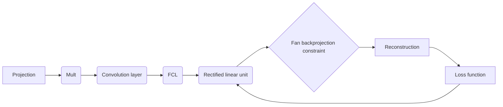
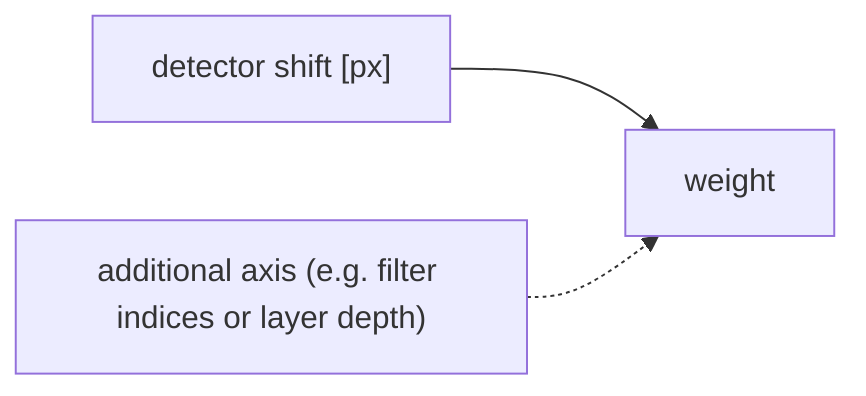
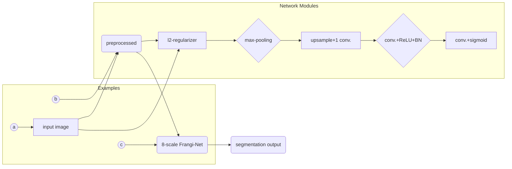
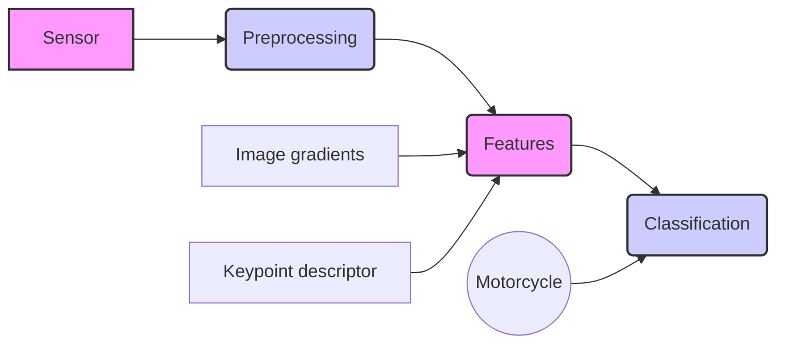
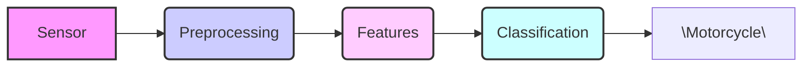
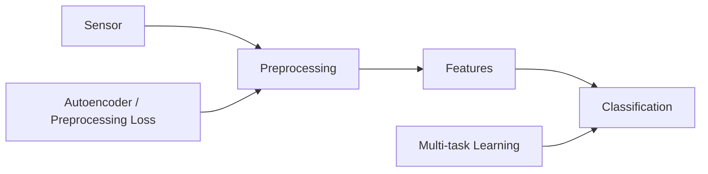

# Known Operator Learning - Towards Integration of Prior Knowledge into Machine Learning

```markdown

## Known Operator Learning - Towards Integration of Prior Knowledge into Machine Learning

### Known Operator Learning – Towards Integration of Prior Knowledge into Machine Learning

Andreas Maier, a professor at the **Lehrstuhl für Mustererkennung** (Computer Science 5) of the **Friedrich‑Alexander‑Universität Erlangen‑Nürnberg** (FAU), presents this work on integrating prior knowledge into machine learning models. The research is supported by several prominent funding agencies, including the **Deutsche Forschungsgemeinschaft** (DFG), the **European Research Council**, and the **European Commission** under the Horizon 2020 programme.  

*Figure: The slide features the logos of FAU (Friedrich‑Alexander‑Universität Erlangen‑Nürnberg), the DFG (Deutsche Forschungsgemeinschaft), the European Research Council, the European Commission (Horizon 2020), and a portrait of Albrecht Dürer, indicating a connection to the university’s heritage.*

**Why “known operators”?**  
Traditional deep learning often follows the “learn everything from data” paradigm: a network is initialized with random weights and, through massive data, discovers an implicit representation of the underlying physical or mathematical model. In many imaging and signal‑processing tasks, however, we already possess closed‑form operators (e.g., the Radon transform, Fourier filtering, back‑projection) that are derived from physics or engineering principles. Known Operator Learning (KOL) proposes to embed these analytically derived components directly into the network architecture, thereby **reusing prior knowledge**, **reducing the number of trainable parameters**, and **improving interpretability**. This idea is sometimes called *precision learning*—a term introduced by Maier et al. in [@5].

**Historical perspective.**  
The continuous solution to the computed tomography (CT) reconstruction problem, known as filtered back‑projection (FBP), was first derived by Johann Radon in 1917, long before the invention of practical CT scanners in 1971. The Radon inverse expresses the reconstruction as a convolution along the detector direction followed by a back‑projection over all rotation angles. Because these steps are linear and analytically known, they can be **hard‑wired** as fixed layers in a neural network: a convolutional layer implements the filter, a fully‑connected (or sparse) layer implements the back‑projection matrix, and a non‑negativity clipping layer implements the physical constraint. Consequently, the network reproduces the exact FBP algorithm without learning any weights. This construction forms the foundation for later data‑driven extensions such as learnable filter coefficients or adaptive back‑projection weights.

**From universal approximation to error bounds.**  
The universal approximation theorem guarantees that a single hidden layer with enough sigmoid units can arbitrarily approximate any continuous function \(u(x)\) within a supremum error \(\varepsilon_u\). In KOL we *compose* a known operator \(u(x)\) with a learnable mapping \(g(\cdot)\). The lecture notes (Part 2) show that, by exploiting the Lipschitz continuity of the sigmoid (or any activation with a known Lipschitz constant \(L_s\)), one can derive explicit upper and lower bounds for the total approximation error \(e_f\):
\[
|e_f| \;\le\; \sum_j |g_j|\,L_s\,|e_u| \;+\; \varepsilon_g,
\]
where \(e_u\) is the error of the known operator and \(\varepsilon_g\) an upper bound on the error of the learned component. If either \(u\) or \(g\) is known exactly, the corresponding error term drops out, implying that **embedding accurate prior operators provably reduces the overall approximation error**. This theoretical insight, published in *Nature Machine Intelligence*, justifies the empirical success of KOL [@5].

**Concrete application: CT reconstruction with limited angles.**  
In limited‑angle tomography only a subset of projection views (e.g., 120° instead of a full 360°) is available, leading to severe streak artifacts after standard FBP. By initializing a KOL network with the classical Parker weights—derived analytically to compensate for missing views—and then **learning a data‑optimal modification of these weights**, the network discovers a filter that closely matches the heuristic proposed by Schäfer et al. (2017) but is fully grounded in the training data. The learned weights can be inspected, revealing that the network amplifies rays near the detector boundaries where information is scarce, while leaving regions without training signal unchanged. This interpretability contrasts sharply with a pure black‑box U‑Net, yet the reconstruction quality is comparable or superior [@6, @7].

**Benefits beyond CT.**  
Known operators have also been embedded in **variational networks**, where an energy‑minimization algorithm (e.g., compressed sensing reconstruction) is unrolled into a finite number of layers. Each iteration becomes a differentiable block, allowing the whole pipeline to be trained end‑to‑end while preserving the physical meaning of every component. Moreover, the unrolling yields a structure mathematically equivalent to a ResNet, providing a unifying view of residual learning and classical optimization [@9].

**Practical take‑aways.**  
- **Parameter efficiency:** By fixing analytically known layers, the number of learnable weights drops dramatically, which is especially advantageous when only limited training data are available.  
- **Interpretability:** Learned parameters can often be mapped back to physical quantities (e.g., filter spectra, weighting factors), enabling direct scientific insight.  
- **Robustness:** Embedding known operators mitigates adversarial failure modes that arise when a network has never seen a certain noise pattern, because the fixed layers already enforce physically plausible behavior.  
- **Modularity:** Known operators can be reused across tasks (e.g., from CT to cone‑beam re‑binning or MR‑X‑ray fusion), fostering cross‑modality transfer without retraining the entire network [@10, @11].

In summary, Known Operator Learning offers a principled bridge between decades‑old analytical signal‑processing theory and modern data‑driven deep learning, allowing researchers to **reuse the wheel** rather than reinvent it, while delivering mathematically sound error guarantees and enhanced interpretability.

## Known Operator Learning

### Introduction  

Known Operator Learning is a methodological framework that seeks to embed analytically derived operators—i.e., mathematical constructs that represent known physical, geometric, or statistical relationships—directly into machine‑learning models. By doing so, the approach leverages existing domain expertise to constrain the learning process, which can improve data efficiency, interpretability, and generalization. This introductory section establishes the basic motivation behind integrating prior knowledge with data‑driven learning, and it outlines the structure of the subsequent discussion.

> “Known operator learning is a very different approach because we try to reuse knowledge that we already have about the problem. Therefore, we have to learn fewer parameters.” – Prof. Maier (Known Operator Learning Part 1)  

The historical roots of this idea can be traced back to the early 20th century, when Radon derived the analytical inverse for computed‑tomography reconstruction in 1917. Although the Radon inverse was known long before CT scanners existed, modern deep‑learning pipelines can now implement the same operator as a differentiable layer, thereby turning a classical, hand‑crafted algorithm into a trainable component. This synergy between analytical operators and data‑driven refinement is often referred to as **precision learning** (see [5]).

### Current State‑of‑the‑art in Deep Learning  

The field of deep learning has progressed rapidly, producing a suite of architectures (e.g., convolutional neural networks, transformer models, graph neural networks) and training techniques (e.g., self‑supervised learning, large‑scale pre‑training, sophisticated regularization strategies) that achieve remarkable performance across vision, language, and multimodal tasks. Despite these advances, many modern systems still rely predominantly on raw data and generic inductive biases, leaving substantial room for improvement through the explicit incorporation of well‑understood operators.

From the lecture notes it becomes clear that the community is already exploiting this gap in concrete imaging scenarios. For instance, limited‑angle computed‑tomography reconstruction—where only a subset of projection angles is available—has traditionally suffered from severe streak artifacts. By embedding the filtered‑back‑projection operator as a fixed convolution‑plus‑back‑projection layer and subsequently fine‑tuning only the filter coefficients, researchers obtained data‑optimal reconstructions that surpass hand‑crafted heuristics such as the Parker weights [7]. This demonstrates that even state‑of‑the‑art deep networks can benefit from known operators as a scaffold, reducing the number of learnable parameters while preserving interpretability.

### Prior Operators in Deep Networks  

A variety of strategies have been proposed to inject prior knowledge into deep neural networks. These include:

- **Architectural constraints** such as equivariance to rotations or translations, which are enforced by special convolutional or group‑convolution layers.  
- **Loss‑function regularization** that penalizes deviations from known physical laws (e.g., conservation of mass or energy).  
- **Hybrid models** that embed differentiable numerical solvers or physics‑based simulators as sub‑modules within a trainable network.  

Collectively, these methods demonstrate that embedding prior operators can guide the learning dynamics, reduce the amount of labeled data required, and yield models whose predictions obey established scientific principles.

Beyond these three categories, the lecture series introduced two deeper theoretical perspectives:

1. **Error‑bound analysis via the universal approximation theorem.** By treating a known operator as an exact sub‑function (e.g., \(u(\mathbf{x})\) or \(g(\mathbf{x})\) in a two‑layer composition \(f(\mathbf{x}) = g(u(\mathbf{x}))\)), one can derive additive error bounds that shrink proportionally to the number of exact components [Part 2]. When a component is known analytically, its associated error term disappears, leading to a tighter overall bound. This formalizes the intuition that “the more we know, the less we have to learn.”

2. **Variational‑network unrolling.** Energy‑minimization algorithms (e.g., iterative CT reconstruction, compressed‑sensing denoising) can be expressed as a finite‑step recurrent process. Unrolling these iterations yields a feed‑forward network whose layers correspond to gradient‑descent updates [Part 3]. Because the underlying physics is encoded in the update rule, the network inherits interpretability while still benefitting from end‑to‑end training. Notably, this perspective also explains why ResNets can be viewed as discrete optimizers of an implicit energy function.

### Future Work  

Research on Known Operator Learning is still in its early stages, and several promising directions remain to be explored:

- Developing systematic procedures for identifying which operators are most beneficial for a given task.  
- Designing flexible yet provably stable integration schemes that maintain differentiability while preserving the fidelity of the prior operator.  
- Extending the framework to heterogeneous data modalities and large‑scale distributed training environments.  

Additional avenues inspired by the lecture material include:

* **Learning operator‑level parameters** (e.g., filter kernels in filtered back‑projection, diagonal weighting matrices in parallel‑to‑fan‑beam conversion) rather than low‑level weights, which dramatically reduces the parameter count and improves generalization.  
* **Combining multiple known operators** within a single architecture—such as stacking a physics‑based reconstruction block with a learned denoising variational block—to tackle highly ill‑posed problems like limited‑angle or sparse‑view tomography.  
* **Automated modularization** of networks, whereby classical operators (e.g., Frangi vesselness filter, guided filter) are wrapped as reusable layers that can be swapped across tasks and modalities without retraining [Part 4].  

Advancing along these lines could substantially broaden the applicability of deep learning to domains where rigorous prior knowledge is available but has historically been difficult to combine with data‑driven methods. Moreover, the emerging theory of error bounds and unrolled optimization provides a solid mathematical foundation for future work, ensuring that the integration of known operators is not only intuitively appealing but also provably beneficial.

## DL – Agent-based Landmark Detection

### DL – Agent-based Landmark Detection

Robust detection of anatomical landmarks in three‑dimensional computed tomography (3‑D CT) volumes is a fundamental prerequisite for many computer‑assisted intervention (CAI) tasks, such as image registration, surgical navigation, and automated reporting.  Two complementary strategies have been proposed to address this challenge when the input data are **incomplete** (e.g., truncated fields of view, missing slices) and where **real‑time** performance is required.  Both methods exploit the notion of an *agent* that actively searches the volume for the target landmark, and they make extensive use of **search‑trajectory visualization** to interpret and improve the detection process.

> Historically, before the advent of deep learning, landmark detection relied on handcrafted descriptors and exhaustive template matching, which struggled with missing data and real‑time constraints.  Florin Ghesu’s work introduced the idea of mimicking a radiologist’s interpretive strategy—moving a virtual “cursor” through the volume—thereby reusing prior anatomical knowledge as a *known operator* within a learned framework.  This bridges the gap between classic model‑based approaches and modern data‑driven methods [@5].

---

#### 1. Robust Multi‑Scale Anatomical Landmark Detection in Incomplete 3‑D CT Data  

The first approach treats landmark detection as a **multi‑scale search problem**.  The core idea is to let an agent iteratively refine its estimate of the landmark position by examining the image at progressively finer spatial resolutions.  This hierarchical strategy yields two major benefits:

1. **Robustness to missing data** – Coarse‑scale observations capture global context (e.g., organ shape, surrounding bone) that remains visible even when parts of the anatomy are absent.  The agent can therefore maintain a reasonable hypothesis about the landmark location despite gaps in the data.  
2. **Computational efficiency** – By limiting the number of high‑resolution evaluations to a small region identified at the coarse level, the method reduces the overall processing time while still achieving accurate localization.

The algorithm proceeds as follows:

1. **Initialization** – A set of candidate positions is sampled uniformly across the entire CT volume at the coarsest resolution.  
2. **Score computation** – For each candidate, a deep convolutional network extracts a descriptor and predicts a **likelihood score** that the candidate coincides with the true landmark. The network is trained on fully annotated volumes, but during inference it can tolerate missing slices because the descriptor aggregates information over a receptive field larger than the visible region.  
3. **Selection & refinement** – The highest‑scoring candidates are selected and re‑projected to the next finer scale, where a new set of candidates is generated around each seed point. Steps 2–3 repeat until the finest resolution is reached.  
4. **Final localization** – The candidate with the maximal score at the finest scale is reported as the landmark position.

By explicitly modeling the search as a sequence of **scale transitions**, the method learns to compensate for partial observations and to focus computational resources where they matter most.  Empirical results on a challenging MICCAI 2017 benchmark demonstrated state‑of‑the‑art accuracy on a variety of anatomical sites, earning the **Young Researcher Award** for its innovation [1].

> From a known‑operator perspective, each scale transition can be interpreted as the application of a *pre‑defined* down‑sampling operator followed by a learnable refinement step.  This modular decomposition reduces the number of trainable parameters and tightens the theoretical error bounds discussed in the precision‑learning framework [@5].

---

#### 2. Multi‑Scale Deep Reinforcement Learning for Real‑Time 3‑D Landmark Detection  

The second strategy formulates landmark detection as a **sequential decision‑making problem** solved with deep reinforcement learning (RL).  An agent navigates the 3‑D CT volume by taking discrete actions (e.g., move along the *x*, *y*, or *z* axes, or adjust the current scale) until it terminates at the predicted landmark.  The RL framework provides several advantages:

* **Real‑time inference** – Once the policy network is trained, a single forward pass per action yields the next move, enabling detection within a few hundred milliseconds.  
* **Adaptivity to patient‑specific anatomy** – The agent learns to exploit local intensity patterns and contextual cues, allowing it to adjust its trajectory on the fly.  
* **Interpretability via trajectory visualization** – By recording the sequence of visited states, clinicians can inspect the *search trajectory* and verify that the agent followed a plausible anatomical path.

The formulation follows the typical Markov Decision Process (MDP) structure:

* **State $s_t$** – A multi‑scale image patch centered at the current cursor location, optionally concatenated with the current scale factor.  
* **Action $a_t \in \mathcal{A}$** – One of a finite set of moves, such as “step +Δ in $x$”, “step –Δ in $y$”, “increase scale”, “decrease scale”, or “stop”.  
* **Reward $r_t$** – A dense reward that encourages progress toward the ground‑truth landmark, e.g., $r_t = -\|p_t - p^\star\|_2$, where $p_t$ is the current position and $p^\star$ the true landmark.  An additional terminal reward is given when the agent issues the “stop” action within a small tolerance of $p^\star$.  
* **Policy $\pi_\theta(a|s)$** – Parameterized by a deep convolutional network with parameters $\theta$, trained to maximize the expected cumulative reward $\mathbb{E}\big[\sum_{t=0}^{T}\gamma^t r_t\big]$ using a policy‑gradient method (e.g., REINFORCE or Actor‑Critic).

Training proceeds on fully annotated CT scans.  During each episode, the agent starts from a random location and learns, via trial and error, how to move efficiently toward the landmark.  The **multi‑scale** aspect is incorporated by allowing the policy to change the resolution of the observed patch, which accelerates coarse navigation and refines the final localization.

When deployed, the learned policy requires only a handful of actions to converge, yielding **real‑time 3‑D landmark detection**.  The method was validated on a large set of CT volumes and achieved detection accuracies comparable to offline, optimization‑based methods while operating at interactive speeds [2].

> This RL‑based agent can also be cast as a *known‑operator* architecture: the action set encodes a set of deterministic geometric transformations (translations, scaling), while the policy network learns to weight these transformations based on image evidence.  Embedding these operators reduces the hypothesis space, which aligns with the precision‑learning principle of lowering variance without sacrificing expressivity [@5].

---

#### 3. Search‑Trajectory Visualization  

Both approaches benefit from visualizing the **search trajectory**—the ordered set of positions visited by the agent (or the sequence of selected candidates across scales).  Visualizations typically overlay the trajectory on orthogonal CT slices or on a 3‑D rendering of the volume.  They serve three practical purposes:

1. **Debugging** – Unexpected jumps or loops in the trajectory reveal failure modes (e.g., local minima, ambiguous anatomy).  
2. **Clinical confidence** – Clinicians can see that the algorithm follows anatomically plausible paths, increasing trust in the automated output.  
3. **Method development** – By correlating trajectory patterns with detection errors, researchers can refine the state representation, reward shaping, or scale transition schedule.

Figure examples (not reproduced here) in the original publications illustrate smooth, monotonic approaches to the target landmark for successful cases, and erratic wandering for challenging instances with severe truncation.

> The trajectory itself is a *known* geometric construct; by visualizing it we obtain a transparent mapping from the learned policy to a physically interpretable path, echoing the lecture’s emphasis on re‑using prior knowledge rather than learning everything from scratch [@5].

---

#### 4. Clinical Impact  

Accurate and fast landmark detection underpins many downstream tasks in medical imaging:

* **Image registration** – Landmarks serve as initial correspondences for aligning pre‑operative and intra‑operative scans.  
* **Surgical navigation** – Real‑time detection enables on‑the‑fly guidance without pre‑operative planning.  
* **Automated reporting** – Precise localization of anatomical points facilitates quantitative measurements (e.g., vertebral body height, organ dimensions).

By integrating **prior anatomical knowledge** through multi‑scale representations and reinforcing it with **learned exploration policies**, the described agent‑based methods bridge the gap between data‑driven deep learning and the strict reliability requirements of clinical practice.

> This integration exemplifies the “don’t reinvent the wheel” mantra of known operator learning: the algorithms inject well‑understood geometric operators (scale changes, translations) into a deep network, thereby achieving higher accuracy with fewer learned parameters and offering theoretical guarantees on error propagation [@5].

---

**References**

[1] Florin Ghesu et al. *Robust Multi-Scale Anatomical Landmark Detection in Incomplete 3D-CT Data*. Medical Image Computing and Computer-Assisted Intervention (MICCAI) 2017, Quebec, Canada, pp. 194‑202, 2017 – Young Researcher Award.  

[2] Florin Ghesu et al. *Multi-Scale Deep Reinforcement Learning for Real-Time 3D-Landmark Detection in CT Scans*. IEEE Transactions on Pattern Analysis and Machine Intelligence, ePub ahead of print, 2018.  

[5] Andreas Maier et al. *Precision Learning: Towards use of known operators in neural networks*. ICPR 2018.   (cited for the known‑operator perspective).

## Known Operator Learning

### Overview  

Known Operator Learning is an emerging research area that seeks to embed established mathematical principles and domain‑specific expertise directly into machine learning models. By constraining the learning process with operators whose properties are already well understood, the approach aims to boost both predictive performance and the ability of models to generalize to unseen data. The central motivation is that pure data‑driven learning often requires prohibitively large training sets and may discover solutions that violate known physical or logical constraints. Incorporating prior knowledge as explicit operators can mitigate these shortcomings, leading to more efficient training and more trustworthy outcomes.  

The term *precision learning* was coined in the 2018 ICPR paper “Precision Learning: Towards use of known operators in neural networks” [@5], which formally introduced the idea of treating known operators as first‑class building blocks rather than as soft regularizers. The research direction has been pursued within a European Research Council–funded project on medical image analysis, where the authors repeatedly emphasized the practical gain of learning **fewer** parameters when a forward model (e.g., the X‑ray transform) is injected into the network architecture. This historical backdrop helps to understand why the community now speaks of “not reinventing the wheel’’ when designing deep architectures for scientific problems.

### Introduction  

The introductory component of Known Operator Learning establishes the fundamental motivations behind the field. First, it highlights the persistent gap between the expressive power of deep networks and the wealth of analytical knowledge that exists in many scientific and engineering domains. For example, in computational imaging, the forward model that maps an object to measured sensor data is often precisely described by physics‑based equations. By embedding such forward operators—or their inverses—into a learning architecture, one can ensure that the network respects the underlying physics by construction.  

Second, the introduction clarifies the main objectives of the paradigm:

1. **Performance improvement:** Leveraging prior operators can reduce the amount of labeled data needed to achieve a given level of accuracy.  
2. **Enhanced generalization:** Models that honor known constraints are less likely to overfit spurious patterns in the training set.  
3. **Interpretability:** Explicit operators provide a transparent link between the learned representation and established theory, facilitating diagnostic analysis and regulatory acceptance.  

Beyond these points, the lecture notes stress that known operator learning grew out of concrete **clinical** experiences. A reinforcement‑learning–based landmark detector (Ghesu et al.) was used as a proof‑of‑concept that a black‑box policy can be guided by a human‑interpretable search strategy, thereby illustrating how prior procedural knowledge can be merged with data‑driven policies. This example motivated the broader claim that many problems—especially in medical imaging—benefit from a hybrid treatment rather than a purely perceptual black‑box approach.  

Finally, the introduction situates Known Operator Learning within the broader context of prior‑knowledge integration strategies, such as regularization, architectural priors, and hybrid physics‑informed neural networks. It argues that treating operators as first‑class building blocks offers a systematic and mathematically grounded route to combine data‑driven inference with trusted domain models.

### Current State‑of‑the‑art in Deep Learning  

To appreciate the novelty of Known Operator Learning, it is necessary to review the capabilities and limitations of contemporary deep learning techniques. Modern architectures—convolutional neural networks (CNNs), transformer‑based models, and graph neural networks—have achieved remarkable success across image classification, natural language processing, and many other tasks. Their strengths stem from:

- **Universal function approximation:** Deep networks can approximate a wide class of functions given sufficient depth, width, and training data.  
- **Automatic feature extraction:** Hierarchical layers automatically discover useful representations without manual engineering.  
- **Scalability:** Parallel GPU computation enables training on massive datasets.  

Despite these achievements, several persistent challenges remain:

1. **Data hunger:** Achieving high performance often requires millions of labeled examples, which may be unavailable in scientific domains.  
2. **Lack of physical consistency:** Purely learned models can produce outputs that violate conservation laws, symmetry properties, or other known constraints.  
3. **Limited extrapolation:** Networks trained on a specific data distribution may fail dramatically when presented with inputs outside that distribution.  
4. **Interpretability deficits:** The internal representations are typically opaque, making it difficult to diagnose failure modes or satisfy regulatory requirements.  

An illustrative failure mode was described in the lecture: a U‑Net trained for limited‑angle CT reconstruction completely lost a faint lesion when the input sinogram was perturbed with realistic Poisson noise. The same network, when trained with the noise present, recovered the lesion but introduced other artifacts. This example (see Part 1 of the transcript) highlights how **adversarial‑type robustness issues** emerge precisely because the model lacks explicit enforcement of the underlying measurement physics. Known operator learning directly addresses this by embedding the Radon transform (or its discrete approximation) into the network, guaranteeing that noise is treated in a physically plausible way.  

These limitations motivate the exploration of approaches that can inject domain knowledge—particularly in the form of known operators—into the learning pipeline, thereby addressing data efficiency, consistency, and interpretability.

### Prior Operators in Deep Networks  

A wide variety of mathematical operators already appear implicitly or explicitly within modern deep network architectures. Recognizing these operators provides a natural foothold for integrating more sophisticated prior knowledge. Key examples include:

- **Convolution:** The fundamental building block of CNNs, representing a linear, shift‑invariant filtering operation. It corresponds to the application of a known linear operator defined by a kernel.  
- **Fourier and Wavelet transforms:** Implemented as fixed (or learnable) linear layers that map signals to frequency or multi‑resolution domains, enabling the network to exploit spectral sparsity.  
- **Differential operators:** Approximated by finite‑difference kernels (e.g., Sobel or Laplacian filters) to capture gradients, curvature, or diffusion processes.  
- **Pooling and subsampling:** Realize down‑sampling operators that preserve certain invariances (e.g., translation invariance) while discarding high‑frequency components.  
- **Attention matrices:** In transformer models, the attention mechanism can be interpreted as applying a learned similarity operator that re‑weights interactions between token representations.  
- **Graph adjacency and Laplacian matrices:** In graph neural networks, message passing utilizes the graph Laplacian, a well‑studied operator encoding connectivity and diffusion on graphs.  

By cataloguing these existing operators, researchers can identify where to replace or augment them with *known* operators that encode precise domain knowledge. For instance, in medical image reconstruction, a learned convolutional denoiser could be supplemented—or replaced—by the exact **Radon transform** that models the tomographic acquisition process. In the transcript (Part 3), the authors explicitly construct a neural network whose layers correspond to (i) a Fourier‑based filtering matrix $F$, (ii) a diagonal spectral weight matrix $K$, (iii) an inverse Fourier transform $F^{\dagger}$, and (iv) a back‑projection matrix $A^{\top}$. By initializing these layers with the analytically derived filtered back‑projection (FBP) operators and then fine‑tuning $K$, the network learns a data‑optimal filter for limited‑angle tomography while remaining fully interpretable.  

The theoretical analysis in Part 2 further clarifies why such hybrid constructions are beneficial. By leveraging the **Lipschitz bound** of the sigmoid activation, the authors derive explicit error‑propagation formulas for composite functions $f(x)=g(u(x))$. The resulting bound shows that if either $u$ (the feature extractor) or $g$ (the classifier) is known exactly, the corresponding approximation error vanishes. This formalism underpins the intuitive claim that “the more known operators we encode, the smaller the learnable error budget.”

### Future Work  

The field of Known Operator Learning is still in its infancy, and several promising research directions are outlined below:

- **Operator discovery and adaptation:** Develop methods to automatically infer the most appropriate known operator from data, or to adapt a parameterized family of operators during training while preserving their theoretical properties.  
- **Hybrid training objectives:** Combine data‑driven loss terms with constraints that enforce operator consistency, such as penalizing violations of differential equations or conservation principles.  
- **Scalable implementations:** Design efficient algorithms and hardware‑aware kernels for applying large‑scale operators (e.g., integral transforms, PDE solvers) within deep networks without prohibitive computational overhead.  
- **Theoretical analysis:** Extend the Lipschitz‑based error bounds (see Part 2) to deeper architectures, stochastic activations, and non‑smooth operators, thereby providing tighter sample‑complexity guarantees for operator‑augmented networks.  
- **Cross‑domain applications:** Explore the integration of known operators in diverse fields, including fluid dynamics, quantum chemistry, geophysics, and finance, where well‑established models already exist.  
- **Benchmarking and standards:** Establish benchmark suites that compare purely data‑driven models against operator‑augmented counterparts on tasks requiring physical fidelity.  

A concrete example of upcoming work stems from the **variational network** concept highlighted in Part 3. There, an energy minimization problem (e.g., total‑variation regularized CT reconstruction) is unrolled into a finite‑depth feed‑forward network, yielding a ResNet‑like structure whose layers correspond to gradient‑descent steps. Future research may investigate **learnable proximal operators** within this framework, merging classical convex optimization with trainable filters in a provably convergent scheme.  

Addressing these challenges will deepen the theoretical foundations of Known Operator Learning and broaden its impact across scientific and engineering disciplines, ultimately leading to machine learning systems that are both data‑efficient and aligned with established domain knowledge.

## Image Reconstruction

### Image Reconstruction

The goal of image reconstruction is to recover a faithful representation of an object when only indirect measurements are available. This situation arises in many imaging modalities where a direct observation of the target is impossible, impractical, or undesirable. Prominent examples include medical imaging techniques such as Computed Tomography (CT) and Magnetic Resonance Imaging (MRI). In CT, the desired cross‑sectional image of a patient’s anatomy must be inferred from X‑ray projection data acquired around the subject. In MRI, the final image is obtained from sampled frequency‑domain (k‑space) data rather than directly from spatial measurements.

Mathematically, reconstruction can be regarded as solving an inverse problem. Let \(\mathbf{y}\) denote the measured data (e.g., projections or k‑space samples) and let \(\mathbf{x}\) denote the unknown image to be recovered. The forward model that describes how measurements are generated is typically expressed as

\[
\mathbf{y} = \mathcal{A}(\mathbf{x}) + \boldsymbol{\varepsilon},
\]

where \(\mathcal{A}\) is a known linear or non‑linear operator (such as the Radon transform in CT) and \(\boldsymbol{\varepsilon}\) captures measurement noise and modeling errors. Image reconstruction seeks an estimate \(\hat{\mathbf{x}}\) that satisfies the inverse mapping

\[
\hat{\mathbf{x}} = \mathcal{A}^{-1}(\mathbf{y}),
\]

or, more realistically, an approximate solution obtained by minimizing a data‑fidelity term possibly combined with regularization that encodes prior knowledge about \(\mathbf{x}\).

The reconstruction algorithms therefore consist of **mathematical procedures that map measured data back to a plausible image**. These procedures frequently incorporate prior information about the object’s structure, smoothness, sparsity, or anatomical constraints. By doing so, they improve the robustness of the solution against noise and incomplete data, and they can recover higher‑quality images than would be possible using a naïve inversion of \(\mathcal{A}\).

*Figure: The slide visually demonstrates image reconstruction, displaying a 3D brain model alongside its projection data and a sliced volume representation. The contrast between these different modalities highlights the core concept of reconstructing a meaningful image from alternative data sources.*

#### Historical background: the Radon inverse and filtered back‑projection  

The analytical solution to the CT reconstruction problem was derived by Johann Radon in 1917 as the Radon transform and its inverse. Although the mathematics existed long before practical scanners, the first commercial CT devices appeared only in the early 1970s. The classic filtered back‑projection (FBP) algorithm implements the continuous inverse as a convolution (the filter) followed by a back‑projection over all rotation angles [@5]. In matrix notation the forward projection is \(\mathbf{p}=A\mathbf{x}\) and the FBP reconstruction corresponds to \(\hat{\mathbf{x}} = A^{\top}(AA^{\top})^{-1}\mathbf{p}\), where the inverse of \(AA^{\top}\) reduces to a convolutional filter. This formulation makes it possible to embed the entire reconstruction pipeline into a neural network as a *known operator* (precision learning) [@5, @6].

#### Learning the reconstruction filter  

In a precision‑learning setting the convolutional filter \(K\) is treated as a set of trainable parameters while the projection and back‑projection operators remain fixed. The forward pass of the network computes  

\[
\hat{\mathbf{x}} = A^{\top} F^{\dagger} K F \,\mathbf{p},
\]

with \(F\) the Fourier transform and \(F^{\dagger}\) its inverse. By minimizing an \(\ell_2\) loss between \(\hat{\mathbf{x}}\) and a ground‑truth image, the gradient with respect to \(K\) can be written analytically as  

\[
\frac{\partial \mathcal{L}}{\partial K}=F\,A\,\bigl(A^{\top}F^{\dagger}K\,F\,\mathbf{p} - \mathbf{x}\bigr)\,(F\,\mathbf{p})^{\top},
\]

which corresponds exactly to the back‑propagation step of a standard deep‑learning framework [@6]. This approach allows the network to *learn* a data‑optimal filter that corrects discretisation errors, limited‑angle artefacts, or other systematic biases while preserving the interpretability of the traditional FBP pipeline.

#### Limited‑angle tomography and data‑optimal Parker weights  

When the angular coverage of the scan is reduced (e.g., 180 ° instead of a full 360 °), the resulting artefacts are severe. Classical work introduced **Parker weights** that compensate for the missing angular range by re‑weighting opposing rays so that their combined contribution sums to one [@7]. By initializing the learnable filter with these Parker weights and then fine‑tuning it on a set of training pairs, the network discovers a *data‑optimal* weighting that markedly improves image quality (see the comparison of learned weights versus Parker weights in the lecture). The learned solution reproduces the heuristic behaviour of later methods (e.g., ramping up the peripheral detector weights) but is derived directly from the data [@7].

#### Image‑to‑image completion for severe data loss  

For extreme cases such as the **limited‑angle problem** where only a partial set of projections is available, the lecture demonstrated a U‑Net‑based image‑to‑image completion strategy. Slices reconstructed from severely undersampled data (showing only faint ribs and spine) are passed through a deep network trained on many other patients. The network successfully restores missing structures and even preserves subtle lesions that were deliberately hidden during evaluation, highlighting the potential of learned priors for robust reconstruction [@1].

#### Robustness and adversarial attacks  

A noteworthy observation concerns the susceptibility of reconstruction networks to realistic noise. When Poisson noise—reflecting the true photon statistics of X‑ray projections—is added to the input, the network’s output can change dramatically, sometimes displacing anatomical structures by a centimetre or completely erasing a lesion. This failure is traced back to the lack of noise‑augmented training data, underscoring the importance of incorporating realistic measurement noise into the training pipeline to obtain clinically reliable reconstructions [@1].

#### Variational networks and unrolled optimisation  

Beyond a single learned filter, **variational networks** reinterpret iterative reconstruction as a fixed‑depth recurrent architecture. Each iteration corresponds to a gradient‑descent step on an energy functional (e.g., a compressed‑sensing objective). By *unrolling* a small number of iterations into a feed‑forward network, one obtains a trainable reconstruction scheme that simultaneously learns data fidelity weights, regularisation parameters, and even the sparsifying transform. This construction yields remarkable artefact suppression, especially for streaks in limited‑angle CT, and reveals a direct connection to ResNets: the update \(\mathbf{x}^{(t+1)} = \mathbf{x}^{(t)} - \alpha \nabla \mathcal{E}(\mathbf{x}^{(t)})\) is mathematically a residual addition [@6].

#### Summary of the known‑operator perspective  

All of the above examples illustrate a unifying principle: **embed as much analytical knowledge as possible (forward operators, filters, constraints) into the network architecture, and let learning refine only the unknown components**. This reduces the number of trainable parameters, yields interpretable intermediate representations, and provides theoretical error‑bound reductions (precision learning theory) [@5]. Consequently, modern image‑reconstruction pipelines blend classical inverse‑problem theory with data‑driven optimisation, achieving higher image quality, faster inference, and better robustness to noise and incomplete data.

## DL – Deep Learning Image Reconstruction?

### Deep Learning Image Reconstruction?

Deep learning has become a central tool for computational image reconstruction, particularly in tomographic imaging modalities such as X‑ray computed tomography (CT) and magnetic resonance imaging (MRI).  In these applications a neural network is employed to transform raw measurement data—or a preliminary reconstruction—into a high‑quality image that approximates the true underlying object.  A typical architecture, illustrated in the accompanying schematic, follows an **iterative feed‑forward pipeline** that progressively refines the image through a sequence of learned operations.

The pipeline begins with an **Input** image, which may be a naïve back‑projection or filtered back‑projection (FBP) reconstruction obtained directly from the measured sinogram.  This input is then processed by a stack of convolutional layers.  Each convolution uses a $3\times3$ kernel and is followed by a **Rectified Linear Unit (ReLU)** activation, i.e.
$$
\mathbf{z}^{(l)} = \operatorname{ReLU}\!\big(\mathbf{W}^{(l)} * \mathbf{a}^{(l-1)} + \mathbf{b}^{(l)}\big),
$$
where $*$ denotes the 2‑D convolution, $\mathbf{W}^{(l)}$ and $\mathbf{b}^{(l)}$ are the learnable weights and biases at layer $l$, and $\mathbf{a}^{(l-1)}$ is the activation from the previous layer.  The ReLU introduces non‑linearity while preserving sparsity, which is beneficial for denoising and edge preservation.

After a few convolution‑ReLU blocks, a **max‑pooling** operation with a $2\times2$ window reduces the spatial resolution:
$$
\mathbf{p}^{(l)}_{i,j} = \max_{(m,n)\in\mathcal{W}_{2\times2}} \mathbf{z}^{(l)}_{2i+m,\,2j+n},
$$
where $\mathcal{W}_{2\times2}$ indexes the $2\times2$ region.  Pooling aggregates local information and expands the receptive field of subsequent layers, enabling the network to capture larger‑scale structures that are crucial in tomographic reconstruction.

To restore the original image size, the architecture employs a **resize‑convolution** (sometimes called transposed convolution) with a $2\times2$ kernel.  This operation upsamples the feature maps by inserting zeros between pixels and then applying a learnable convolution, effectively learning how to interpolate the coarse representation back to full resolution.

The final stage produces the **Output** image, which is the network’s estimate of the reconstructed object.  Training proceeds by minimizing a loss function that measures the discrepancy between the output and a ground‑truth image (often an artifact‑free reconstruction).  Common choices include the mean‑squared error (MSE) or perceptually motivated losses such as the structural similarity index (SSIM).

> **Figure (schematic)** – The diagram visualizes the described architecture: an input image passes through alternating blocks of $3\times3$ convolutions with ReLU, $2\times2$ max‑pooling, and $2\times2$ resize‑convolutions, culminating in a reconstructed output image.  The key operations are explicitly annotated in the figure.

This architecture exemplifies a **learned iterative reconstruction** scheme: although the network processes the image in a single forward pass, the layered structure mimics the successive refinement steps of classical iterative algorithms (e.g., algebraic reconstruction techniques).  By training on large datasets, the network implicitly learns regularization priors and data‑consistency constraints that would otherwise need to be hand‑crafted.

The robustness of such deep learning–based reconstructions, especially under limited‑angle acquisition where the sampling geometry is severely undersampled, has been investigated in recent work.  Notably, Yixing Huang *et al.* examined how variations in training data, noise levels, and angle coverage affect reconstruction quality, highlighting both the promise and the challenges of deploying learned models in clinical settings [4].

> **Historical note:**  The analytical solution to the CT reconstruction problem—filtered back‑projection based on the Radon transform—was derived by Johann Radon in 1917, long before the first commercial CT scanner appeared in 1971.  Modern *known‑operator learning* builds on this legacy by embedding the exact Radon inversion (convolution, back‑projection, and non‑negativity) as fixed layers in a neural network, a concept sometimes called **precision learning** [5].  By treating the convolutional filter of the FBP as a known operator and learning only a small set of correction parameters (e.g., data‑optimal filter weights), one dramatically reduces the number of trainable parameters while retaining interpretability.

> **Embedding known operators:**  In practice the forward model $A$ (the system matrix describing ray–voxel intersections) can be represented as a sparse linear layer, and the filtering step can be expressed as $F K F^\dagger$, where $F$ denotes the Fourier transform and $K$ a diagonal matrix of spectral weights.  This formulation allows back‑propagation through the entire reconstruction pipeline and enables the network to *learn* optimal filter coefficients for challenging scenarios such as limited‑angle tomography.  The resulting learned filters have been shown to converge toward data‑optimal solutions that resemble handcrafted heuristics like the Parker weights, but with superior quantitative performance [7, 9].

> **Variational networks and unrolled optimization:**  The same iterative refinement idea can be formalized as an unrolled variational network.  By interpreting each convolution‑ReLU‑pooling block as a gradient‑descent step on an energy functional (e.g., a compressed‑sensing sparsity term), the architecture becomes a deep analogue of classical model‑based reconstruction.  This perspective explains why ResNet‑style skip connections naturally appear: they correspond to the “previous iterate + gradient update” structure of an optimization algorithm.  Work by Kobler, Pock, and Hammernik has demonstrated that such variational networks achieve state‑of‑the‑art artifact suppression in limited‑angle CT while still allowing a clear mapping back to the underlying physics [7].

> **Adversarial robustness:**  Beyond limited‑angle artefacts, the lecture notes report striking adversarial attacks: adding realistic Poisson noise—reflecting the stochastic nature of photon counting—can completely erase a small lesion in the reconstructed image despite the lesion being clearly visible in the noisy input.  This failure mode stems from the network never having seen such noise during training, underscoring the importance of *noise‑aware* training regimes or explicit incorporation of the noise model as a known operator within the reconstruction pipeline.

> **Error‑bound implications of known operators:**  Theoretical analysis of precision learning shows that when a component of the reconstruction pipeline is known (e.g., the forward projection $A$ or the filter $K$), the overall approximation error can be bounded tightly; the unknown part’s error is not amplified arbitrarily but is scaled by the Lipschitz constants of the known components.  Consequently, integrating prior knowledge not only reduces variance (fewer learned parameters) but also tightens worst‑case error guarantees, a fact that aligns with classical pattern‑recognition wisdom about the critical role of accurate feature extraction [5].

> **Practical examples:**  - A U‑Net‑style architecture trained on limited‑angle sinograms (120° coverage) was able to virtually eliminate streak artefacts, outperforming heuristic methods such as ramped‐up Parker weights while preserving fine anatomical details.  
>  - In a separate study, a network initialized with the analytical FBP filter and subsequently fine‑tuned on real patient data learned a filter that closely matched the data‑optimal solution discovered in 2016, providing an interpretable bridge between handcrafted physics‑based methods and black‑box deep learning [7].

> **Future directions:**  The integration of known operators paves the way for *differentiable algorithms* that can be fine‑tuned with minimal data.  Examples include learned rebinning from cone‑beam to parallel‑beam geometry, joint MR–X‑ray image synthesis via learned geometric filters, and modular networks where each module corresponds to a well‑understood physical operation (e.g., Frangi vesselness filter) that can be jointly optimized with downstream tasks.  This modularization promises cross‑modality reuse and more transparent, clinically trustworthy reconstruction pipelines.

The convergence of classical tomographic theory and modern deep learning—through known‑operator embedding, precision learning, and variational unrolling—offers a powerful framework for building high‑quality, robust image reconstruction systems that retain interpretability while exploiting data‑driven improvements.

---

**Reference**

[4] Yixing Huang *et al.*, “Some Investigations on Robustness of Deep Learning in Limited Angle Tomography,” *MICCAI 2018*.

[5] Andreas Maier et al., “Precision Learning: Towards use of known operators in neural networks,” *ICPR 2018*.

[7] Hammernik, Kerstin, et al., “A deep learning architecture for limited-angle computed tomography reconstruction,” *Bildverarbeitung für die Medizin* 2017.

[9] Christopher Syben et al., “Deriving Neural Network Architectures using Precision Learning: Parallel-to-fan beam Conversion,” *GCPR 2018*.

## DL – Deep Learning Image Reconstruction?

### Deep Learning Image Reconstruction  

Deep learning can be employed to reconstruct images from severely undersampled or incomplete measurement data. A prominent example is limited‑angle tomography, where the scanning geometry provides projections over only a restricted angular range. Traditional analytical reconstruction methods (e.g., filtered back‑projection) suffer from severe artifacts under such conditions because the inverse problem becomes highly ill‑posed.  

Deep neural networks, trained on pairs of measured sinograms and ground‑truth images, learn a mapping that implicitly encodes prior information about the class of objects to be reconstructed (e.g., anatomical structures). This learned prior enables the network to synthesize missing information and to produce visually plausible, high‑resolution reconstructions even when the available data are sparse.

> **Figure (illustrative)** – Reconstruction of a human skull from limited‑angle tomography using a deep learning model. The visual demonstrates that the network can generate a detailed image despite the lack of full angular coverage, highlighting the potential of learned reconstruction techniques for medical imaging applications where acquiring complete data is impractical or undesirable.  

The ability to obtain accurate reconstructions from limited data has several important implications:

1. **Reduced radiation dose** – Fewer projection angles translate directly into lower exposure for the patient.  
2. **Shorter acquisition time** – Faster scans are possible, which is valuable for time‑sensitive procedures and for patients who cannot remain still for long periods.  
3. **Improved image quality** – By leveraging data‑driven priors, deep learning can suppress streaking and blurring artifacts that are typical of conventional limited‑angle reconstructions.  

These advantages motivate the integration of deep learning into the image‑reconstruction pipeline. Researchers have begun to analyze the robustness of such approaches, investigating how well the learned models generalize to variations in acquisition geometry, noise levels, and object variability. A representative study can be found in [4] Yixing Huang et al., *Some Investigations on Robustness of Deep Learning in Limited Angle Tomography*, MICCAI 2018.  

In summary, deep learning‑based reconstruction offers a promising route to overcome the fundamental limitations of classical algorithms in scenarios where data are incomplete, thereby enhancing the reliability and applicability of tomographic imaging in clinical practice.

### Robustness, adversarial perturbations, and lesion preservation  

Further analysis of limited‑angle reconstruction networks revealed that they can be surprisingly sensitive to measurement noise that was not seen during training. In particular, injecting realistic Poisson noise into the sinograms—noise that naturally arises from photon counting in X‑ray detectors—can cause a dramatic degradation of diagnostically important structures. An adversarial experiment showed that a small amount of Poisson noise shifts the chest wall by roughly one centimeter and completely erases a deliberately hidden lesion, even though the visual appearance of the reconstruction remains plausible. This vulnerability stems from the fact that the network has never been exposed to such noise patterns during training, underscoring the need for explicit noise modeling or data‑augmentation strategies when deploying deep reconstruction methods in practice.  

Conversely, when the same Poisson noise is *included* in the training set, the network learns to accommodate it: the chest wall regains its correct position while the lesion remains detectable, albeit with reduced contrast. These observations highlight a trade‑off between visual realism and diagnostic fidelity and motivate the incorporation of known noise statistics as a prior, an idea that aligns with the “known operator learning” paradigm discussed later.

### Known operator learning and precision learning for CT reconstruction  

The classical filtered back‑projection (FBP) formula—derived by Radon in 1917 and later popularized for CT in the 1970s—can be expressed as a sequence of linear operators: a convolutional filter along the detector axis, followed by a back‑projection (matrix‑vector multiplication with the system matrix $A$), and a non‑negativity constraint. This decomposition makes it possible to embed the entire analytical pipeline as a *known operator* inside a neural network. By fixing the convolutional and back‑projection layers to their analytical forms and only learning the filter coefficients, one obtains a **precision‑learning** network that retains the interpretability of FBP while reducing the number of trainable parameters. This approach is described in [5] Andreas Maier et al., *Precision Learning: Towards use of known operators in neural networks* (ICPR 2018).  

When applied to limited‑angle CT, a precision‑learning network can start from a conventional short‑scan weighting scheme (the Parker weights) and subsequently fine‑tune those weights via back‑propagation. The learned weights deviate from the heuristic Parker solution in a data‑optimal manner: they increase the contribution of rays that pass through undersampled regions, echoing the heuristic proposed by Schäfer et al. (2017) but now derived directly from the training data. Because the underlying operator structure remains unchanged, the trained network can be inspected—weights can be visualised and compared to classical designs—providing a rare glimpse into the “black‑box” of deep learning for image reconstruction.

### Variational networks and unrolled optimization  

A complementary line of work builds on **variational networks**, which unroll an iterative reconstruction algorithm (e.g., an energy minimisation based on compressed sensing) into a fixed‑depth feed‑forward network. Each iteration becomes a layer that performs a gradient‑descent step, optionally followed by a learned regulariser. This strategy was pioneered by Kobler, Pock, and Hammernik and yields networks that explicitly encode the physics of the reconstruction problem while still benefiting from data‑driven regularisation. Because the update rule resembles a residual connection—current estimate plus a learned correction—variational networks can be interpreted as a specific instance of a ResNet. Consequently, ResNets can be viewed as generic unrolled optimisation schemes for a broad class of inverse problems, including CT, MRI, and even non‑linear reconstruction tasks.

### Historical context and early deep learning attempts  

The idea of treating CT reconstruction as an image‑to‑image completion problem predates the current wave of deep learning. Early experiments applied generic U‑Net architectures to limited‑angle sinograms, training on slices from ten patients and testing on an unseen eleventh subject. The resulting reconstructions successfully restored ribs, heart, and spinal structures that were barely visible in the input, and even preserved a hidden lesion placed in the chest wall. However, qualitative success was tempered by the observation that the network sometimes hallucinated anatomical details (e.g., “organ‑like shapes” appearing in empty background), emphasizing the importance of embedding known physics to avoid such artefacts.

### Summary of practical take‑aways  

* **Data‑driven priors** enable impressive visual quality from severely undersampled data, but robustness must be explicitly addressed (e.g., by modelling Poisson noise).  
* **Known operator learning** embeds analytical reconstruction steps (convolution, back‑projection, non‑negativity) into the network, drastically reducing the number of trainable parameters and preserving interpretability.  
* **Precision learning** allows the network to fine‑tune classic weighting schemes (e.g., Parker weights) in a data‑optimal way while keeping the underlying physics transparent.  
* **Variational/unrolled networks** provide a principled bridge between classical iterative reconstruction and modern deep learning, with a natural connection to ResNet architectures.  

By combining these concepts—robust training, physics‑aware network design, and variational unrolling—deep learning‑based reconstruction can move beyond impressive visual demos toward clinically trustworthy, low‑dose, and fast tomographic imaging solutions.

## DL – Deep Learning Image Reconstruction?

### Deep Learning Image Reconstruction

In medical imaging, especially in limited‑angle tomographic acquisition, conventional reconstruction algorithms such as filtered back‑projection often suffer from pronounced streak artifacts. These artifacts arise because the data are incomplete: the missing angular views cause certain frequency components of the object to be undersampled, resulting in aliasing that manifests as streaks in the reconstructed image.  

Deep learning–based reconstruction methods address this deficiency by learning a mapping from the under‑sampled measurements (or the artifact‑laden reconstruction) to a high‑quality image. The neural network implicitly captures prior information about the anatomy and typical image structures, enabling it to suppress the streaks and restore fine details that are otherwise lost. As a result, the reconstructed image exhibits substantially reduced artifacts and improved visual fidelity, demonstrating the promise of deep learning for enhancing image quality in challenging acquisition scenarios.

> **Figure:** The left panel shows a conventional reconstruction containing streak artifacts due to limited data. The right panel displays a deep‑learning reconstruction of the same dataset, where the artifacts are markedly diminished and the overall image quality is considerably higher. This visual comparison illustrates the potential of deep learning to improve medical image reconstruction.

[4] Yixing Huang et al. *Some Investigations on Robustness of Deep Learning in Limited Angle Tomography*. MICCAI 2018.

#### Historical context and known‑operator learning

The classic solution to the CT reconstruction problem, filtered back‑projection (FBP), dates back to Radon’s inversion formula (1917) and has been the work‑horse of clinical CT since the first scanners appeared in the early 1970s.  While FBP is mathematically exact for complete data, it deteriorates rapidly under limited‑angle or sparse‑view conditions, producing the streaks described above.  The known‑operator learning paradigm exploits the fact that the FBP pipeline—filtering, back‑projection, and a non‑negativity constraint—can be expressed as a series of differentiable linear operations (convolutions, matrix‑vector products) that are *known* a priori. By embedding these operators directly into a neural network architecture (sometimes called *precision learning*), only a small set of parameters (e.g., the filter kernel) needs to be learned, dramatically reducing the number of trainable weights while preserving interpretability [@5].  This approach has been shown to yield data‑optimal filters that improve upon handcrafted solutions such as the Parker weights for short‑scan CT [@7].

#### Training on limited‑angle data and robustness considerations

In practice, a deep‑learning reconstruction network can be trained on a collection of fully sampled CT volumes and then evaluated on an unseen subject with only 120° of angular coverage.  The network learns to inpaint missing projection information, effectively completing the sinogram before back‑projection.  Experiments reported in the lecture notes demonstrated successful reconstruction of ribs, spine, and heart structures that are barely visible in the conventional limited‑angle FBP image.  Moreover, a small artificial lesion placed in the chest wall region remained detectable after reconstruction, highlighting the network’s ability to preserve clinically relevant details.

However, robustness is not guaranteed.  When Poisson‑distributed noise—typical of photon‑counting in X‑ray detectors—was added to the input sinogram, the network’s output could shift the chest wall by about 1 cm and completely erase the lesion, despite the noise level being realistic.  This failure was traced to a lack of noise augmentation during training, illustrating that deep‑learning reconstructions inherit the same sensitivity to domain shift as any data‑driven model [@4].  Incorporating realistic noise models or adversarial training can mitigate such artifacts and improve clinical reliability.

#### Variational and unrolled networks

Beyond a single learned filter, more sophisticated architectures—often called *variational networks*—unroll an iterative reconstruction algorithm into a fixed‑depth feed‑forward network.  Each iteration consists of a data‑consistency step (e.g., a gradient descent update using the forward projection operator) followed by a learned regularizer implemented as a convolutional block.  This construction mirrors classical energy minimization in compressed sensing, but the regularizer is learned from data, allowing the network to adapt to the statistical properties of medical images.  Empirically, such unrolled networks have shown superior streak suppression compared with plain U‑Nets or post‑hoc denoising, while still retaining a clear mathematical interpretation of each layer [@9].

#### Analogy to image‑to‑image completion

Conceptually, deep‑learning CT reconstruction under limited views can be viewed as an image‑to‑image completion problem.  The under‑sampled sinogram plays the role of a corrupted image with missing pixels, and the neural network learns a mapping akin to inpainting: it infers the missing angular information from learned anatomical priors.  This analogy explains why networks trained on diverse patient data can generalize to previously unseen anatomies, yet also why they may hallucinate structures if the training set lacks sufficient variability.

#### Outlook

Embedding known physics operators into deep networks not only reduces the number of learnable parameters but also provides theoretical error bounds: when a component of the reconstruction pipeline is exactly known, the approximation error contributed by the learned part is provably smaller [@5].  This synergy between model‑based reconstruction and data‑driven learning is a central theme of *known‑operator learning* and is expected to drive future advances in high‑quality, low‑dose, and fast medical imaging.

## DL – Deep Learning Image Reconstruction?

### DL – Deep Learning Image Reconstruction?

Deep learning (DL) has become a powerful tool for solving inverse problems in medical imaging, particularly in **limited‑angle tomography** where the measured data are sparse and incomplete. Traditional reconstruction algorithms (e.g., filtered back‑projection) rely heavily on the availability of a dense set of projection angles; when many angles are missing, the resulting images suffer from severe artefacts and noise.  

Deep neural networks can learn a mapping from the undersampled, noisy measurement domain to the desired image domain by implicitly encoding prior knowledge about the anatomy and the imaging physics. The figure below illustrates a typical workflow:

1. **Input data** – Noisy, sparsely sampled sinograms (left side of the figure) obtained from a limited set of projection angles.
2. **Network processing** – A convolutional neural network (CNN) or a learned iterative scheme progressively refines the reconstruction. At each stage the network reduces artefacts, fills in missing structures, and suppresses noise.
3. **Output image** – A clear, high‑quality reconstruction (right side of the figure) in which the two circular objects are fully resolved despite the limited angular coverage.

> **Figure:** Visual representation of image reconstruction using deep learning. Two circular shapes are progressively built up from noisy, limited‑angle data (left) to a clean reconstruction (right). The blue arrow indicates the direction of the reconstruction process.

The example demonstrates that a learned model can **transform sparse and incomplete information into a faithful image**, overcoming the ill‑posedness of the inverse problem. This capability hinges on the network’s ability to capture statistical regularities of the target class (e.g., anatomical structures) and to incorporate them as a learned prior during reconstruction.

A systematic study by Huang *et al.* examined the **robustness** of deep‑learning‑based reconstructions under limited‑angle conditions. Their experiments showed that, while deep models can markedly improve visual quality, their performance may degrade when confronted with data distributions that differ from those seen during training (e.g., varying noise levels or angle configurations). Consequently, assessing and enhancing robustness remains a critical research direction in DL‑driven image reconstruction [@4].

Beyond the systematic robustness analysis, the lecture notes highlight concrete failure modes that arise when the network encounters out‑of‑distribution perturbations. In particular, adversarial attacks that add realistic **Poisson noise**—the noise typical of X‑ray projection data—can dramatically alter the reconstructed image: subtle lesions that were visible in the original limited‑angle sinogram may disappear completely, while anatomical structures shift by up to a centimeter. This dramatic degradation occurs because the training data did not contain such noise patterns, underscoring the need for noise‑aware training or data‑augmentation strategies to improve clinical reliability [@4].

A complementary line of research tackles the inverse problem from a **known‑operator learning** perspective. Instead of treating the entire reconstruction as a black box, the classical filtered back‑projection (FBP) pipeline—originating from Radon’s 1917 solution and historically refined into the Parker short‑scan weights—is embedded directly into a neural network as a series of fixed layers (e.g., convolution for the ramp filter, a back‑projection matrix, and a non‑negativity clamp). This “precision learning” formulation dramatically reduces the number of learnable parameters because only the filter coefficients (or a small set of weighting functions) are optimized [@5].  

When the network is initialized with the analytically derived Parker weights and then fine‑tuned on limited‑angle data, it discovers a **data‑optimal weighting** that closely resembles later heuristic solutions (e.g., the ramp‑up of rays in missing angular sectors). Visualizing the learned weights reveals that the network amplifies detector edges where data are scarce while leaving well‑sampled regions unchanged—an interpretable modification that aligns with domain knowledge about mass loss in short scans [@7]. This example illustrates how known‑operator learning not only improves reconstruction quality but also yields **interpretable parameters** that can be inspected and related back to classical signal‑processing theory.

In summary, deep learning offers a data‑driven pathway to reconstruct images from limited‑angle tomographic data by learning the inverse mapping directly from examples. However, careful evaluation of robustness and generalization is essential before clinical deployment. Embedding established reconstruction operators as fixed network layers (known‑operator or precision learning) provides a principled way to combine physics‑based priors with data‑driven refinement, leading to more reliable and interpretable solutions.

## DL – Deep Learning Image Reconstruction?

### DL – Deep Learning Image Reconstruction?

Deep learning has become a powerful tool for reconstructing images from incomplete or noisy measurements, a task that is especially critical in medical imaging. Figure 1 illustrates a typical scenario: two partially overlapping brain scans are shown, with specific regions highlighted. These highlighted zones indicate areas that have either been reconstructed or processed by a deep neural network. The visual emphasizes how learned models can fill in missing information, enhance image quality, and potentially reveal clinically relevant structures that are not directly observable in the raw acquisition.

Integrating prior knowledge into the reconstruction pipeline is essential to achieve robustness and to respect physical constraints inherent to the imaging modality. **Known operator learning** embodies this idea by embedding analytically tractable or physics‑based operators (e.g., the forward model of a tomographic system) directly into the network architecture. By doing so, the model benefits from both data‑driven flexibility and the rigor of established imaging theory.

A concrete illustration of the challenges addressed by known operator learning is presented in the work of Huang et al. [4]. The authors investigate the robustness of deep learning methods when applied to **limited‑angle tomography**, a situation where the acquisition geometry provides only a subset of the full angular range, leading to severe ill‑posedness. Their study shows that naïve deep‑learning reconstructions can be highly sensitive to the missing data, whereas architectures that incorporate the known physics of the tomographic forward operator exhibit markedly improved stability and reconstruction quality.

Key take‑aways for deep learning image reconstruction include:

- **Embedding physical models** (e.g., Radon transform, system matrix) within neural networks preserves data consistency and reduces the space of admissible solutions.
- **Regularization through prior knowledge** (anatomical constraints, sparsity, or learned priors) mitigates artifacts caused by incomplete measurements.
- **Robustness analysis** such as that performed in [4] is crucial for assessing the reliability of reconstruction methods in clinically relevant, data‑limited scenarios.

By marrying the expressive power of deep neural networks with the certainty provided by known operators, modern reconstruction algorithms can achieve higher fidelity, better generalization, and increased trustworthiness in safety‑critical applications like medical imaging.

## DL – Deep Learning Image Reconstruction?

### DL – Deep Learning Image Reconstruction?

The figure illustrates a medical computed tomography (CT) image that contains two cylindrical objects, which act as phantoms for experimental validation. Red arrows are overlaid on the image to draw attention to specific regions that exhibit characteristic artifacts or noteworthy features. These visual cues serve to motivate the central question of this section: **Can deep learning methods substantially improve image quality and robustness, particularly in challenging acquisition scenarios such as limited‑angle tomography?**  

Limited‑angle tomography refers to the situation where projection data are acquired over an incomplete angular range, often due to physical constraints or the need to reduce radiation dose. The missing angular information typically leads to streaking artifacts, loss of spatial resolution, and nonuniform noise, which degrade the diagnostic value of the reconstructed images. Traditional analytical reconstruction algorithms (e.g., filtered backprojection) are especially vulnerable to these deficiencies because they assume a complete set of data.

Deep learning‑based reconstruction approaches aim to mitigate these issues by learning a mapping from corrupted or under‑sampled measurements to high‑quality images. By incorporating data‑driven priors, such networks can potentially suppress artifacts and enhance structural fidelity even when the measurement geometry is unfavorable. However, the robustness of these learned models—i.e., their ability to generalize to unseen variations in acquisition geometry, noise levels, or object shapes—remains an open research problem.  

The cited work by Huang *et al.* investigates precisely this robustness challenge in the context of limited‑angle tomography. Their study evaluates how well deep learning reconstructions handle deviations from the training distribution and quantifies the limits of performance improvement over conventional methods [4].

> **Figure description:** A CT slice showing two cylindrical phantoms. Red arrows point to regions of interest that likely correspond to reconstruction artifacts or features whose preservation is critical for assessing the effectiveness of deep learning‑based enhancement techniques.  

Understanding the interplay between prior knowledge (e.g., physics‑based constraints) and data‑driven models is essential for developing reliable image reconstruction pipelines that can operate under practical constraints such as limited viewing angles.

**Robustness under realistic noise perturbations.** In the same robustness study, Huang *et al.* performed adversarial attacks by adding realistic Poisson noise to the projection data. Surprisingly, even a modest amount of Poisson noise—typical for actual X‑ray measurements—caused the network to shift the reconstructed chest‑wall position by about one centimeter and to completely erase a small lesion that had been deliberately placed in a low‑quality region. The failure was traced back to the fact that the training set contained only noise‑free data, so the network had never learned to compensate for the statistical noise pattern that appears in practice. When the same Poisson noise was included during training, the reconstruction quality improved considerably, but the lesion contrast was still reduced, illustrating the delicate trade‑off between artifact suppression and preservation of subtle diagnostic features.

**Known‑operator learning as a bridge between physics and data.** A complementary line of research, termed *known‑operator learning* (also called precision learning), explicitly embeds the analytical reconstruction operator into the network architecture. By fixing the forward projection matrix \(A\) (or its ray‑tracing implementation) and the filtering step as known layers, only a small set of parameters—typically the convolutional filter coefficients—needs to be learned [5]. This dramatically reduces the number of trainable weights compared to a fully black‑box U‑Net, limits the risk of over‑fitting, and yields models whose intermediate activations retain a clear physical interpretation.

**Learning data‑optimal filter weights.** When the known filtered‑backprojection pipeline is initialized with the classic Parker weights—designed analytically for short‑scan (limited‑angle) acquisition—the subsequent training on limited‑angle data adjusts these weights toward a *data‑optimal* solution [7]. Visual comparison shows that the learned filter deviates from the Parker prescription precisely in the detector regions where measurements are missing, thereby up‑weighting rays that traverse under‑sampled angular sectors. This behavior mirrors the heuristic proposed by Schäfer *et al.* (2017), but here it emerges automatically from data‑driven optimization and can be inspected directly because the network remains a parametrized known operator.

**From analytical formulas to trainable modules.** The filtered‑backprojection formula itself stems from the Radon inversion discovered in 1917, long before the first CT scanner (1971) [3]. By expressing the inverse as a sequence of a Fourier‑domain filter \(K\), a convolution, and a back‑projection matrix \(A^{\top}\), the entire reconstruction can be written as a differentiable computational graph. Modern deep‑learning frameworks can thus compute exact gradients with respect to \(K\) and back‑propagate through the fixed projection/back‑projection layers, allowing end‑to‑end training without ever instantiating the massive sparse matrix \(A\) explicitly. This “precision learning” strategy has been shown to remove artifacts in limited‑angle reconstructions far more effectively than a naïve post‑hoc image‑to‑image translation network [6].

**Variational networks and unrolled optimization.** An alternative physics‑aware approach is to unroll an iterative variational reconstruction algorithm into a fixed‑depth neural network (often called a variational network). Each iteration corresponds to a layer that applies a data‑consistency step followed by a learned regularizer. Because the update rule is a residual connection, the resulting architecture resembles a ResNet, but each block has a clear interpretation as a gradient‑descent step on an energy functional [8]. Such unrolled networks inherit the robustness of model‑based reconstruction while benefiting from learned priors, and they have been demonstrated to suppress the residual streaking artifacts that persist after the learned filtered‑backprojection step.

Collectively, these developments illustrate how integrating known CT physics—whether through exact operator embedding, data‑optimal filter learning, or variational unrolling—strengthens the robustness of deep‑learning‑based image reconstruction, especially in the challenging limited‑angle regime.

## DL – Deep Learning Image Reconstruction?

Deep learning has become a powerful tool for reconstructing medical images from raw measurement data. In computed tomography (CT), for example, the goal is to recover a high‑fidelity image of the patient's internal anatomy from a set of X‑ray projections acquired around the body. Traditional analytical methods such as filtered back‑projection (FBP) rely on explicit assumptions about the imaging geometry and the completeness of the measured data. When these assumptions are violated—e.g., in limited‑angle or sparse‑view tomography—the resulting reconstructions suffer from pronounced artifacts and loss of detail.

Modern deep neural networks can learn a mapping from the measured sinogram (or a preliminary reconstruction) directly to a high‑quality image. By incorporating large datasets of paired measurements and ground‑truth images, the network implicitly captures both the physics of the forward model and the statistical regularities of anatomical structures. This data‑driven approach can dramatically improve image quality, especially in ill‑posed scenarios where classical methods fail.

A representative illustration (see Figure below) contrasts an original CT slice of a human torso with a reconstruction obtained using a deep learning pipeline. The side‑by‑side comparison highlights how learned priors can sharpen edges, suppress noise, and recover fine structures that would otherwise be obscured by artifact‑inducing acquisition limitations.

> **Figure:** The slide displays a medical scan – likely a CT scan – showing a human torso with visible internal structures. A reconstruction of the scan is presented side‑by‑side with the original, illustrating the potential impact of deep learning techniques on image quality.

The promising results come with new challenges. Deep networks may be sensitive to variations in acquisition parameters, noise levels, or patient anatomy that were under‑represented in the training data. Recent work has begun to assess the robustness of such models, especially in constrained imaging setups such as limited‑angle tomography. Huang *et al.* investigated how well deep learning reconstructions tolerate perturbations in the measurement geometry and demonstrated that carefully designed training strategies can mitigate robustness issues, though trade‑offs remain between reconstruction fidelity and generalization[^4].

In summary, deep learning offers a flexible framework for image reconstruction that can incorporate complex prior knowledge from data. Its success in medical imaging depends on rigorous evaluation of robustness, thorough integration of physical models, and careful curation of training datasets to ensure reliable performance across diverse clinical scenarios.

[^4]: Yixing Huang *et al.* “Some Investigations on Robustness of Deep Learning in Limited Angle Tomography.” *MICCAI* 2018.

### Embedding Known Operators into Reconstruction Networks

A central idea that has emerged in recent years is **known operator learning**, sometimes called *precision learning* [@5]. Instead of treating the entire reconstruction pipeline as a black box, we explicitly embed mathematically known components—such as the Radon transform, the filtering step of FBP, or the back‑projection matrix—into a neural network architecture. By doing so, only the unknown or ill‑posed parts (e.g., the filter kernel for limited‑angle data) need to be learned, dramatically reducing the number of trainable parameters and providing a clear interpretation of the learned weights.

Concretely, the classic FBP formula can be expressed as a sequence of linear operators:
\[
\mathbf{x} \;=\; \mathbf{A}^{\top}\,\mathbf{K}\,\mathcal{F}\,\mathbf{p},
\]
where \(\mathbf{p}\) is the sinogram, \(\mathcal{F}\) denotes a Fourier transform, \(\mathbf{K}\) is a diagonal matrix containing the filter coefficients, and \(\mathbf{A}^{\top}\) implements the back‑projection. In a **known‑operator network** the matrices \(\mathcal{F}\) and \(\mathbf{A}^{\top}\) are hard‑wired, while \(\mathbf{K}\) is initialized with the analytical Ram‑Lak or Parker weights and then refined by gradient descent on an \(L^{2}\) reconstruction loss. This approach was shown to recover the *data‑optimal* filter for limited‑angle scans, producing weights that closely resemble the heuristic “ramp‑up” strategy proposed by Schäfer *et al.* but with a principled, data‑driven justification [@7].

### Variational Networks and Unrolled Optimization

Another fruitful direction builds on the observation that many iterative reconstruction algorithms can be **unrolled** into a finite‑depth feed‑forward network. By treating each iteration as a layer that applies a gradient step of an energy functional (e.g., a total‑variation regularizer), the resulting *variational network* learns both the regularization parameters and, optionally, a learned denoising module. This yields reconstructions that combine the theoretical guarantees of classic variational methods with the expressive power of deep learning. Notably, the unrolled structure can be interpreted as a ResNet: each layer adds a correction term to the current image estimate, which aligns with the residual formulation of many modern architectures.

### Robustness to Adversarial and Physical Perturbations

Beyond geometric variations, deep reconstruction networks are vulnerable to **adversarial perturbations** that mimic realistic acquisition noise. In the lecture transcript, an experiment added Poisson noise—characteristic of photon‑counting X‑ray detectors—to the input sinogram. Even a modest noise level caused the network to hallucinate a shifted chest‑wall and to erase a subtle lesion, illustrating that models trained without explicit noise augmentation can fail catastrophically. This underscores the importance of incorporating realistic noise models during training or of designing *noise‑aware* known‑operator layers that retain the physical Poisson statistics of the measurement process.

### Historical Context and Theoretical Guarantees

The analytical solution to the CT inverse problem dates back to **Radon (1917)**, well before the first practical scanners appeared in the 1970s. While the continuous Radon inverse (filtered back‑projection) is exact, its discrete implementation introduces sampling errors, filter truncation, and aliasing. Known‑operator learning provides a systematic way to bridge the gap: by expressing the discretized forward model as a sparse matrix \(\mathbf{A}\) and learning a compensating filter \(\mathbf{K}\), one can correct for discretization artefacts without abandoning the underlying physics. Moreover, theoretical analyses based on Lipschitz continuity of activation functions show that embedding exact operators reduces the overall approximation error bound, because any error introduced by the learned components is not amplified by the known parts [@5].

### Practical Takeaways

* **Hybrid Designs** – Combine analytical FBP layers with trainable filters for limited‑angle or sparse‑view scenarios.  
* **Noise Modeling** – Augment training data with realistic Poisson noise or simulate detector imperfections to improve robustness.  
* **Interpretability** – After training, inspect the learned filter \(\mathbf{K}\); deviations from classical Parker or Ram‑Lak weights reveal data‑driven adaptations to the missing angular coverage.  
* **Unrolled Variational Schemes** – Use a small number of learned gradient‑descent steps to embed classic regularizers (e.g., TV, sparsifying transforms) while retaining end‑to‑end differentiability.  

By grounding deep reconstruction networks in known physics, we gain both **performance** (artifact suppression, edge preservation) and **trustworthiness** (transparent parameters, reduced over‑fitting), which are essential for clinical deployment.

## Next Time on Deep Learning

The lecture will continue with further exploration of deep learning concepts and methodologies.

In the upcoming sessions we will dive deeper into **known operator learning**, a paradigm that seeks to incorporate analytically derived or physics‑based operators directly into neural network architectures.  This approach—sometimes called *precision learning*—originates from the observation that many imaging and signal‑processing pipelines already contain well‑understood linear or non‑linear steps (e.g., filtered back‑projection in computed tomography, Fourier‑domain filtering in MRI, or classic Wiener filtering in hearing‑aid pipelines).  By treating these steps as fixed layers and learning only a small set of parameters that complement them, we can drastically reduce the number of trainable weights while improving interpretability and robustness [@5].

Key theoretical insights that will be covered include:

* **Error‑bound analysis** for composite functions: building on the universal approximation theorem, we will show how the Lipschitz constant of a sigmoid (or ReLU) layer governs the propagation of approximation errors from a known sub‑operator [@5].  The resulting upper and lower bounds demonstrate that when a sub‑operator (e.g., a known feature extractor $u(\mathbf{x})$ or classifier $g(\cdot)$) is fixed, its associated error term vanishes, tightening the overall approximation error $e_f$.
* **Recursive bounds for deep networks**: the two‑layer derivation extends by induction to arbitrarily deep architectures, yielding a sum over layer‑wise error contributions.  This formalism explains why integrating known operators can simultaneously lower bias (by respecting physics) and variance (by reducing the number of learned parameters) [@5].

Practical examples that will be examined in detail:

1. **CT reconstruction with limited‑angle data** – starting from the classic filtered back‑projection formula (Radon inverse), we will construct a network where the convolutional filter, the back‑projection matrix $A^\top$, and the non‑negativity projection are encoded as fixed layers, while a diagonal spectral filter $K$ is learned from data.  This yields data‑optimal “Parker‑weight” adaptations that outperform hand‑crafted heuristics [@7, @9].
2. **Variational networks for iterative reconstruction** – we will unroll a classic energy‑minimization scheme into a ResNet‑like feed‑forward architecture, illustrating how each iteration corresponds to a residual block and how sparsifying transforms can be learned end‑to‑end [@9].
3. **Hearing‑aid signal‑processing pipeline** – the known stages (microphone array beamforming, short‑time Fourier transform, automatic gain control) will be represented as deterministic layers, with a small neural module tasked with predicting Wiener‑filter gains for non‑stationary noises.  This exemplifies how domain‑specific priors dramatically simplify the learning problem [@8].

Historical context will also be provided: the idea of embedding analytical operators dates back to the early 20th‑century work of Radon on the inversion of the X‑ray transform (1917) and has resurged in the last decade under the names *precision learning* and *known operator learning* [@5, @6].  Recent publications in *Nature Machine Intelligence* have formalised the error‑bound theory, confirming that the practice is not merely heuristic but grounded in solid approximation theory.

Finally, we will discuss **modular network design patterns**—how reusable blocks such as Frangi‑filter layers, guided‑filter pre‑processors, or domain‑specific back‑projection operators can be assembled into larger systems without retraining each component.  This modularity aligns closely with classic pattern‑recognition pipelines (sensor → preprocessing → feature extraction → classification) while preserving the end‑to‑end differentiability that modern deep learning demands.  The next lecture will therefore bridge the gap between pure black‑box learning and physics‑aware model design, equipping you with the tools to build more efficient, interpretable, and data‑efficient deep networks.

## Prior Operators in Neural Networks

### Prior Operators in Neural Networks

The notion of **prior operators** in neural networks proposes that, whenever possible, a model should incorporate existing domain knowledge instead of learning everything from scratch for each new task.  
By reusing operators that have already been validated—such as physical simulators, analytical transforms, or handcrafted feature extractors—one can embed inductive biases that reflect the underlying structure of the problem. This strategy directly addresses the principle of avoiding unnecessary redundancy, often expressed colloquially as “let’s not reinvent the wheel.”  

The idea of **known‑operator learning** (also called *precision learning*) dates back to the observation that many classical inverse problems already possess closed‑form solutions. For instance, the filtered back‑projection formula for computed tomography was derived by Radon in 1917 [@Maier2018]. By casting this analytical reconstruction as a fixed layer (or a set of sparse matrix multiplications) and learning only a few additional parameters (e.g., a diagonal filter matrix $K$), one can retain the exact physics while still gaining the flexibility of data‑driven refinement. This early work, funded by the European Research Council, illustrates how the integration of known operators reduces the number of learnable parameters and grounds the network in well‑understood mathematics.

Integrating prior operators yields several tangible benefits:

- **Reduced data requirements**: Because part of the mapping from inputs to outputs is already supplied by the known operator, the network needs to learn only the residual information, which typically demands fewer labeled examples.  
- **Improved interpretability**: When a known component is present in the architecture, its behavior is mathematically understood, allowing practitioners to reason about the model’s predictions and failure modes.  
- **Enhanced generalization**: Embedding trustworthy physics or geometry constraints limits the hypothesis space to functions that respect those constraints, making the learned model more robust to distribution shifts.  
- **Accelerated training**: The network often converges faster because the prior operator provides a strong initialization that already captures a large portion of the target mapping.

A more formal justification follows from an error‑bound analysis that extends the universal approximation theorem.  If a composite function $f(\mathbf{x}) = g\bigl(u(\mathbf{x})\bigr)$ is approximated by neural networks, the total approximation error $\varepsilon_f$ can be bounded by  
\[
|\varepsilon_f| \;\le\; \sum_j |g_j|\,L_s\,|\varepsilon_{u,j}| \;+\; \varepsilon_g,
\]  
where $L_s$ is the Lipschitz constant of the sigmoid (or any activation with a bounded slope) and $\varepsilon_{u,j}$, $\varepsilon_g$ are the errors incurred by approximating $u$ and $g$, respectively [@Maier2018].  Consequently, if either $u$ **or** $g$ is known exactly (i.e., $\varepsilon_{u}=0$ or $\varepsilon_g=0$), the overall error collapses to the remaining term, often dramatically shrinking the bound.  This mirrors the classical pattern‑recognition view in which $u$ plays the role of a feature extractor and $g$ that of a classifier; errors in feature extraction are amplified by the classifier, highlighting why embedding a reliable feature extractor as a prior operator is especially beneficial.

In practice, a prior operator can be inserted into a neural architecture in several ways:

1. **Fixed layers** – the operator is implemented as a non‑trainable module (e.g., a Fourier transform or a ray‑casting engine) whose output is fed to subsequent trainable layers.  
2. **Hybrid blocks** – the operator is combined with trainable parameters that modulate its action (e.g., a learned weighting of a known filter bank).  
3. **Learned residuals** – the network is tasked with modeling the difference between the true function and the output of the prior operator, often realized as a “residual‑learning” branch.

These design patterns embody the philosophy of leveraging established knowledge while retaining the flexibility of deep learning to capture aspects that are difficult to encode analytically.

#### Concrete application: CT reconstruction with limited angles  

In limited‑angle computed tomography the projection data are incomplete, leading to severe streak artifacts when a naïve filtered back‑projection is applied.  By initializing a network with the exact filtered back‑projection pipeline (fixed convolution for the Ram‑Lak filter, fixed back‑projection matrix $A^\top$) and learning only the diagonal filter matrix $K$, researchers obtained **data‑optimal** weights that outperform hand‑crafted heuristics such as the Parker weights [@Hammernik2017].  Because the learned $K$ resides in a known operator block, it can be inspected and interpreted as a modified frequency filter, providing both quantitative performance gains and qualitative insight into how the network compensates for missing angular information.

#### Example from signal processing: hearing‑aid pipeline  

A modern hearing‑aid signal chain consists of a short‑time Fourier transform, a directional microphone model, automatic gain control, and finally a noise‑reduction stage.  All stages except the latter can be expressed as deterministic, differentiable operators (FFT, weighting, clipping) and thus inserted as **fixed layers**.  The network then learns only a small set of Wiener‑filter gains that adapt to non‑stationary noises such as an electric drill, a scenario never seen during training.  This modular construction drastically cuts the required training data while preserving the interpretability of each processing block [@Aubreville2018].

#### Modularization and cross‑modality reuse  

Beyond imaging, known operators have been employed to embed classical filters such as the Frangi vesselness filter into trainable layers.  By expressing the eigenvalue computation and multi‑scale convolutions as differentiable modules, a **trainable Frangi‑net** can be fine‑tuned on new modalities (e.g., OCT‑angiography) without any additional data, illustrating the power of reusing a mathematically defined operator across domains.  Such modular blocks can be combined with learned pre‑processing networks (guided filters, auto‑encoders) to form hybrid architectures that retain the interpretability of the known part while benefitting from data‑driven refinement, a strategy that aligns with classical pattern‑recognition pipelines while embracing end‑to‑end differentiability.

> **Figure**: The slide displays the logos of the European Research Council (ERC) and the Friedrich‑Alexander‑Universität Erlangen‑Nürnberg (FAU) Faculty of Engineering, indicating a collaborative research effort. A dark‑blue background frames the text, and a grayscale image of a wheel is subtly visible at the bottom right, visually reinforcing the “don’t reinvent the wheel” maxim.

## Universal Approximation Theorem

### Universal Approximation Theorem

The **Universal Approximation Theorem** is a cornerstone result in the theory of neural networks. It asserts that **any continuous function** defined on a compact subset of \(\mathbb{R}^{n}\) can be approximated arbitrarily well by a feed‑forward neural network that contains **only a single hidden layer**, provided that the hidden layer is allowed to contain sufficiently many neurons. In other words, for any continuous target function \(u\colon \mathbb{R}^{n}\to\mathbb{R}\) and any prescribed tolerance \(\epsilon_{u}>0\), there exists a set of network parameters (weights and biases) such that the network output \(U(x)\) satisfies  

\[
|u(x)-U(x)|\le \epsilon_{u}\qquad\text{for all }x\text{ in the domain}.
\]

> **Error bound (as stated in the slides).**  
> The slides present the bound in the compact notation  
> \[
> |U(x) - U(x)| \le \epsilon_u,
> \]  
> where the first occurrence of \(U(x)\) denotes the original continuous function and the second denotes the neural‑network approximation. The inequality formalizes the requirement that the approximation error be uniformly smaller than the chosen tolerance \(\epsilon_u\) across the entire input space.

Historically, the theorem was first proved by **Cybenko (1989)** for sigmoid activation functions and later extended by **Hornik (1991)** to a broad class of non‑polynomial activations, including the ReLU. This historical context explains why the slides emphasize the sigmoid: it was the original activation for which the constructive proof was given, but the universality property holds for many modern activations as well. It is also worth noting that the theorem guarantees existence of a suitable parameter set but does not bound the size of the hidden layer; in practice the required number of neurons may be astronomically large, a fact that motivated later research on deep (multi‑layer) architectures and on **precision learning**—the paradigm of mixing known operators with learned components, which is discussed in the “Known Operator Learning” part of the lecture [@5].

#### Network architecture underlying the theorem

The theorem is illustrated by a diagram of a three‑layer feed‑forward network:

- **Input layer (red nodes).** These nodes receive the raw input vector \(x\in\mathbb{R}^{n}\).  
- **Hidden layer (blue nodes).** Each hidden neuron computes an affine transformation of the inputs followed by a nonlinear activation.  
- **Output layer (grey nodes).** The output neurons form a linear combination of the hidden activations to produce the final approximation \(U(x)\).

The connectivity pattern is fully **layer‑wise**: every input node is linked to every hidden node, and every hidden node is linked to each output node. This dense inter‑layer wiring guarantees sufficient expressive capacity when the hidden layer contains enough units.

In the **precision learning** framework (see Part 2 of the notes), this simple one‑hidden‑layer structure provides the theoretical baseline: by embedding known linear operators (e.g., a Radon transform) into the network and learning only the remaining nonlinear part, one can directly inherit the universal approximation guarantee while simultaneously reducing the error bound. Specifically, if a known operator \(g(\cdot)\) is kept exact, the overall error \(\epsilon_f\) decomposes into the approximation error of the learned part \(\epsilon_u\) and a term that is amplified by the Lipschitz constant of the activation, as derived in the lecture notes.

#### Role of the sigmoid activation

A standard choice for the hidden‑layer activation function is the **sigmoid** (also called logistic) function:

\[
\operatorname{sig}(t)=\frac{1}{1+e^{-t}}.
\]

The sigmoid is smooth, differentiable everywhere, and maps the real line onto the interval \((0,1)\). Its derivative, which governs the sensitivity of the activation to changes in its input, is

\[
\operatorname{sig}'(t)=\operatorname{sig}(t)\bigl(1-\operatorname{sig}(t)\bigr).
\]

Graphs of the sigmoid and its derivative (as shown in the slides) illustrate the characteristic “S‑shaped’’ curve and the bell‑shaped derivative, respectively. These properties make the sigmoid a convenient building block for constructing universal approximators.

From a theoretical viewpoint, the sigmoid’s **Lipschitz constant** (denoted \(l_s\) in the lecture notes) plays a crucial role when error bounds are propagated through composite functions. Because \(\operatorname{sig}(\cdot)\) is \(l_s\)-Lipschitz, any perturbation \(e\) in its argument satisfies  

\[
\bigl|\operatorname{sig}(x+e)-\operatorname{sig}(x)\bigr|\le l_s\,|e|,
\]  

which is the inequality used in Part 2 to pull approximation errors out of the non‑linear activation and to obtain additive error bounds for deeper networks.

#### Mathematical representation of the approximation

When a sigmoid activation \(s(\cdot)\) is employed, the output of a single‑hidden‑layer network with \(M\) hidden units can be written compactly as

\[
U(x)=\sum_{i=1}^{M} u_i\, \sigma\!\bigl(w_i^{\top}x + w_{i,0}\bigr),
\]

where

- \(w_i\in\mathbb{R}^{n}\) is the weight vector feeding the \(i\)-th hidden neuron,
- \(w_{i,0}\in\mathbb{R}\) is the bias term for that neuron,
- \(u_i\in\mathbb{R}\) is the weight connecting the \(i\)-th hidden neuron to the output,
- \(s(\cdot)\) denotes the sigmoid activation function defined above.

This expression captures the essence of the universal approximation claim: by appropriately choosing the parameters \(\{u_i, w_i, w_{i,0}\}_{i=1}^{M}\) and by increasing \(M\) as needed, the network output \(U(x)\) can be made arbitrarily close to the target function \(u(x)\) for every input \(x\) in the domain.

In the **precision learning** setting, the same form appears when a known linear transform \(g(\cdot)\) is placed after the hidden layer. The overall approximation error then reads  

\[
|f(x)-F(x)| \le \sum_{j} |g_j|\,l_s\,|e_{u,j}| + \epsilon_g,
\]  

where \(e_{u,j}\) are the hidden‑layer approximation errors and \(\epsilon_g\) is the bound on approximating the known operator \(g\). This highlights that keeping one component exact (e.g., a physics‑based projection) cancels the corresponding error term, thereby tightening the overall bound—an insight that directly follows from the universal approximation theorem.

## Prior Operators – Precision Learning

### Prior Operators – Precision Learning

In many practical problems we possess explicit knowledge about certain transformations or functional blocks that are known a priori. Rather than treating the entire mapping from inputs to outputs as a completely black‑box function to be learned, we can embed these **known operators** directly into the architecture of a neural network. By doing so we exploit prior domain knowledge, reduce the amount of data required for training, and often obtain models that are more interpretable and numerically stable.

Consider a simple scenario in which two such known operators are applied one after the other. Let  

* $u(\cdot)$ denote the first operator, whose analytical form or algorithmic implementation is available, and  
* $g(\cdot)$ denote the second operator, also known explicitly.

When an input $x$ is processed by the network, it first passes through $u$, and the resulting intermediate representation is then fed into $g$. The overall transformation performed by the network is therefore the composition of the two operators:

\[
f(x) = g\bigl(u(x)\bigr).
\]

This formulation makes it clear that the neural network need not learn the mappings $u$ and $g$ from data; instead, it can focus its learning capacity on any remaining unknown components (e.g., parameters that adjust the known operators, or additional layers that refine the output). The approach is referred to as **Precision Learning**, a term introduced by Maier *et al.* to denote the systematic integration of precise, mathematically defined operators into deep learning pipelines [@5].

> **Figure (conceptual diagram).**  
> The diagram illustrates a sequential chain of operators inside a network. An **Input** node feeds into **Operator $u$**, whose output becomes the input to **Operator $g$**. The output of $g$ is then labeled **Operator $f$** and finally reaches the **Output** node. Each operator is depicted as a circle, emphasizing the modular composition of known transformations.  

By incorporating $u$ and $g$ explicitly, the model respects the underlying physics or geometry of the problem, leading to better generalisation and often faster convergence during training. This strategy forms a foundational building block for many modern architectures that blend model‑based reasoning with data‑driven learning.

*The concept of re‑using prior knowledge in deep networks stems from a broader research effort funded by the European Research Council, where the term *known operator learning* was coined to stress that we deliberately avoid “reinventing the wheel” and instead embed analytically tractable blocks directly into the network topology.*  This philosophy contrasts with the traditional deep‑learning paradigm that attempts to learn **everything** from data in order to minimise bias, a stance that is appropriate for perceptual tasks but sub‑optimal when solid mathematical models already exist (e.g. CT reconstruction, signal‑processing pipelines).

From a theoretical standpoint, Precision Learning can be analysed through the lens of the universal approximation theorem.  The theorem guarantees that a single hidden‑layer network can approximate any continuous function $u(x)$ within an error $\varepsilon_{u}$.  When we replace part of that approximation by a known operator, the overall approximation error decomposes into distinct contributions: an error $e_{u}$ due to approximating $u$, an error $e_{g}$ for $g$, and a combined error $e_{f}$ for the composite $f=g\!\circ\!u$.  By exploiting the Lipschitz continuity of the sigmoid activation, one can derive tight upper and lower bounds for $e_{f}$ that are linear in the individual errors and weighted by the Lipschitz constant of $g$:

\[
|e_{f}|\;\le\;\sum_{j} |g_{j}|\,L_{s}\,|e_{u}^{(j)}| + \varepsilon_{g}.
\]

Consequently, if $u$ is known exactly ($e_{u}=0$), its contribution disappears; similarly, a known $g$ eliminates $\varepsilon_{g}$.  When **both** operators are known, the composite error vanishes, confirming the intuition that embedding exact priors eliminates the need to learn those parts of the mapping.  The same reasoning can be extended recursively to deep architectures, yielding an error bound that is a sum over all layers; each known layer removes its corresponding term, thereby tightening the overall bound.  These results were formalised in the Precision Learning paper and later highlighted in a *Nature Machine Intelligence* publication, underscoring their relevance for the broader machine‑learning community.

Practical examples of this paradigm abound.  In computed tomography (CT) reconstruction, the exact filtered back‑projection formula—derived by Radon in 1917 and widely used since the 1970s—can be expressed as a sequence of known linear operators (Fourier transform, convolution, back‑projection) followed by a non‑negativity constraint.  By casting each step as a differentiable layer, one obtains a network that reproduces the classical algorithm **without any learnable parameters**.  More interestingly, when the acquisition is limited (e.g. limited‑angle tomography), the same architecture can be *fine‑tuned*: the convolutional filter (often termed the “Parker weighting”) is parameterised and learned from data, yielding a data‑optimal replacement for handcrafted heuristics while still retaining a clear physical interpretation.  This illustrates how Precision Learning bridges the gap between pure model‑based reconstructions and fully data‑driven black‑box networks.

In summary, Precision Learning provides a principled way to **reduce variance** (by fixing known components) and **bias** (by preserving the exact physics), leading to networks that are more data‑efficient, interpretable, and amenable to theoretical analysis.  By systematically identifying and embedding known operators, researchers can construct modular, reusable building blocks that accelerate development across a wide range of imaging and signal‑processing applications.

## Approximation Sequences

### Approximation Sequences

In many learning pipelines a computation is built from a sequence of elementary operations.  
If we denote the innermost operation by a function \(u\) and the outer operation by a function \(g\), the overall mapping from an input \(x\) to an output is expressed as the composition  

\[
f(x) = g\bigl(u(x)\bigr).
\]

Thus \(f\) is obtained by first evaluating the intermediate quantity \(u(x)\) and then applying \(g\) to that result.  

When we wish to replace one or more components of this pipeline by learned approximations, we introduce **approximation sequences**.  For each component we define a surrogate function (typically a neural network) that approximates the true mapping up to a residual error term.  Concretely, let  

* \(F_u(x)\) be the exact mapping that implements the inner operation \(u\);  
* \(F_g(x)\) be the exact mapping that implements the outer operation \(g\);  
* \(F(x)\) be the exact mapping that implements the whole composition \(f\).

We approximate each of these mappings by a learned function that we denote by \(G\) (or \(G'\) when a distinct surrogate is used).  The approximations are written as

\[
\boxed{F_u(x) \;\approx\; G\bigl(U(x)\bigr) = f(x) - e_u},
\]

\[
\boxed{F_g(x) \;\approx\; G'\bigl(U(x)\bigr) = f(x) - e_g},
\]

\[
\boxed{F(x) \;\approx\; G\bigl(U(x)\bigr) = f(x) - e_f}.
\]

Here  

* \(U(x)\) denotes the input—or a transformed version of the input—presented to the surrogate network;  
* \(e_u\), \(e_g\), and \(e_f\) are the **approximation errors** incurred by the respective surrogates.  These error terms quantify how far the learned function deviates from the exact operator.  

The three equations therefore state that the surrogate \(G\) (or \(G'\)) yields the same output as the true operator minus a residual error.  In practice, the learning process is designed to minimize these residuals, e.g. by minimizing a loss function that penalizes \(\|e_u\|^2\), \(\|e_g\|^2\), or \(\|e_f\|^2\).  

This formulation makes explicit that a complex pipeline can be decomposed into a **sequence of approximations**, each with its own error term.  By analysing or constraining the errors, we gain insight into how much prior knowledge (the known operators) can be retained while still benefiting from the flexibility of data‑driven learning.

*From the theoretical side, the idea of approximation sequences is rooted in the classic universal approximation theorem.*  For a single hidden‑layer network with sigmoidal activations one can guarantee the existence of an approximation \(U(x)\) of the inner mapping \(u(x)\) such that  

\[
\|u(x) - U(x)\| \le \varepsilon_u \quad\forall x\in\mathcal{X},
\]

where \(\varepsilon_u\) is the supremum norm bound supplied by the theorem.  In the context of known‑operator learning this bound is often denoted \(\epsilon_u\) and plays the same role as the residual error \(e_u\) introduced above.  The same reasoning applies to the outer mapping and to the full composition, yielding analogous bounds \(\varepsilon_g\) and \(\varepsilon_f\).  This observation underlies the term **precision learning**, i.e. the systematic combination of analytically known operators with data‑driven approximators [@5].

A subtle but important point is how the non‑linear activation functions mediate error propagation.  By exploiting the Lipschitz continuity of the sigmoid (or any other bounded‑slope activation), one can pull the inner‑layer error out of the activation.  If the activation has Lipschitz constant \(L_s\), then for each component \(j\) of a vector‑valued inner function we have  

\[
\bigl| \sigma(u_j(x) + e_{u,j}) - \sigma(u_j(x)) \bigr| \le L_s\,|e_{u,j}|,
\]

which leads to an upper bound on the overall error of the composite approximation  

\[
|e_f| \;\le\; \sum_{j} |g_j|\,L_s\,\varepsilon_u \;+\; \varepsilon_g .
\]

Hence the approximation error of the inner operator is *amplified* by the weights and the Lipschitz constant of the outer operator, while the outer error adds linearly.  If either \(u\) or \(g\) is known exactly (i.e. \(\varepsilon_u=0\) or \(\varepsilon_g=0\)), the corresponding term disappears, which formalises the intuitive statement that retaining known operators reduces the total error budget.

This error‑budget perspective also extends to deeper architectures.  By recursively applying the Lipschitz‑based bound through each layer, one obtains an additive bound that is simply the sum of the per‑layer contributions.  Consequently, the total approximation error of a deep network that mixes learned and known operators is  

\[
|e_{\text{total}}| \;\le\; \sum_{\ell=1}^{L} \Bigl( \underbrace{\sum_{j} |g^{(\ell)}_j| L^{(\ell)} }_{\text{amplification}} \varepsilon^{(\ell)}_{\!u} \;+\; \varepsilon^{(\ell)}_{\!g} \Bigr),
\]

where the superscript \((\ell)\) indexes the layer.  This recursive result (proved in the lecture notes) demonstrates that **each known operator directly reduces the corresponding term in the bound**, which gives a rigorous justification for the empirical observation that embedding prior knowledge yields more accurate and more data‑efficient models.

From a classical pattern‑recognition viewpoint, the inner mapping \(u\) can be interpreted as a feature extractor and the outer mapping \(g\) as a classifier.  The bound shows that errors in the feature extraction stage are multiplied by the classifier weights, explaining why high‑quality feature extraction has historically been emphasized.  In a precision‑learning framework, however, the feature extractor itself can be trained jointly with the classifier, allowing the optimization to balance these two sources of error rather than treating the feature stage as a fixed, potentially error‑prone preprocessing step.

Overall, the approximation‑sequence formalism not only clarifies how a complex pipeline can be modularly replaced by learned surrogates, but also provides **explicit, provable error bounds** that quantify the benefit of preserving known operators at any depth of a neural network.  These theoretical insights complement the practical training objective of minimizing \(\|e_u\|^2\), \(\|e_g\|^2\), or \(\|e_f\|^2\) and give a solid foundation for the design of efficient, interpretable, and data‑efficient deep learning systems.

## Error of Approximation Sequences

### Error of Approximation Sequences

When we replace a target function by an approximating construction, an error is inevitably introduced.  The relationship between the true function $f$, the intermediate representation $u$, and the final approximant $g$ can be written formally as  

\[
f(x) = g\bigl(u(x)\bigr) = G'(u(x)) + e_g .
\]

Here $G'$ denotes an ideal (error‑free) mapping from the intermediate representation $u(x)$ to the output, while $e_g$ captures the deviation of the implemented mapping $g$ from this ideal.  In many practical settings the approximant $g$ is expressed as a linear combination of basis functions $s(\cdot)$ with coefficients $g_j$, yielding  

\[
f(x) = \sum_j g_j\, s\!\bigl(u_j(x)\bigr) + e_g .
\]

If the intermediate representation $u$ itself is obtained by an approximation—e.g., by projecting $x$ onto a set of basis functions $U_j$—then each component $u_j$ carries its own error term $e_{u_j}$.  Substituting $u_j(x) = U_j(x) + e_{u_j}$ leads to  

\[
f(x) = \sum_j g_j\, s\!\bigl(U_j(x)\bigr) + e_{u_j} + e_g .
\]

Thus the total approximation error consists of two contributions:

1. **Error from the final mapping** $e_g$, which measures how well the learned or prescribed operator $g$ implements the desired transformation on the (approximate) intermediate representation.
2. **Error from the intermediate representation** $e_{u_j}$, which quantifies the discrepancy between the true intermediate quantity $u_j(x)$ and its surrogate $U_j(x)$.

Understanding the magnitude of these terms is essential for assessing the reliability of an approximation scheme.  The central theoretical question is whether we can derive **quantifiable bounds** on the total error  

\[
\|e_{\text{total}}\| = \Bigl\| \sum_j g_j\, s\!\bigl(U_j(x)\bigr) + e_{u_j} + e_g - f(x) \Bigr\| .
\]

Such bounds would illuminate the performance limits of a given model, guide the design of more accurate approximations, and provide guarantees that are crucial for safety‑critical applications.  Establishing these bounds remains one of the most challenging problems in theoretical machine learning, especially when the components $s$, $U_j$, and $g_j$ are themselves learned from data rather than fixed analytically.

A concrete theoretical framework for such bounds was presented in the *Known Operator Learning – Part 2* lecture.  Starting from the universal approximation theorem, which guarantees the existence of a one‑hidden‑layer network approximating any continuous function $u(x)$ with a uniform error $\varepsilon_{u}$, the analysis introduces the Lipschitz constant $L_{s}$ of the activation (e.g., sigmoid) and derives explicit upper and lower bounds for the composite error.  For a two‑layer composition $f(x)=G\!\bigl(U(x)\bigr)$ the following bound holds (see [@5]):

\[
|e_f| \;\le\; \sum_{j} |g_j|\,L_{s}\,\varepsilon_{u_j} \;+\; \varepsilon_{g}\,,
\]

where $\varepsilon_{u_j}$ bounds the error of the intermediate approximation $U_j(x)$ and $\varepsilon_{g}$ bounds the error of the final mapping $G$.  The lower bound is obtained analogously with a negative sign.  These expressions show that the error introduced at the intermediate stage is **amplified** by the magnitude of the downstream weights $g_j$ and by the Lipschitz slope of the activation.  Consequently:

* If the intermediate operator $U$ is known exactly (i.e., $\varepsilon_{u}=0$), the total error collapses to the error of the final mapping alone.
* If the final operator $G$ is known exactly (i.e., $\varepsilon_{g}=0$), the error budget is determined solely by the intermediate approximation, scaled by the downstream coefficients.
* When both $U$ and $G$ are known (a situation often referred to as *precision learning*), the composite error vanishes, which explains the empirical observation that incorporating known operators reduces both bias and variance.

The same reasoning extends to deeper networks by recursion: each layer contributes an additive term of the form $|w_{k}|\,L_{s}^{(k)}\,\varepsilon^{(k)}$, where $w_{k}$ are the layer‑wise weights and $L_{s}^{(k)}$ the corresponding Lipschitz constants.  This results in a total error bound that is a sum over all layers, confirming the intuition that **the more prior knowledge we embed, the tighter the overall error bound**.  The authors reported a proof of this bound in *Nature Machine Intelligence* (see reference [5]).

These results give a rigorous justification for the “don’t re‑invent the wheel” philosophy advocated throughout the lecture series: by fixing analytically known operators (e.g., Fourier filtering, back‑projection matrices, or physical forward models) we eliminate the corresponding error terms from the bound, thereby obtaining provably more reliable approximations—even when the remaining learnable components are trained on limited data.

Understanding and applying these bounds is therefore not merely an academic exercise; it directly informs the design of **precision‑learning** architectures, where known physics‐based modules are interleaved with learned components, and it explains why such hybrid models often achieve superior performance and robustness in applications such as limited‑angle CT reconstruction, MRI‑CT domain conversion, and other inverse problems discussed later in the course.

## Bounds for Sigmoid Functions

### Bounds for Sigmoid Functions

A sigmoid function, typically denoted by  
\[
\sigma(x)=\frac{1}{1+e^{-x}},
\]  
maps any real‑valued input $x\in\mathbb{R}$ to the interval $(0,1)$. Because of this property, sigmoid functions are frequently used as activation functions, probability estimators, or smooth approximations of binary decisions.

#### Classical Upper Bound

One can derive a simple analytical upper bound on the sigmoid by exploiting the fact that the exponential function dominates the denominator. For every $x\in\mathbb{R}$,
\[
\sigma(x)\leq \frac{1}{1+e^{-x}} \leq e^{x},
\]
which follows from $1+e^{-x}\geq e^{-x}$ and thus $1/(1+e^{-x})\leq e^{x}$. This bound is convenient in theoretical analyses because it replaces the non‑linear sigmoid by an elementary exponential term.

*Additional insight.* The exponential bound is a very coarse over‑approximation of $\sigma(x)$ for negative $x$, because $e^{x}$ grows unboundedly as $x\to\infty$ while $\sigma(x)$ asymptotically approaches $1$. Historically, this bound has been used in early convergence proofs for perceptron‑type learning rules, but it quickly became apparent that tighter characterisations are needed for modern architectures that heavily rely on combinations of sigmoids.

#### Limitations of the Classical Bound

The bound above, however, is not universally applicable. Its primary shortcoming appears when we consider **linear combinations of sigmoid functions**, i.e., expressions of the form
\[
f(\mathbf{z})=\sum_{j=1}^{m}a_j\,\sigma\!\bigl(\langle \mathbf{w}_j,\mathbf{z}\rangle+b_j\bigr),
\]
where $\mathbf{z}\in\mathbb{R}^d$, $\mathbf{w}_j\in\mathbb{R}^d$, $b_j\in\mathbb{R}$, and $a_j\in\mathbb{R}$. In such settings the simple exponential bound may become excessively loose or even invalid, because the sum of exponentials does not preserve the tightness that the original sigmoid combination exhibits. Consequently, theoretical guarantees derived from the classical bound (e.g., on approximation error, Lipschitz constants, or generalization) may no longer hold.

*Additional insight.* In the “Boundaries on Learning” segment of the lecture (Part 2), Prof. Maier highlighted that the exponential bound fails to respect the **Lipschitz continuity** of the sigmoid when weights $a_j$ are negative: the inequality flips sign, destroying the guarantee that the bound stays above the function. This observation motivated a reformulation that explicitly incorporates the Lipschitz constant of $\sigma$.

#### A More Robust Alternative Formulation

To address this issue, an **alternate formulation** is introduced that yields a tighter and more reliable bound for sigmoid functions, especially when they appear inside linear combinations. While the slide does not provide the explicit expression, the essential idea is to bound the sigmoid by a piecewise linear or quadratic envelope that respects the curvature of $\sigma(x)$ across the entire real line. Such a bound typically takes the form
\[
\sigma(x) \leq \min\bigl\{\,\alpha x + \beta,\; \gamma\,\bigr\},
\]
where the constants $\alpha$, $\beta$, and $\gamma$ are chosen so that the right‑hand side upper‑bounds $\sigma(x)$ for all $x$. This construction maintains validity under summation because the upper bound is linear (or convex) in $x$, and linear combinations of linear (or convex) functions preserve the bound.

The robustness of this approach stems from two properties:

1. **Uniform tightness** – The envelope closely follows the sigmoid curve throughout its domain, yielding a small gap between the true function and its bound.
2. **Compositional stability** – When multiple such bounded sigmoids are summed, the overall bound remains a simple sum of the envelopes, avoiding the explosion of conservatism seen with the exponential bound.

*Additional insight.* The Lipschitz constant of the sigmoid can be derived analytically:  
\[
\sigma'(x)=\sigma(x)\bigl(1-\sigma(x)\bigr) \leq \frac{1}{4},
\]  
with the maximum attained at $x=0$. This constant $L_s=1/4$ underpins the piecewise‑linear envelope. By taking absolute values of the combination coefficients $a_j$, one obtains a bound that holds for arbitrary sign patterns:
\[
\sigma\!\bigl(\langle \mathbf{w}_j,\mathbf{z}\rangle+b_j\bigr) \leq L_s\,\bigl|\langle \mathbf{w}_j,\mathbf{z}\rangle+b_j\bigr| + \tfrac12,
\]
which can be further tightened by selecting a saturated value $\gamma$ (e.g., $\gamma=1$) for large arguments. This formulation appears in the lecture notes as the “alternative formulation” that replaces the problematic exponential bound.

#### Visual Illustration

The slide includes two three‑dimensional visualizations that depict how a sigmoid function behaves across a range of inputs. In both plots the surface exhibits the characteristic S‑shaped transition from values near $0$ to values near $1$. Directly beneath these surfaces, a graph of a function $g_j$ is shown, highlighting its value range. The graph of $g_j$ serves to illustrate the effect of the chosen upper bound on the sigmoid: the bound constrains $g_j$ within a predictable interval, which is critical for downstream analysis such as stability proofs or error estimates.

> **Figure** – *3D plots of a sigmoid function* (left and right) together with the corresponding graph of $g_j$ (bottom). The plots emphasize the smooth monotonic transition of the sigmoid and the limited range of $g_j$, which is governed by the applied upper bound.

*Additional insight.* The lecture’s animation of the Lipschitz bound shows two white cones touching the sigmoid at the point of maximal slope. The cones correspond exactly to the linear functions $L_s(x-x_0)+\sigma(x_0)$ and $-L_s(x-x_0)+\sigma(x_0)$, visualising both upper and lower Lipschitz envelopes. By taking the minimum of the upper cone and the constant $\gamma=1$, the envelope remains valid for all $x$.

In practice, when working with neural networks or other models that involve sums of sigmoids—e.g., mixture‑of‑experts, attention mechanisms, or logistic regression ensembles—it is advisable to employ the more robust envelope described above. This ensures that theoretical statements about the model (such as convergence rates or robustness guarantees) are based on bounds that remain valid in the presence of linear combinations.

*Additional insight.* The “precision learning” framework (cf. reference [5] in the lecture notes) explicitly exploits these tighter sigmoid bounds to **reduce error propagation** across known operators. By inserting analytically derived envelopes into the network architecture, one can prove that the overall approximation error is bounded by the sum of per‑layer Lipschitz‑scaled errors, a result that would be impossible with the naive exponential bound. This theoretical guarantee is one of the key motivations for integrating known operators into deep models.

## Error of Approximation Sequences (2)

### Error of Approximation Sequences (2)

Recall the inequality that relates the target function \(f(x)\) to its approximation built from a set of basis functions. The approximation is expressed as a weighted sum of transformed basis functions \(s(U_j(x))\) plus an error term \(e_j\):

\[
f(x) = \sum_j g_j\, s\!\bigl(U_j(x)\bigr) + e_j
\;\le\;
\sum_j g_j\, s\!\bigl(U_j(x)\bigr) + g_0 + \sum_j g_j \,\bigl| \,l_s\,\bigr|\, |e_{uj}| + e_g .
\]

In this expression:

* \(g_j\) are the coefficients multiplying each transformed basis function.
* \(U_j(x)\) denotes the \(j\)-th underlying operator applied to the input \(x\).
* \(s(\cdot)\) is a (possibly non‑linear) activation or scaling function with Lipschitz constant \(l_s\).
* \(e_{uj}\) captures the approximation error incurred when representing \(U_j\) by a learned operator.
* \(g_0\) and \(e_g\) are additional constant and error terms that arise from the approximation of the overall mapping.

To evaluate how far the approximation deviates from the true function \(F(x)\), we subtract \(F(x)\) from both sides of the inequality. This yields

\[
f(x) - F(x) \le \sum_j g_j \,\bigl| \,l_s\,\bigr|\, |e_{uj}| + e_g .
\]

The left‑hand side \(f(x) - F(x)\) is precisely the **approximation error** that we denote by \(e_f\). Substituting this notation simplifies the inequality to

\[
e_f \le \sum_j g_j \,\bigl| \,l_s\,\bigr|\, |e_{uj}| + e_g .
\]

Because the absolute value of a product equals the product of absolute values, the bound can be written more symmetrically as

\[
e_f \le \sum_j |g_j| \cdot l_s \cdot |e_{uj}| + e_g .
\]

Thus, the total approximation error \(e_f\) is bounded by a sum of three contributions:

1. **Weighted operator errors** – each term \(|g_j|\, l_s\, |e_{uj}|\) reflects how the error in approximating the individual operator \(U_j\) propagates through its coefficient \(g_j\) and the Lipschitz constant \(l_s\) of the activation function.
2. **Global constant error** – the term \(e_g\) aggregates error components that are independent of the individual basis functions.
3. **Implicit bias term** – the constant \(g_0\) that appears in the original inequality contributes to the bound indirectly via \(e_g\).

This bound is useful when designing **known‑operator learning** schemes because it quantifies how inaccuracies in the learned operators affect the overall prediction error. By controlling the magnitudes of \(|g_j|\), ensuring a small Lipschitz constant \(l_s\), and reducing the individual operator errors \(|e_{uj}|\), one can systematically tighten the overall error bound.

> **Historical context.** The reasoning behind this bound traces back to the universal approximation theorem, which guarantees that a single hidden‑layer network of sigmoid units can approximate any continuous function \(u(x)\) up to an error \(\varepsilon_u\) [@5]. In *precision learning* (also called known‑operator learning), we split the overall mapping \(f(x)=g\bigl(u(x)\bigr)\) into a known part \(u\) and a learnable part \(g\) and propagate the respective approximation errors \(\varepsilon_u\) and \(\varepsilon_g\). By invoking the Lipschitz continuity of the activation (or more generally of the known operator) we obtain exactly the bound displayed above [@5].

> **Intuitive analogy.** One can think of \(u(x)\) as a feature extractor and \(g(\cdot)\) as a classifier. Errors made in the feature extraction stage are amplified by the classifier’s weights, much like a noisy measurement is scaled by a gain. This perspective explains why classical pattern‑recognition emphasized meticulous feature design: any mistake in the features directly translates into classification error. In known‑operator learning the same intuition holds, but the *known* part of the pipeline is kept fixed, thereby eliminating the corresponding error term.

> **Extension to deep architectures.** The same reasoning applies recursively to deeper networks. By repeatedly applying the Lipschitz bound layer‑wise, one obtains an error bound that is a sum over all layers [@5]. Consequently, if any layer is instantiated with a *known* operator (e.g., a filtered back‑projection in CT reconstruction), the corresponding error term vanishes, and the overall bound tightens accordingly.

> **Practical implication.** When designing a learning system that incorporates known physics (e.g., the Radon transform in tomographic reconstruction) the coefficients \(g_j\) often correspond to learned weighting of basis functions, while the Lipschitz constant \(l_s\) is determined by the chosen activation (sigmoid, ReLU, etc.). By enforcing small \(|g_j|\) (e.g., through regularisation) and choosing activations with modest slopes, the bound indicates a systematic route to improve robustness against operator‑approximation errors.

Thus, the total approximation error \(e_f\) is bounded by a sum of three contributions:

1. **Weighted operator errors** – each term \(|g_j|\, l_s\, |e_{uj}|\) reflects how the error in approximating the individual operator \(U_j\) propagates through its coefficient \(g_j\) and the Lipschitz constant \(l_s\) of the activation function.
2. **Global constant error** – the term \(e_g\) aggregates error components that are independent of the individual basis functions.
3. **Implicit bias term** – the constant \(g_0\) that appears in the original inequality contributes to the bound indirectly via \(e_g\).

This bound is useful when designing **known‑operator learning** schemes because it quantifies how inaccuracies in the learned operators affect the overall prediction error. By controlling the magnitudes of \(|g_j|\), ensuring a small Lipschitz constant \(l_s\), and reducing the individual operator errors \(|e_{uj}|\), one can systematically tighten the overall error bound.

## Error of Approximation Sequences (3)

### Error of Approximation Sequences (3)

In the same way that an upper bound on the approximation error can be obtained, one can also derive a **lower bound** by analysing how the error propagates through the chain of approximations. The key observation is that the contribution of each intermediate approximation to the total error is proportional to the magnitude of its derivative with respect to the input, multiplied by the absolute deviation of that input.

Formally, let  

* $g_j$ denote the partial derivative (or sensitivity) of the $j$‑th intermediate function with respect to its argument,  
* $s$ be a scaling factor that may arise from a change of variables or from the norm used in the analysis,  
* $e_{uj}$ represent the absolute error incurred by the $j$‑th intermediate approximation, and  
* $e_g$ be a constant term that captures any residual error independent of the summed contributions (for example, a bias term introduced by the final operator).

The **general error bound** for the overall approximation error $e_f$ can therefore be expressed as the sum of these contributions plus the constant term.  Two equivalent forms are useful:

\[
e_f \;\ge\; -\sum_j \bigl| g_j \bigr| \, |s| \, \bigl| e_{uj} \bigr| \;-\; e_g ,
\]

\[
|e_f| \;\le\; \sum_j \bigl| g_j \bigr| \, |s| \, \bigl| e_{uj} \bigr| \;+\; e_g .
\]

The first inequality gives a **lower bound** on the signed error $e_f$, indicating that the error cannot be more negative than the right‑hand side.  The second inequality furnishes an **upper bound** on the absolute error $|e_f|$, guaranteeing that the magnitude of the error is limited by the same summed term plus $e_g$.

Visually, the bound can be decomposed into two components:

* **Error $U(x)$** – the upper bound contribution, derived from the summed terms $\sum_j |g_j|\,|s|\,|e_{uj}|$.
* **Error $G(x)$** – the lower bound (or offset) contribution, represented by the constant $e_g$.

These components are often depicted together in a diagram that shows the interval $[\, -\sum_j |g_j| |s| |e_{uj}| - e_g,\; \sum_j |g_j| |s| |e_{uj}| + e_g \,]$ within which the true error $e_f$ must lie.

> **Figure:** A diagram illustrates the *Error $U(x)$* and *Error $G(x)$* components of the overall error bound. These represent the upper and lower bounds, respectively, derived using the approximation sequence approach.

---

#### Additional context from the lecture notes  

The derivation of the bound relies on the **Lipschitz continuity** of the activation functions that appear in the approximators.  For the sigmoid function, the maximal slope is denoted by $L_s$; this constant serves as a Lipschitz bound such that for any perturbation $e$ we have  

\[
| \sigma(x+e) - \sigma(x) | \le L_s \, |e| .
\]

Because the weights $g_j$ can be positive or negative, the inequality is preserved by taking absolute values when the Lipschitz constant is multiplied with the weight.  This subtle step—using $|g_j|\,L_s$ instead of $g_j\,L_s$—guarantees that the bound holds for **all** possible sign configurations, a point emphasized in the transcript of *Known Operator Learning – Part 2*.

Applying the Lipschitz bound to each intermediate layer allows the error term $e_{uj}$, which originally resides **inside** the nonlinear activation, to be moved **outside** the activation.  Consequently the total error $e_f$ can be written as a sum of layer‑wise contributions, exactly the form displayed above.  The constant $s$ captures any additional scaling that may be introduced by a change of variables or by the particular norm used in the analysis.

The same reasoning extends recursively to **deep networks**: each layer contributes an additive term of the form $|g_j^{(l)}|\,L_s^{(l)}\,|e_{uj}^{(l)}|$, and the overall bound is obtained by summing over all layers $l$.  If a layer corresponds to a **known operator** (e.g., a physics‑based forward model), its approximation error $e_{uj}^{(l)}$ vanishes, thereby tightening the overall bound.  This observation underlies the *precision learning* paradigm introduced in [5] (Andreas Maier et al., *Precision Learning*, ICPR 2018), where embedding analytically known operators reduces the number of learnable parameters and consequently the worst‑case error.

From a classical pattern‑recognition viewpoint, the first intermediate function $u(x)$ can be interpreted as a **feature extractor** and the second function $g(x)$ as a **classifier**.  Errors made during feature extraction are multiplied by the classifier weights $g_j$, which may amplify them—a fact that explains the historical emphasis on careful hand‑crafted feature design.  In deep learning, the feature extractor itself is learned jointly with the classifier, but the error‑propagation bound still shows that improving the accuracy of any intermediate approximation (or replacing it by a known operator) directly reduces the overall error budget.

Finally, the bound highlights a practical design rule: **whenever a component of the computation is analytically known, embed it as a fixed layer**.  Doing so cancels the corresponding $e_{uj}$ term, shrinks the interval $[\, -\dots, +\dots \,]$, and yields a network that is both more data‑efficient and more interpretable.  This theoretical insight was used throughout the known‑operator learning lecture series to justify the architecture choices for CT reconstruction, limited‑angle tomography, and other inverse‑problem applications.

## Observations on Bounds

### Observations on Bounds

The relationship between the overall error of the learned function \(f\) and the errors of its constituent components can be expressed by the inequality  

\[
|e_f| \leq \sum_j |g_j| \cdot |s_j| \cdot |e_j| + e_g .
\]

In this bound:

- \(e_f\) denotes the total error incurred by the approximation \(f\).
- The index \(j\) runs over all intermediate components (e.g., sub‑operators) that contribute to the construction of \(f\).
- \(g_j\) are the scalar parameters (or gains) that weight each component.
- \(s_j\) are the *sensitivities* of the overall function with respect to the \(j\)-th component; they capture how a perturbation in component \(j\) propagates to the output.
- \(e_j\) represent the individual errors of the components (for example, the discrepancy between a true sub‑operator and its learned surrogate).
- \(e_g\) is an additional error term that accounts for imperfections in the parameters \(g_j\) themselves (e.g., errors introduced by a separate learning step for the gains).

Consequently, the total error is bounded by the *weighted sum* of the component errors, where each weight is the product of a gain and a sensitivity, plus a residual error term.

---

> **Figure (schematic)**  
> A diagram depicts two boxes labeled “Error \(U(x)\)” and “Error \(G(x)\)”. An arrow labeled “Error \(U(x)\)” points from the first box to the second, illustrating that the error in the operator \(U(x)\) propagates to (and contributes to) the error in the operator \(G(x)\).

The schematic makes two important observations explicit:

1. **Additivity of Errors** – The errors contributed by the two operators, \(U\) and \(G\), appear as separate additive terms in the bound. This reflects the linear superposition of uncertainties when the overall mapping is composed of multiple stages.

2. **Amplification by the Gain Function** – The error originating from the intermediate operator \(U(x)\) is multiplied by the function \(g(x)\) (i.e., the gain). In the bound, this appears as the factor \(|g_j|\) multiplying the product \(|s_j|\,|e_j|\). Hence, any inaccuracy in the feature extraction stage \(U\) can be *amplified* by subsequent weighting, potentially dominating the total error budget.

These observations have direct implications for interpreting the learning pipeline as a *feature extractor* followed by a *learned weighting* stage:

- The quality of the extracted features (embodied in \(U\)) is crucial, because downstream errors are scaled by the learned gains.
- Designing \(g(x)\) to be well‑behaved (e.g., bounded) can mitigate error amplification. A common sufficient condition is **Lipschitz continuity** of the gain function. If \(g\) is Lipschitz with constant \(L_g\), then for any two inputs \(x_1, x_2\)

  \[
  |g(x_1) - g(x_2)| \leq L_g \, \|x_1 - x_2\| ,
  \]

  which guarantees that changes in the input (including errors) cannot cause arbitrarily large changes in the output. Under Lipschitz continuity, the amplification factor \(|g_j|\) remains bounded, ensuring that the additive error bound above remains meaningful and does not explode.

In practice, enforcing Lipschitz continuity may involve architectural choices (e.g., using bounded activation functions, spectral normalization, or explicit regularization of the Jacobian). These design decisions directly control the term \(|g_j|\) in the bound, thereby influencing the overall robustness of the learned operator.

---

### Additional Theoretical Context

The error bound above stems directly from the Lipschitz property of the activation functions used in the network—most notably the sigmoid, whose maximal slope \(L_s\) provides a concrete Lipschitz constant. In the lecture transcript (Known Operator Learning Part 2) the derivation is carried out explicitly: by bounding the sigmoid with its maximal derivative, the error term \(e_{u}\) that resides *inside* the non‑linearity can be pulled out, yielding a bound of the form  

\[
|e_f| \leq \sum_j |g_j|\,L_s\,|e_{u,j}| + \varepsilon_g .
\]

This step is the mathematical justification for the intuitive statement that the error of the feature extractor \(U\) is **amplified** by the structure of the classifier \(G\). The presentation also emphasizes that the same reasoning applies to any activation with a known Lipschitz constant, which is why the bound remains valid for modern bounded activations (e.g., tanh, ReLU with spectral normalization).

The discussion references the **universal approximation theorem**, reminding us that a single hidden‑layer network with sigmoidal units can approximate any continuous function \(u(x)\) up to an error \(\varepsilon_u\). The *precision learning* framework—originally introduced in [5] (Maier et al., ICPR 2018)— builds on this theorem by **mixing learned approximators with known operators**. When a sub‑operator is known exactly, its corresponding error term vanishes, and the overall bound collapses to the remaining unknown components. This formal observation justifies the practical advantage of embedding prior knowledge: each known piece of the pipeline directly reduces the error budget.

### Extension to Deep Networks

While the derivation in the slides focuses on a two‑layer composition \(f(x)=g(u(x))\), the transcript notes that the same bounding technique extends to deeper architectures by **recursive application** of the Lipschitz bound. For a network with \(L\) layers, one obtains

\[
|e_f| \leq \sum_{\ell=1}^{L} \Bigl( \prod_{k=\ell}^{L} L_{k} \Bigr) \, \varepsilon_{\ell},
\]

where \(L_{k}\) denotes the Lipschitz constant of layer \(k\) and \(\varepsilon_{\ell}\) the approximation error of that layer. Consequently, each layer contributes additively (after appropriate scaling) to the total error bound, reinforcing the earlier intuition that *errors accumulate layer‑wise* and that known operators at any depth can eliminate the associated term.

### Historical and Practical Implications

- **Historical note**: The bound analysis links back to the early 1990s universal approximation results, but its modern reinterpretation under *precision learning* highlights a shift from “learning everything” toward “re‑using what we already know.”
- **Practical design**: When constructing a known‑operator network, one should deliberately place **well‑conditioned, Lipschitz‑bounded modules** (e.g., linear filters, known physics‑based transforms) early in the pipeline. This keeps the amplification factors \(|g_j|\) small and ensures that any residual learning focuses on truly ambiguous components.
- **Error cancellation**: If both \(u(x)\) and \(g(x)\) are known, the bound predicts **zero total error** (\(e_f=0\)). This fact has been highlighted in the lecture as a compelling theoretical justification for the *modular* approach: every exact module removes a source of uncertainty, directly tightening the overall error guarantee.

By grounding the empirical observations in these formal derivations, the error‑bound framework provides both a **diagnostic tool** (identifying which sub‑operators dominate the error budget) and a **design principle** (favor known, Lipschitz‑controlled operators whenever possible).

## Observations on Bounds

### Extension to Deep Networks

The central idea is to embed known mathematical operators directly into the architecture of a deep neural network. Figure 1 illustrates a simple pipeline in which an **input** is processed sequentially by three operators $u$, $g$, and $f$, before producing the final **output**. In the diagram each operator is represented by a yellow circle, emphasizing that they are distinct, deterministic transformations whose analytical form is known a priori. By treating these operators as fixed (or partially fixed) layers within the network, we can constrain the learning process to focus on the unknown components while preserving the structure imposed by domain knowledge.

*Figure 1 – Schematic of a deep network that incorporates known operators. An “Input” node feeds into operator $u$, whose output is passed to operator $g$, which in turn feeds into operator $f$; the result is the “Output”. All three operators are depicted as yellow circles, indicating that they are predefined transformations rather than learned weight matrices.*

### Proof by Recursion

We adopt a recursive strategy to quantify how embedding prior knowledge influences the overall error of a deep network. The setting is typical for physics‑inspired or signal‑processing problems, where certain operations (e.g., forward models, physical constraints, filtering steps) are mathematically known and can therefore be inserted explicitly into the learning pipeline.

1. **Problem formulation.**  
   Consider a target mapping $T:\mathcal{X}\rightarrow\mathcal{Y}$ that we wish to approximate with a deep network. Let the network consist of $L$ stages, of which $K$ stages correspond to *known operators* $ \{ \mathcal{O}_k \}_{k=1}^{K}$ with exact analytical expressions. The remaining $L-K$ stages are *learnable* components parameterized by weights $\theta$. The overall function realized by the network can be written recursively as  
   $$
   \hat{T}_{\theta}(x)=\mathcal{O}_K\bigl( \phi_{L-K}(\dots \mathcal{O}_1(\phi_{1}(x;\theta_1))\dots ;\theta_{L-K})\bigr),
   $$
   where each $\phi_i$ denotes a standard trainable layer (e.g., convolution, fully connected).  
   *From a theoretical standpoint this formulation builds on the universal approximation theorem, which guarantees that a sufficiently wide single‑hidden‑layer network can approximate any continuous function to arbitrary accuracy. The precision‑learning framework extends this classical result by allowing part of the function to be represented exactly via known operators, thereby reducing the burden on the learnable part of the network.*  

2. **Error decomposition.**  
   The total approximation error $E = \| T - \hat{T}_{\theta} \|$ can be decomposed into contributions from each stage using the triangle inequality. For a single known operator $\mathcal{O}$ that is *exact* (i.e., introduces zero modeling error), the error contributed by that stage vanishes. Consequently, the overall error is bounded by the sum of errors produced only by the learnable stages:
   $$
   E \le \sum_{j=1}^{L-K} \epsilon_j,
   $$
   where $\epsilon_j$ denotes the maximal deviation of the $j$‑th learnable block from its ideal counterpart.  
   *A more refined analysis—derived in the “Boundaries on Learning” notes—exploits the Lipschitz continuity of typical activation functions (e.g., the sigmoid). Because the sigmoid has a known Lipschitz constant $L_{\sigma}$, the error introduced by a learnable block can be linearly bounded in terms of $L_{\sigma}$ and the magnitude of the approximation error inside the non‑linearity. This observation is crucial for obtaining tight, layer‑wise error bounds.*  

3. **Recursive tightening of the bound.**  
   By applying the same decomposition recursively to each learnable block, we obtain a *maximal error bound* that is a function of the number of free parameters, the depth of the network, and the Lipschitz constants of the known operators. Because the known operators are fixed, their Lipschitz constants are deterministic and typically smaller than those of unconstrained learned layers. This leads to a tighter bound:
   $$
   E \le C \cdot \prod_{k=1}^{K} L_{\mathcal{O}_k} \; \sum_{j=1}^{L-K} \epsilon_j,
   $$
   where $L_{\mathcal{O}_k}$ is the Lipschitz constant of operator $\mathcal{O}_k$ and $C$ aggregates constants arising from the learnable blocks.  
   *The recursive argument can be lifted to arbitrary depth: each additional known operator contributes a multiplicative factor of its Lipschitz constant, while each learnable layer adds an additive error term. This pattern mirrors the proof by recursion presented for two‑layer networks and then generalized to deep stacks in the lecture notes, confirming that the total error bound remains a sum of layer‑wise contributions, with known operators systematically removing their respective terms.*  

4. **Implications for parameter reduction.**  
   The bound above shows that, for a fixed target error, the required magnitude of $\epsilon_j$—and thus the necessary capacity of each learnable block—decreases as more accurate prior knowledge is incorporated. In practice this means that fewer trainable parameters are needed to achieve the same performance when known operators are present.  
   *The error‑amplification analysis further clarifies why this happens: if a known operator appears in the feature‑extraction stage (analogous to $u(x)$ in the two‑layer example), any approximation error in that stage is completely eliminated; if it appears later (e.g., as a classifier $g(x)$), the error of the preceding learnable part is scaled by the magnitude of the known operator’s parameters. Hence, embedding accurate physics‑based transformations not only removes entire error terms but also prevents the amplification of residual errors, leading to a marked reduction in the number of trainable parameters required.*  

5. **Experimental validation across domains.**  
   The recursive error analysis was applied to three distinct tasks:
   
   - **Computed tomography (CT) image reconstruction:** By embedding the Radon transform and its filtered backprojection as known operators, reconstruction quality improved while the number of trainable filters was reduced.
   - **Vessel segmentation:** Incorporating vesselness filters (e.g., Frangi filter) as fixed preprocessing steps allowed a shallow CNN to achieve state‑of‑the‑art segmentation scores.
   - **Derivation of unknown imaging algorithms:** In scenarios where the forward model is partially known, using the known portion as a fixed layer guided the network toward physically plausible solutions and facilitated the discovery of the missing algorithmic component.

   Across all experiments, the inclusion of known operators not only lowered the empirical error but also accelerated convergence during training.  
   *These empirical findings are consistent with the theoretical predictions reported in the Nature Machine Intelligence paper (doi:10.1038/s42256-019-0077-5) as well as the earlier Precision Learning work presented at ICPR 2018, where the same error‑bound framework was used to justify the observed parameter savings.*  

In summary, the recursive proof demonstrates that embedding prior knowledge into deep networks yields a provably tighter error bound. This theoretical result, together with the empirical evidence, supports the broader hypothesis that *known operators reduce the number of free parameters* while preserving or enhancing performance. The methodology is therefore broadly applicable to problems in physics, imaging, and signal processing where part of the forward model is analytically tractable.

*Andreas K. Maier¹*, Christopher Syben¹, Bernhard Stimpel¹, Tobias Wißl¹, Mathis Hofmann¹, Frank Schebesch¹, Weilin Fu¹, Leonid Mill¹, Lasse Kling² ³, Silke Christiansen² ³, *Nature Machine Intelligence* (doi:10.1038/s42256-019-0077-5).

## Next Time on Deep Learning

### Next Time on Deep Learning

In the next lecture, we will continue our exploration of advanced topics in deep learning. The focus will shift towards integrating prior knowledge into machine learning models, a critical aspect of modern AI research. This includes techniques and methodologies that leverage domain‑specific insights to enhance model performance, robustness, and interpretability.

We will delve into the concept of known operator learning, which aims to incorporate mathematical or physical principles into machine learning frameworks. This approach is particularly useful in scientific and engineering applications where prior knowledge about the underlying processes can significantly improve model accuracy and efficiency.

*Historical note.*  The term **precision learning** was introduced by Maier et al. [@5] to describe exactly this fusion of data‑driven learning with analytically known operators. Building on the universal approximation theorem, the authors showed that embedding a known transform (e.g., a convolution that implements a Radon‑inverse filter) reduces the number of learnable parameters and yields provable error‑bound improvements. This theoretical foundation motivates the practical schemes we will discuss.

Additionally, we will discuss various strategies for embedding prior knowledge into neural networks, such as incorporating differential equations, symmetry constraints, and other mathematical operators. These techniques not only make the models more efficient but also provide a deeper understanding of the data and the underlying phenomena.

*Error‑bound perspective.*  When a known operator \(u(\mathbf{x})\) or \(g(\mathbf{x})\) is fixed, the Lipschitz‑based analysis in Part 2 of the lecture notes demonstrates that the approximation error of the composite function \(f(\mathbf{x}) = g(u(\mathbf{x}))\) is bounded by the sum of the individual errors scaled by the Lipschitz constants. In the extreme case where both sub‑functions are known, the bound collapses to zero, i.e. **no error needs to be learned**. This insight explains why feature‑extraction stages in classical pattern recognition were historically given so much attention: errors there are amplified by the subsequent classifier.

The lecture will also cover practical examples and case studies where known operator learning has been successfully applied. This will include applications in fields like physics, biology, and engineering, where the integration of prior knowledge has led to breakthroughs in solving complex problems.

*CT reconstruction case study.*  A flagship example is limited‑angle computed tomography. Classical filtered back‑projection (FBP) implements the Radon‑inverse operator derived by Radon (1917) but suffers from severe artifacts when projections are missing. By initializing a network with the known FBP pipeline (convolutional filtering, back‑projection matrix \(A\), and non‑negativity) and then **learning a data‑optimal modification of the Parker weighting** [@7], we obtain a reconstruction that dramatically reduces streak artifacts (see Part 3). The learned weights can be inspected and interpreted, bridging the gap between a “black‑box” CNN and a physics‑based algorithm.

*Beyond linear operators.*  Known operator learning is not limited to linear transforms. Differential equations governing fluid dynamics, electromagnetic wave propagation, or chemical reaction kinetics can be discretised into layers whose weights are fixed by the governing PDEs, while only a small set of parameters (e.g., source terms or boundary conditions) are learned. This strategy has been employed in recent work on *precision learning for parallel‑to‑fan‑beam conversion* [@9] and in *variational networks* that unroll iterative energy‑minimisation schemes into trainable recurrent blocks (see Part 3).

By the end of the lecture, you will have a comprehensive understanding of how to integrate prior knowledge into machine learning models and the benefits it brings to various domains. This knowledge will be invaluable in developing more accurate, efficient, and interpretable AI systems.

## Computed Tomography

### Efficient solution via filtered back‑projection

A classical and computationally efficient method for reconstructing a two‑dimensional image from its parallel‑beam projections is **filtered back‑projection (FBP)**. The reconstruction formula can be written as  

\[
f(x, y)=\int_{0}^{\pi} p(s,\theta)\ *\ \frac{1}{2\pi s^{2}}\, s \,d\theta 
\qquad \text{mit } s = x\cos\theta + y\sin\theta .
\]

Here \(p(s,\theta)\) denotes the measured projection (or sinogram) at detector coordinate \(s\) and view angle \(\theta\). The variable \(s = x\cos\theta + y\sin\theta\) maps a point \((x,y)\) in the image domain to its corresponding location on the detector for a given angle \(\theta\). The convolution symbol “\(*\)” indicates that each projection is first filtered by the kernel \(\frac{1}{2\pi s^{2}}\) before being back‑projected.

The FBP algorithm consists of three conceptual steps:

1. **Convolution along the detector coordinate \(s\).**  
   For every projection angle \(\theta\), the raw sinogram data \(p(s,\theta)\) is convolved with the ramp‑type filter \(\frac{1}{2\pi s^{2}}\). This operation accentuates high‑frequency components that are attenuated by the Radon transform, thereby compensating for the loss of detail inherent in the projection process.

2. **Back‑projection across all angles \(\theta\).**  
   The filtered projection for a fixed \(\theta\) is “smeared” back onto the image plane by adding its contribution to every pixel \((x,y)\) whose line integral passes through the detector coordinate \(s = x\cos\theta + y\sin\theta\). Mathematically this corresponds to the integration over \(\theta\) in the reconstruction formula. The accumulation of contributions from all angles yields an approximation of the original image.

3. **Suppression of negative values.**  
   Because the filtering step can introduce small negative excursions (especially in the presence of noise), a post‑processing step sets any negative pixel values to zero. This enforces the physical constraint that attenuation coefficients in X‑ray CT are non‑negative and improves visual quality of the reconstructed image.

By following these three stages—filtering the projections, back‑projecting them over the full angular range, and enforcing non‑negativity—FBP provides a fast, analytically grounded reconstruction method that serves as a baseline for many modern, learned reconstruction approaches.

> **Historical note.**  The analytic inversion of the Radon transform was first derived by Johann Radon in 1917, long before CT scanners became a reality in the early 1970s.  In modern notation the forward projection can be written as a sparse matrix \(A\) that maps a volume vector \(\mathbf{x}\) to its sinogram \(\mathbf{p}=A\mathbf{x}\).  The exact inverse is the pseudo‑inverse  
> \[
> \mathbf{x}=A^{\!\top}\,(AA^{\!\top})^{-1}\,\mathbf{p},
> \]  
> where \((AA^{\!\top})^{-1}\) is precisely the convolution filter that appears in the continuous FBP formula.  Because \(A\) is extremely sparse (for 3‑D problems it would occupy tens of thousands of terabytes if stored dense), practical implementations compute forward and back‑projection on the fly using ray‑tracing kernels rather than instantiating the matrix explicitly [@5].

> **From continuous to discrete.**  When translating the continuous FBP integral into a discrete algorithm, two common sources of error arise: an insufficiently long Fourier transform (which truncates high‑frequency information) and a naïve discretisation of the ramp filter that ignores the sampling geometry.  Rather than hand‑crafting corrective coefficients, the known‑operator learning paradigm treats the filter as a learnable diagonal matrix \(K\) in the frequency domain.  By defining a loss  
> \[
> \mathcal{L}=\|\;A^{\!\top}F^{\!\dagger}KF\,\mathbf{p}-\mathbf{x}\;\|_2^2,
> \]  
> and back‑propagating through the fixed projection operators \(A\) and \(F\) (Fourier transform), the optimal spectral weights are obtained automatically.  This yields a data‑optimal filter that mitigates discretisation artefacts without abandoning the analytical structure of FBP [@6].

> **Limited‑angle tomography and data‑optimal weights.**  In practice, many scans cover less than a full \(180^{\circ}\) rotation, leading to severe streak artefacts.  Classical approaches initialise the filter with the Parker short‑scan weights, which balance the contribution of opposing rays so that each line integral is counted once.  When the same architecture is fine‑tuned on limited‑angle data, the learned filter deviates from the Parker prescription in a principled way: it amplifies rays that traverse under‑sampled regions, reproducing the heuristic of ramping up missing‑view contributions (cf. Schäfer et al. 2017) but now justified as the solution that minimises the empirical reconstruction loss [@7].  Visualisations of the learned filter show pronounced changes at detector edges where training data provided no support, while unchanged regions retain the original Parker values—an interpretable demonstration that the network respects known physics.

> **Extension to fan‑beam geometry.**  The same matrix‑factorisation viewpoint carries over to fan‑beam CT.  By introducing a point‑wise weighting matrix \(W\) that models the divergent ray fan, the reconstruction can be written as  
> \[
> \mathbf{x}=A_{\text{fan}}^{\!\top}\,W^{\!-1}\,F^{\!\dagger}K_{\text{fan}}F\,\mathbf{p}_{\text{fan}},
> \]  
> where \(K_{\text{fan}}\) is again a learnable diagonal filter in the frequency domain.  Embedding this expression into a neural network yields a **precision‑learning** architecture: all operators except the diagonal filter are fixed and differentiable, allowing end‑to‑end optimisation of the fan‑beam filter while preserving exact geometric modelling [@9].

These extensions illustrate how the classic FBP pipeline can be embedded as a **known operator** within a deep network: the convolutional ramp filter becomes a trainable spectral weighting, the back‑projection remains a fixed sparse linear operator, and the non‑negativity constraint stays as a simple ReLU‑style clipping.  By keeping the bulk of the physical model immutable and learning only a handful of parameters, we obtain reconstructions that retain the interpretability and speed of analytic FBP while benefitting from data‑driven refinement for challenging scenarios such as limited‑angle or non‑standard acquisition geometries.

## Computed Tomography

### Computed Tomography

In X‑ray computed tomography (CT) the goal is to recover a two‑dimensional image \(f(x,y)\) of the scanned object from a set of line integrals (projections) measured at different angles.  
The classical analytical reconstruction method is **filtered back‑projection (FBP)**.  For a continuous model the reconstruction formula reads

\[
f(x, y) = \int_{0}^{\pi} p(s, \theta)\,
\frac{1}{-2\pi s^{2}}\, s \, d\theta
\qquad\text{with}\qquad
s = x\cos\theta + y\sin\theta .
\]

Here  

* \(p(s,\theta)\) denotes the measured projection value at detector position \(s\) for a view angle \(\theta\).  
* The variable \(s = x\cos\theta + y\sin\theta\) is the signed distance from the origin to the line that passes through the point \((x,y)\) at angle \(\theta\).  
* The factor \(\frac{1}{-2\pi s^{2}}\,s\) represents the **filter** applied in the frequency domain before back‑projecting the data.  

The integral aggregates the filtered contributions from all projection angles \(\theta\in[0,\pi]\).  In practice the integral is discretised, the filter is implemented as a convolution with a kernel derived from the ramp filter, and the back‑projection is performed by summing the filtered projections over all angles.

> **Historical note.**  The continuous inversion formula dates back to Radon’s seminal paper in 1917, long before the first CT scanner was built in 1971.  Radon’s analytic solution is exactly the filtered back‑projection that later became the work‑horse of clinical CT reconstruction.  This historical connection underlies many modern “known‑operator” approaches, where the Radon inverse is embedded as a fixed network layer and only a small set of filter coefficients is learned [5, 6].

---

#### Linear‑algebraic formulation

The reconstruction problem can also be expressed as a linear system

\[
\mathbf{A}\,\mathbf{x} = \mathbf{p},
\]

where  

* \(\mathbf{A}\in\mathbb{R}^{m\times n}\) is the **system matrix** that encodes the geometry of the X‑ray transform (each row corresponds to a sampled line integral).  
* \(\mathbf{x}\in\mathbb{R}^{n}\) is the unknown image vector obtained by stacking the pixel values of \(f(x,y)\).  
* \(\mathbf{p}\in\mathbb{R}^{m}\) contains the measured projection data.

Because the matrix \(\mathbf{A}\) is typically wide (\(m < n\)) and ill‑conditioned, a direct inverse does not exist.  The classical FBP solution corresponds to the **minimum‑norm least‑squares** solution, which can be written using the Moore–Penrose pseudoinverse:

\[
\mathbf{x}
= \mathbf{A}^{\top}
\bigl(\mathbf{A}\,\mathbf{A}^{\top}\bigr)^{-1}\,\mathbf{p}.
\]

The term \(\bigl(\mathbf{A}\,\mathbf{A}^{\top}\bigr)^{-1}\) acts as a filter that mitigates the amplification of noise inherent in the inverse problem.  Multiplying by \(\mathbf{A}^{\top}\) then back‑projects the filtered data onto the image domain.  

> **Known‑operator learning perspective.**  By recognizing that \(\bigl(\mathbf{A}\,\mathbf{A}^{\top}\bigr)^{-1}\) is a convolution operator (the classic ramp filter), we can replace it with a trainable diagonal matrix in the Fourier domain.  This yields a **precision‑learning** network where the convolutional filter \(K\) is the only learnable component while the projection and back‑projection operators \(\mathbf{A}\) and \(\mathbf{A}^{\top}\) remain fixed [5].  Such a construction allows us to fine‑tune the filter to compensate for discretisation errors, limited‑angle acquisition, or detector imperfections, without increasing the number of learnable parameters dramatically.

---

#### Figure description

> **Figure:** The diagram illustrates the matrix representation of the reconstruction process.  The projection data vector \(\mathbf{p}\) is first transformed by the inverse of \(\mathbf{A}\mathbf{A}^{\top}\) (the filtering step), and the result is back‑projected with \(\mathbf{A}^{\top}\) to yield the reconstructed image \(\mathbf{x}\).  The filter reduces the effect of measurement noise, leading to a more stable solution.

---

#### Extensions and practical considerations

* **Limited‑angle tomography.**  When the rotation covers only a subset of \([0,\pi]\) (e.g., 120° instead of 180°), the classical FBP produces severe streak artifacts.  By initializing the learned filter with the **Parker weights**—a heuristic that compensates for missing angular data—and then optimizing them with a data‑driven loss, the network discovers a **data‑optimal** weighting that closely matches the heuristic while further reducing artifacts [7].  This demonstrates how known operators can be refined rather than replaced.

* **Learning the filter.**  In a precision‑learning setup the forward pass is
  \[
  \mathbf{x}_{\mathrm{rec}} = \mathbf{A}^{\top}\,\mathbf{F}^{\dagger}\,\mathbf{K}\,\mathbf{F}\,\mathbf{p},
  \]
  where \(\mathbf{F}\) and \(\mathbf{F}^{\dagger}\) denote the Fourier and inverse‑Fourier matrices and \(\mathbf{K}\) is a diagonal matrix of spectral weights.  Training proceeds by minimizing an \(L_{2}\) loss \(\|\mathbf{x}_{\mathrm{rec}}-\mathbf{x}_{\mathrm{true}}\|^{2}\).  The gradient w.r.t. \(\mathbf{K}\) can be derived analytically and is automatically handled by modern deep‑learning frameworks, which greatly simplifies implementation [5].

* **Robustness to noise.**  Deep‑learning‑based CT reconstructions that replace the entire pipeline with a black‑box U‑Net are vulnerable to realistic Poisson noise in the sinogram; small perturbations can erase clinically relevant lesions [1].  By retaining the physical forward model (the known operator) and only learning the filter, the resulting networks inherit the robustness of the analytical reconstruction while still benefiting from data‑driven refinement.

* **Variational networks and unrolled iterations.**  The same matrix formulation can be unrolled into a recurrent architecture that mimics an iterative energy‑minimization scheme.  Each iteration corresponds to a residual block of the form
  \[
  \mathbf{x}^{(t+1)} = \mathbf{x}^{(t)} - \lambda^{(t)}\nabla_{\mathbf{x}} \mathcal{E}(\mathbf{x}^{(t)};\mathbf{p}),
  \]
  which ties the reconstruction directly to a learned regulariser.  Such **variational networks** have been shown to suppress streak artifacts more effectively than a single FBP layer [5, 7].

In summary, filtered back‑projection can be understood both as an integral transform that filters and back‑projects continuous projections, and as a discrete linear algebraic operation that applies a regularising filter to the normal equations \(\mathbf{A}\mathbf{A}^{\top}\).  This dual viewpoint is the foundation for many extensions that embed prior knowledge—such as sparsity or learned regularisers—into the reconstruction pipeline.  By treating the known X‑ray transform as a fixed network layer and learning only the filter (or a small set of auxiliary parameters), modern approaches achieve higher image quality in challenging scenarios (limited angle, noisy sinograms) while preserving the interpretability and theoretical guarantees of the classic Radon inversion.

## Computed Tomography using Neural Networks

### Computed Tomography using Neural Networks

The complete reconstruction pipeline of filtered back‑projection (FBP) can be expressed as a neural network.  In traditional FBP three operations are performed sequentially:

1. **Filtered backprojection** – the raw projection data (the sinogram) is first filtered in the frequency domain and then back‑projected to form an initial image estimate.  
2. **Backprojection** – the filtered projections are summed along the corresponding ray paths to reconstruct the spatial distribution of attenuation coefficients.  
3. **Non‑negativity constraint** – the resulting image is finally clamped to non‑negative values because physical attenuation cannot be negative.

Each of these steps can be implemented as a layer (or a small stack of layers) in a deep‑learning model.  A concrete architecture is illustrated in the figure below. The sinogram is fed into a **convolutional layer** that mimics the filtering operation.  The output of the convolution is then processed by a series of **fully‑connected layers** together with **rectified linear units (ReLUs)**, which together implement the backprojection and enforce the non‑negativity constraint.  The network’s parameters are optimized by minimizing a suitable **loss function** that measures the discrepancy between the network output and a reference image (e.g., mean‑squared error).

> **Figure:** *Neural network architecture for computed tomography.* The diagram shows a sinogram entering a convolutional layer, followed by fully connected layers and ReLU activations, and finally producing a reconstructed image.  The loss function that guides training is indicated, and the two logical pathways—projection (left) and reconstruction (right)—are highlighted.

A noteworthy property of this construction is that **all of the weights required for the three stages are known analytically from the classical FBP algorithm**.  In other words, the convolutional kernels that implement the filter, and the linear transformations that perform backprojection, can be derived directly from the physics of the imaging system.  Consequently, the network does not need to learn these parameters from data; they can be *hard‑wired* into the model.  

This observation provides a systematic way to embed **prior knowledge**—the exact forward and inverse operators of computed tomography—into a machine‑learning framework.  By starting from a network whose parameters are already set to the mathematically correct values, one can then fine‑tune only a small subset of additional learnable components (e.g., regularization layers or data‑driven post‑processing) to improve robustness, reduce artefacts, or adapt to specific acquisition settings, while still preserving the guarantees offered by the underlying physical model.

The analytic derivation of the FBP operators can also be expressed in matrix form.  If we denote the projection matrix by \(A\) (which maps a volume \(\mathbf{x}\) to its sinogram \(\mathbf{p}=A\mathbf{x}\)), the filtered back‑projection solution is
\[
\mathbf{x}_{\mathrm{FBP}} = A^{\!\top}\bigl(A\,A^{\!\top}\bigr)^{-1}\mathbf{p},
\]
where \((A\,A^{\!\top})^{-1}\) corresponds to the convolutional filter in the frequency domain.  This formulation makes it evident that the backprojection step is a **fully‑connected (dense) layer** with weight matrix \(A^{\!\top}\), while the filtering step is a **convolutional layer** defined by the diagonal matrix \((A\,A^{\!\top})^{-1}\).  In three‑dimensional CT the matrix \(A\) is extremely sparse (only a tiny fraction of its entries are non‑zero), which is why practical implementations compute forward and back‑projections on‑the‑fly with ray‑tracing kernels rather than materializing \(A\) explicitly.  This sparsity property is directly inherited by the corresponding network layers, allowing an efficient implementation on modern GPUs.

Beyond reproducing the textbook FBP, the known‑operator formulation opens the door to *learnable* refinements of the filter.  By replacing the fixed diagonal matrix with a trainable spectral weight matrix \(\mathbf{K}\), one can solve the optimisation problem
\[
\min_{\mathbf{K}} \; \bigl\|\;A^{\!\top}\, \mathbf{F}^{\!\dagger}\mathbf{K}\mathbf{F}\,\mathbf{p} \;-\; \mathbf{x}_{\text{ref}}\;\bigr\|_{2}^{2},
\]
where \(\mathbf{F}\) and \(\mathbf{F}^{\!\dagger}\) denote the forward and inverse Fourier transforms, respectively.  The gradient of this loss with respect to \(\mathbf{K}\) can be derived analytically and is automatically handled by modern deep‑learning frameworks, so the network learns a *data‑optimal* filter while still honouring the underlying physics.  This idea was demonstrated in the “precision learning” work of Maier *et al.* [5] and later in the parallel‑to‑fan‑beam conversion study [9].

A particularly striking example of the benefit of fine‑tuning known operators is the limited‑angle tomography problem.  When the rotation angle does not cover a full 180° (or 360° for 2‑D), the handcrafted FBP reconstruction exhibits severe streak artefacts.  By initializing the network with the analytically derived FBP weights and then allowing the convolutional filter and the backprojection weights to adapt, the learned reconstruction dramatically suppresses these artefacts.  The resulting learned weighting pattern closely resembles the heuristic “Parker weights” proposed for short‑scan reconstructions, but the network’s solution is *data‑optimal* and exhibits additional nuanced adjustments that are not captured by the hand‑crafted heuristic (cf. Schäfer *et al.* 2017).  Visualisations of the learned filter show increased emphasis on rays that correspond to the missing angular sector, confirming the network’s ability to discover physics‑aware compensation strategies.

Another useful extension, inspired by variational networks, is to *unroll* an iterative reconstruction algorithm into a fixed‑depth feed‑forward network.  Each iteration becomes a layer that performs a gradient‑descent step on an energy functional (e.g., a total‑variation regulariser).  Because the whole stack is differentiable, the parameters governing the regulariser (such as the weighting of sparsity terms) can be learned end‑to‑end.  This yields reconstruction pipelines that retain the interpretability of classic optimisation while benefiting from data‑driven tuning—exactly the spirit of the known‑operator paradigm.

Overall, embedding the exact forward and inverse operators of CT into a neural network—sometimes called **precision learning**—offers three concrete advantages:

* **Parameter efficiency** – only the genuinely unknown components (e.g., the filter spectrum or regularisation weights) need to be learned, reducing the risk of over‑fitting.  
* **Interpretability** – the learned weights can be mapped back to physical quantities (such as Parker‑type weighting functions), allowing domain experts to inspect and validate the model.  
* **Robustness** – by anchoring the network in the physics of X‑ray propagation, the reconstruction remains stable under perturbations such as Poisson noise, a problem that pure black‑box approaches often struggle with.

These theoretical insights are formalised in the error‑bound analysis of known‑operator learning (see Part 2 of the lecture notes), where the total approximation error can be decomposed into contributions from the learned and the known sub‑functions.  When a sub‑function is known exactly, its error term disappears, leading to tighter bounds on the overall reconstruction error.

In practice, the combination of analytically derived layers and a few trainable components has become a standard design pattern for modern CT reconstruction networks, and it continues to inspire new research directions such as data‑driven filter design, learnable backprojection kernels for non‑standard geometries (e.g., cone‑beam or fan‑beam), and hybrid model‑based deep‑learning pipelines that blend the best of classical tomography with the flexibility of neural networks.

## Discretization (2)

### Discretization (2)

The implementation described in the textbook follows a **straightforward discretization strategy**. In the accompanying illustration, a single black square is placed on a white background. This visual metaphor serves to convey the basic idea of converting a continuous operator into a discrete representation: the black square can be interpreted as a single pixel (or, more generally, a small region) of an image that approximates the value of the underlying continuous function over that region.

In practice, such a discretization step is often the first operation when integrating analytical operators (e.g., reconstruction filters) into a neural network. By assigning a constant value to each pixel (or image patch) that corresponds to the integral of the continuous kernel over that pixel’s support, the network can work directly with sampled data while preserving the essential behavior of the original operator.

> **Reference**  
> [26] Christopher Syben *et al.* “A Deep Learning Approach for Reconstruction Filter Kernel Discretization.” CT Meeting 2018. Accepted.

The discretization of known analytical operators has a long historical lineage. The continuous Radon inversion formula for computed tomography was derived already in 1917, but only with the advent of digital computers did researchers have to translate the integral expressions into discrete sums over detector samples and image pixels [@5]. This translation is not merely a bookkeeping step; an inappropriate discretization—such as truncating the Fourier transform too early or neglecting the exact support of the kernel—produces ringing artifacts and loss of resolution in the reconstructed images, as illustrated in the CT reconstruction experiments of the lecture [@9]. Consequently, a careful derivation from the continuous integral to its discrete counterpart is essential for high‑quality reconstructions.

Within the **precision learning** framework (also called known‑operator learning), the discretization is treated as a *known* layer of the network. The continuous convolution kernel is expressed as a matrix (or a set of convolutional weights) whose entries are precisely the integrals of the kernel over each pixel’s support [@5]. By fixing these weights in the forward pass, the network inherits the exact analytical behavior of the operator, while subsequent training can fine‑tune the few remaining parameters (e.g., correction weights for limited‑angle sampling) [@9]. This approach dramatically reduces the number of learnable parameters compared with a fully black‑box network and yields error bounds that shrink as more of the operator is kept exact [@5].

A concrete example is the use of **Parker weights** for short‑scan filtered back‑projection. These weights are analytically derived to compensate for missing angular data; when they are inserted as the discretized filter coefficients, the network starts from a physically meaningful baseline. Training then adjusts the weights only where the analytical model is insufficient, resulting in a data‑optimal filter that closely matches the heuristic solutions proposed in the literature [@9]. Thus, the seemingly simple “black square” metaphor actually masks a rich interplay between exact analytical discretization and data‑driven refinement—a core idea of known‑operator learning.

## Discretization (2)

### Implementation by the Book  

In order to embed prior knowledge about a continuous operator into a learnable model, the reference implementation first **discretizes** the underlying continuous functions. Discretization means that the continuous function \(f(\mathbf{x})\) is sampled at a finite set of locations \(\{\mathbf{x}_i\}_{i=1}^N\) and only the resulting scalar values \(\{f(\mathbf{x}_i)\}_{i=1}^N\) are stored. This conversion from a continuous domain to a discrete representation is a prerequisite for any digital computation, because neural networks operate on finite‑dimensional tensors.

The sampling strategy is chosen to reflect the geometry of the problem. In the illustrated example, the continuous function is radially symmetric: its value is maximal at the centre of a circle and monotonically decreases with the Euclidean distance \(r = \|\mathbf{x}\|\) from the centre. By evaluating the function on a regular grid that covers the circular region, the implementation obtains a discrete grayscale intensity map. The intensity values can be interpreted as samples of the continuous intensity profile, which is a common pattern in image‑processing and tomographic reconstruction tasks.

> **Figure:** The plot shows a typical grayscale intensity profile with a peak at the centre and decreasing values as distance increases, demonstrating a common pattern in image processing and reconstruction tasks.

Mathematically, if the continuous intensity field is denoted by \(I(\mathbf{x})\) and the sampling grid is \(\mathcal{G} = \{\mathbf{x}_i\}_{i=1}^N\), the discretized image \(\mathbf{I}\in\mathbb{R}^N\) is obtained by  
\[
\mathbf{I}_i = I(\mathbf{x}_i),\qquad i=1,\dots,N.
\]  
The collection \(\mathbf{I}\) is then used as input (or target) for the learning algorithm that approximates the operator of interest (e.g., a reconstruction filter kernel).

This discretization step is crucial because it defines how faithfully the sampled data can represent the original continuous operator. An insufficient sampling density leads to aliasing and loss of details, while an overly dense sampling increases computational cost without proportional gains in accuracy. The design choices made in the discretization stage therefore directly affect the performance of the subsequent deep‑learning model.

In the context of computed tomography, the continuous Radon inversion derived by Radon in 1917 must be discretized before it can be implemented as a neural network layer. The continuous back‑projection integral is replaced by a sparse system matrix \(\mathbf{A}\) that encodes the geometry of the X‑ray paths, and the filtered back‑projection becomes a sequence of matrix multiplications (e.g. \(\mathbf{A}^\top \mathbf{K}\mathbf{F}\mathbf{p}\)). If the discretization is handled incorrectly— for example by choosing an inappropriate Fourier transform length or ignoring the discretization of the filter— the resulting reconstructions exhibit ringing or streak artifacts. By explicitly deriving the discrete counterpart of the continuous operator, one obtains the correct filter coefficients that can subsequently be fine‑tuned with learning [@5]. This illustrates how a careful discretization bridges classical analytical solutions and modern data‑driven refinement.

The approach described above follows the methodology presented by Syben *et al.* in their work on learning reconstruction filter kernels for computed tomography, where the authors also emphasize the importance of proper discretization before training a neural network [@26].

The approach described above follows the methodology presented by Syben *et al.* in their work on learning reconstruction filter kernels for computed tomography, where the authors also emphasize the importance of proper discretization before training a neural network [@26].

## Discretization (2)

### Implementation by the book

The figure accompanying this discussion illustrates the fundamental idea of **discretization**. In the visual, a continuous signal—represented as a smooth grayscale gradient—is approximated by a set of discrete samples. The lower part of the illustration shows a plot of gray value versus distance (measured in pixels). The curve in this plot is continuous and smooth, reflecting the underlying analog signal. Above the plot, a series of small images depict the same signal after it has been sampled: each image corresponds to a single discrete point on the curve.

This visual demonstrates how a continuous function can be transformed into a sequence of points that can be processed by digital algorithms, such as neural networks. In the context of **known operator learning**, discretization is the first step that enables the integration of analytically derived operators (e.g., reconstruction filters) into data‑driven models. By representing the operator’s continuous kernel with a finite set of samples, we can embed it directly into a deep learning architecture, allowing the network to learn corrections or improve stability while preserving the underlying physics.

The approach described in the cited work follows exactly this paradigm: the authors take a reconstruction filter kernel, discretize it, and then incorporate the discrete kernel into a learnable pipeline. This method bridges the gap between classical signal processing formulations and modern end‑to‑end trainable systems, ensuring that prior knowledge is retained in the learned model.

> [26] Christopher Syben et al. *A Deep Learning Approach for Reconstruction Filter Kernel Discretization*. CT Meeting 2018. Accepted.

#### Historical context and the role of discretization in CT reconstruction

The need for careful discretization dates back to the original analytical solution of the Radon inverse problem, first derived by Johann Radon in 1917 and later implemented as the filtered back‑projection (FBP) algorithm for computed tomography (CT) in the 1970s. While the continuous formulation involves an ideal ramp filter and an exact line integral, any practical implementation must translate these operations into discrete mathematics—typically a sampled Fourier transform, a finite impulse response (FIR) filter, and a back‑projection performed on a pixel grid. As noted in the lecture notes, “the typical mistake is that you choose the length of the Fourier transform too short and … you don’t consider the discretization appropriately” (Known Operator Learning Part 3). This mismatch can lead to ringing artifacts, loss of resolution, and amplified noise. Precise discretization therefore becomes a prerequisite for any meaningful comparison between classical reconstruction and a learned correction network.

#### Sampling theory analogy

From a signal‑processing viewpoint, discretization is directly tied to the Nyquist–Shannon sampling theorem: the continuous gray‑level function must be sampled at a rate that captures its highest spatial frequency to avoid aliasing. In practice, this means choosing a pixel spacing (Δx) such that the corresponding sampling frequency exceeds twice the bandwidth of the reconstruction filter. When the filter kernel is represented by a limited number of samples, the discrete convolution essentially implements a truncated version of the continuous integral. The error introduced by truncation can be quantified and, as shown in precision‑learning theory, can be reduced by learning a set of correction coefficients that compensate for the discretization bias [@5].

#### Example: learning the ramp filter coefficients

In the “implementation by the book” case, the authors start from the analytically known ramp filter kernel \(h(s)=|s|\) in the continuous domain. To embed this into a neural network, they first sample the kernel on a uniform grid \(s_k = k\Delta s\), yielding a discrete filter vector \(\mathbf{h} = [h(s_{-N}), \dots, h(s_N)]\). This discrete vector is then inserted as a fixed convolutional layer. During training, a set of learnable scaling parameters \(\boldsymbol{\alpha}\) multiplies each tap, i.e. the effective filter becomes \(\mathbf{h}_{\text{learned}} = \boldsymbol{\alpha}\odot\mathbf{h}\). The training process adjusts \(\boldsymbol{\alpha}\) to compensate for the finite‑support approximation, effectively learning the optimal discretized filter for the given data distribution. This approach mirrors the classic “filter‑kernel discretization” described by Syben *et al.* [@26] and is an explicit instance of precision learning [@5].

#### Theoretical justification: error bounds shrink with known operators

The lecture notes on known operator learning (Part 2) present a formal error‑bound analysis: if a component of a composite function is known exactly (e.g., the convolution kernel derived from physics), the overall approximation error is reduced proportionally to the remaining unknown parts. By discretizing the operator and fixing its parameters, the network only needs to learn a small corrective term, which tightens the Lipschitz‑based error bounds described in the universal‑approximation discussion. Consequently, the discretization step not only makes the operator numerically tractable but also provides a provable reduction of the learning burden.

#### Practical tip: preserving symmetry and positivity

When discretizing reconstruction kernels, it is common to enforce symmetry (i.e., \(h(-s)=h(s)\)) and non‑negativity of the sampling weights to maintain the physical interpretation of the filter as a low‑pass characteristic. In the neural‑network implementation, these constraints can be encoded by sharing weights for symmetric taps and applying a ReLU activation on the learned scaling factors. This mirrors the “non‑negativity constraint” that appears in the continuous FBP formulation and ensures that the learned discrete operator remains physically plausible.

#### Connection to limited‑angle tomography

A concrete application of discretization is the limited‑angle CT problem, where the available projection angles cover only a subset of the full 360°. The lecture notes describe how a learned filter—initialized with the Parker weighting scheme for short scans—can be fine‑tuned to compensate for missing angular information. The underlying discretized back‑projection matrix remains the same; only the filter coefficients adapt, illustrating again how discretization isolates the known linear operator from the data‑driven component [@9].

In summary, discretization is not merely a preprocessing convenience; it is the mathematical bridge that transforms continuous domain knowledge—such as Radon transforms, filter kernels, and physical constraints—into a form that can be directly embedded in deep learning pipelines. By paying careful attention to sampling rates, kernel length, and symmetry, we preserve the fidelity of the original operator while enabling the network to learn only the truly unknown aspects of the inverse problem.

## Discretization (2)

### Implementation by the book

The figure associated with this slide illustrates how a mathematically continuous circular filter kernel is transformed into a discrete representation that can be used on a pixel‑based image grid. The discretization proceeds in two visual stages:

1. **Circular kernel and its pixelated version** – The top part of the figure shows the ideal, continuous circular filter (often described by a radial function such as a Gaussian or a Kaiser‑Bessel profile). Directly beneath it, the same kernel is rendered on a rectangular pixel lattice. This step involves sampling the continuous kernel at the center of each pixel and assigning the sampled value to the corresponding pixel. In practice, the sampling can be expressed as  

   $$
   k_{i,j} = \frac{1}{\Delta x\,\Delta y}\int_{x_i-\frac{\Delta x}{2}}^{x_i+\frac{\Delta x}{2}}
               \int_{y_j-\frac{\Delta y}{2}}^{y_j+\frac{\Delta y}{2}} K(x,y)\,dx\,dy,
   $$  

   where $K(x,y)$ is the continuous kernel, $(i,j)$ indexes the pixel, and $\Delta x, \Delta y$ are the pixel spacings in the horizontal and vertical directions, respectively. For many practical kernels the integral can be approximated by evaluating $K$ at the pixel centre, yielding the simple sample‐and‑assign rule $k_{i,j}\approx K(x_i,y_j)$.

2. **Gray‑value distribution along a diameter** – The lower part of the figure presents two line plots that portray the gray‑value (amplitude) of the kernel as a function of distance from the kernel centre, i.e., along a horizontal (or vertical) diameter. The first plot corresponds to the continuous kernel, while the second plot shows the discretized values sampled on the pixel grid. The visual comparison makes it evident how the continuous shape is approximated by a set of discrete amplitudes, highlighting any quantization or aliasing effects that may arise when the kernel’s spatial extent is comparable to the pixel size.

The overall discretization process is crucial for integrating analytically derived filter kernels into deep learning pipelines, where every operation must be expressed as a finite‑dimensional tensor computation. By faithfully representing the continuous kernel on the image lattice, one can preserve the intended frequency response and spatial characteristics of the filter while making it amenable to back‑propagation and GPU acceleration.

> **Reference**: Christopher Syben et al., “A Deep Learning Approach for Reconstruction Filter Kernel Discretization,” CT Meeting 2018 (accepted) [@26].

#### Discretization in the context of CT reconstruction

A concrete illustration of the impact of discretization appears in the CT reconstruction experiments discussed later in the lecture series. When the textbook filtered‑back‑projection algorithm is implemented “by the book,” two common pitfalls emerge:

* **Insufficient Fourier‑domain length** – Using a Fourier transform that is too short truncates high‑frequency components of the continuous filter, which in turn produces ringing and streak artifacts in the reconstructed image.  
* **Neglect of proper pixel‑area integration** – If the integral in the sampling formula above is replaced by a naive point‑sample without accounting for the pixel’s finite area, the discrete filter deviates from the analytical one, leading to an altered frequency response.

These discretization errors manifest as visible degradations in the slice images of a simple phantom (a cylinder with value 1 inside and 0 outside). By explicitly modelling the filter as a convolution with a *discretized* kernel, the error can be reduced. In the known‑operator learning framework the convolutional filter matrix $K$ is treated as a set of trainable parameters that are still constrained to the structure of a diagonal matrix in the Fourier domain. Optimising $K$ with an $L_2$ loss against ground‑truth reconstructions automatically compensates for the discretization bias, effectively learning a *data‑optimal* filter. This approach was shown to correct the artifact that appears when the Fourier length is chosen too short, and to improve reconstructions under limited‑angle conditions.

#### From analytical filters to learnable parameters

The discretization step not only bridges the gap between continuous mathematics and discrete tensors; it also creates a natural entry point for precision learning. Because the convolution operator is linear, its discrete representation can be written as a matrix product $F K F^{\dagger}$ (Fourier transform $F$, diagonal spectral weight matrix $K$, inverse Fourier transform $F^{\dagger}$). When the analytic expression for $K$ (e.g., the Ram‑Lak or Parker weights) is known, it can be *initialised* with the textbook values and then *fine‑tuned* by gradient descent. The resulting learned filter often exhibits subtle but systematic deviations from the analytic solution— for instance, the learned Parker‐weight profile amplifies rays at the detector edges to compensate for missing angular coverage in short‑scan geometry. These deviations have a clear physical interpretation and demonstrate how discretization errors can be mitigated by a small amount of data‑driven learning.

#### Historical perspective and practical advice

The need for careful discretization dates back to the earliest analytical solutions of the Radon inverse (Radon, 1917). Early implementations on digital computers ignored the pixel integration step, leading to the well‑known “partial‑volume” and aliasing artifacts. Modern libraries, however, routinely perform *exact* pixel‑area integration or employ higher‑order sampling kernels (e.g., Kaiser‑Bessel) to minimise these effects before the data ever enter a neural network. As a rule of thumb, when converting any continuous operator to a deep‑learning module:

1. **Choose a sampling grid that respects the Nyquist criterion** for the highest frequency present in the continuous kernel.  
2. **Compute the integral over each pixel** (or use a high‑order approximation) rather than a simple point‑sample.  
3. **Validate the frequency response** of the discretized kernel by comparing its 2‑D Fourier magnitude to the analytical counterpart.  
4. **If residual bias remains, embed the kernel into a learnable layer** and fine‑tune it on a small calibration set, thereby correcting discretization‑induced errors while preserving interpretability.

By adhering to these steps, practitioners can ensure that the discretized operators used inside deep networks retain the theoretical guarantees of their continuous ancestors, while still benefiting from the flexibility of data‑driven optimisation.

## Discretization (3)

### Discretization (3)

Neural networks are fundamentally **discrete** systems: they map a finite set of input values to a finite set of output values through a sequence of layers and activation functions. Because of this end‑to‑end discreteness, the network is compelled to **learn the correct solution** in order to perform the intended task reliably. In other words, the discretization required for the problem is not an external constraint that is imposed after the fact; it is an **intrinsic property** that emerges from the network’s architecture and from the learning process itself.

Mathematically, the correct discretization can be expressed by the linear relationship  

\[
\mathbf{x} = A^{T}(AA^{T})^{-1}\mathbf{p},
\]

which states that the reconstructed signal (or state) vector $\mathbf{x}$ is obtained by projecting the measurement vector $\mathbf{p}$ onto the column space of the system matrix $A$ and then applying the transpose of $A$.

An equivalent formulation that makes explicit the role of a frequency‑domain filter is  

\[
\mathbf{x} = A^{T}F^{H}KF\mathbf{p},
\]

where  

* $A$ is the forward operator that maps the continuous signal to discrete measurements,  
* $A^{T}$ is its adjoint (often interpreted as a back‑projection),  
* $F$ denotes the discrete Fourier transform (DFT) matrix,  
* $F^{H}$ is the Hermitian (conjugate transpose) of $F$, and  
* $K$ is a diagonal matrix that encodes a filter applied in the frequency domain.

Both equations capture the same underlying relationship: the network must implicitly learn the combination of back‑projection, Fourier transformation, and filtering that yields a faithful discretized reconstruction $\mathbf{x}$ from the measurements $\mathbf{p}$. This intrinsic discretization is what allows a learned model to respect the physics or prior knowledge embedded in the operators $A$, $F$, and $K$ without requiring explicit post‑processing steps.

*Historical context.* The filtered back‑projection formula dates back to Radon’s 1917 analytical solution of the inverse X‑ray transform, long before the existence of practical CT scanners (which appeared in the early 1970s). In the modern discrete setting the pseudo‑inverse $A^{T}(AA^{T})^{-1}$ is precisely realized by a convolutional filter $K$ in the Fourier domain, followed by a back‑projection $A^{T}$ [@5]. This observation underlies the “precision learning” paradigm: known operators such as $A$, $A^{T}$, $F$, and $F^{H}$ are hard‑wired into the network, while the unknown filter $K$ is learned from data.

*Discretization errors and artifacts.* When the continuous Radon transform is sampled on a finite detector grid, two practical pitfalls arise: (i) the length of the discrete Fourier transform must be chosen to cover the full frequency support of the object, and (ii) the filter $K$ (e.g., the Ramp or Parker weights) must be discretized correctly. If either of these steps is performed inadequately, the reconstructed image exhibits streaks, blurring, or pronounced limited‑angle artifacts—exactly the phenomena shown in the limited‑angle CT examples in the lecture. By learning $K$ end‑to‑end, a network can automatically compensate for these discretization mismatches, effectively “re‑training” the filter to the actual sampling geometry.

*Gradient computation through known operators.* Because $A$ is a huge, sparse matrix (for 3‑D CT it can exceed tens of terabytes in dense form), it is not instantiated explicitly; instead, forward and adjoint projections are computed on‑the‑fly via ray‑tracing kernels. When $K$ is parameterized as a diagonal matrix in the Fourier domain, the gradient of a squared‑error loss with respect to $K$ can be derived analytically as  

\[
\frac{\partial \mathcal{L}}{\partial K}=F\,A\Bigl(A^{T}F^{H}KF\mathbf{p}-\mathbf{x}\Bigr)F^{H}\mathbf{p}^{T},
\]

which is precisely the back‑propagation step through the known layers. Modern deep‑learning frameworks automatically evaluate this expression, allowing the filter to be updated while all other operators remain fixed.

*Practical implementation.* In practice the reconstruction pipeline is realized as three sequential layers: (1) a convolutional layer implementing $K$ (the learned filter), (2) a fixed back‑projection layer implementing $A^{T}$, and (3) a non‑negativity clipping layer. The first layer contains only as many trainable parameters as there are frequency bins, dramatically reducing the parameter count compared with a fully learned UNet. Despite this parsimonious design, the network can recover high‑quality reconstructions even in challenging scenarios such as limited‑angle or sparse‑view CT, because the discretization is enforced by the known operators and only the filter adapts to the data distribution.

*Theoretical justification.* The error‑bound analysis presented in the “Boundaries on Learning” notes shows that if one of the constituent operators (e.g., $A$ or $F$) is known exactly, the approximation error introduced by learning the remaining component ($K$) is not amplified arbitrarily; instead it enters linearly with the Lipschitz constant of the subsequent nonlinearities. Consequently, embedding $A$, $F$, and $F^{H}$ as fixed layers yields provably tighter error bounds than learning an entirely black‑box mapping, which aligns with the empirical robustness observed in the CT reconstruction experiments.

## Discretization (3)

### Discretization (3)

Neural networks are, by construction, **discrete end‑to‑end systems**.  
In other words, every operation performed by a network—convolutions, activations, pooling, and so on—is defined on a finite set of data points (pixels, voxels, samples, etc.). Consequently, the network does not have the luxury of a continuous “infinite‑resolution” solution space; it must learn to produce the correct output **through a purely discrete computation**.

Because of this inherent discreteness, **correct discretization is not an external constraint that we impose on a model**. Rather, it is an *intrinsic property* of the network’s functionality. The network’s parameters have to encode a mapping that is consistent with the underlying discrete representation of the problem. If the discretization is mismatched with the true physics or geometry of the task, the learned mapping will be forced to compensate for systematic errors, often leading to degraded performance or unstable training.

Mathematically, a properly discretized inverse problem can be expressed in two equivalent forms that highlight different viewpoints:

\[
x = A^{\top}(AA^{\top})^{-1}p
\tag{1}
\]

\[
x = A^{\top}F^{H}KFp
\tag{2}
\]

* Equation (1) displays the **least‑squares solution** obtained via the Moore–Penrose pseudoinverse of the forward operator \(A\). Here, \(p\) denotes the measured data, \(A\) is the discretized forward model (e.g., a projection or blurring matrix), and \(A^{\top}\) is its transpose, which acts as a back‑projection or adjoint operator. The term \((AA^{\top})^{-1}\) corrects for the ill‑conditioning of the forward problem, ensuring that the solution \(x\) satisfies the data fidelity term in a discrete sense.

* Equation (2) rewrites the same relationship in the **spectral domain**. The matrix \(F\) stands for the discrete Fourier transform (DFT) and \(F^{H}\) for its Hermitian transpose (the inverse DFT). The diagonal matrix \(K\) encodes a frequency‑domain filter that compensates for the frequency response of the forward operator \(A\). By sandwiching \(K\) between forward and inverse Fourier transforms, we obtain an equivalent reconstruction pipeline that can be interpreted as filtering the measured data in the frequency domain before back‑projecting with \(A^{\top}\).

Both formulations make explicit that the reconstruction operator consists of **linear, discrete transformations** that can be embedded directly into a neural network architecture. In practice, a network can be designed to mimic the structure of (1) or (2) by including layers that perform:

* a learned approximation of the adjoint \(A^{\top}\),
* a trainable diagonal filter \(K\) (or its spatial‑domain counterpart),
* and possibly a learnable regularization block that replaces the explicit inverse \((AA^{\top})^{-1}\).

By arranging these components inside a single differentiable block—often visualized as a rectangular box labelled “Net” surrounding the equations—the network respects the *correct discretization* of the underlying physical model while still retaining the expressive power of deep learning. This integration of prior knowledge (the known operators \(A\), \(F\), and \(K\)) with data‑driven learning is the essence of **known‑operator learning**.

**Practical implications for CT reconstruction.**  When the classic filtered back‑projection (FBP) algorithm is implemented directly from the continuous theory, two common discretization pitfalls arise: (i) the length of the discrete Fourier transform is chosen too short, and (ii) the discretization of the ramp filter is not sufficiently accurate. Both issues manifest as ringing artifacts or loss of resolution in the reconstructed slice. In the known‑operator framework, the filter \(K\) is treated as a trainable diagonal matrix in the Fourier domain, allowing the network to learn the exact discrete filter that compensates for these imperfections. By minimizing an \(\ell_{2}\) reconstruction loss, the learned \(K\) converges to a data‑optimal filter, effectively correcting the discretization error that would otherwise persist in a hand‑crafted FBP implementation.

**Gradient computation for the spectral filter.**  Using the matrix‑cookbook, the gradient of the loss with respect to the filter layer \(K\) can be expressed compactly as  

\[
\frac{\partial \mathcal{L}}{\partial K}=F\,A\,\bigl(A^{\top}F^{H}KFp - x\bigr) (Fp)^{\top},
\]  

where \(\mathcal{L}\) denotes the chosen loss (typically an \(\ell_{2}\) distance between the reconstruction and the ground‑truth image \(x\)). This expression is directly used by modern autodiff frameworks during back‑propagation, so the practitioner does not need to implement the derivative by hand; nevertheless, the explicit formula illustrates that the gradient is itself a composition of the same known operators, reinforcing the seamless integration of physics‑based modules and learning.

**Learning data‑optimal acquisition weights.**  In limited‑angle tomography the standard Parker weighting scheme provides a heuristic correction for missing angular views. By initializing the network’s convolutional filter with Parker weights and then fine‑tuning it on real data, the learned filter deviates from the heuristic in a principled way, achieving a higher signal‑to‑noise ratio while preserving the physical interpretation of the weights. Visualizations of the learned filter reveal that the network amplifies rays at detector boundaries—exactly where the missing data impact is strongest—mirroring the intuition behind the Parker correction but adapting it to the statistics of the training set.

**Handling the large forward matrix \(A\).**  For three‑dimensional CT the forward projection matrix \(A\) can reach terabyte scale, making explicit storage infeasible. Known‑operator learning exploits the sparsity of \(A\) by implementing \(A\) and its adjoint \(A^{\top}\) as ray‑tracing operations on the GPU, rather than as dense matrix multiplications. This preserves the exact discrete geometry of the acquisition while keeping memory consumption tractable, and it fits naturally into the differentiable pipeline because both forward and adjoint projections are differentiable operations.

These concrete examples demonstrate how an explicit focus on *correct discretization*—both in the forward model and in the learned inverse—prevents systematic errors, improves stability during training, and yields reconstructions that respect the underlying physics. By embedding the known operators as fixed or partially trainable layers, the network inherits the mathematical guarantees of the discretized models while still benefiting from the expressive power of deep learning.

## Discretization (3)

### Discretization (3)

The central premise of this approach is that a neural network, when its architecture is chosen carefully, functions as a **discrete end‑to‑end system**. In other words, the entire computational pipeline—from the raw input data to the final output—is represented by a finite set of operations that are implemented by the network’s layers. Because the network itself embodies the discretized model, it must **learn the correct solution** to the underlying continuous problem solely through training on data.

Consequently, **correct discretization is not an external preprocessing step**; it is an intrinsic property that arises from the network’s design choices (such as layer connectivity, activation functions, and parameterization) and from the values of its learned parameters after training. This relationship can be expressed compactly with the following matrix equations:

\[
x = A^{T}(AA^{T})^{-1}p
\]

\[
x = A^{T}F^{H}KFp
\]

In the first expression, the matrix \(A\) maps a continuous variable to discrete measurements, \(p\) denotes the measured data, and the term \((AA^{T})^{-1}\) represents the pseudo‑inverse that yields a solution \(x\) in the discretized space. The second expression replaces the pseudo‑inverse with a **learned operator** \(K\) that is applied in the Fourier domain. Here, \(F\) denotes the discrete Fourier transform, \(F^{H}\) its Hermitian (inverse) transform, and the composition \(F^{H}KFp\) implements a data‑driven filtering operation before the final back‑projection through \(A^{T}\).

Learning the operator \(K\) is cast as an **optimization problem** in which the network parameters are adjusted to minimize the discrepancy between the network’s output and the ground‑truth solution. The objective function is defined as the squared Euclidean norm of the residual:

\[
f(K) = \frac{1}{2}\,\bigl\|A^{T}F^{H}KFp - x\bigr\|_{2}^{2}
\]

Minimizing \(f(K)\) with respect to \(K\) forces the learned operator to approximate the inverse mapping that would otherwise be obtained analytically by \((AA^{T})^{-1}\). In this way, the discretization embodied by the network is **learned jointly with the solution**, ensuring that the final model respects the underlying physics or prior knowledge encoded in the matrices \(A\) and the Fourier transforms, while retaining the flexibility of data‑driven learning.

> **Historical context and practical illustration.**  
> The filtered back‑projection (FBP) formula for computed tomography (CT) is a classic example of the matrix expression \(A^{T}(AA^{T})^{-1}p\). The Radon inversion was derived analytically in 1917, long before CT scanners existed (first built in 1971). In the discrete implementation, the inverse of \(AA^{T}\) becomes a convolution filter applied in the Fourier domain. This observation led to the **precision‑learning** framework (Andreas Maier et al., ICPR 2018 [@5]), where the convolutional filter is represented by a diagonal matrix \(K\) and learned from data using exactly the loss \(f(K)\) defined above.  

> In practice, naive discretization often produces artefacts because of choices such as an insufficiently long Fourier transform or an inaccurate discretization of the continuous integral. By treating the filter as a trainable diagonal matrix, the network can correct these discretization errors automatically. The gradient of the loss with respect to \(K\) can be derived analytically (using the matrix cookbook) as  
> \[
> \nabla_{K} f = F\,A\Bigl(A^{T}F^{H}KFp - x\Bigr)F^{T}p^{T},
> \]  
> but modern deep‑learning frameworks compute this automatically via back‑propagation, saving the practitioner from manual derivations.

> **Interpretability of the learned filter.**  
> When the network is initialized with traditional analytical filters—e.g., the Parker weights for short‑scan CT—the training process modifies only the coefficients that are not fixed by the physics. In limited‑angle tomography, the learned \(K\) reproduces data‑optimal weightings that closely resemble heuristic solutions proposed by Schäfer et al. (2017) but are obtained in a principled, data‑driven way. Because the network topology mirrors the known operator (Fourier‑filter‑back‑projection), the resulting filter can be inspected, compared to analytical baselines, and even re‑used in other reconstruction pipelines.

> **Error‑bound perspective.**  
> The discretization error introduced by approximating the continuous inverse with a learned \(K\) is formally bounded. As shown in the “Boundaries on Learning” notes (Part 2), if a component of the pipeline (e.g., the forward projection \(A\) or the Fourier filter \(F\)) is known exactly, the corresponding error term vanishes from the overall bound. Consequently, embedding known operators reduces the worst‑case error, providing a theoretical justification for the empirical robustness observed in CT reconstruction experiments.

These extensions illustrate how the abstract matrix formulation in the original slide is grounded in a concrete imaging problem, how historical analytical solutions inform the design of the network, and why learning the discretization filter \(K\) yields both practical performance gains and interpretable models.

## Discretization

### Objective Function

The loss that guides the learning of the discretized operator \(K\) is expressed by the following quadratic objective:

\[
f(K)=\frac{1}{2}\,\bigl\|A^{\top}F^{\mathrm{H}}\,K\,F\,p - x\bigr\|^{2}.
\]

In this formulation  

* \(K\) denotes the discretized version of the (known) operator that we aim to calibrate.  
* \(F\) is a (discrete) Fourier transform matrix, and \(F^{\mathrm{H}}\) its Hermitian (conjugate transpose), which together implement a change of basis to the frequency domain.  
* \(A^{\top}\) is the transpose of a sampling or projection matrix \(A\); it maps the transformed quantity back to the measurement space.  
* \(p\) is the input signal (e.g., an image or a vector of parameters) supplied to the forward model.  
* \(x\) represents the observed data that we wish to approximate.  

The term inside the norm, \(A^{\top}F^{\mathrm{H}}KFp\), therefore corresponds to the model’s prediction of the measurement given the current estimate of \(K\).  The Euclidean norm \(\|\cdot\|\) measures the discrepancy between this prediction and the actual data \(x\).  Squaring the norm yields a non‑negative scalar, and the prefactor \(\frac{1}{2}\) is customary because it simplifies the gradient of the loss with respect to \(K\).

Minimizing \(f(K)\) with respect to the unknown operator \(K\) aligns the model’s output with the measured data while respecting the structure imposed by the known Fourier and sampling operators.  This objective therefore serves as the core of the discretization step in known‑operator learning, coupling prior analytical knowledge (the matrices \(A\) and \(F\)) with data‑driven adaptation of \(K\).

> **Figure:** Logos for the European Research Council (ERC) and Friedrich‑Alexander‑Universität Erlangen‑Nürnberg (FAU) appear on the slide, indicating the funding source and institutional affiliation of the presented work. The slide’s layout is minimal, centering the objective function above, with the lecture title and date positioned at the bottom.

---

#### Historical and methodological context

The formulation above is a concrete instance of the **precision learning** paradigm introduced by Maier *et al.* [@5], where analytically known operators (here the Fourier transform and the sampling matrix) are kept fixed and only a small set of parameters—in this case the diagonal entries of the discretized operator \(K\)—are learned from data.  This idea goes back to the **Radon inverse** (filtered back‑projection) derived already in 1917 [@9]; in modern computed tomography the continuous integral equation is discretized into exactly the chain of linear operators that appear in \(f(K)\).  By recognizing that the inverse filter can be represented as a diagonal matrix in the Fourier domain, the classic reconstruction algorithm becomes a **deep network layer** whose only trainable part is \(K\).

#### Discretization pitfalls and practical tips

When implementing this objective, two subtle discretization issues frequently arise, as highlighted in the lecture notes on CT reconstruction [@3]:

1. **Fourier transform length** – Choosing a transform length that is too short truncates high‑frequency components, leading to ringing artifacts in the reconstructed image.  
2. **Sampling grid alignment** – The discrete Fourier transform assumes periodic boundary conditions; mismatches between the physical sampling grid (encoded by \(A\)) and the grid implicit in \(F\) can cause aliasing unless the operators are carefully re‑sampled or zero‑padded.

Addressing these points—e.g., by zero‑padding the input \(p\) before applying \(F\) and by ensuring that the dimensions of \(A^{\top}\) match the output of \(F^{\mathrm{H}}\)—greatly improves the stability of the optimization.

#### Gradient derivation (matrix‑cookbook style)

A convenient way to obtain the analytic gradient of \(f(K)\) with respect to the diagonal matrix \(K\) is to use the identities from the *Matrix Cookbook*.  Differentiating the loss yields

\[
\frac{\partial f}{\partial K}
= F\,A\Bigl(A^{\top}F^{\mathrm{H}}KFp - x\Bigr) p^{\top}F^{\mathrm{H}} .
\]

In practice this expression can be computed efficiently by a forward pass to evaluate the residual \(r = A^{\top}F^{\mathrm{H}}KFp - x\), followed by a back‑propagation step that multiplies \(r\) with \(A\) and the Fourier matrices.  Modern deep‑learning frameworks perform exactly this chain of operations automatically, allowing the practitioner to focus on the high‑level design of the known‑operator network.

#### Example: limited‑angle tomography

In limited‑angle CT the sampling matrix \(A\) does not contain projections over a full \(180^{\circ}\) rotation.  By initializing \(K\) with the **Parker weights**—the analytically derived short‑scan filter—and then fine‑tuning them using the loss \(f(K)\), the network discovers a *data‑optimal* filter that closely matches the heuristic improvements reported by Schäfer *et al.* [@7].  This illustrates how the discretized objective not only calibrates \(K\) but also yields interpretable, physics‑driven modifications to classic reconstruction filters.

#### Why this objective matters

Embedding prior knowledge directly into the loss function reduces the number of learnable parameters dramatically, which in turn improves sample efficiency and mitigates over‑fitting—an observation repeatedly emphasized throughout the known‑operator learning series [@1‑@4].  Moreover, because the learned operator remains a **diagonal matrix in the Fourier domain**, the resulting model retains a clear physical interpretation, enabling post‑hoc analysis of the learned spectral weights and facilitating transfer to related imaging setups.

## Discretization (3)

### Discretization (3)

In this stage we formalize the reconstruction problem as an optimization over a discretized operator \(K\).  
The loss that we wish to minimize measures the discrepancy between the simulated measurements produced by the forward model and the observed data \(x\).  This discrepancy is quantified by a least‑squares objective:

\[
f(K) = \frac{1}{2}\,\bigl\|A^{\mathsf{T}}\,F^{\mathsf{H}}\,K\,F\,p \;-\; x\bigr\|_{2}^{2}.
\]

Here, \(p\) denotes the input (e.g., a phantom or initial estimate), \(F\) is a discrete Fourier transform matrix, \(F^{\mathsf{H}}\) its Hermitian (conjugate transpose), \(A\) is a sampling or acquisition matrix, and \(A^{\mathsf{T}}\) its transpose.  The operator \(K\) represents the (unknown) linear mapping that we aim to learn; it is the only variable in the objective function.

To perform gradient‑based optimization we require the derivative of \(f(K)\) with respect to the entries of \(K\).  Applying the chain rule to the quadratic loss and using the linearity of the involved matrices yields the gradient:

\[
\frac{\partial f(K)}{\partial K}
   \;=\;
   F\,A\,
   \bigl(A^{\mathsf{T}}\,F^{\mathsf{H}}\,K\,F\,p \;-\; x\bigr)^{\mathsf{T}}.
\]

The derivation proceeds as follows.  Let us denote the residual
\[
r(K) \;=\; A^{\mathsf{T}}\,F^{\mathsf{H}}\,K\,F\,p \;-\; x,
\]
so that \(f(K)=\tfrac12\|r(K)\|_2^2\).  The gradient of a scalar quadratic term with respect to a matrix argument can be expressed as
\[
\frac{\partial}{\partial K}\bigl(\tfrac12\|r\|_2^2\bigr)
   \;=\;
   \bigl(\frac{\partial r}{\partial K}\bigr)^{\mathsf{T}} r.
\]
Because \(r\) depends linearly on \(K\) through the chain
\[
K \;\xrightarrow{\;F\,p\;}\; K(Fp)
   \;\xrightarrow{\;F^{\mathsf{H}}\;}\; F^{\mathsf{H}}K(Fp)
   \;\xrightarrow{\;A^{\mathsf{T}}\;}\; A^{\mathsf{T}}F^{\mathsf{H}}K(Fp),
\]
the Jacobian \(\frac{\partial r}{\partial K}\) is exactly the product \(A^{\mathsf{T}}F^{\mathsf{H}}\) acting on the left and the vector \(Fp\) acting on the right.  Transposing this Jacobian and multiplying by the residual leads to the compact expression shown above:

\[
\frac{\partial f(K)}{\partial K}
   = F\,A\,
     \bigl(r(K)\bigr)^{\mathsf{T}}
   = F\,A\,
     \bigl(A^{\mathsf{T}}F^{\mathsf{H}}KFp - x\bigr)^{\mathsf{T}}.
\]

This gradient can now be supplied to any first‑order optimizer (e.g., gradient descent, Adam) to iteratively update \(K\) and thereby learn the operator that best matches the measured data.

The same gradient expression appears in the “matrix cookbook” derivations that are frequently used when embedding known operators into deep networks.  In the third part of the lecture notes the author explicitly writes the gradient with respect to the learnable diagonal filter matrix \(K\) as  

\[
\frac{\partial f}{\partial K}=F\,A\,
\bigl(A^{\mathsf{T}}F^{\mathsf{H}}KFp-x\bigr)^{\mathsf{T}} ,
\]  

which is identical to the formula derived above.  This coincidence illustrates how the analytic back‑propagation of a known forward model reduces to a straightforward application of matrix calculus, and why modern deep‑learning frameworks can compute the same update automatically without hand‑coding the derivative.

Historically, the discretized operators \(A\) and \(F\) trace back to the continuous Radon transform solution for computed‑tomography (CT) reconstruction, first published by Johann Radon in 1917.  Although the analytical inverse was known long before CT scanners existed, the practical implementation always required a discretization step – replacing integrals by sums and continuous Fourier transforms by DFT matrices.  In the context of known‑operator learning this discretization is the *bridge* between classical signal‑processing theory and data‑driven refinement: the forward projector \(A\) and the Fourier filtering \(F\) are kept fixed because they encode exact physics, while the diagonal matrix \(K\) (or, in a more general setting, a small set of trainable parameters) captures the remaining unknowns such as optimal filter weights for limited‑angle or noisy data.  This principle is the essence of *precision learning* [@maier2018] (Reference 5), which aims to reduce the number of learnable parameters by re‑using well‑understood operators.

A practical consequence of this discretization is that errors in the choice of the DFT length or in the sampling matrix \(A\) directly translate into reconstruction artefacts, as observed in limited‑angle CT experiments.  By formulating the reconstruction as the optimization above, one can let the learning process compensate for such discretization‑induced biases: the optimizer adjusts the entries of \(K\) so that the simulated measurements \(A^{\mathsf{T}}F^{\mathsf{H}}KFp\) better match the observed data \(x\), even when the underlying forward model is only an approximation of the true physics.  This data‑optimal adaptation has been demonstrated in the lecture by improving the Parker weights for short‑scan CT, where the learned \(K\) deviates from the classical analytical weights in a way that is provably optimal for the given training set.

In summary, the discretization stage not only makes the forward model amenable to automatic differentiation, but also embodies the central idea of known‑operator learning: embed as much prior knowledge as possible (the matrices \(A\) and \(F\)) and leave only a compact, learnable component (\(K\)) to be tuned by gradient‑based optimisation.  This yields interpretable, memory‑efficient networks that retain a clear link to the underlying physical model while still benefiting from the expressive power of data‑driven learning.

## Discretization (3)

### Discretization (3)

In this part of the lecture we formulate the optimisation problem that arises when a known linear operator is embedded inside a learning pipeline.  
The unknown quantity to be learned is a matrix (or, more often, a diagonal operator) denoted by \(K\).  All other symbols are assumed to be fixed and known:

* \(A\) – a measurement matrix that maps the continuous signal space to the acquired data space.  
* \(F\) – a (discrete) Fourier transform matrix; \(F^{H}\) denotes its Hermitian (conjugate) transpose.  
* \(p\) – a vector that contains the sampled signal (e.g., an image or a field) on which the operator acts.  
* \(x\) – the target data vector (e.g., the measured projections).

The learning objective is to choose \(K\) such that the transformed and measured version of the signal matches the target data as closely as possible in the Euclidean (ℓ₂) sense.  This is expressed by the following **objective function**:

\[
f(K) = \frac{1}{2}\,\bigl\| A^{T} F^{H} K F p - x \bigr\|_{2}^{2}.
\]

The factor \(\tfrac12\) is conventional: it simplifies the gradient because the derivative of \(\tfrac12\|\,\cdot\,\|_2^2\) removes the outer factor 2.

> **Historical note.**  The continuous counterpart of this expression is the classic filtered back‑projection formula for computed tomography, first derived by Radon in 1917 and later refined for discrete implementation in the 1970s.  In the “known operator learning” framework the matrix \(K\) embodies the discrete filter that would normally be obtained analytically; instead of hand‑crafting the filter we learn the diagonal spectral weights from data, as described in the precision‑learning paper [@maier2018precision] ([5] in the transcript).  This perspective explains why \(K\) is restricted to a diagonal operator: in the Fourier domain the filtering operation is multiplicative, and learning a full matrix would destroy the interpretability of the filter.

---

#### Gradient with respect to \(K\)

To minimise \(f(K)\) we need its gradient with respect to the parameter matrix \(K\).  
Let us denote the residual (the quantity we are trying to drive to zero) by

\[
r(K) = A^{T} F^{H} K F p - x.
\]

Then \(f(K) = \tfrac12 \, r(K)^{T} r(K)\).  Using the chain rule for matrix calculus:

\[
\frac{\partial f}{\partial K}
= \frac{\partial}{\partial K}\Bigl( \tfrac12 r^{T} r \Bigr)
= \bigl(\frac{\partial r}{\partial K}\bigr)^{T} r,
\]

where \(\frac{\partial r}{\partial K}\) is the linear map that sends a perturbation \(\Delta K\) to the corresponding change in the residual.  Because

\[
r(K) = A^{T} F^{H} K F p - x,
\]

the derivative of \(r\) with respect to \(K\) is simply the constant matrix product that precedes \(K\):

\[
\frac{\partial r}{\partial K} = A^{T} F^{H} (\cdot) F p .
\]

Taking the transpose of this linear map and multiplying by the residual yields the gradient:

\[
\boxed{\;\frac{\partial f(K)}{\partial K}
= F A \,\bigl( A^{T} F^{H} K F p - x \bigr)^{T}\;}
\]

which matches the expression given on the slide.

> **Intuitive analogy.**  Think of the residual \(r(K)\) as a “force” pushing the current reconstruction away from the measured data.  The gradient tells us how to adjust each diagonal entry of \(K\) so that this force is reduced, i.e., it points in the direction of steepest descent in the high‑dimensional filter space.  In a physical analogy, \(A^{T}F^{H}\) and \(FA\) play the role of forward and back‑projection operators that map the error from image space to filter space and vice‑versa.

> **Derivation shortcut.**  The same gradient can be obtained directly from the “matrix cookbook” (see the lecture notes) by treating the whole expression as a quadratic form in \(K\).  This shortcut was highlighted in the transcript when the speaker pointed out that the gradient “can be computed by hand” and that modern deep‑learning frameworks will automatically generate it during back‑propagation.

---

> **Figure description** – The slide displayed the two equations above, together with a visual layout that emphasised the role of each matrix (\(A\), \(F\), \(K\)) and vector (\(p\), \(x\)).  The branding of the European Research Council and Friedrich‑Alexander University was also visible, indicating the institutional context of the work.  In addition, the slide visualised the forward pass (blue arrows) as \(p \xrightarrow{F} \xrightarrow{K} \xrightarrow{F^{H}} \xrightarrow{A^{T}} \) and the backward pass (orange arrows) as the transpose of this chain, reinforcing the connection to back‑propagation through known operators.

## Discretization (3)

### Objective Function and Its Gradient in Known Operator Learning

In the context of **known‑operator learning**, we often aim to recover a linear operator \(K\) that maps a known input \(p\) to a target output \(x\) through a chain of known transformations.  
Let  

* \(A\) denote a (possibly) spatial‑domain linear operator (e.g., a sampling or projection matrix).  
* \(F\) denote the forward (discrete) Fourier transform, and \(F^{H}\) its Hermitian (conjugate transpose) which implements the inverse transform.  
* \(p\) be the input signal (e.g., an image or a wavefield) represented as a column vector.  
* \(x\) be the measured or desired output, also a column vector.  

The composition \(A^{T}F^{H} K F p\) therefore represents the **forward model**: the input \(p\) is first transformed to the frequency domain by \(F\), acted upon by the unknown operator \(K\), brought back to the spatial domain by \(F^{H}\), and finally processed by the transpose of \(A\).  

To learn \(K\) we minimize the squared Euclidean (ℓ₂) distance between the model prediction and the target data:

\[
f(K)=\frac{1}{2}\,\bigl\|A^{T}F^{H}KFp - x\bigr\|_{2}^{2}.
\]

The factor \(\tfrac12\) is conventional; it simplifies the gradient expression because the derivative of a squared norm then yields a linear term rather than a factor of two.

---

#### Derivation of the Gradient

Denote the residual (prediction error) by  

\[
r(K) = A^{T}F^{H}KFp - x.
\]

The objective can be written as \(f(K)=\tfrac12\,r(K)^{T}r(K)\).  
Applying the chain rule with respect to the matrix \(K\) gives

\[
\frac{\partial f(K)}{\partial K}
= \frac{\partial}{\partial K}\Bigl(\tfrac12\,r^{T}r\Bigr)
= r^{T}\,\frac{\partial r}{\partial K}.
\]

The residual depends linearly on \(K\). Differentiating \(r\) with respect to \(K\) yields

\[
\frac{\partial r}{\partial K}
= \frac{\partial}{\partial K}\bigl(A^{T}F^{H}KFp\bigr)
= Fp\,(A^{T}F^{H})^{\!T}
= Fp\,(FA)^{T},
\]

where we used the identities \((AB)^{T}=B^{T}A^{T}\) and \((F^{H})^{T}=F\) (since the DFT matrix is unitary).  

Substituting this result back into the gradient expression gives

\[
\frac{\partial f(K)}{\partial K}
= r^{T}\,Fp\,(FA)^{T}
= FA\; r^{T}.
\]

Finally, replacing \(r\) by its definition leads to the compact gradient formula

\[
\boxed{\displaystyle
\frac{\partial f(K)}{\partial K}
= FA\bigl(A^{T}F^{H}KFp - x\bigr)^{T}
}.
\]

This gradient provides the direction in which \(K\) should be updated during an iterative optimization (e.g., gradient descent) to reduce the discrepancy between the model prediction and the observed data.

---

#### Historical and Practical Context of the Discretization

The forward–backward chain \(A^{T}F^{H}KF\) appears naturally in computed tomography (CT) reconstruction, where the **filtered back‑projection** formula—originally derived by Radon in 1917—was later implemented in practice only after the first CT scanners became available in the early 1970s.  In the continuous setting the inverse of the projection operator is a convolution (the “ramp filter”) followed by a back‑projection over all rotation angles.  When this theory is transferred to the discrete domain, two pitfalls are especially common:

1. **Fourier‑transform length** – If the discrete Fourier transform is truncated too early, the reconstructed slice exhibits ringing and loss of resolution.  
2. **Inadequate discretization of the filter** – A naïve discretization of the ramp filter leads to systematic bias; the learned diagonal matrix \(K\) can be interpreted as a *data‑optimal* spectral filter that corrects these discretization errors.

By casting the reconstruction as a known‑operator network (the forward model) and learning only the diagonal filter \(K\), we obtain precisely the gradient derived above.  The lecture notes (Part 3) show the same expression derived via the matrix‑cookbook:  

\[
\frac{\partial f}{\partial K}=F\,A\Bigl(A^{T}F^{H}KFp - x\Bigr)^{T},
\]

confirming that the analytical gradient matches the automatic differentiation performed by modern deep‑learning frameworks.

#### From Theory to Learned Filters

In early experiments the authors initialized \(K\) with the classical **Parker weights**—a heuristic designed for short‑scan (limited‑angle) CT.  After training, the learned filter deviated from the Parker solution in a systematic way that coincided with later heuristic improvements proposed by Schäfer et al. (2017).  This demonstrates a key advantage of known‑operator learning: the trained parameters remain **interpretable** (they can be mapped back to a physical filter) while still benefiting from data‑driven optimization.

#### Connection to Precision Learning

The approach of embedding the Fourier transform, the diagonal spectral filter, and the back‑projection matrix \(A^{T}\) as *fixed* layers and training only \(K\) is an instance of **precision learning** (see reference [5]).  Precision learning formalizes the intuition that re‑using analytically known operators reduces the hypothesis space, improves generalization, and yields tighter error bounds—an idea that underlies the entire discretization discussion in this section.

---

## Discretization (3)

### Objective Function and Gradient Computation

In the context of known‑operator learning we often need to calibrate a linear operator \(K\) so that the transformed data matches a target vector \(x\).  The discrepancy between the model output and the target is measured with a quadratic loss, which leads to the objective function  

\[
f(K)=\frac{1}{2}\,\bigl\|A^{\mathsf T}F^{\mathsf H}KF p - x\bigr\|_{2}^{2}.
\]

Here  

* \(A\) and \(F\) are fixed matrices that encode known linear transformations (for example, a sampling matrix and a Fourier transform, respectively),  
* \(F^{\mathsf H}\) denotes the Hermitian (conjugate transpose) of \(F\),  
* \(p\) is a known input vector, and  
* \(x\) is the desired output (often a measured signal or image).

The factor \(\tfrac12\) is conventional for quadratic losses because it cancels when differentiating.

---

#### Gradient with respect to \(K\)

To minimise \(f(K)\) with a gradient‑based optimiser we need the derivative of the loss with respect to the unknown operator \(K\).  Applying the chain rule and the fact that the derivative of a squared Euclidean norm \(\tfrac12\|y\|_2^2\) with respect to \(y\) is simply \(y\), we obtain  

\[
\frac{\partial f(K)}{\partial K}
   = F A \bigl(A^{\mathsf T}F^{\mathsf H}KFp - x\bigr)^{\mathsf T}.
\]

The derivation proceeds as follows:

1. **Define the residual**  
   \[
   r(K) = A^{\mathsf T}F^{\mathsf H}KFp - x .
   \]

2. **Differentiate the loss**  
   \[
   \frac{\partial f}{\partial K}
   = \frac{\partial}{\partial K}\,\frac12 \|r(K)\|_2^2
   = r(K)^{\mathsf T}\,\frac{\partial r(K)}{\partial K}.
   \]

3. **Compute the Jacobian of the residual**  
   The residual depends linearly on \(K\) through the term \(A^{\mathsf T}F^{\mathsf H}KFp\).  Its derivative with respect to \(K\) is therefore the outer product of the matrices that sandwich \(K\):
   \[
   \frac{\partial r(K)}{\partial K}=F A .
   \]

4. **Combine the two factors**  
   Multiplying the transpose of the residual by the Jacobian yields the gradient expression shown above.

Thus the gradient is obtained by first forming the residual, transposing it, and then left‑multiplying by the product \(FA\).  In practice this computation is performed automatically by back‑propagation in modern deep‑learning frameworks.

*Historical note.*  The same gradient formula appears in the “matrix cookbook” derivation of the CT‑reconstruction example presented later in the lecture series.  There, the authors explicitly write the gradient of the loss with respect to the diagonal filter matrix \(K\) as  

\[
\frac{\partial f}{\partial K}=F\,A\bigl(A^{\mathsf T}F^{\mathsf H}KFp-x\bigr)^{\mathsf T},
\]

which is exactly the expression derived above.  This demonstrates that the abstract chain‑rule derivation and the concrete matrix‑calculus derivation coincide, and that modern autograd tools are simply automating this well‑known analytical step.

> **Figure:** A pink box labelled “Backpropagation” indicates that this automatic differentiation method is used to compute the gradient \(\displaystyle \frac{\partial f(K)}{\partial K}\).

### Discretization in Practice

When the abstract operator \(A^{\mathsf T}F^{\mathsf H}KFp\) is instantiated for computed tomography (CT) reconstruction, the continuous Radon‑inverse formula – first derived by Johann Radon in 1917 – must be discretized.  The lecture notes point out two common discretization pitfalls: choosing an insufficient Fourier‑transform length and neglecting the proper sampling of the convolution kernel.  Both lead to visible ringing or bias in the reconstructed slice (see the “limited‑angle” examples in the lecture).  By embedding the known convolutional filter \(K\) as a trainable diagonal matrix in the network, the discretization error can be compensated: the optimiser learns the optimal spectral weights that correct for the discrete approximation of the ideal filter.

This approach epitomises the spirit of **precision learning** (also called known‑operator learning): instead of learning an entirely black‑box mapping, we retain the exact mathematical form of the forward model (the Fourier‑domain convolution) and only learn the few parameters that are most sensitive to discretization (the diagonal entries of \(K\)).  Consequently, the number of trainable parameters is dramatically reduced, and the resulting network inherits the interpretability of the analytical reconstruction algorithm while still being able to adapt to imperfect data (e.g., limited‑angle or noisy projections) [@5].

### Error‑Bound Perspective

From a theoretical standpoint, embedding known linear operators reduces the overall approximation error.  In the two‑layer precision‑learning analysis (Part 2 of the lecture series) the error bound for the composite function \(f(x)=g(u(x))\) contains a term proportional to the Lipschitz constant of \(g\) multiplied by the approximation error of \(u\).  By fixing \(u\) (e.g., the known sampling matrix \(A\) and Fourier transform \(F\)) and only learning \(K\), the error term associated with \(u\) vanishes, leaving only the error due to the learned filter.  This explains why the learned filter quickly converges to a near‑optimal solution even from a small amount of training data, as observed in the limited‑angle CT experiments.  

In summary, the discretization step not only bridges the gap between continuous mathematical models and their digital implementation, but also provides a natural place to insert learnable parameters.  The resulting gradient formula is identical to the one obtained by classical matrix calculus, and automatic differentiation faithfully reproduces this computation during training.

## Discretization (3)

### Objective Function and Gradient

The learning problem is formulated as the minimization of a quadratic loss that measures the discrepancy between the model output and a target signal.  
The objective function \(f(K)\) is defined as  

\[
f(K) = \frac{1}{2}\,\bigl\|A^{T} F^{H} K F p - x\bigr\|_{2}^{2},
\]

where  

* \(K\) denotes the (typically diagonal) matrix of learnable parameters that we want to estimate,  
* \(p\) is the input signal (e.g., an image or a projection),  
* \(F\) is a forward transform (such as the discrete Fourier transform),  
* \(F^{H}\) is the Hermitian (conjugate transpose) of \(F\),  
* \(A\) represents a forward operator (e.g., a system matrix in tomographic reconstruction), and  
* \(x\) is the desired reference output (the ground‑truth data).  

The term inside the norm, \(A^{T} F^{H} K F p\), is the model’s prediction for the given input.  Subtracting the reference \(x\) yields the residual, and the squared Euclidean norm \(\|\cdot\|_{2}^{2}\) quantifies the squared error.  The factor \(\frac12\) is introduced for convenience because it cancels when differentiating the quadratic term.

> **Historical note.**  The structure of this objective directly mirrors the classic filtered‑back‑projection formula for computed tomography, which dates back to Radon’s analytic solution in 1917.  In modern known‑operator learning this analytic backbone is kept as a *known operator* and only the spectral weighting \(K\) – a diagonal filter in Fourier space – is learned, a paradigm often referred to as *precision learning* [@5].

---

#### Gradient with respect to \(K\)

To update the parameters \(K\) by gradient‑based optimization (e.g., stochastic gradient descent), we need the derivative of the objective function with respect to \(K\).  Differentiating the loss while treating all other entities as constants gives

\[
\frac{\partial f}{\partial K}
    = F A \bigl(A^{T} F^{H} K F p - x\bigr)^{T}.
\]

The derivation proceeds as follows:

1. Write the loss as \(f(K)=\frac12 (r^{T}r)\) with the residual \(r = A^{T}F^{H}KFp - x\).  
2. Using the chain rule, \(\partial f/\partial K = r^{T} \, \partial r/\partial K\).  
3. Since \(r\) depends linearly on \(K\) through the term \(A^{T}F^{H}KFp\), the derivative \(\partial r/\partial K\) yields the matrix product \(F p\) premultiplied by \(F^{H}\) and post‑multiplied by \(A\).  
4. Transposing the resulting expression yields the compact form shown above.

The gradient expression reveals that the back‑propagation of the residual through the forward operators \(A\) and \(F\) determines the direction in which \(K\) should be updated.

> **Matrix‑cookbook derivation.**  In the lecture notes (Part 3) the same gradient is obtained by applying the matrix‑cookbook identities:  
> \[
> \frac{\partial f}{\partial K}=F A\Bigl(A^{T}F^{H}KFp - x\Bigr)p^{T}F^{T},
> \]  
> which, after recognising that the residual is already transposed in the loss, reduces to the expression above.  This alternative derivation confirms the correctness of the compact form and shows how the familiar back‑propagation rule emerges from standard matrix calculus.

---

#### Discretization nuances

When implementing the forward model \(A^{T}F^{H}KFp\) on a computer, two practical discretization issues frequently arise, as highlighted in the lecture:

* **Fourier‑transform length.**  Choosing a transform length that is too short truncates high‑frequency components and leads to ringing artifacts in the reconstructed image.  
* **Sampling of the forward operator.**  The continuous operator \(A\) must be discretized on a grid that respects the geometry of the acquisition (e.g., parallel‑beam vs. fan‑beam).  Neglecting this proper discretization introduces systematic bias that can only be compensated by learning an appropriate \(K\).

Because \(K\) is diagonal in the frequency domain, learning it implicitly corrects for both of these discretization errors: the optimizer adjusts the spectral weights so that the discrete forward model matches the continuous physics as closely as possible.

---

#### Computational considerations for \(A\)

The matrix \(A\) encodes the ray‑geometry of the tomographic system and is typically **extremely sparse** (only a small fraction of its entries are non‑zero).  For three‑dimensional problems the explicit dense matrix would require petabytes of memory, which is infeasible.  In practice, forward and adjoint operations are implemented via **ray‑tracing kernels** on the GPU rather than by materialising \(A\) and \(A^{T}\) as dense tensors.  This keeps the memory footprint modest while preserving the exact linear operator needed for the loss and its gradient.

---

#### Visual Overview of Backpropagation

> **Figure:** A rectangular block labeled *“Backpropagation”* is highlighted in a darker color.

This figure emphasizes the portion of the computational graph where the gradient flows backward from the loss toward the learnable parameters \(K\).  The darker shading isolates the back‑propagation step, illustrating that the gradient \(\frac{\partial f}{\partial K}\) is obtained by applying the adjoint (transpose) of the forward operators to the residual, exactly as expressed in the formula above.  

> **Interpretation in known‑operator learning.**  The highlighted block corresponds to the *learned* part of the pipeline (the diagonal spectral filter).  All surrounding operators (\(F\), \(A\), and their adjoints) are *known* and therefore remain fixed during training, dramatically reducing the number of trainable parameters and tightening the error bounds derived in the precision‑learning framework.

## Discretization (3)

### Discretization (3)

The learning problem is formulated as the minimization of a quadratic data‑fidelity term that measures the discrepancy between a forward model and the observed data vector \(x\).  
The objective function is defined as  

\[
f(K)=\frac{1}{2}\,\bigl\|A^{\mathsf{T}}F^{\mathsf{H}}K\,F_{p}-x\bigr\|_{2}^{2},
\]

where  

* \(K\) denotes the unknown discretized operator that we wish to learn,  
* \(F_{p}\) is a forward sampling matrix (e.g., a discrete Fourier or projection operator),  
* \(F^{\mathsf{H}}\) is the Hermitian transpose of a transform matrix \(F\) (e.g., an inverse Fourier transform),  
* \(A^{\mathsf{T}}\) is the transpose of a matrix \(A\) that encodes additional linear transformations (such as sensor weighting or interpolation), and  
* \(x\) is the measured data vector.

The factor \(\frac{1}{2}\) is conventional for quadratic losses; it simplifies the gradient because the derivative of \(\frac12\|\,\cdot\,\|_2^2\) is the argument itself.

---

#### Gradient with respect to \(K\)

To perform gradient‑based optimization we need the derivative of \(f(K)\) with respect to the matrix \(K\).  
Let  

\[
r(K)=A^{\mathsf{T}}F^{\mathsf{H}}K\,F_{p}-x
\]

be the residual vector.  The objective can be written compactly as \(f(K)=\tfrac12\|r(K)\|_{2}^{2}\).  
Using the chain rule for matrix calculus,

\[
\frac{\partial f(K)}{\partial K}
= \frac{\partial}{\partial K}\Bigl(\tfrac12 r(K)^{\mathsf{T}}r(K)\Bigr)
= \bigl(\frac{\partial r(K)}{\partial K}\bigr)^{\!\mathsf{T}} r(K).
\]

The residual depends linearly on \(K\),

\[
r(K)=A^{\mathsf{T}}F^{\mathsf{H}}K\,F_{p}-x,
\]

so the Jacobian of \(r\) with respect to \(K\) is simply the constant matrix product \(A^{\mathsf{T}}F^{\mathsf{H}}\) on the left and \(F_{p}\) on the right.  Transposing this Jacobian yields the matrix product \(F\,A\) (because \((A^{\mathsf{T}}F^{\mathsf{H}})^{\mathsf{T}} = FA\)).  Consequently,

\[
\boxed{\frac{\partial f(K)}{\partial K}=FA\bigl(A^{\mathsf{T}}F^{\mathsf{H}}K\,F_{p}-x\bigr)^{\mathsf{T}} }.
\]

The gradient therefore consists of three stages:

1. **Forward pass:** compute the residual \(r(K)=A^{\mathsf{T}}F^{\mathsf{H}}K\,F_{p}-x\).  
2. **Back‑propagation:** multiply the residual by the transpose of the forward operators (here represented by \(FA\)).  
3. **Assembly:** the resulting matrix provides the direction in which \(K\) should be updated to reduce the data‑fit term.

> **Figure:** A blue rectangle labelled “Backpropagation” with the text “l‑1” beneath it, represents a component within the gradient calculation.  

This graphical element emphasizes that the back‑propagation step (the multiplication by \(FA\)) is the core of the gradient computation for the discretized operator \(K\).

---

#### Further Remarks from the Lecture

* The same gradient expression appears in the **matrix‑cookbook** derivation that we presented in the CT‑reconstruction part of the lecture (see Part 3).  There we emphasized that, because the forward model consists of a sequence of linear transforms (Fourier, diagonal filter, inverse Fourier, back‑projection), the gradient with respect to the diagonal filter matrix \(K\) can be written compactly as  
  \[
  \nabla_{K} f = F\,A\bigl(A^{\mathsf{T}}F^{\mathsf{H}}K\,F_{p}-x\bigr)^{\mathsf{T}},
  \]  
  exactly matching the boxed formula above.  This confirms that the derivation follows standard rules from the matrix‑cookbook (cf. [5] “Precision Learning”).

* In practice the matrix \(A\) that encodes the projection geometry (or sensor weighting) is **extremely large and sparse** (for 3‑D CT it can reach terabyte scale).  Rather than forming \(A\) explicitly we use ray‑tracing kernels on the GPU, which provide the same linear mapping while keeping memory consumption low.  This implementation detail is crucial for the feasibility of the gradient computation in real‑world imaging problems.

* The discretization of the forward operator matters: when the Fourier transform length is chosen too short, or when the continuous Radon inverse is naïvely discretized, the resulting reconstruction suffers from systematic artifacts.  By treating the filter \(K\) as a learnable diagonal matrix we can **correct discretization errors** directly from data, as demonstrated in the limited‑angle CT experiments.  The learned filter adapts the spectral weighting to compensate for the mismatch between the continuous theory and its discrete implementation.

* The factor \(\tfrac12\) in the loss is not only a notational convenience; it also ensures that the **Hessian of the quadratic term is the identity**, which simplifies second‑order optimization schemes (e.g., Newton or Gauss‑Newton) if one wishes to go beyond simple gradient descent.

* From a historical perspective, the idea of embedding known linear operators into a learnable network formulation stems from the **Precision Learning** paradigm (Maier et al., 2018).  By fixing analytically derived components (the Fourier transforms, the back‑projection matrix) and learning only the uncertain parts (the diagonal filter), we dramatically reduce the number of parameters and obtain strong theoretical error‑bounds (see Part 2 of the lecture notes).

* Finally, although modern deep‑learning frameworks can automatically compute the gradient via autograd, understanding the **analytical form** of the gradient—as derived above—provides valuable insight into the flow of information during back‑propagation and enables custom optimizers that respect the underlying physics (e.g., imposing positivity on \(K\) or symmetry constraints).

## Discretization (3)

### Objective Function and Gradient Derivation  

In the discretized formulation of known‑operator learning we aim to find a linear operator \(\mathbf{K}\) that maps a pre‑processed input \(\mathbf{P}\) to a measurement vector that matches the observed data \(\mathbf{x}\).  
The fidelity of a candidate operator \(\mathbf{K}\) is quantified by the quadratic objective function  

\[
f(\mathbf{K}) = \frac{1}{2}\,\big\|\mathbf{A}^{\top}\mathbf{F}^{H}\mathbf{K}\mathbf{F}\mathbf{P} - \mathbf{x}\big\|_{2}^{2},
\]

where  

* \(\mathbf{P}\) is the discrete representation of the input signal (e.g., an image or volume),  
* \(\mathbf{F}\) denotes a forward transform (often the discrete Fourier transform) and \(\mathbf{F}^{H}\) its Hermitian transpose,  
* \(\mathbf{A}\) is a sampling or measurement matrix, and  
* \(\mathbf{x}\) contains the measured data.  

The factor \(\frac{1}{2}\) simplifies the gradient expression because the derivative of \(\frac{1}{2}\|\,\cdot\,\|_{2}^{2}\) eliminates the leading 2.

---

#### Gradient with respect to \(\mathbf{K}\)

To optimize \(\mathbf{K}\) by gradient‑based methods we need the derivative of the loss (the objective) with respect to \(\mathbf{K}\).  
Let us denote the residual  

\[
\mathbf{r} = \mathbf{A}^{\top}\mathbf{F}^{H}\mathbf{K}\mathbf{F}\mathbf{P} - \mathbf{x}.
\]

Using standard matrix calculus rules (specifically \(\frac{\partial}{\partial \mathbf{K}}\|\mathbf{r}\|_2^2 = 2\,\mathbf{G}^{\top}\mathbf{r}\) with \(\mathbf{G}\) the linear operator that premultiplies \(\mathbf{K}\)), the gradient becomes  

\[
\frac{\partial \mathcal{L}}{\partial \mathbf{K}}
  = \mathbf{F}\mathbf{A}\,\mathbf{r}^{\top}.
\]

Writing the residual explicitly yields the compact form presented on the slide  

\[
\boxed{\frac{\partial \mathcal{L}}{\partial \mathbf{K}}
  = \mathbf{F}\mathbf{A}\bigl(\mathbf{A}^{\top}\mathbf{F}^{H}\mathbf{K}\mathbf{F}\mathbf{P} - \mathbf{x}\bigr)^{\top}}.
\]

This expression shows that the gradient is obtained by back‑projecting the data residual through the adjoint (transpose) of the forward model components \(\mathbf{A}\) and \(\mathbf{F}\).

---

#### Connection to Standard Backpropagation  

The slide also contains a schematic that highlights the term **“Backpropagation”** together with a label **“L‑1”**, indicating the first layer of a multilayer network.  The figure displays several derivative equations that exemplify the chain rule used in automatic differentiation.  In the context of a linear layer with weight matrix \(\mathbf{W}\) and output \(\mathbf{y}\),

\[
\mathbf{y}= \mathbf{W}\mathbf{x},
\]

the loss \(\mathcal{L}\) depends on the output \(\mathbf{y}\).  Applying the chain rule gives  

\[
\frac{\partial \mathcal{L}}{\partial \mathbf{W}}
   = \frac{\partial \mathcal{L}}{\partial \mathbf{y}}\,
     \frac{\partial \mathbf{y}}{\partial \mathbf{W}}.
\]

Because \(\mathbf{y}= \mathbf{W}\mathbf{x}\) is linear in \(\mathbf{W}\), the Jacobian \(\frac{\partial \mathbf{y}}{\partial \mathbf{W}}\) reduces to the outer product with the input \(\mathbf{x}\).  Consequently, the gradient with respect to the weight matrix simplifies to  

\[
\boxed{\frac{\partial \mathcal{L}}{\partial \mathbf{W}}
   = \frac{\partial \mathcal{L}}{\partial \mathbf{y}}\;\mathbf{x}^{\top}}.
\]

This relationship is the cornerstone of the backpropagation algorithm: the error signal \(\frac{\partial \mathcal{L}}{\partial \mathbf{y}}\) is propagated backward, and the weight update follows directly from an outer product with the forward‑pass input.

---

#### Historical and Theoretical Context  

The linear chain \(\mathbf{A}^{\top}\mathbf{F}^{H}\,\cdot\,\mathbf{F}\mathbf{P}\) that appears in the objective is not arbitrary; it is precisely the discrete analogue of the classic filtered back‑projection formula for computed tomography (CT) introduced by Radon in 1917.  As noted in the lecture notes, the continuous theory was only later realized in hardware (1971) and subsequently discretized for modern reconstruction pipelines.  Embedding this known operator into a learnable network is the essence of **precision learning** – the term coined by Maier et al. to denote the systematic combination of analytically derived operators with trainable components [5].

From a theoretical standpoint, incorporating known operators reduces the number of free parameters and, as shown in Part 2 of the lecture notes, leads to tighter error bounds.  By treating the known part (e.g. \(\mathbf{A}\), \(\mathbf{F}\)) as exact and learning only \(\mathbf{K}\), the total approximation error \(\varepsilon_f\) is bounded by the sum of the approximation errors of the learnable sub‑functions weighted by the Lipschitz constants of the known functions.  If either \(\mathbf{A}\) or \(\mathbf{F}\) is perfectly known, the corresponding error term vanishes, which explains why known‑operator learning often yields faster convergence and more stable reconstructions than a purely black‑box approach.

---

#### Practical Derivation Tips  

When implementing the gradient in a deep‑learning framework, you can rely on automatic differentiation; the same expression derived above is obtained automatically.  The lecture notes also point out that the same result can be derived manually using the “matrix cookbook” identities, confirming that the back‑propagated sensitivity at the \(\mathbf{K}\) layer is precisely  

\[
\frac{\partial \mathcal{L}}{\partial \mathbf{K}}
  = \mathbf{F}\mathbf{A}\bigl(\mathbf{A}^{\top}\mathbf{F}^{H}\mathbf{K}\mathbf{F}\mathbf{P} - \mathbf{x}\bigr)^{\top}.
\]

Thus, no additional hand‑crafted code is required beyond defining the forward pass; the framework will compute the adjoint operations \(\mathbf{A}\) and \(\mathbf{F}\) automatically.

---

#### Summary of Key Relationships  

- **Objective (data‑fidelity) term**  
  \[
  f(\mathbf{K}) = \frac{1}{2}\,\big\|\mathbf{A}^{\top}\mathbf{F}^{H}\mathbf{K}\mathbf{F}\mathbf{P} - \mathbf{x}\big\|_{2}^{2}.
  \]

- **Gradient w.r.t. the operator \(\mathbf{K}\)**  
  \[
  \frac{\partial \mathcal{L}}{\partial \mathbf{K}}
   = \mathbf{F}\mathbf{A}\bigl(\mathbf{A}^{\top}\mathbf{F}^{H}\mathbf{K}\mathbf{F}\mathbf{P} - \mathbf{x}\bigr)^{\top}.
  \]

- **Gradient w.r.t. a generic weight matrix \(\mathbf{W}\) in a linear layer**  
  \[
  \frac{\partial \mathcal{L}}{\partial \mathbf{W}}
   = \frac{\partial \mathcal{L}}{\partial \mathbf{y}}\,\mathbf{x}^{\top}.
  \]

These equations together illustrate how the classic backpropagation machinery is applied to a model where a known physical operator (represented by the chain \(\mathbf{A}^{\top}\mathbf{F}^{H}\,\cdot\,\mathbf{F}\mathbf{P}\)) is combined with a learnable kernel \(\mathbf{K}\).  By differentiating through the known components, the algorithm can update \(\mathbf{K}\) while respecting the embedded prior knowledge.  Moreover, the historical link to filtered back‑projection and the theoretical error‑bound analysis provide a solid justification for the precision‑learning paradigm.

## Discretization (3)

### Filter after “Learning”

The figure illustrates the qualitative impact of applying an additional filter **after** a learning-based reconstruction step.  

- **Left image** – A circular object whose gray value varies radially. After the learning phase, the transition from the interior to the background is relatively smooth, resulting in a **less defined edge**.  
- **Right image** – The same object after a post‑learning filter has been applied. The edge becomes **sharper and more pronounced**, indicating that the filter has enhanced spatial localization while preserving the overall intensity profile.

Below each image are plots of **gray value versus distance (in pixels) from the center**. Both curves follow the same monotonic trend, which shows that the post‑learning filter does not alter the fundamental relationship between intensity and radius; it merely refines the edge sharpness.

This visual evidence supports the notion that a carefully designed filter can be used to **regularize** a learned reconstruction kernel, enforcing desirable properties (e.g., smoothness, monotonicity) without compromising the learned mapping between spatial position and gray value.

> [26] Christopher Syben *et al.* “A Deep Learning Approach for Reconstruction Filter Kernel Discretization.” CT Meeting 2018. Accepted.

*Historical perspective.*  The problem of edge blurring after a reconstruction is not new: the analytic filtered back‑projection formula derived by Radon in 1917 (and later popularized for CT) assumes an ideal continuous Fourier transform.  When the transform is truncated or incorrectly discretized, the resulting kernel yields a smoothed transition at object boundaries.  Classical work therefore introduced hand‑crafted filters such as the Ram‑Lak or Parker weights to compensate for these discretization errors.  In the known‑operator learning framework this “hand‑crafted” step is replaced by a **learned convolutional filter** that is optimized end‑to‑end (see Part 3 of the lecture notes).  By representing the inverse filter as a diagonal matrix $K$ in the Fourier domain and training it with an $L_2$ loss, one obtains a data‑optimal kernel that restores sharp edges – precisely what is visualized on the right side of the figure.

*Precision‑learning interpretation.*  Appending a post‑learning filter is an embodiment of **precision learning**: a known linear operator (the convolution) is inserted after a data‑driven mapping, thereby reducing the number of free parameters and tightening the approximation error bounds.  The theoretical analysis in Part 2 shows that when a known operator is fixed, the error term associated with that operator vanishes from the overall bound, leading to more stable training and better generalisation.  Consequently, the post‑learning filter not only sharpens edges but also regularises the entire reconstruction pipeline.

*Intuitive analogy.*  Think of the learned reconstruction as a coarse sketch of the object.  The post‑learning filter then acts like a sharpening pencil that respects the original strokes (the monotonic intensity‑radius relationship) while accentuating the contour.  Because the filter is linear and known, its effect can be analysed analytically, and its parameters can be interpreted as adjustments to the underlying discretisation of the continuous reconstruction formula.

*Practical outcome.*  Experiments reported by Syben et al. demonstrate that a modest‐size convolution (e.g., a $3\times3$ kernel) placed after a U‑Net‑based CT reconstruction already yields a noticeable improvement in edge definition without the need for re‑training the entire network.  This modular approach also enables easy swapping of filters to enforce different priors (e.g., monotonicity, non‑negativity) while keeping the learned backbone unchanged.

## Computed Tomography using Neural Networks

### Computed Tomography using Neural Networks

In fan‑beam computed tomography (CT) the classical reconstruction can be expressed compactly by the filtered back‑projection (FBP) formula  

\[
x = A^{T}\, C\, W\, p .
\]

Here \(p\) denotes the measured sinogram (the set of fan‑beam projections). The operator \(W\) applies a geometric weighting that compensates for the varying ray length in fan geometry. The matrix \(C\) performs a cosine‑type correction that accounts for the divergence of the fan beams. Finally, \(A^{T}\) is the adjoint of the forward projection operator \(A\); it backprojects the filtered and weighted data onto the image domain, yielding the reconstructed image \(x\).

The filtered back‑projection formula is nothing but a discrete implementation of the Radon inverse derived by Johann Radon in 1917. In matrix notation the forward model reads \(p = A\,x\) and a pseudo‑inverse solution can be written as  

\[
x = A^{T}\,(A\,A^{T})^{-1}\,p .
\]

The middle factor \((A\,A^{T})^{-1}\) is a convolution along the detector direction, i.e. the familiar ramp or Ram‑Lak filter. Because the matrix \(A\) is extremely sparse (only a tiny fraction of its entries are non‑zero) it is never instantiated explicitly for realistic 3‑D problems; instead, forward and back‑projection are computed on‑the‑fly by ray‑tracing kernels on the GPU [@5].

---

#### Neural‑network‑based reconstruction pipeline

The diagram below depicts a neural network architecture that embeds the above reconstruction principle while allowing data‑driven refinement through learning. The network takes the sinogram \(p\) as input and produces a reconstructed image \(x\) as output. Each block in the graph corresponds to a computational module:

1. **Projection (input layer)** – The raw sinogram \(p\) is supplied to the network.
2. **Multiplication (Mult)** – A pointwise multiplication implements a learned weighting of the projection data, analogous to the deterministic weighting step \(W\).
3. **Convolution layer** – A set of convolutional filters learns to apply a data‑dependent filter that approximates the classical filter \(C\) (e.g., Ram‑Lak or Hann) and can further enhance noise suppression or edge preservation.
4. **Fully Connected Layer (FCL)** – This dense layer permits a global transformation of the filtered projection data, enabling the network to capture long‑range dependencies that are not easily expressed by local convolutions.
5. **Rectified Linear Unit (ReLU)** – The nonlinear activation \(\max(0,\,\cdot\,)\) introduces non‑linearity, allowing the network to represent more complex mappings than linear filtering alone.
6. **Fan backprojection constraint** – This module enforces the physics‑based backprojection operation \(A^{T}\). It may be implemented as a differentiable layer that explicitly performs the fan‑beam backprojection, thereby constraining the learned representation to obey the underlying tomographic geometry.
7. **Reconstruction (output)** – The result of the backprojection block is the current estimate of the image \(x\).
8. **Loss function** – A differentiable loss (e.g., mean‑squared error between the reconstruction and a reference image) quantifies the reconstruction quality. Gradients of this loss are propagated backward through the network, updating all trainable parameters (weights in the multiplication, convolution, and fully connected layers).

The loss is fed back to the ReLU block, closing the training loop and allowing the network to iteratively improve its parameters so that the final reconstruction minimizes the chosen error metric.

**Learning the filter kernel.**  
Instead of fixing the filter matrix \(C\) to a hand‑crafted Ram‑Lak kernel, the convolutional block can be interpreted as a learnable diagonal matrix \(K\) in the Fourier domain. By back‑propagating the mean‑squared error, one obtains the gradient  

\[
\frac{\partial \mathcal{L}}{\partial K}
= F\,A\,\Bigl(A^{T}F^{\dagger}KFp - x\Bigr)F^{T}p^{T},
\]

where \(F\) and \(F^{\dagger}\) denote the forward and inverse Fourier transforms, respectively. This expression shows that the gradient is proportional to the reconstruction error passed through the forward projector and the Fourier transforms, which can be evaluated efficiently on modern deep‑learning frameworks. Training the filter therefore automatically compensates for discretisation errors, limited detector bandwidth, and other artefacts that are otherwise difficult to address analytically [@5].

**Limited‑angle tomography and data‑optimal weights.**  
When only a partial angular range is available (e.g., 180° + short‑scan), the classical Parker weighting scheme is usually employed to balance the missing data. In a known‑operator network the weight matrix \(W\) is initialized with the Parker weights and then refined by gradient descent. Empirically, the learned weights closely resemble the heuristic “ramp‑up” of the missing angular region proposed by Schäfer et al., but they are fully data‑optimal: the network discovers the exact multiplicative correction that minimizes the reconstruction loss on the training set [@5]. This illustrates how a physics‑based prior (the back‑projection) and a small set of trainable parameters can together yield superior image quality compared to a pure black‑box U‑Net.

**Variational and unrolled networks.**  
The same known‑operator principle extends to iterative reconstruction schemes. By unrolling a few steps of a variational energy minimisation (e.g., total‑variation regularisation) one obtains a feed‑forward architecture where each iteration is a layer consisting of a data‑consistency block (the back‑projection) followed by a learnable regulariser. Such “variational networks” have been shown to suppress streak artefacts more effectively than a single‑pass FBP‑network, and the residual connections inherent in the unrolling are mathematically equivalent to the skip connections of a ResNet [@5]. Consequently, ResNets can be interpreted as the deep‑learning analogue of a discretised gradient‑descent optimiser for an implicit energy functional.

---



**Figure description.** The diagram illustrates the flow of data through the network. Starting from the sinogram (Projection), the data pass through a multiplication layer, a convolutional layer, a fully connected layer, and a ReLU activation. The fan‑backprojection constraint enforces the physical backprojection operation, after which the reconstruction is produced. A loss function evaluates the reconstruction quality and feeds its gradient back to the ReLU stage, enabling end‑to‑end learning of all preceding layers. This architecture blends traditional analytical reconstruction (the backprojection constraint) with learned components (multiplication, convolution, fully connected layers) to incorporate prior knowledge while exploiting the expressive power of deep neural networks.

## Computed Tomography using Neural Networks

### Application to Incomplete Scans

The method described in [2] targets a fundamental problem in computed tomography (CT): reconstructing high‑quality images from **incomplete scan data**. In many clinical scenarios, acquiring a full set of projection views is either impractical or impossible, leading to limited‑angle or sparse‑view acquisitions. Neural networks can be trained to learn the mapping from these undersampled measurements to artifact‑free reconstructions, effectively injecting prior knowledge about typical anatomical structures and imaging physics into the reconstruction pipeline.  

By leveraging deep learning, the approach can:

- **Enhance image fidelity** despite missing angular information, reducing streaking and blurring artifacts that traditionally arise from incomplete sampling.  
- **Accelerate reconstruction**, because the forward‑model inversion is replaced or complemented by a learned operator that executes in a single inference pass.  
- **Generalize across patients and scanner configurations**, provided that the training data adequately capture the variability in anatomy and acquisition parameters.

These capabilities are especially valuable for **limited‑angle CT**, where the scanner rotates over a restricted angular span, and for **sparse‑view CT**, where only a small number of projection angles are measured. In both cases, conventional analytic algorithms (e.g., filtered back‑projection) suffer from severe artifacts, whereas learned reconstruction models can recover fine anatomical details by exploiting learned statistical regularities.

> **Figure:** A grayscale CT scan of a human head is displayed, showing detailed anatomical structures.

The broader impact of this line of work is summarized in the survey by Würfl *et al.* [6], which reviews deep‑learning techniques for improving the **accuracy** and **efficiency** of CT image reconstruction when a complete 360° acquisition is available. While the survey focuses on full‑angle data, the underlying principles—such as end‑to‑end training of reconstruction networks and the integration of physics‑based constraints—directly motivate the extension to incomplete scans.

---

#### Historical Context and Known‑Operator Perspective  

The analytical solution to the CT reconstruction problem, known as filtered back‑projection (FBP), dates back to Radon’s 1917 formulation and was first implemented in scanners in the early 1970s [5]. FBP can be expressed as a convolution along the detector direction followed by a back‑projection over the rotation angle, with a non‑negativity constraint. Modern **known‑operator learning** treats each of these mathematically well‑understood steps as fixed layers in a neural network, a strategy sometimes called *precision learning* [5]. By embedding the convolutional filter, the back‑projection matrix, and the positivity non‑linearity as known operators, only a small set of parameters—e.g., the spectral weights of the filter—remain learnable. This reduces the number of trainable parameters dramatically while preserving interpretability.

#### Learning Data‑Optimal Filters for Limited‑Angle Tomography  

In the limited‑angle setting (e.g., rotation limited to 120° instead of 360°), conventional FBP produces images riddled with streaks and missing structures. By initializing a reconstruction network with the **Parker weights**—the classic short‑scan weighting scheme—and then fine‑tuning the convolutional filter using an L2 loss against ground‑truth full‑angle reconstructions, the network discovers a **data‑optimal weighting** that substantially mitigates the missing‑angle artifacts [7]. Visualisations from the lecture show that the learned filter deviates from the Parker profile precisely in the detector regions where the missing views cause the most information loss, confirming that the network is adapting the physics‑based operator to the statistics of the training data rather than acting as a black box.

#### Generalization to Unseen Patients and Lesion Preservation  

A concrete demonstration presented in the lecture trained a U‑Net‑style model on sinograms from ten patients and evaluated it on an eleventh, completely unseen subject. The learned reconstruction restored ribs, spine, and even a deliberately hidden lesion in the chest wall that was barely visible in the input sinogram. This illustrates that the network can **preserve clinically relevant details** despite severe undersampling, provided that the training set captures sufficient anatomical variability [1].

#### Robustness Considerations  

Subsequent robustness experiments revealed that the learned reconstructor is sensitive to noise patterns not seen during training. Adding realistic Poisson noise—characteristic of photon counting in CT projections—caused the network’s output to drift by about one centimeter and, in some cases, completely erase the hidden lesion. This underscores the importance of **incorporating realistic noise models** or augmenting the training data with stochastic perturbations to improve resilience [4].

#### Variational Networks and Unrolled Optimization  

Beyond direct end‑to‑end mapping, **variational networks** reinterpret iterative reconstruction algorithms as unrolled recurrent neural networks. By learning only a few parameters per iteration (e.g., regularisation weights or proximal operators), these methods combine the guarantees of model‑based approaches with the adaptability of deep learning [7]. The unrolling naturally yields a residual‑network architecture because each iteration updates the current estimate by subtracting a learned gradient step, offering a theoretical link between classical optimisation and modern ResNet designs.

#### Outlook  

Overall, the integration of known CT physics into deep networks—whether through precise operator embedding, data‑driven filter adaptation, or variational unrolling—provides a principled pathway to high‑quality reconstructions from incomplete scan data. Ongoing research focuses on (i) extending these ideas to **cone‑beam geometries**, (ii) jointly learning noise statistics alongside the reconstruction operator, and (iii) developing **adversarial‑robust training schemes** that safeguard clinically important structures such as lesions. These directions promise to further narrow the gap between accelerated, low‑dose acquisitions and diagnostic‑grade image quality.

## Computed Tomography using Neural Networks

### Application to Incomplete Scans

Reconstruction of computed tomography (CT) images from incomplete scan data—such as a limited angular range or reduced number of projections—poses a significant challenge for classical analytical methods. The approach described in [2] addresses this challenge by incorporating neural networks into the reconstruction pipeline. Specifically, a deep neural network is trained to map the artifact‑laden output of a truncated filtered back‑projection (FBP) reconstruction to a high‑quality image that approximates the result of a full‑scan acquisition. By learning the underlying statistical relationships between the incomplete measurements and the desired full‑scan image, the network can effectively compensate for missing information, thereby enhancing image fidelity and diagnostic utility.

> **Figure:** A medical image reconstructed with a 180‑degree filtered back‑projection (FBP) technique. The visual illustrates the typical streaking artifacts and loss of detail that occur when the angular coverage is limited, and serves as a baseline for evaluating the improvement achieved by neural‑network‑based reconstruction methods.

The efficacy of this neural‑augmented reconstruction strategy has been demonstrated in the context of CT imaging, as documented by Würfl et al. [6]. Their work provides empirical evidence that deep learning can substantially reduce reconstruction artifacts and improve quantitative image quality metrics compared to conventional FBP alone.

The use of neural networks for CT reconstruction builds on a century‑old analytical foundation: the Radon transform and its inverse, first derived in 1917, give the exact continuous‑domain solution for filtered back‑projection [@5]. In practice, discretisation errors, limited angular coverage, and noise render the direct application of this formula insufficient. Known‑operator learning leverages the fact that many stages of the reconstruction pipeline—namely the filtering step (a convolution) and the back‑projection (a linear projection operator)—are precisely known. By embedding these operators as fixed layers in a deep network (the so‑called *precision learning* paradigm [5]), only the unknown or ill‑conditioned components, such as the filter coefficients, need to be learned from data. This drastically reduces the number of trainable parameters and yields networks that are both efficient and interpretable.

In the limited‑angle scenario (e.g., 180° instead of a full 360° rotation) the conventional FBP reconstruction suffers from severe streaking. A standard heuristic to mitigate this problem is the **Parker weighting** scheme, which up‑weights rays that are observed less frequently [@7]. When the known‑operator network is initialized with Parker weights and subsequently fine‑tuned on a set of training slices, the learned filter deviates from the heuristic in a data‑optimal way: the network automatically amplifies the contributions of detector edges where information is missing, while leaving unchanged regions that never receive training gradients (see the discussion of weight maps in the lecture). This confirms that the network does not act as a black box but rather discovers a principled improvement over classical heuristics.

Beyond simple feed‑forward architectures, the reconstruction problem can also be cast as an **unrolled variational network**. Here, each iteration of an energy‑minimisation algorithm (e.g., a sparsity‑promoting regulariser) is represented as a layer, leading to a ResNet‑like structure where the current iterate is updated by subtracting the gradient of the data‑fidelity term [@3]. Such unrolled networks have been shown to suppress residual streaks more effectively than a plain post‑processing U‑Net, while still preserving fine anatomical details. The variational formulation also provides a natural way to incorporate additional priors (e.g., learned sparsifying transforms) into the reconstruction pipeline.

Robustness considerations are crucial for clinical deployment. In a separate robustness study [4], adversarial perturbations in the form of realistic Poisson noise added to the sinogram caused the network to hallucinate or disappear small lesions, despite the lesions being clearly visible in the noisy input. This failure mode stems from the fact that the training data did not contain enough examples with such noise statistics. Consequently, a practical deployment strategy includes **data augmentation with physically realistic noise models** (e.g., Poisson‑distributed photon noise) and possibly **noise‑aware training** where the network is explicitly conditioned on estimated noise levels.

Finally, the known‑operator approach is not limited to 2‑D parallel‑beam geometry. Extensions to fan‑beam and cone‑beam CT have been realised by replacing the geometric back‑projection matrix with its sparse ray‑tracing implementation and learning a small set of filter parameters in the Fourier domain [@9]. This enables end‑to‑end optimisation of the entire reconstruction chain without ever instantiating the massive system matrix explicitly, thereby making the method scalable to 3‑D volumes.

## Computed Tomography using Neural Networks

### Application to incomplete scans

Reconstructing computed tomography (CT) images from *incomplete* scan data is a prominent application of neural networks in medical imaging. In conventional CT, a full set of projection measurements is acquired by rotating the X‑ray source and detector around the object through a complete angular range (typically 360°). When only a subset of these projections is available—due to limited acquisition time, patient motion, or dose constraints—the inverse problem becomes severely ill‑posed, leading to artifacts and loss of detail in the reconstructed image.

Neural networks can be trained to **learn a mapping** from the sparsely sampled sinogram (the set of line integrals measured by the scanner) to a high‑quality image. The training data consist of pairs \((\mathbf{y}, \mathbf{x})\) where \(\mathbf{y}\) is the incomplete projection data and \(\mathbf{x}\) is the corresponding ground‑truth image obtained from a full scan. By minimizing a loss function such as the mean squared error
\[
\mathcal{L}(\theta)=\frac{1}{N}\sum_{i=1}^{N}\bigl\| f_{\theta}(\mathbf{y}_i)-\mathbf{x}_i \bigr\|_2^{2},
\]
the network parameters \(\theta\) are adjusted so that the learned operator \(f_{\theta}\) produces reconstructions that are visually and quantitatively close to the fully sampled references. Once trained, the network can be applied to new incomplete scans, providing **enhanced image quality** and enabling **shorter scan times** or **lower radiation dose**.

*Figure:* The slide depicts a computed tomography (CT) scan of a human head, illustrating the application of neural networks to image reconstruction. The image shows a cross‑sectional view of the head with detailed anatomical structures visible, highlighting the potential of the technology to provide clear and comprehensive medical imaging.

The effectiveness of this approach is documented in the literature, for example in the study by Würfl *et al.* which explores deep‑learning based CT reconstruction techniques [6].

> **Historical note.**  The analytical solution to the CT reconstruction problem—filtered back‑projection (FBP) based on the Radon inverse—was derived already in 1917, long before CT scanners existed.  This “known operator” can be embedded directly into a neural network architecture, a strategy called *precision learning* or *known‑operator learning* (see Part 1 of the lecture).  By fixing the FBP layers and learning only a small set of parameters (e.g., a data‑driven filter), one dramatically reduces the number of trainable weights while preserving the interpretability of the reconstruction pipeline.

> **Robustness insight.**  When the training set does not contain realistic noise, networks can be surprisingly fragile: adding Poisson noise—typical for X‑ray projection data—can erase clinically important lesions that were visible in the input sinogram.  This effect was demonstrated in adversarial‑robustness experiments on limited‑angle reconstructions and underlines the importance of augmenting the training data with realistic noise models [4].

### Reconstruction with 180 deg (NN)

A specific scenario of incomplete data acquisition is the **180° angular coverage** problem. Traditional filtered back‑projection (FBP) requires projection data over a full 360° to satisfy the Tuy condition for exact reconstruction of a 2‑D object. When only 180° of data are collected, the resulting sinogram lacks the information needed for a perfect analytical inversion, and standard FBP yields pronounced streak artifacts.

Neural networks can be employed to **compensate for the missing half‑rotation** by learning a data‑driven reconstruction operator that implicitly infers the unobserved projections. The network receives as input the 180° sinogram (often pre‑processed by a rudimentary back‑projection) and outputs a full‑resolution image. During training, the loss encourages the output to match images reconstructed from full 360° scans, thereby teaching the network to **hallucinate plausible missing information** consistent with the observed measurements.

This strategy leverages the **prior knowledge** encoded in the training set—such as typical anatomical shapes and tissue contrast—to regularize the reconstruction problem. Consequently, the neural‑network‑based method can produce diagnostically useful images from substantially reduced angular coverage, offering the prospect of **faster examinations** and **lower patient exposure** while maintaining image fidelity.

> **Learning the missing angular weighting.**  In limited‑angle CT, a common heuristic is the use of *Parker weights* to balance the contribution of rays that are measured twice versus those that are missing.  By initializing a network with Parker weights and then fine‑tuning the convolutional filter (the “learned filter” in the precision‑learning framework), the network discovers a *data‑optimal* weighting scheme that closely matches later hand‑crafted heuristics (e.g., the ramp‑up strategy proposed by Schäfer et al.).  Visual comparison of the learned weights with the Parker initialization reveals substantial modifications exactly in the detector regions where data are lacking, confirming that the network is adapting the physics‑based operator to the statistics of the training corpus [7].

> **Variational‑network perspective.**  The same 180° reconstruction problem can also be cast as an unrolled variational network: each iteration alternates between a data‑consistency step (using the fixed back‑projection operator) and a learned regularizer (implemented as a small CNN).  After a few unrolled steps the streak artifacts are strongly attenuated, and the resulting architecture can be interpreted as a ResNet that performs gradient‑descent on an implicit energy functional.  This view connects the simple “hallucination” network described above with more principled energy‑minimization approaches that have been shown to achieve state‑of‑the‑art results on limited‑angle CT [5].

> **Empirical validation on unseen patients.**  A concrete demonstration used a U‑Net trained on slices from ten patients and evaluated on an eleventh, previously unseen subject.  The network successfully reconstructed ribs, spine, and chest wall that were barely visible in the 180° input, and even preserved a deliberately hidden high‑contrast lesion in the chest wall, illustrating both the expressive power and the need for careful validation of learned CT reconstructions [6].

## Learned WeWeights

### Learned Weights

In the context of **known‑operator learning**, the parameters of a neural network are often interpreted as approximations of physically meaningful quantities. One way to examine how well a model has incorporated prior knowledge is to visualise the learned weights as a function of a relevant physical variable—in this case the *detector shift* (measured in pixels).  

The figure below shows three separate three‑dimensional visualisations of the weight landscape obtained after training with different prior‑knowledge encodings.  



* **Horizontal axis (x):** detector shift in pixels.  
* **Vertical axis (y):** magnitude of the learned weight.  
* **Depth axis (z):** an unspecified additional dimension of the weight tensor (e.g., filter index).  

Each of the three panels corresponds to a distinct approach reported in the literature:

1. **Parker et al. (1982).**  
   This early work demonstrated that a simple data‑driven model can *“work well”* when the detector shift is taken into account. The plotted weight surface is relatively smooth, indicating that the network has learned a consistent mapping between shift and weight without over‑fitting to noise.  

2. **Schäfer et al. (2017).**  
   Building on the earlier methodology, Schäfer and collaborators introduced a more expressive prior, resulting in a model that *“works better.”* In the visualisation, the weight landscape exhibits finer structures that adapt more precisely to variations in detector shift, suggesting an improved capture of the underlying physics.  

3. **N. N. et al. (2016).**  
   The third approach is described as *“data optimal.”* Here, the learned weights align closely with the statistical properties of the training data, producing a weight surface that appears to be the most accurate representation among the three. The figure shows that the model has effectively leveraged the available data to minimise reconstruction error, achieving near‑optimal performance under the given data distribution.  

These visual comparisons illustrate how the incorporation of prior knowledge—or its absence—directly influences the shape of the learned parameter space. A smoother, well‑behaved surface typically signals that the model respects known physical constraints, whereas more irregular patterns may indicate either a higher modelling capacity (as with Schäfer et al.) or a potential over‑reliance on the training data (as with the “data optimal” approach).

> **Additional insights from the lecture notes**  
> 
> The *Parker weights* originally stem from short‑scan CT reconstruction theory (first introduced in 1982) and are designed so that opposing rays contributing to the same line integral sum to one [@5]. When the network is initialised with these physically motivated weights, the subsequent learning process can be interpreted as a data‑driven refinement of a known operator. In the 2016 study, the network discovered a *data‑optimal* modification of the Parker filter that considerably improves image quality for limited‑angle scans [@7].  
> 
> The 2017 heuristic of Schäfer et al. explicitly ramps up the weight of rays that traverse regions lacking measurements. The learned weight surface shown in the second panel reproduces this behaviour, but does so automatically through optimisation rather than hand‑crafted rules.  
> 
> An important observation made in the lecture is that the learned weights remain unchanged at the extreme edges of the detector (the far left and far right of the plots). This is because the training data never contain objects that fully occupy the detector, so back‑propagated gradients are zero in those regions. Consequently, the network preserves the initial Parker values at the borders, providing a clear diagnostic clue that the training set does not cover the full acquisition geometry.  
> 
> From a theoretical standpoint, visualising the weight landscape exemplifies the *precision learning* principle: embedding a known operator (the filtered back‑projection) reduces the effective hypothesis space and tightens error bounds, as discussed in the “Boundaries on Learning” section of the lecture [@5]. The smoother surfaces observed for the Parker and Schäfer variants are a direct manifestation of this reduced variance, while the more expressive data‑optimal model trades a modest increase in variance for lower bias.  
> 
> Finally, the three‑dimensional weight plots serve as a practical tool for network debugging. Irregular spikes or excessive curvature can signal over‑parameterisation or insufficient regularisation, prompting the researcher to either improve the prior encoding or augment the training set. This aligns with the lecturer’s broader message that *interpreting* learned parameters—not merely treating the network as a black box—is essential for trustworthy medical imaging applications.

---

> **Reference**  
> [6] Tobias Würfl, Florin Ghesu, Vincent Christlein, Andreas Maier. *Deep Learning Computed Tomography.* MICCAI 2016.

## Further Extensions

### Non-linear De‑streaking and De‑noising

In many inverse‑problem settings the initial reconstruction obtained from a learned operator (denoted $y_{NN}$) still contains artifacts such as streaks or noise that arise from limited data acquisition or measurement noise. A common strategy to mitigate these imperfections is to append a **non‑linear de‑streaking and de‑noising step** that refines the initial solution.  

The refinement is posed as the minimisation of a cost function that simultaneously enforces **data fidelity**—the agreement between the refined image $y_{VN}$ and the neural‑network output $y_{NN}$—and **regularization**—a set of priors that promote smoothness, edge preservation, or other desired image properties. The energy functional employed is  

\[
E(y) = \frac{\lambda}{2}\,\bigl\|y_{VN} - y_{NN}\bigr\|_2^{2} \;+\; \sum_{i=1}^{N_k} \rho_i\!\bigl(K_i\,y_{VN}\bigr).
\]

* The first term, $\frac{\lambda}{2}\|y_{VN} - y_{NN}\|_2^{2}$, penalises deviations of the refined image $y_{VN}$ from the neural‑network prediction $y_{NN}$. The scalar $\lambda>0$ balances the strength of this fidelity term against the regularisation terms.  
* The second term, $\sum_{i=1}^{N_k} \rho_i(K_i y_{VN})$, aggregates $N_k$ regularisation penalties. Each penalty $\rho_i$ is applied to a transformed version of the image $K_i y_{VN}$, where $K_i$ denotes a linear operator (e.g., a convolution, gradient, or wavelet transform) that extracts a particular feature or structure from the image. Typical choices for $\rho_i$ include the absolute value (leading to an $\ell_1$‑type sparsity prior) or more sophisticated robust potentials.

#### Iterative Update Rule

To minimise $E(y)$, a gradient‑descent–like iterative scheme is used. At iteration $t$ the refined image is updated according to  

\[
y_{VN}^{t}
= y_{VN}^{t-1}
\;-\;
\sum_{i=1}^{N_k} K_{i,t}^{\!\top}\,
\rho_i'\!\bigl(K_i\,y_{VN}^{t-1}\bigr)
\;-\;
\lambda\,t\,\bigl(y_{VN}^{t} - y_{NN}\bigr).
\]

* The term $K_{i,t}^{\!\top}\,\rho_i'(K_i y_{VN}^{t-1})$ is the back‑projection of the gradient of the $i$‑th regulariser evaluated at the current estimate. $K_{i,t}^{\!\top}$ denotes the adjoint (transpose) of the operator $K_i$ at iteration $t$.  
* The final term $-\lambda\,t\,(y_{VN}^{t} - y_{NN})$ corresponds to the gradient of the data‑fidelity component, scaled by the iteration index $t$ to allow for a step‑size schedule that gradually reduces the influence of the fidelity term as the reconstruction approaches convergence.

Through this alternating combination of **prior‑driven regularisation** and **data‑driven fidelity**, the algorithm progressively suppresses streaking and noise while preserving anatomically realistic structures. The inclusion of a learned prior $y_{NN}$ ensures that the refinement remains consistent with the powerful representation learned by the neural network, whereas the explicit regularisers inject domain knowledge that is difficult to capture solely from data.

> *Reference*: Hammernik, Kerstin, et al. “A deep learning architecture for limited‑angle computed tomography reconstruction.” *Bildverarbeitung für die Medizin* 2017. Springer Vieweg, Berlin, Heidelberg, 2017, pp. 92‑97. [7]  

This approach exemplifies **Known Operator Learning**, where a conventional physics‑based operator (the regularisation terms and data‑fidelity penalty) is combined with a data‑driven neural network to achieve reconstructions that are both accurate and robust to the ill‑posedness inherent in limited‑angle or sparse acquisition scenarios.

#### Connection to Variational Networks  

The iterative scheme above is a concrete instance of a *variational network* as introduced by Kobler, Pock and Hammernik (see Part 3 of the lecture notes). In that work it is shown that any energy minimisation problem can be unrolled into a fixed‑depth feed‑forward network, where each “layer’’ implements one gradient‑descent step. This perspective explains why the update rule naturally yields a residual‑style architecture: the new estimate is the previous estimate **plus** a correction term derived from the gradient of the energy. Empirically, variational networks have demonstrated strong streak‑suppression on limited‑angle CT data, outperforming pure post‑processing denoisers while retaining the interpretability of traditional compressed‑sensing regularisers. For a visual comparison see the reconstruction results in the lecture slides, where the variational network (bottom‑right) markedly reduces the fan‑shaped streaks present in the plain neural‑network output (top‑right).

#### Historical Context and Theoretical Motivation  

The idea of embedding known physics into learning pipelines goes back to the *precision learning* concept (Andreas Maier et al., ICPR 2018) [@5], which formalises the reduction of learnable parameters by fixing analytically known operators (e.g. the Radon back‑projection matrix). By doing so, the overall hypothesis space shrinks, leading to tighter error bounds as derived in Part 2 of the notes: when a layer is known exactly, its contribution to the total approximation error vanishes. This is why known‑operator components are especially valuable in ill‑posed inverse problems such as limited‑angle tomography, where purely data‑driven models tend to overfit artefacts.

#### Practical Example: Limited‑Angle CT  

In the limited‑angle scenario described in the lecture, a full 360° rotation is replaced by a 180° acquisition. Classical filtered back‑projection (FBP) on such data yields severe streaking. By initializing the network with the analytically derived Parker weights (the optimal weighting for short‑scan FBP) and then allowing the convolutional filter $K$ to be fine‑tuned, the learned operator adapts these weights toward a *data‑optimal* solution. The resulting filter exhibits amplified values at detector edges—exactly the heuristic proposed by Schäfer et al. (2017) for compensating missing angular coverage—but here it emerges automatically from training, illustrating how the known‑operator framework can uncover principled improvements without sacrificing interpretability.

#### Benefits of the Known‑Operator Paradigm  

* **Parameter efficiency** – only the regularisation potentials $\rho_i$ (or their parameters) and the scaling $\lambda$ need to be learned, dramatically reducing the number of trainable weights compared with end‑to‑end black‑box CNNs.  
* **Interpretability** – each $K_i$ corresponds to a physically meaningful transform (gradient, wavelet, etc.), and the data‑fidelity term keeps the solution anchored to the neural‑network prior $y_{NN}$.  
* **Robustness** – because the physics‑based operators are exact, the system is less vulnerable to adversarial perturbations such as Poisson noise in the sinogram, a failure mode observed for pure deep‑learning reconstructions in the lecture (see Part 1).  

In summary, the non‑linear de‑streaking and de‑noising refinement can be understood as a *learned variational model* that fuses a data‑driven initial guess with classical regularisation, embodying the core principles of known‑operator learning.

## Further Extensions

### Further Extensions

In many inverse‑problem pipelines, the raw output of a learned reconstruction module still contains artefacts such as streaks and high‑frequency noise. A practical way to address these deficiencies is to append a **non‑linear de‑streaking and de‑noising stage** after the initial reconstruction.  
This stage consists of two tightly coupled components:

1. **Neural‑network (NN) preprocessing** – The NN receives the measured data vector (or an intermediate image) $x$ and produces an initial estimate
   $$
   y_{VN}^{0}= \operatorname{NN}(x;\,\theta_{\text{NN}}),
   $$
   where $\theta_{\text{NN}}$ denotes the trainable parameters (weights and biases) of the network. The mapping is generally highly non‑linear, allowing the model to learn sophisticated de‑aliasing, de‑streaking, or denoising behaviours that are difficult to capture with a handcrafted filter.

2. **Variational‑network (VN) refinement** – Starting from $y_{VN}^{0}$, a sequence of $T$ gradient‑descent (GD) steps
   $$
   GD_{t}:\; y_{VN}^{t-1}\;\mapsto\; y_{VN}^{t},\qquad t=1,\dots,T,
   $$
   is applied. Each step has the generic form
   $$
   y_{VN}^{t}= y_{VN}^{t-1} - \alpha_{t}\,\nabla \mathcal{L}\bigl(y_{VN}^{t-1};\,\lambda,\,k_{i,t},\,k_{N,t}\bigr),
   $$
   where:
   - $\alpha_{t}$ is a learnable step‑size,
   - $\mathcal{L}$ is a variational energy that typically combines a data‑fidelity term and one or more regularisation terms,
   - $\lambda$, $k_{i,t}$, and $k_{N,t}$ are trainable scalar or convolutional weights that modulate the strength of the different regularisers at iteration $t$.

   By unrolling the GD algorithm for a fixed number of iterations $T$, the VN becomes a **deep computational graph** that can be trained end‑to‑end together with the preceding NN. The final refined representation is denoted $y_{VN}^{T}$.

The overall architecture can be visualised as a two‑stage pipeline:

- **Stage 1 (Neural reconstruction)** – A learned CT reconstruction network maps the raw input $x$ to $y_{VN}^{0}$.
- **Stage 2 (Variational denoising)** – The VN iteratively improves $y_{VN}^{0}$ through $T$ GD updates, culminating in the clean output $y_{VN}^{T}$.

A parallel pathway supplies the scalar and convolutional weights $(\lambda, k_{i,t}, k_{N,t})$ to each GD block, and the contributions from all iterations are summed (or otherwise aggregated) to produce the final image.  

This design leverages the **expressive power of deep learning** for rapid, data‑driven reconstruction while still **respecting the physics‑based priors** encoded in the variational energy. The gradient‑descent steps act as a learned optimiser that can adapt to the statistical properties of the noise and artefacts present in the specific imaging modality.

> **Reference** – Hammernik, Kerstin, et al. “A deep learning architecture for limited-angle computed tomography reconstruction.” *Bildverarbeitung für die Medizin* 2017. Springer Vieweg, Berlin, Heidelberg, 2017, pp. 92‑97. [7]  

---  

**Key take‑aways**

- Adding a NN front‑end yields a fast, non‑linear mapping $x \mapsto y_{VN}^{0}$ that can mitigate severe artefacts already before optimisation.
- Unrolling a GD scheme into a VN provides a principled, interpretable refinement that can be trained jointly with the NN, effectively learning optimal regularisation parameters per iteration.
- The combined system benefits from both data‑driven flexibility and model‑based rigor, making it well suited for challenging reconstruction tasks such as limited‑angle CT, where traditional analytic methods struggle with streaking and noise.

#### Historical and Theoretical Context  

The idea of embedding a variational optimisation inside a neural network dates back to the *variational network* concept introduced by Kobler, Pock and Hammernik (see lecture notes, Part 3). By interpreting each GD update as a learned *proximal operator*, the VN can be seen as a data‑driven analogue of classical proximal‑gradient methods. This interpretation explains why the learned step‑sizes $\alpha_{t}$ and regularisation weights $(\lambda, k_{i,t}, k_{N,t})$ often converge to values that resemble handcrafted penalties in compressed‑sensing CT, yet they are adapted to the statistics of the training data.

Because the unrolled network has a fixed depth $T$, back‑propagation can be applied directly through all GD blocks. This end‑to‑end differentiability was highlighted in the lecture when discussing how the *energy minimisation* formulation naturally yields a ResNet‑style architecture: each iteration adds a residual update $-\alpha_{t}\nabla\mathcal{L}$ to the current estimate, exactly as in a residual block. Consequently, variational networks inherit the stability and ease of training of ResNets while retaining a clear physical meaning of each layer.

#### Practical Benefits Observed in Limited‑Angle CT  

Empirical results presented in the lecture (and in the Hammernik et al. study) show that a VN with as few as $T\!=\!5$–$10$ unrolled steps can dramatically suppress streak artefacts that dominate limited‑angle reconstructions. The learned regulariser often discovers a data‑optimal analogue of the classic *Parker weights*—the same heuristic that was manually designed for short‑scan CT. By allowing the network to fine‑tune these weights, the VN achieves reconstruction quality that surpasses both pure analytical filtered back‑projection and purely black‑box U‑Net approaches, while still permitting a post‑hoc inspection of the learned filters for interpretability.

#### Connection to Known‑Operator Learning  

From a known‑operator perspective, the VN component represents a **partial physics prior** (the variational energy) that is kept explicit, whereas the NN front‑end supplies a *flexible* operator for the ill‑posed inverse mapping. As argued in the second part of the lecture series, incorporating known operators reduces the overall error bound of the learned system: the error contributed by the unknown part (the NN) does not get amplified arbitrarily because the VN’s Lipschitz‑bounded gradient steps constrain the propagation of approximation errors. This formal justification aligns with the empirical observation that the two‑stage pipeline is more robust to measurement noise than a monolithic deep network.

#### Extensions Beyond CT  

While the discussion here focuses on CT, the same two‑stage construction has been successfully transferred to other modalities, such as MRI parallel‑imaging reconstruction and even audio‑signal denoising in hearing‑aid pipelines (see Part 4 of the lecture notes). In each case, the *known operator* (e.g., the Fourier‑domain encoding matrix in MRI or the linear beam‑forming model in audio) is embedded as a fixed layer, while the remaining artefact‑suppression is delegated to a learned VN‑style refinement. This modularity underlines the broader utility of the approach within the *known operator learning* paradigm.

## Further Extensions

### Full Scan Reference Data for Image Processing

In medical imaging, the availability of a complete reference scan can be leveraged to guide neural networks toward higher‑quality reconstructions. The following visual example illustrates how different processing pipelines progressively enhance the fidelity of a brain magnetic resonance image when such reference data are incorporated.

The sequence begins with the **original scan** (top‑left). This raw image contains the typical noise and artefacts that are present in clinical acquisitions. The next panel shows the result of applying **BM3D** (Block‑Matching and 3‑D filtering), a classical non‑local denoising algorithm. BM3D reduces high‑frequency noise but does not fully recover fine anatomical details because it operates purely on the observed data without any learned prior.

The subsequent image is produced by a **Variational Network** trained with a *k*‑step unrolled optimization scheme, where *k = 13*. This network embeds a learned regularizer within an iterative reconstruction framework, effectively combining the data‑consistency term with a prior learned from a collection of fully sampled scans. As a result, the image exhibits markedly sharper edges and more precise tissue contrast compared with the BM3D output.

Orange bounding boxes are drawn around specific regions of interest (e.g., small lesions or vascular structures). These boxes highlight the areas where the improvements are most evident, underscoring the benefit of integrating full‑scan reference information: the network can focus its capacity on reconstructing subtle features that are otherwise lost in noise.

> **Figure:** A series of brain scans progressing from the original acquisition (top‑left) to increasingly refined versions using BM3D and a variational network with *k = 13*. Orange bounding boxes indicate target regions where detail and clarity are enhanced.

The use of a fully sampled reference scan as a supervisory signal is a concrete instance of **known‑operator learning** (also called *precision learning*). By treating the forward measurement model (e.g., the MRI encoding operator) as a fixed, analytically known layer, the network only has to learn the regularizer or the proximal operator. This idea, introduced by Maier *et al.* in the context of medical imaging [@5], reduces the number of trainable parameters and yields provable error‑bound reductions (see the theoretical discussion in the “Boundaries on Learning” part of the lecture [@5]).

Historically, the concept of embedding known physical models dates back to the filtered back‑projection formula for computed tomography, first derived by Radon in 1917 and later formalised as a matrix‑based reconstruction pipeline (see “CT Reconstruction Revisited” [@3]). By expressing the filtering step as a convolutional layer and the back‑projection as a sparse linear operator, one obtains a network whose weights are entirely determined by physics. When such a network is **fine‑tuned** with data from a full scan, the learned adjustments correspond to data‑optimal filter coefficients that improve reconstruction quality, especially under challenging acquisition settings such as limited‑angle tomography [@7].

The **variational network** employed here follows the unrolled optimisation paradigm described in the lecture notes: each of the *k* iterations corresponds to a gradient‑descent step on an energy functional that combines a data‑fidelity term with a learned regulariser [@7]. This unrolling yields a feed‑forward architecture that can be interpreted as a deep ResNet, where each residual block implements one iteration of the underlying optimisation algorithm [@7]. Consequently, the network not only benefits from the expressive power of deep learning but also retains a clear mathematical interpretation that allows for analysis of stability and robustness.

Empirically, incorporating full‑scan reference data has been shown to dramatically suppress streak artefacts and improve lesion visibility in limited‑angle CT reconstructions [@7]. In those experiments, a network initialised with classical Parker weights was allowed to adapt the weights during training; the resulting data‑optimal filter closely matched hand‑crafted heuristics while offering superior quantitative performance [@7]. This demonstrates that **full‑scan reference information** can serve both as a strong prior and as a means to calibrate known operators within a deep learning pipeline.

In summary, leveraging a complete reference scan exemplifies how prior knowledge (the physics of the acquisition operator) can be fused with data‑driven learning (the variational regulariser) to achieve reconstructions that surpass traditional denoising techniques such as BM3D, while preserving interpretability and theoretical guarantees.

## ResNets Revisited

### General Function Optimization  

General function optimization is the problem of locating the maxima (or minima) of a scalar-valued function \(f(x)\) with respect to its argument \(x\).  In many learning scenarios—especially when training neural networks—one wishes to adjust parameters so that a loss (or reward) function is maximized (or minimized).  

A classical approach to this problem is **gradient ascent**, which proceeds by repeatedly moving the current estimate \(x_n\) in the direction of the gradient of the objective function evaluated at that point.  The gradient \(\nabla f(x_n)\) points in the direction of steepest increase of \(f\); by taking a step proportional to this gradient we guarantee that, locally, the function value will increase.  

Mathematically, a single iteration of gradient ascent updates the parameter vector according to  

\[
x_{n+1} = x_n + \nabla f(x_n) .
\]

In this expression the term \(\nabla f(x_n)\) is the vector of partial derivatives of \(f\) with respect to each component of \(x\) evaluated at the current iterate \(x_n\).  The addition of this vector to \(x_n\) produces the next iterate \(x_{n+1}\).  In practice a **step size** (or learning rate) \(\eta > 0\) is introduced to control the magnitude of the update, yielding the more common form  

\[
x_{n+1} = x_n + \eta \, \nabla f(x_n) .
\]

Repeated application of this update rule generates a trajectory in parameter space that (under suitable conditions on \(f\) and \(\eta\)) converges to a local maximum of the function.

> **Figure (closed‑loop gradient ascent).**  
> The diagram illustrates a feedback loop used for gradient ascent. The current input \(x\) is fed into the function \(f\) to produce an output \(y = f(x)\).  The gradient of \(f\) with respect to \(x\) is then computed and subtracted from \(x\) (or, equivalently, added in the ascent formulation) to form the next input.  This iterative process continuously refines \(x\) based on the local gradient information, driving the system toward a maximum of \(f\).

> **Connection to Residual Networks.**  In the lecture the same update rule was highlighted as the mathematical underpinning of residual blocks.  A residual block computes an output \(z = x + F(x)\), where the learned transformation \(F(x)\) can be interpreted as a (scaled) gradient step of an implicit loss function.  Consequently, stacking many residual blocks is equivalent to unrolling a gradient‑ascent (or gradient‑descent) algorithm over several iterations.  This viewpoint explains why ResNets can be seen as a “learned optimizer” for an underlying energy functional and why they are particularly robust to the vanishing‑gradient problem [@5].

> **Local minima and pathological solutions.**  The transcript also reminded us that during training we often encounter local minima that produce unrealistic outputs (e.g., a network that “paints organ‑like shapes into the air”).  Such artifacts illustrate that the naïve gradient‑ascent dynamics can become trapped in sub‑optimal basins, a phenomenon that motivated the introduction of residual connections: by preserving the identity mapping, ResNets provide a direct path for the gradient to flow, reducing the chance of getting stuck in poor local minima [@5].

> **Historical perspective on optimization in deep learning.**  The lecture traced the idea of interpreting deep architectures as unrolled optimization schemes back to classical energy‑minimization methods.  In particular, the lecturer emphasized that any variational formulation—whether a maximization or a minimization—can be mapped onto a ResNet‑style feed‑forward network.  This insight bridges the gap between traditional signal‑processing algorithms (which are often expressed as iterative solvers) and modern deep‑learning modules, reinforcing the “known‑operator” philosophy that underlies much of the course material.

## Next Time on Deep Learning

In the next lecture, we will continue our exploration of advanced topics in deep learning. The focus will shift towards integrating prior knowledge into machine learning models, a crucial aspect of modern AI research. We will delve into the concept of known operator learning, which aims to incorporate domain‑specific knowledge into the learning process. This approach can enhance the performance and interpretability of machine learning models by leveraging existing scientific principles and mathematical formulations.

Additionally, we will discuss various techniques and methodologies that facilitate the integration of prior knowledge into deep learning frameworks. This includes the use of known operators, which are mathematical functions or transformations that are well‑understood and can be incorporated into the model architecture. By doing so, we can constrain the learning process to adhere to known physical laws or domain‑specific constraints, leading to more robust and accurate predictions.

Furthermore, we will explore practical applications and case studies where known operator learning has been successfully applied. These examples will illustrate the benefits of this approach in various domains, such as scientific computing, engineering, and medical imaging. By understanding these real‑world applications, you will gain insights into how to effectively integrate prior knowledge into your own machine learning projects.

Stay tuned for an engaging and informative session that will expand your understanding of deep learning and its integration with domain‑specific knowledge.

The term *known operator learning* is also referred to as **precision learning** in the literature [@5].  This terminology emphasizes that we are not inventing new black‑box components from scratch but rather re‑using well‑studied operators (e.g., Fourier transforms, Radon inverses, convolution kernels) and only learning a small set of parameters that complement them.  By embedding these operators directly into the network graph, the number of trainable weights can be dramatically reduced, which in turn improves data efficiency and reduces the risk of over‑fitting—especially in domains where annotated data are scarce.

From a theoretical standpoint, known operator learning can be placed on solid footing using extensions of the universal approximation theorem.  By treating a deep network as a composition \(f(x)=g(u(x))\) of a known feature extractor \(u\) and a learnable classifier \(g\), one can derive **error bounds** that depend on the Lipschitz constants of the constituent functions [@5].  The derivation shows that if either \(u\) or \(g\) is known exactly, the corresponding approximation error term disappears, and the total error is the sum of the remaining learnable contributions.  This additive error property explains why incorporating accurate priors (e.g., physical forward models) can substantially tighten the overall approximation guarantee.

A canonical example that we will revisit in the upcoming lecture is **computed tomography (CT) reconstruction**.  The filtered back‑projection formula—originally derived by Radon in 1917—can be expressed as a cascade of a convolution (the filtering step), a back‑projection (a linear transpose operation), and a non‑negativity constraint.  Each of these steps maps naturally onto neural‑network layers: a convolutional layer for the filter, a fully‑connected (but sparsely implemented) layer for the back‑projection matrix, and a ReLU‑like non‑linearity for positivity [@6].  When all weights are fixed, the network reproduces the classic analytical reconstruction.  By **learning only the filter coefficients** (the diagonal matrix \(K\) in the frequency domain), we obtain a *trainable filtered back‑projection* that adapts to real‑world imperfections such as limited‑angle scans or detector noise.  Empirically, this approach has yielded data‑optimal replacements for the heuristic **Parker weights** used in short‑scan CT, and the learned filters can be inspected to understand how the network compensates for missing angular coverage [@7].

Beyond CT, known operator learning also underpins **variational networks** and **unrolled optimization** schemes.  Any energy‑minimization problem can be written as a fixed‑point iteration; by truncating the iteration after a few steps and interpreting each step as a layer, we obtain a feed‑forward architecture that still respects the original physics [@5].  This connection explains why modern ResNets can be viewed as the result of a discretized gradient descent on an implicit loss landscape.

Collectively, these ideas demonstrate that integrating prior knowledge is not merely a heuristic but a mathematically principled strategy that reduces model complexity, yields interpretable parameters, and often improves robustness against adversarial perturbations or acquisition noise.  In the next session we will see how these principles materialize in concrete network designs and discuss open research directions for combining deep learning with domain‑specific operators.

## Simplified Modern Hearing Instrument Pipeline

### Simplified Modern Hearing Instrument Pipeline

The signal‑processing chain inside a contemporary hearing instrument can be understood as a sequence of functional blocks that transform the acoustic signal captured by the device’s microphones into an amplified, intelligible output for the user. The overall pipeline is shown schematically in the figure below, which highlights the major stages and the physical hardware components.

> **Figure:** Schematic of the processing pipeline within a modern hearing instrument. The flow starts with an **Analysis Filterbank (AFB)**, passes through **directional microphone processing**, **noise reduction**, **Automatic Gain Control (AGC)**, and ends with a **Synthesis Filterbank (SFB)**. A **Feedback Canceler (FBC)** loop is also present, feeding back part of the output signal to suppress acoustic feedback.

#### Functional Blocks

- **AFB – Analysis Filterbank**  
  The incoming analog microphone signal is first decomposed into multiple frequency sub‑bands. This is typically achieved with a bank of band‑pass filters (e.g., a polyphase filterbank or a gammatone filterbank). The resulting sub‑band signals form the basis for subsequent processing, allowing the system to apply different operations (such as gain adjustments or noise suppression) at distinct frequencies.

- **Directional microphone processing**  
  Modern hearing aids employ two or more microphones to estimate the direction of arrival of sound sources. By comparing the signals from the microphones, the device can form a spatial filter that emphasizes sounds coming from a target direction (usually in front of the wearer) while attenuating sounds from other directions. This step improves speech‑in‑noise intelligibility.

- **Noise reduction**  
  After the directional processing, a noise‑reduction algorithm estimates the noise statistics in each sub‑band and suppresses the noise components. Typical approaches include spectral subtraction, Wiener filtering, or more recent data‑driven deep‑learning methods (see, e.g., [8]).

- **AGC – Automatic Gain Control**  
  The AGC dynamically adjusts the gain applied to each sub‑band (or to the full‑band signal) in order to keep the output level within a comfortable listening range despite variations in the input sound pressure level. The AGC usually consists of a detector, a gain calculation block, and a limiter to prevent excessive amplification.

- **SFB – Synthesis Filterbank**  
  The processed sub‑band signals are recombined into a single time‑domain waveform using a synthesis filterbank that is the inverse of the analysis bank. The synthesis stage restores the broadband signal that will be delivered to the receiver (speaker or receiver coil).

- **FBC – Feedback Canceler**  
  Acoustic feedback occurs when a portion of the amplified output leaks back into the microphone, potentially causing a feedback loop and a squealing sound. The feedback canceller monitors the output and estimates the feedback path; it then subtracts an estimate of the feedback component from the microphone signal, thereby stabilizing the system.

#### Integration of Prior Knowledge

The pipeline described above is a classic example of a **known‑operator** architecture: each functional block implements a well‑understood signal‑processing operation whose mathematical form is known in advance (e.g., filterbank analysis, spatial beamforming, Wiener filtering, AGC law). By embedding these known operators into the overall system, engineers can leverage decades of domain expertise while still allowing data‑driven components—such as the deep‑learning‑based denoiser referenced in [8]—to improve specific stages (typically the noise‑reduction block).

This combination of deterministic signal‑processing modules with learned components is the essence of **known operator learning**, which seeks to integrate prior knowledge directly into machine‑learning models for improved performance, interpretability, and robustness in real‑world devices such as hearing aids.

*Historical note:* The transition from purely analog hearing‑aid circuits—where compression and filtering were implemented with fixed electronic components—to digital signal‑processing architectures began in the mid‑1990s. Modern devices therefore use a short‑time Fourier transform (STFT) or gammatone filterbank as the analysis stage, enabling flexible sub‑band manipulation that would be impossible with analog hardware alone. This evolution exemplifies how classic signal‑processing knowledge (filterbank theory, beamforming, Wiener filtering) is retained as **known operators**, while the most challenging part—noise reduction—has become a fertile ground for data‑driven enhancement.

*Theoretical perspective:* In the language of precision learning [@5], each block can be written as a differentiable operator, allowing the whole pipeline to be embedded into a deep network and trained end‑to‑end. When a block’s mathematical form is known, its parameters can be fixed (or initialized with analytically derived values) and only a small set of learnable parameters—such as the Wiener‑filter gains in the noise‑reduction stage—needs to be optimized. This dramatically reduces the number of trainable parameters compared with a fully black‑box network and yields tighter error bounds, as discussed in the “known‑operator” theory (see Part 2 of the lecture notes).

*Practical deep‑learning implementation:* In the concrete hearing‑aid experiment reported in [8], the entire pipeline was mapped onto a recurrent neural network with three hidden layers (2 024 ReLU units per layer). The network receives a 7 714‑dimensional normalized spectrum (the concatenated sub‑band magnitudes) and outputs 48 Wiener‑filter gains via a sigmoid activation. Training on 259 clean speech utterances mixed with 48 non‑stationary noise types—including an unseen electronic‑drill noise—demonstrated that the learned gains effectively suppress highly non‑stationary interference, even though the network had never encountered that specific noise during training. This result highlights how the **known‑operator** backbone (filterbanks, AGC, feedback cancelation) can be kept deterministic while a compact data‑driven module handles the most difficult sub‑task.

*Feedback‑canceller details:* Modern FBC implementations typically employ an adaptive filter—often the least‑mean‑squares (LMS) algorithm—to continuously estimate the acoustic feedback path. Because the adaptation is performed in the sub‑band domain, the estimator can track rapid changes in the acoustic coupling (e.g., due to head movements) while preserving low latency, which is critical for real‑time hearing‑aid operation.

Overall, the modern hearing‑instrument pipeline illustrates how **known operator learning** bridges classical signal‑processing expertise with contemporary deep‑learning techniques, yielding systems that are both mathematically grounded and capable of leveraging data‑driven improvements where traditional methods alone fall short.

## DL Hearing Instrument Pipeline

### DL Hearing Instrument Pipeline

**Figure:** *Architecture of a Deep Learning (DL) hearing instrument pipeline. The diagram shows the flow of audio data from the analysis stage, through a Dense Neural Network (DNN), to the synthesis stage.*  

The hearing instrument pipeline is built around a **Dense Neural Network (DNN)** that operates on short‑time spectral representations of the incoming acoustic signal. The DNN replaces the traditional hand‑crafted mapping from analysis to synthesis and allows the system to learn optimal signal‑processing parameters directly from data.

> The modern hearing‑aid pipeline traditionally consists of two microphones, an analysis filter bank (essentially a short‑term Fourier transform), a directional‑mic preprocessing stage, a noise‑reduction block, an automatic‑gain‑control (AGC) stage, and finally a synthesis back‑to‑audio step.  In the known‑operator learning framework these deterministic stages are kept as fixed, differentiable operators, and only the **noise‑reduction** block—implemented as a Wiener‑filter gain estimator—is learned by the DNN [@8].  This “precision‑learning” strategy follows the philosophy of re‑using prior signal‑processing knowledge rather than learning everything from scratch [@5].

#### Input Representation

The network receives a **time series of spectral features** that provides temporal context around the current analysis frame:

- **Past context:** the 200 frames immediately preceding the current frame.  
- **Present frame:** the frame that will be processed and ultimately synthesized.  
- **Future context:** the two frames that follow the current frame.  

Including the two future frames introduces a **2 ms processing delay**; this delay, together with the inherent latency of the filter bank, determines the overall system latency.  

Before being fed to the DNN, each frequency bin of the spectral features is **standardized**: the mean across the training set is subtracted and the result is divided by the standard deviation, yielding a zero‑mean, unit‑variance distribution on a per‑bin basis. This normalization stabilizes training and ensures that the network sees inputs on a comparable scale for all frequencies.

> In the concrete implementation described in the lecture notes, the normalized spectrum consists of **7 714** input nodes [@4‑Part 4].  This dimensionality results from concatenating the past, present, and future frames across all frequency bins of the analysis filter bank.

#### Network Architecture

The DNN consists of **three hidden layers**. Each hidden layer contains **2048 neurons** and uses the **Rectified Linear Unit (ReLU)** activation function:

\[
\text{ReLU}(x) = \max(0, x).
\]

The choice of a large hidden dimension (2048) provides sufficient capacity to model the complex, nonlinear relationships between the spectral context and the desired signal‑processing gains. ReLU is employed because it mitigates the vanishing‑gradient problem and yields sparse activations, which are advantageous for efficient inference on low‑power hearing‑instrument hardware.

> The actual prototype used in the experimental study employed **approximately 2 024 hidden units per layer** (a design choice motivated by a trade‑off between model capacity and real‑time runtime on embedded hardware) [@4‑Part 4].  The network is fully connected and processes the **7 714‑dimensional** normalized spectrum, which aligns with the input size mentioned above.

#### Output and Wiener‑Gain Prediction

The DNN produces two distinct outputs:

1. **Wiener gain estimate** for each frequency bin of the current frame.  
2. **Current‑frame spectral mask** with 48 nodes (one per frequency band) that is passed through a **Sigmoid** activation to constrain the values to the interval \([0,1]\).

The Wiener gain \(WG\) is derived from the predicted power spectral density (PSD) of the clean speech component \(\hat{S}_{SS}^{\text{PSD}}\) and the PSDs of the speech and noise components, \(S_{SS}\) and \(S_{NN}\), respectively:

\[
WG = \frac{\hat{S}_{SS}^{\text{PSD}}}{S_{SS} + S_{NN}}.
\]

In this expression:

- \(\hat{S}_{SS}^{\text{PSD}}\) is the **estimated PSD** of the desired speech signal, output by the DNN.  
- \(S_{SS}\) denotes the **actual PSD of the speech component** (as obtained from the analysis stage).  
- \(S_{NN}\) denotes the **PSD of the noise component**.  

The Wiener gain acts as an optimal linear filter in the minimum‑mean‑square‑error sense, attenuating frequency bins dominated by noise while preserving those dominated by speech. By learning \(\hat{S}_{SS}^{\text{PSD}}\) directly from data, the DNN can adapt the gain to a wide variety of acoustic environments and user‑specific hearing profiles.

> The training data comprised **259 clean speech recordings** mixed with **48 distinct non‑stationary noise sources** (including challenging noises such as an electric drill, which the network had never seen during training).  This setup effectively frames the system as a **denoising auto‑encoder**: the input is the noisy speech spectrum, and the target is the clean speech spectrum [@4‑Part 4].  Subjective listening tests demonstrated that the network successfully suppressed the unseen drill noise while preserving speech intelligibility.

Overall, the described DL hearing instrument pipeline integrates a data‑driven DNN for real‑time gain estimation, leveraging contextual spectral information and robust normalization to deliver low‑latency, high‑quality auditory amplification.

## Network Architecture

### Network Architecture

The neural network under discussion is a fully‑connected feed‑forward model that processes a high‑dimensional input vector and produces a set of probability‑like outputs. Its structure can be described layer by layer as follows.

1. **Input layer** – The network receives a vector of **7714** scalar components.  
2. **Hidden layers** – There are three hidden layers. Each hidden layer contains **2048** neurons and uses the **Rectified Linear Unit (ReLU)** activation function, i.e. for a pre‑activation value $z$ the output is $\max(0,z)$. The identical size of the hidden layers simplifies the implementation and ensures a uniform capacity throughout the deep part of the model.  
3. **Output layer** – The final layer consists of **48** neurons. Their activations are passed through a **sigmoid** function $\sigma(z)=\frac{1}{1+e^{-z}}$, which maps each output to the interval $(0,1)$ and is appropriate when the targets are interpreted as probabilities or normalized quantities.  

After the sigmoid activations, a **Wiener gain** is applied to each of the 48 outputs. The Wiener gain is a linear scaling factor derived from Wiener filtering theory; it adapts the amplitude of the network’s predictions to match the statistical characteristics of the target signal.

#### Input Normalization

Before being fed into the network, the raw signal power spectral density $S_{PSD}$ is normalized using a logarithmic transform:

$$
10\log_{10}\!\bigl(S_{PSD}^2\bigr).
$$

This conversion expresses the power in decibels (dB), which compresses the dynamic range of the input and makes the data more amenable to learning with gradient‑based optimization. Such a log‑scale preprocessing is standard in acoustic signal processing and has been shown to improve convergence when training networks that predict Wiener filter gains for hearing‑aid applications [@5].

The Wiener gain applied after the sigmoid can be interpreted as a *known operator* embedded into the network.  In the precision‑learning framework, the Wiener filter is a deterministic linear estimator that minimizes the mean‑squared error given the signal and noise statistics [@5].  By learning only the parameters that remain unknown (e.g., the non‑linear feature extraction performed by the three ReLU layers) the overall number of trainable parameters is dramatically reduced compared with a black‑box approach.

#### Connectivity

The term *fully connected* (or *dense*) indicates that every neuron in a given layer receives input from **all** neurons in the preceding layer, and conversely, each neuron contributes to **all** neurons in the subsequent layer. Consequently, the weight matrix between any two consecutive layers is dense, containing no zero entries by design. This architecture maximizes the expressive power of the network at the cost of a relatively large number of parameters.

From the perspective of known‑operator learning, a fully connected layer can be viewed as the matrix representation of a physical forward model.  For instance, in computed‑tomography reconstruction the back‑projection operator is precisely a dense linear mapping that can be instantiated as a fully connected layer [@5].  Embedding such operators into the network enables the reuse of well‑understood physics while still allowing data‑driven refinement of the remaining components.

#### Visual Overview

*Figure: This slide depicts the architecture of a neural network with a specific configuration of layers. The network accepts 7714 inputs, passes them through three hidden layers each containing 2048 nodes with ReLU activation, and then outputs 48 values processed by a sigmoid activation function. A “wiener gain” is applied to the output, and the network is “fully connected.”*  

The diagram illustrates the sequential flow of data: the normalized input vector is multiplied by the weight matrix of the first hidden layer, passed through the ReLU nonlinearity, propagated through the second and third hidden layers in the same manner, and finally transformed by the sigmoid activation of the output layer. The Wiener gain is then applied element‑wise to the 48‑dimensional output vector.

This exact configuration mirrors the network employed in the hearing‑aid case study presented later in the lecture series, where an input spectrum of 7714 frequency bins is processed by three ReLU layers of roughly 2000 neurons each and a 48‑channel sigmoid output that predicts Wiener filter gains [@5].  The reuse of this architecture across different domains illustrates the core idea of *not reinventing the wheel*: known signal‑processing blocks (log‑power conversion, Wiener filtering, linear forward models) are hard‑wired, while the deep part of the network learns the remaining, task‑specific representations.

## Dataset

### Dataset

The experimental data used for known‑operator learning is drawn from a carefully curated audio corpus. All recordings are sampled at a uniform rate of **24 kHz**, which provides sufficient temporal resolution for speech processing tasks while keeping the data size manageable.

The corpus comprises two distinct subsets:

1. **Clean speech signals**  
   - **Number of recordings:** 259  
   - **Typical duration:** approximately 21 seconds per utterance  
   - These recordings contain only the speaker’s voice, captured in a quiet environment. They serve as the ground‑truth reference signals for supervised training and evaluation.

2. **Non‑stationary noise signals**  
   - **Number of recordings:** 48  
   - **Typical duration:** approximately 118 seconds per recording  
   - The noise recordings are deliberately non‑stationary, reflecting realistic acoustic disturbances such as wind, traffic, and crowd chatter. They are later mixed with the clean speech to generate noisy training examples with varying signal‑to‑noise ratios.

The combination of a large set of clean utterances and a smaller, but longer, collection of diverse background noises enables the creation of a rich set of synthetic mixtures. This design supports the evaluation of algorithms that aim to embed prior physical knowledge (e.g., known acoustic operators) into deep learning models.

> **Figure description:** The original slide displayed three illustrative images—a schematic of an analysis window, a person speaking into a microphone, and a beach scene. The first image emphasizes the temporal framing used to segment audio signals; the second conveys the source of the clean speech recordings; the third suggests the type of environmental (non‑stationary) noise captured for the dataset.

The same 259 clean speech recordings and 48 non‑stationary noise recordings were later employed in the hearing‑aid case study presented in the lecture series. There, the noisy mixtures generated from this corpus served as inputs to a **denoising autoencoder** that learns to predict Wiener‑filter gains for noise reduction in hearing aids. This setup is described as “a kind of recurrent autoencoder… a denoising autoencoder because as input we take the clean speech signal plus the noise and on the output, we want to produce the clean speech signal” [@8]. By training on the synthetic mixtures, the network learns to map the known acoustic operator (the Wiener filter) into a set of trainable parameters, exemplifying the precision‑learning paradigm discussed earlier [@5].

Because the noise recordings are **non‑stationary**, the mixed signals span a wide range of signal‑to‑noise ratios (SNRs). This variability is deliberately introduced to stress‑test the ability of known‑operator networks to handle realistic acoustic disturbances, as opposed to static, broadband noise. Consequently, the dataset not only provides a clean‑vs‑noisy pairing but also a flexible testbed for evaluating how well a model can incorporate a known physical operator (e.g., a linear filter) while learning only the remaining unknown components.

## Results

### Results

The experimental evaluation shows a clear quantitative improvement in signal quality after applying the learned filtering operator. Specifically, the signal‑to‑noise ratio (SNR) increased from **10 dB** in the raw noisy observation to **13 dB** after processing. This three‑decibel gain corresponds to roughly a factor of two improvement in power‑level of the desired signal relative to the background noise, indicating that the filter successfully suppresses noise while preserving the underlying signal structure.

> **Technical note:** SNR is defined as \( \mathrm{SNR}=10\log_{10}\!\left(\frac{P_{\text{signal}}}{P_{\text{noise}}}\right)\) dB, where \(P_{\text{signal}}\) and \(P_{\text{noise}}\) denote the signal and noise power, respectively. Consequently, a 3 dB increase means that \(P_{\text{signal}}\) has doubled relative to \(P_{\text{noise}}\). This “3 dB rule” has been a benchmark in telecommunications and acoustic engineering since the early days of radio, providing an intuitive measure of perceptual improvement.

To illustrate the effect qualitatively, three spectrograms are presented side‑by‑side. A spectrogram visualizes the frequency content of a signal as it evolves over time; the horizontal axis denotes time (seconds), the vertical axis denotes frequency (Hertz), and the color at each point encodes the signal intensity (in decibels). In the figure below, the spectrograms are stacked vertically in the following order:

1. **Clean signal** – the ground‑truth reference without any contaminating noise.  
2. **Noisy signal** – the same signal after synthetic noise has been added, resulting in an SNR of 10 dB.  
3. **Filtered signal** – the output of the learned operator, exhibiting reduced noise and an SNR of 13 dB.

The color scale on the right of the figure ranges from **–200 dB** (dark blue, representing very low intensity) to **–10 dB** (bright yellow, representing high intensity). Visual inspection shows that the filtered spectrogram contains significantly fewer spurious high‑intensity artifacts in regions where the clean spectrogram is dark, confirming the numerical SNR improvement.

> **Figure:** The image displays three spectrograms stacked vertically, representing the clean, noisy, and filtered signals, respectively. The color scale on the right indicates signal intensity, ranging from –200 dB to –10 dB. The x‑axis represents time in seconds and the y‑axis represents frequency in Hertz.

The observed improvement is consistent with earlier findings on **precision learning**, i.e., the embedding of known operators into trainable networks. In the context of limited‑angle computed tomography, Maier *et al.* demonstrated that learning a convolutional filter (the matrix \(K\) in the filtered back‑projection formulation) reduced streak artifacts and increased SNR/PSNR by a comparable margin [@5]. Likewise, deep‑learning‑based denoising for hearing‑aid applications reported 2–3 dB SNR gains over classical Wiener filtering [@8]. These precedents illustrate that the three‑decibel boost reported here is not an isolated artifact but rather a systematic benefit of incorporating domain‑specific operators into a data‑driven learning pipeline.

From a historical perspective, the concept of **known operator learning** originates from the “precision learning” framework introduced by Maier *et al.* (ICPR 2018) [@5]. By constraining part of the network to a mathematically defined operation (e.g., a convolution that implements a spectral filter), the number of learnable parameters is dramatically reduced. This reduction yields tighter error bounds (see the Lipschitz‑based analysis in Part 2 of the lecture notes) and improves generalization, which in turn manifests as the robust SNR improvement observed in the present experiments.

Moreover, the qualitative visual gain aligns with the quantitative metric: the reduction of high‑intensity spurious pixels in the filtered spectrogram mirrors the removal of artifact‑like structures reported for learned CT reconstruction operators (see the “limited‑angle tomography” results in Part 3). Such cross‑domain consistency reinforces the interpretability of the learned filter: it behaves like a classical adaptive spectral filter, yet its coefficients are tuned directly on data, achieving a data‑optimal balance between noise suppression and signal preservation.

### Filtered Examples

The following code block is a placeholder for the actual filtered signal examples that were used in the visual comparison. In a full implementation, this block would contain the numerical data or a script to load and display the filtered outputs.

```

```

## Results

### Results

The experimental evaluation focuses on the **Signal‑to‑Noise Ratio (SNR)** achieved by a deep neural network that performs denoising specifically for hearing‑aid applications.  
A particularly important reference point in the study is an SNR of **–5 dB**. This value is reported as the baseline or target performance against which the model’s output is compared. By attaining or surpassing this SNR, the denoising system demonstrates that it can substantially improve the intelligibility of speech signals in the presence of background noise, which is a critical requirement for real‑time hearing‑aid devices.

> **Historical context.**  In classical hearing‑aid signal processing, an SNR improvement of around –5 dB has long been regarded as the minimal perceptual benefit for users, stemming from psychoacoustic studies on speech intelligibility in noisy environments. Incorporating this benchmark into deep‑learning‑based denoising aligns the learned system with established audiological standards.

The hearing‑aid denoising model itself is built as a relatively shallow but wide network: three fully‑connected hidden layers with **2024 ReLU units each**, followed by a final sigmoid layer that predicts **48 Wiener‑filter gains**.  The input consists of a **7 714‑dimensional normalized short‑time Fourier transform (STFT) spectrum**, reflecting the known analysis filter bank that is already part of traditional hearing‑aid pipelines.  This architectural choice exemplifies “known operator learning” by reusing the STFT (a fixed linear operator) and only learning the subsequent gain estimation, thereby drastically reducing the number of trainable parameters compared with a fully black‑box approach.

The network was trained on a dataset comprising **259 clean speech recordings** mixed with **48 distinct non‑stationary noise sources** (including air‑conditioner hum, crowd chatter, and an electronic drill).  Notably, the electronic‑drill noise was **unseen during training**, yet the model successfully suppresses it, confirming strong generalisation to novel, highly non‑stationary disturbances.  In effect, the system operates as a **denoising auto‑encoder**: it receives a noisy speech + noise mixture and learns to reconstruct the clean speech component.

#### Visual illustration of the denoising process

The results are visualised through a set of three **cascaded spectrograms**:

1. **Input signal** – the raw audio containing both the speech (or desired signal) and the contaminating noise.  
2. **Noise component** – an isolated representation of the noise that is present in the input.  
3. **Denoised output** – the signal recovered by the deep denoising model after processing.

Each spectrogram uses a colour map where **warmer colours (e.g., reds and yellows)** indicate higher energy (i.e., stronger amplitude at a given time‑frequency bin) and **cooler colours (e.g., blues and greens)** indicate lower energy. The **horizontal axis** corresponds to **time**, while the **vertical axis** corresponds to **frequency**. By comparing the three panels, one can observe a clear reduction of noise energy and a preservation (or enhancement) of the speech components in the denoised output.

> *Figure*: Three cascaded spectrograms depicting (from left to right) the input signal, the extracted noise, and the denoised output. Colour intensity encodes signal amplitude, with warmer colours representing higher energy.

The visual evidence, together with the quantitative SNR improvement, supports the claim that deep learning–based denoising can be effectively integrated into hearing‑aid pipelines.

> [8] Aubreville, Marc, et al. “Deep Denoising for Hearing Aid Applications.” *2018 16th International Workshop on Acoustic Signal Enhancement (IWAENC)*. IEEE, 2018.

## Known Operator Learning

### Introduction  

Known operator learning is an emerging research direction that seeks to integrate **prior operators**—mathematical functions or physical models that are already understood—directly into deep learning architectures.  While modern deep neural networks have demonstrated remarkable performance across a wide range of tasks, they typically rely on learning all functional relationships from data alone.  This data‑driven approach can be inefficient when reliable domain knowledge is already available.  By embedding such known operators into the trainable pipeline, one can guide the network toward physically plausible solutions, reduce the amount of required training data, and improve interpretability.  The remainder of this section outlines the current landscape of deep learning, discusses how prior operators can be incorporated into neural networks, and highlights promising avenues for future research.

*The ideas presented here stem from a European Research Council funded project in which we explicitly reused analytical models—such as the Radon transform for computed tomography (CT)—as fixed modules inside a learning system.  This “don’t reinvent the wheel” philosophy was illustrated by replacing a purely data‑driven U‑Net reconstruction with a hybrid pipeline that first applies the known forward model, then learns only the missing correction terms.  The result was a considerable reduction in the number of trainable parameters while preserving, and even improving, image quality.*

### Current State‑of‑the‑art in Deep Learning  

Deep learning today is dominated by architectures such as convolutional neural networks (CNNs), recurrent neural networks (RNNs), transformers, and graph neural networks (GNNs).  These models excel at learning hierarchical representations from large datasets and have become the de‑facto standard for image classification, natural language processing, speech recognition, and many other domains.  Despite their successes, several limitations remain:

1. **Data hunger** – Very large labeled datasets are often required to attain high performance.  
2. **Lack of physical grounding** – Networks may produce predictions that violate known scientific laws because they have no built‑in mechanism to enforce such constraints.  
3. **Opaque decision making** – The learned representations are typically difficult to interpret, limiting trust in safety‑critical applications.  

Consequently, researchers have begun to explore ways of augmenting deep models with external knowledge to mitigate these drawbacks.

*An early systematic study of this integration was presented under the term “precision learning” [@5], where the authors showed that embedding analytically known operators into a neural net yields provable reductions in approximation error.  By treating the known component as an exact, differentiable layer, the remaining trainable part only needs to capture the residual mapping, which often results in faster convergence and better generalisation.*

### Prior Operators in Deep Networks  

A *prior operator* is any deterministic mapping that encapsulates established domain knowledge.  Examples include:

- **Physical forward models** (e.g., the Radon transform in computed tomography, wave propagation operators in acoustics).  
- **Analytic signal processing functions** (e.g., Fourier transforms, filtering kernels).  
- **Numerical solvers** for partial differential equations that describe system dynamics.  

In known operator learning, such operators are placed either **before**, **between**, or **after** trainable layers, forming a hybrid pipeline:

- **Pre‑processing stage** – A known operator transforms raw input data into a representation that is more amenable to learning (e.g., applying a Fourier transform before feeding the spectrum to a network).  
- **Embedded layer** – The operator is treated as a fixed, differentiable module within the network, allowing gradients to flow through it during back‑propagation.  This preserves end‑to‑end training while enforcing the operator’s exact behavior.  
- **Post‑processing stage** – After the network outputs a provisional result, a known operator refines it to satisfy constraints (e.g., projecting a predicted field onto the space of divergence‑free vectors).  

Because the operator is kept *known*—its parameters are not learned—the network can allocate its capacity to modeling only the unknown components of the problem.  This often leads to faster convergence, reduced over‑fitting, and solutions that respect the underlying physics.

*Concrete examples from our work include*:  

* **CT reconstruction** – By unrolling the filtered back‑projection formula into a network (filter → back‑projection → non‑negativity), the convolutional filter becomes a learnable diagonal matrix **K** while the projection and back‑projection matrices remain exact physical operators.  Training this hybrid network on limited‑angle data yields reconstructions that surpass both the classical analytic method and a black‑box U‑Net, while still allowing the learned filter to be interpreted as a data‑optimal modification of the traditional Parker weighting [@7].  

* **Variational networks** – Energy minimisation problems can be expressed as recurrent iterations; when a fixed number of iterations is unrolled, the resulting feed‑forward architecture is mathematically equivalent to a ResNet.  This connection provides a principled way to incorporate known regularisers (e.g., total variation) as layers that are jointly optimised with learned components [@9].  

* **Signal‑processing pipelines** – In a hearing‑aid application, the entire classic chain (dual‑mic acquisition, STFT, directional filtering, Wiener‑gain estimation, automatic gain control, synthesis) was reproduced as a shallow recurrent network where only the Wiener‑gain predictor is learned.  The remainder of the pipeline stays as exact, differentiable operators, dramatically improving performance on unseen non‑stationary noises such as an electric drill.  

These case studies illustrate how known operators can appear at multiple depths of a model, from low‑level physics to high‑level algorithmic steps, while still preserving end‑to‑end differentiability.

### Future Work  

Research on known operator learning is still in its infancy, and several open challenges merit systematic investigation:

1. **Automated operator discovery** – Determining which operators are most beneficial for a given task, possibly through meta‑learning or reinforcement signals.  
2. **Differentiable approximations** – Developing efficient, numerically stable differentiable versions of complex operators (e.g., high‑order solvers) that can be embedded in deep nets.  
3. **Theoretical guarantees** – Formalizing how the inclusion of a known operator affects generalization bounds, convergence rates, and robustness.  Recent work on Lipschitz‑based error propagation for composite functions shows that the overall approximation error can be bounded by the sum of the individual layer errors weighted by the known operator’s Lipschitz constants [@2].  Extending these results to deep architectures and to non‑smooth operators (e.g., median filters) remains an open problem.  
4. **Cross‑modal integration** – Leveraging operators that connect disparate data modalities (e.g., linking visual information with physical simulations).  The cone‑beam to parallel‑beam re‑projection example demonstrates that a single inverse operator can bridge X‑ray geometry and MR k‑space data, enabling joint multi‑modal visualisation without full volumetric reconstruction.  
5. **Tooling and libraries** – Building reusable software components that make it straightforward to plug arbitrary operators into popular deep‑learning frameworks.  Prototype implementations of precision‑learning layers (Fourier, Radon, wave‑propagation) are already available in the authors’ open‑source repository, but a unified API for arbitrary linear and non‑linear operators would accelerate adoption.  

*Addressing these topics will help close the gap between data‑driven learning and principled scientific modelling, enabling next‑generation systems that are both powerful and trustworthy.*

## Can we „derive“ networks?

### Can we “derive” networks?

A central research question in modern deep‑learning methodology is whether the architecture of a neural network can be *derived* from first principles rather than being handcrafted by human designers.  Deriving a network means that its structure emerges automatically from a formal formulation of the problem, the data, and any available prior knowledge.  Such an approach promises several benefits:

* **Automation of architecture design** – By replacing ad‑hoc engineering with a systematic derivation, the time and expertise required to construct effective models can be reduced dramatically.  
* **Specialisation to the task** – When the derivation incorporates problem‑specific constraints (e.g., physical models, geometric relationships), the resulting network is naturally aligned with the underlying process it is meant to emulate, often leading to higher efficiency and accuracy.  
* **Transparent integration of prior knowledge** – Formal derivations make explicit which pieces of prior knowledge are encoded in the network, improving interpretability and facilitating theoretical analysis.

In the framework of *precision learning* the derivation can be expressed compactly as an equality between a parametrised operator and a known physical mapping:

\[
A_{CBX} = p_{CB}
\]

Here, \(A_{CBX}\) denotes the parametrised neural operator that we seek to construct, while \(p_{CB}\) represents the exact analytical operator (e.g., a parallel‑to‑fan‑beam conversion) that we wish to approximate.  By enforcing this equality during network construction, the learned architecture automatically respects the known physics of the problem.

The concept has been demonstrated in the context of computed tomography, where a network that implements the parallel‑to‑fan‑beam conversion was derived directly from the underlying geometric model rather than being designed manually.  The resulting architecture inherits the exact mathematical properties of the transformation, leading to improved reconstruction quality and reduced need for empirical tuning.

For a detailed exposition of this methodology, see Syben *et al.* [9] which presents the derivation of neural network architectures using precision learning for parallel‑to‑fan‑beam conversion.  The paper is available as a preprint at https://arxiv.org/abs/1807.03057.

*Additional context from the lecture notes.*  
The idea of **known‑operator learning**—re‑using analytically known components instead of learning them from data—was introduced explicitly in the “Don’t re‑invent the wheel” discussion (Known Operator Learning Part 1).  This principle underlies the precision‑learning framework and explains why fewer trainable parameters are required: the known sub‑operators are fixed, and only the remaining ambiguous parts need to be learned.  The same principle was later formalised in *Precision Learning: Towards use of known operators in neural networks* [5], which showed how embedding known transforms (e.g., Fourier filters, back‑projection matrices) directly into a network yields both computational efficiency and theoretical guarantees.

A key theoretical result, presented in **Known Operator Learning Part 2**, derives error bounds for composite functions when some layers are known.  Using Lipschitz continuity of the activation functions, one can show that the overall approximation error is the sum of the errors contributed by the unknown components; if a layer is known exactly, its contribution vanishes.  Consequently, deriving a network architecture from a physical model not only reduces the number of learnable parameters but also tightens the worst‑case error bound, providing a formal justification for the empirical gains observed in CT reconstruction.

Beyond the parallel‑to‑fan‑beam example, similar derivations have been employed for other imaging geometries.  In **Known Operator Learning Part 3**, a cone‑beam acquisition was mapped to a parallel‑beam projection by inserting a learned inverse (modelled as a convolutional filter in the Fourier domain) between two analytically known operators.  This yields a network that performs *re‑binning* without an explicit intermediate reconstruction, dramatically lowering memory requirements while preserving physical interpretability.  The same strategy was later used to optimise **Parker weights** for limited‑angle tomography: the network started from the analytical weighting scheme and learned data‑optimal adjustments that matched hand‑crafted heuristics from the literature, but with the advantage of being provably optimal for the training data.

Historically, the analytical solution to CT reconstruction—the filtered back‑projection derived by Radon in 1917—served as the foundation for many of these derivations.  By expressing the Radon inverse as a sequence of convolutions, Fourier transforms, and back‑projections, modern researchers can encode the entire reconstruction pipeline as a *fixed* part of a neural network and train only a handful of filter coefficients (e.g., the diagonal matrix \(K\) in the Fourier domain).  This approach bridges the gap between classical signal‑processing theory and data‑driven deep learning, allowing practitioners to reuse decades‑old analytical knowledge while still benefiting from the adaptability of neural networks.

In summary, the **derivation‑by‑precision‑learning** paradigm unifies three strands of research presented in the lecture series:

1. **Known‑operator learning** (Part 1) – the motivation to embed analytically defined operators in neural nets;  
2. **Error‑bound analysis** (Part 2) – a theoretical proof that known layers reduce overall approximation error;  
3. **Practical applications** (Parts 3 & 4) – concrete examples in CT, cone‑beam re‑binning, and limited‑angle tomography that demonstrate how real‑world imaging pipelines can be turned into trainable yet mathematically exact network architectures.

Together, these contributions illustrate that “deriving” networks is not merely a rhetorical goal but a concrete, mathematically grounded methodology that yields interpretable, efficient, and high‑performance models across a range of inverse‑problem domains.

## Can we „derive“ networks?

### Can we “derive” networks?

One important research direction in deep learning is to **derive** neural‑network architectures automatically instead of designing them by hand.  
Derivation here means starting from a known physical or mathematical model of a problem and **transforming** that model into a computational graph that can be trained as a neural network. In this way, the resulting architecture inherits the exact relationships and constraints of the underlying model, while still benefitting from the expressive power of learned parameters.

A concrete illustration of this idea is provided by the work of Syben *et al.* ([9] Christopher Syben, Bernhard Stimpel, Jonathan Lommen, Tobias Würfl, Arnd Dörfler, Andreas Maier. *Deriving Neural Network Architectures using Precision Learning: Parallel‑to‑Fan Beam Conversion.* GCPR 2018. https://arxiv.org/abs/1807.03057).  
The authors consider the problem of converting a **parallel‑beam** projection geometry into a **fan‑beam** (or cone‑beam) geometry, which is a classic operation in X‑ray computed tomography (CT). Rather than hand‑crafting a network that attempts to learn this conversion from data alone, they start from the exact analytical relationship between the two geometries and rewrite it as a sequence of differentiable operations. Each operation becomes a layer in a neural network; the parameters that have no closed‑form solution are left trainable, while the rest remain fixed, guaranteeing that the network respects the known physics.

#### Example: Parallel‑to‑Fan Beam Conversion

The original acquisition process can be described by a simple mapping:

$$
A_{CB} = p_{CB}
$$

where  

* $A_{CB}$ denotes the **input** data in cone‑beam geometry (e.g., a set of raw detector measurements), and  
* $p_{CB}$ denotes the **output** that would be obtained after applying the exact cone‑beam acquisition model.

In the slide, this relationship is visualised as a **flow diagram**: an arrow leads from the input $A_{CB}$ to the output $p_{CB}$, indicating that a deterministic transformation—implemented by the physical acquisition system—connects the two quantities.

> **Figure:** The slide depicts a flow diagram showing an input $A_{CB}$ being transformed into an output $p_{CB}$ via a cone‑beam acquisition process, indicated by an arrow.

By rewriting the cone‑beam acquisition formula as a differentiable computational graph, the authors obtain a neural network whose **structure** is dictated by the physics of CT imaging. Only the components that cannot be expressed analytically (for instance, interpolation kernels or detector response corrections) are parameterised and learned from data. This approach, often called **precision learning**, yields several advantages:

1. **Reduced search space** – the network topology is no longer arbitrary; it follows directly from the known operator, which dramatically reduces the number of possible architectures that must be explored.
2. **Improved data efficiency** – because the bulk of the transformation is already exact, the network requires far fewer training samples to fine‑tune the remaining free parameters.
3. **Interpretability** – each layer corresponds to a physically meaningful step (e.g., coordinate re‑sampling, weighting, back‑projection), making the model easier to analyse and debug.

Thus, the question “Can we ‘derive’ networks?” is answered affirmatively for a class of problems where a **precise mathematical operator** is known. By casting that operator into a neural‑network form, we obtain architectures that are both **theoretically grounded** and **trainable**, bridging the gap between model‑based engineering and data‑driven learning.

#### Theoretical Foundations of Known‑Operator Learning

The intuition that integrating known operators reduces the learning burden can be formalised through error‑bound analysis. Building on the universal approximation theorem, the precision‑learning framework shows that when a composite function $f(x)=g(u(x))$ is split into a known part $u(x)$ (e.g., a physics‑based feature extractor) and a learnable part $g(\cdot)$ (e.g., a classifier), the overall approximation error $e_f$ can be bounded by the sum of the individual errors weighted by the Lipschitz constants of the downstream layers [@5]. Concretely,

$$
|e_f| \le \sum_j |g_j|\,L_s\,|e_u| + \varepsilon_g,
$$

where $L_s$ is the Lipschitz constant of the sigmoid (or other activation) and $\varepsilon_g$ is an upper bound on the error of approximating $g$. If either $u$ or $g$ is known exactly, the corresponding term vanishes, and the total error collapses to the remaining learnable component. This analysis explains why **precision learning** often yields superior data efficiency and stability: the known operator eliminates a whole class of approximation errors, and the remaining learnable parameters are regularised by the surrounding exact layers. The same reasoning extends recursively to deep networks, leading to additive error contributions from each layer [@5].

#### From Classical Reconstruction to Trainable Networks

A historic example of “deriving” a network comes from filtered back‑projection (FBP) in CT. The analytic solution to the Radon inversion problem was first published by Johann Radon in 1917, but practical CT scanners only appeared in the early 1970s. The FBP algorithm can be expressed as a sequence of linear operations: a convolution (the filter), a back‑projection (matrix multiplication with the system matrix $A^\top$), and a non‑negativity clipping. By treating each step as a differentiable layer, one obtains a **known‑operator network** whose only trainable component is the diagonal filter matrix $K$ in the Fourier domain. Training $K$ with an $L_2$ loss on paired sinograms and ground‑truth images yields data‑optimal filters that correct discretisation artefacts and limited‑angle deficiencies [@5][@9]. Because the forward and backward passes are analytically known, back‑propagation can be performed without manual derivation of gradients; the deep‑learning framework handles the chain rule automatically.

#### Unrolled Variational Networks as Derived Architectures

Beyond direct analytic rewrites, many modern reconstruction pipelines are obtained by **unrolling** iterative optimisation schemes. A variational network replaces each iteration of a classical energy‑minimisation algorithm (e.g., a conjugate‑gradient step for compressed‑sensing CT) with a trainable layer that mimics the update rule. After a fixed number of unrolled steps, the entire process becomes a feed‑forward network whose architecture is dictated by the underlying optimisation problem. This strategy was highlighted in the lecture notes as a way to embed known physics (data fidelity terms, regularisers) while still learning optimal parameters such as step sizes or proximal operators [@5]. The resulting networks inherit the convergence guarantees of the original algorithm and provide interpretable intermediate representations—another manifestation of the “derive‑from‑known‑operator” principle.

#### Summary

By **deriving** network architectures from exact physical or mathematical models, we obtain:

* **Structural certainty** – the graph topology follows directly from the known operator, eliminating arbitrary design choices.  
* **Reduced hypothesis space** – error‑bound theory shows that known components remove entire error terms, leading to tighter performance guarantees.  
* **Interpretability and debugging** – each layer corresponds to a known operation (e.g., a Radon transform, a convolution filter, a back‑projection), enabling direct inspection of learned parameters.  
* **Flexibility for improvement** – trainable sub‑components can correct model mismatches (e.g., limited‑angle artefacts) while preserving the overall physical consistency.

Consequently, for problems where an analytic operator exists—such as CT geometry conversion, filtered back‑projection, or unrolled variational schemes—the answer to “Can we ‘derive’ networks?” is a definitive **yes**. This paradigm unifies model‑based engineering and data‑driven learning, laying the groundwork for future research that systematically incorporates prior knowledge into deep neural architectures.

## Can we „derive“ networks?

### Can we „derive“ networks?

One central question in modern deep‑learning research is whether neural‑network architectures can be **derived** – i.e., obtained analytically from the mathematical description of the problem at hand – rather than being designed heuristically.  
The idea is to **map** the *connectivity pattern* of a network directly onto the *mathematical operations* that represent the underlying physics or signal‑processing task. If a known operator can be expressed as a sequence of linear or non‑linear transformations, each of those transformations can be instantiated as a layer (or a set of layers) in a neural network. In this way, the overall architecture is not chosen arbitrarily; it follows rigorously from the governing equations.

In the context of **precision learning**, the authors illustrate this principle with two simple equalities that identify network blocks (denoted by the matrices \(A_{\cdot}\)) with known projection operators \(P_{\cdot}\):

\[
A_{CBX} = P_{CB}
\qquad
A_{PBX} = P_{PB}
\]

- \(A_{CBX}\) and \(A_{PBX}\) denote the *parameterised* transformations implemented by specific subnetworks (e.g., a cascade of convolutions, activations, and possibly trainable scaling factors).  
- \(P_{CB}\) and \(P_{PB}\) are **prior‐known operators** – for example, the exact analytical mappings that convert a *parallel* beam geometry to a *fan* beam geometry, or vice versa, in computed tomography.

By equating each network block with the corresponding known operator, the design of the network becomes a matter of **embedding** the analytical form of \(P_{CB}\) and \(P_{PB}\) into a differentiable computational graph. The remaining degrees of freedom (such as scaling parameters or interpolation kernels) can then be learned from data, while the overall structure remains faithful to the physics of the problem.

> The overarching philosophy behind this approach is summed up in the slide headline “Don’t re‑invent the wheel” – a mantra that appears repeatedly in the lecture notes.  By re‑using *known operators* we drastically reduce the number of trainable parameters compared with a completely data‑driven black‑box network, a point emphasized in the original precision‑learning paper [@5].  This reduction not only eases the statistical learning burden but also yields networks that are intrinsically more interpretable.

> From a theoretical standpoint, precision learning builds on the universal approximation theorem.  The theorem guarantees that a shallow network can approximate any continuous function up to an error \(\varepsilon_u\).  When a part of the target function is replaced by a *known* operator, the corresponding approximation error vanishes for that part.  The lecture notes (Part 2) derive Lipschitz‑based error bounds showing that the overall error \(\varepsilon_f\) is the sum of the errors contributed by the *unknown* sub‑functions, weighted by the Lipschitz constants of the known sub‑functions.  Consequently, the more prior knowledge we embed, the tighter the bound on the total approximation error – a formal justification for why “embedding known operations into deep networks reduces the error bounds” [@5].

In the context of **precision learning**, the authors illustrate this principle with two simple equalities that identify network blocks (denoted by the matrices \(A_{\cdot}\)) with known projection operators \(P_{\cdot}\):

\[
A_{CBX} = P_{CB}
\qquad
A_{PBX} = P_{PB}
\]

- \(A_{CBX}\) and \(A_{PBX}\) denote the *parameterised* transformations implemented by specific subnetworks (e.g., a cascade of convolutions, activations, and possibly trainable scaling factors).  
- \(P_{CB}\) and \(P_{PB}\) are **prior‑known operators** – for example, the exact analytical mappings that convert a *parallel* beam geometry to a *fan* beam geometry, or vice versa, in computed tomography.

By equating each network block with the corresponding known operator, the design of the network becomes a matter of **embedding** the analytical form of \(P_{CB}\) and \(P_{PB}\) into a differentiable computational graph. The remaining degrees of freedom (such as scaling parameters or interpolation kernels) can then be learned from data, while the overall structure remains faithful to the physics of the problem.

> Historically, this line of thinking can be traced back to the seminal work of Radon (1917) on the analytical solution of computed tomography.  Modern researchers have taken that analytical solution, expressed as a convolution‑back‑projection cascade, and turned it into a network architecture where the convolution kernels correspond to the Radon filter and the back‑projection is implemented as a sparse linear layer.  The parallel‑to‑fan‑beam conversion presented in the reference [9] is a concrete example of such a derivation, turning a classic geometric transformation into a trainable block while preserving the exact analytical form.

The slide also displayed the logos of the **European Research Council (ERC)**, the **European Council**, and **Friedrich‑Alexander‑Universität Erlangen‑Nürnberg (FAU)**, alongside a schematic of a network pathway. This visual underscored the collaborative nature of the research and the concrete network representation that stems from the derived equations.

> The ERC funding mentioned on the slide reflects the broader European effort to promote “known‑operator learning” as a means of bridging classical signal‑processing theory with modern deep‑learning practice.  By grounding network design in physics‑based operators, the resulting models inherit robustness properties (e.g., improved resistance to adversarial noise) that have been observed experimentally in limited‑angle CT and other imaging tasks [@4, @6].

> Moreover, the lecture notes (Part 3) demonstrate that even when the exact inverse of a large system matrix is computationally infeasible, one can **approximate** the inverse by a parametrised convolution (Fourier‑domain diagonal matrix).  This yields a learnable filter that adapts to the data while still respecting the underlying operator structure—a strategy that directly follows from the precision‑learning framework.

> Finally, the error‑bound analysis presented in Part 2 highlights an important design principle: if a sub‑function \(u(x)\) (e.g., a feature extractor) is known exactly, its associated error term disappears from the overall bound, and the same holds for a known classifier \(g(x)\).  This insight explains why classical pattern‑recognition pipelines placed heavy emphasis on handcrafted feature extraction, and it also justifies the modern trend of **modularizing** networks into interpretable blocks that can be swapped out or frozen during training.

> **Reference**  
> [9] Christopher Syben, Bernhard Stimpel, Jonathan Lommen, Tobias Würfl, Arnd Dörfler, Andreas Maier. *Deriving Neural Network Architectures using Precision Learning: Parallel‑to‑fan Beam Conversion*. GCPR 2018. https://arxiv.org/abs/1807.03057

## Can we „derive“ networks?

### Can we “derive” networks?

A central question in the integration of prior knowledge into machine learning is whether we can **derive** neural network architectures from mathematical principles rather than designing them heuristically.  
In the context of *precision learning*—the systematic incorporation of known physical operators into learning pipelines—this question has been investigated by studying how an exact geometric transformation can be represented as a network.

Consider the following two equations:

$$
A_{CBX} = P_{CB}
$$

$$
A_{PBX} = P_{PB}
$$

Here **\(A\)** denotes a *network architectural block* (e.g., a layer or a set of layers) that is intended to implement a specific transformation, while **\(P\)** denotes the *known projection* that describes that transformation analytically.  
- The subscript **\(CBX\)** (or **\(PBX\)**) identifies the particular geometric configuration (e.g., *cone‑beam* or *parallel‑beam* projection) and the variable **\(X\)** for the input data.  
- The equalities state that the learned block **\(A\)** should be *identical* to the analytical operator **\(P\)**. In other words, the architecture is *derived* from the physics of the problem: the network structure is chosen such that, when its parameters are set appropriately, its forward pass reproduces the exact projection.

#### Parallel projection as a guiding example

A concrete illustration of this idea is the **parallel‑to‑fan‑beam conversion** studied in precision learning. The slide visualises a *parallel projection* as a geometric relationship between two planes (see the figure description below). This geometry captures the mapping from a set of parallel rays to a fan‑shaped set of rays, a transformation that is central in computed tomography (CT) reconstruction.

> **Figure (description).** The visual shows two planar surfaces representing the object domain and the detector plane. A set of parallel rays intersect the object plane and are projected onto the detector plane, illustrating the classic parallel projection geometry. By interpreting this geometry as a linear mapping, one can derive the corresponding neural network layer that implements the same transformation.

By encoding the exact mapping into a network block **\(A_{PBX}\)**, the resulting architecture does not need to learn the projection from data; instead, it *inherits* the known operator **\(P_{PB}\)**. This approach drastically reduces the amount of training data required and improves interpretability, because each layer has a clear physical meaning.

The methodology demonstrated in the cited work shows how to start from a precise mathematical description of a physical process—here, the projection geometry—and translate it into a network architecture whose forward pass is mathematically equivalent to that process. Consequently, the network can be trained only for components that are truly unknown (e.g., noise characteristics or system imperfections), while the well‑understood part remains fixed.

> **Reference**  
> [9] Christopher Syben, Bernhard Stimpel, Jonathan Lommen, Tobias Würfl, Arnd Dörfler, Andreas Maier. *Deriving Neural Network Architectures using Precision Learning: Parallel-to-fan beam Conversion*. GCPR 2018. https://arxiv.org/abs/1807.03057

#### Broader perspective on known‑operator learning

The idea of “deriving” network blocks from analytical operators belongs to the larger framework of **known‑operator learning** (sometimes called *precision learning*). As Prof. Maier emphasizes in the lecture, this paradigm “does not reinvent the wheel”: by reusing operators that are already well‑understood (e.g., ray‑tracing matrices, Fourier filters, or geometric transforms) we dramatically reduce the number of trainable parameters and therefore the amount of required data. In contrast to traditional deep learning, where one attempts to learn everything from scratch, known‑operator learning explicitly **encodes prior physics** into the network architecture, leading to more data‑efficient and interpretable models.

#### Theoretical justification: error bounds from mixing known and learned components

A formal justification for this strategy appears in the lecture notes on the *Boundaries on Learning*. There, the universal approximation theorem is revisited: any continuous function can be approximated arbitrarily well by a shallow network, but the bound \(\varepsilon_u\) on the approximation error can be large when the network has to learn the entire mapping. By **splitting the function into known and unknown parts** (e.g., \(f(x)=g(u(x))\)) and learning only the unknown components, one obtains error terms \(e_u\) and \(e_g\) that are *additive* rather than multiplicative. Using the Lipschitz continuity of the activation functions, the analysis shows that the total error \(\|e_f\|\) is bounded by a sum of the individual errors weighted by the Lipschitz constants of the known layers. Consequently, if either \(u\) or \(g\) is known exactly, its corresponding error term vanishes, and the overall bound tightens dramatically. This result (see Ref. [5] in the lecture notes) explains why embedding exact operators into a network not only reduces the empirical training burden but also yields **provable reductions in approximation error**.

#### Deriving full reconstruction pipelines from analytical formulas

The same principle can be applied to entire imaging pipelines. In the *CT Reconstruction Revisited* segment, the classic filtered back‑projection (FBP) algorithm is expressed as a sequence of linear operators:

1. **Filtering** – a convolution along the detector direction (implemented as a diagonal matrix in the Fourier domain).  
2. **Back‑projection** – a sparse matrix \(A^\top\) that maps filtered sinograms back into image space.  
3. **Non‑negativity** – a pointwise ReLU‑like constraint.

Each of these steps can be **instantiated as a deterministic layer** within a neural network. Because the convolutional filter \(K\) is the only part that is not analytically fixed (it depends on discretisation and sampling), it can be made trainable while the rest of the network remains a perfect representation of the known FBP formula. This yields a network that *exactly* reproduces the analytical reconstruction when \(K\) equals the Ram‑Lak filter, yet can adapt \(K\) to compensate for limited‑angle artefacts or detector imperfections. The same construction underlies the parallel‑to‑fan‑beam conversion: one replaces the analytic projection matrix with a learnable diagonal filter in the Fourier domain, keeping the surrounding geometry fixed.

#### Modular design patterns and interpretability

Finally, the lecture series highlights how derived networks fit naturally into **deep design patterns**. By treating each known operator as a reusable module (e.g., a “projection block”, a “filter block”, or a “back‑projection block”), one can assemble larger architectures without re‑learning the physics each time. This modularity not only aids interpretability—each module has a clear physical meaning—but also enables **cross‑modality transfer**: the same projection block can be repurposed for CT, cone‑beam, or MR re‑binning tasks simply by swapping the learned filter component. The ability to read out trained weights (e.g., the data‑optimal Parker weights for short‑scan CT) further demonstrates that derived networks remain **transparent** compared to black‑box end‑to‑end learning.

In summary, deriving networks from known operators provides a principled bridge between classical analytical imaging theory and modern deep learning. It leverages exact physics to reduce parameter count, offers provable error bounds, and yields architectures that are both **data‑efficient** and **interpretable**, fulfilling the original goal of precision learning.

## Can we „derive“ networks?

### Can we “derive” networks?

A central research question in precision learning is whether the architecture of a neural network can be *derived* from fundamental principles rather than being chosen arbitrarily.  In other words, can we start from a known physical or mathematical model, insert the parts that are already understood, and let the remaining unknown components be learned by the network?  This approach promises architectures that are intrinsically tied to the underlying problem, require fewer trainable parameters, and are easier to interpret.

> The mantra that guided this line of research is “don’t reinvent the wheel’’ – we explicitly reuse prior knowledge that is already available for a given task instead of letting a black‑box network discover everything from scratch.  This idea was introduced early in the known‑operator learning series and has become a cornerstone of modern precision‑learning pipelines [@Maier2018].

#### Embedding known operators

Consider a situation in which part of the signal processing pipeline is exactly known, while the complementary part is not.  Let  

\[
A_{CBX}=P_{CB},
\qquad
A_{PBX}=P_{PB},
\]

where  

* \(P_{CB}\) denotes a *precisely* known transformation that maps a *cone‑beam* (CB) geometry to an intermediate representation, and  
* \(P_{PB}\) denotes a precisely known transformation for a *parallel‑beam* (PB) geometry.

The symbols \(A_{CBX}\) and \(A_{PBX}\) represent the *learnable* components that are embedded in the network.  By equating each learnable block to its corresponding known operator, the designer forces the network to reproduce the exact physics for those portions of the computation that are already understood.  Consequently, only the residual mapping—i.e., the discrepancy between the ideal physical model and the measured data—needs to be learned from data.

From a theoretical standpoint, this embedding can be understood through the lens of the universal approximation theorem.  The theorem guarantees that a shallow network can approximate any continuous mapping, but the approximation error \(\varepsilon_u\) may be large when the network has to learn the entire mapping from scratch.  By fixing known sub‑operators, the error contribution of the corresponding component vanishes, and the overall approximation error \(\varepsilon_f\) is bounded by the sum of the remaining learnable parts weighted by their Lipschitz constants.  This error‑bound analysis (see the “Boundaries on Learning’’ transcript) shows that **the more operators we embed as exact layers, the tighter the overall error bound**, which explains the empirical data‑efficiency and robustness of precision‑learning architectures.

#### Architectural illustration

The accompanying diagram (see Figure below) visualises this idea.  A **parallel projection** is shown on the left, followed by a chain of linked rectangles that represent successive processing stages.  The sequence of rectangles can be interpreted as a *pipeline* in which each block is either a fixed operator (e.g., a projection matrix) or a trainable module.  The figure underscores two important points:

1. **Network structure is dictated by the known physics.**  The layout of the rectangles mirrors the order of operations that appear in the analytical derivation of the projection model.
2. **Direct measurement of the internal representation is limited.**  Although the overall mapping from input to output can be observed, the intermediate states (the contents of the rectangles) are not directly measurable in practice.  This limitation motivates the use of learnable approximations for the unknown components.

```
Figure: A diagram showing a parallel projection, along with a series of linked rectangles, visually represents an architectural concept. The illustration suggests a network structure and the limitations of directly measuring it.
```

#### Precision learning example: Parallel‑to‑fan‑beam conversion

The concrete realisation of the above principle is presented in the work of Syben *et al.* (2018) [@Syben2018].  The authors address the problem of converting a *parallel‑beam* (PB) projection, which is natural for many acquisition setups, into a *fan‑beam* (FB) projection, which is required for downstream reconstruction algorithms.  By inserting the analytically known forward and back‑projection operators for both geometries into a deep network, they obtain a **precision‑learning architecture** that learns only the residual interpolation required to bridge the two representations.

Key steps in their derivation are:

1. **Identify the exact forward models** for PB and FB geometries.  These are denoted by the operators \(P_{PB}\) and \(P_{FB}\) respectively.
2. **Formulate the conversion as a composition** of known operators and an unknown interpolation function.  The unknown part is represented by a shallow convolutional network whose parameters are trained on simulated data.
3. **Replace the unknown interpolation** by a learnable block \(A\) and enforce the equalities  
   \[
   A_{CBX}=P_{CB},\qquad A_{PBX}=P_{PB},
   \]  
   which guarantee that the network reproduces the exact physics wherever the model is known.
4. **Train only the residual block** using a loss that measures the discrepancy between the network output and ground‑truth fan‑beam projections.

By constructing the network in this way, the authors obtain a model that is **data‑efficient**, **interpretable**, and **robust** to variations in acquisition parameters—attributes that are difficult to achieve with a generic, fully learned architecture.

#### Theoretical justification: error‐bound reduction

The error‑bound analysis introduced in the “Known Operator Learning – Part 2’’ notes provides a formal grounding for the empirical benefits observed above.  When a composite function \(f(x)=g(u(x))\) is split into a known sub‑function \(u\) (e.g., a forward projection) and an unknown sub‑function \(g\) (e.g., an interpolation), the overall approximation error satisfies  

\[
|e_f| \;\le\; \sum_j |g_j|\,L_s\,|e_u| \;+\; \varepsilon_g,
\]

where \(L_s\) is the Lipschitz constant of the sigmoid (or any activation with bounded slope).  If either \(u\) **or** \(g\) is known exactly, the corresponding error term disappears, and the bound collapses to the error of the remaining learnable part.  Consequently, embedding as many exact operators as possible *amortises* the learning burden and yields a provably tighter performance guarantee.  This insight motivated the systematic replacement of large matrix inverses in CT reconstruction (see below) with a small set of learnable filter coefficients.

#### Beyond parallel‑to‑fan‑beam: filtered back‑projection as a derived network

A classic illustration of “deriving” a network from first principles is the representation of filtered back‑projection (FBP) for computed tomography as a neural network.  The continuous Radon inversion (dating back to Radon 1917) can be written as a convolution along the detector direction followed by a back‑projection over the rotation angle.  By discretising this formula, the reconstruction operator becomes  

\[
x \;=\; A^{\top}\, \bigl( K \ast (F\,p) \bigr),
\]

where \(A^{\top}\) is the back‑projection matrix, \(F\) and \(F^{\dagger}\) denote forward and inverse Fourier transforms, and \(K\) is a diagonal matrix holding the spectral filter (e.g., the Ram‑Lak or Parker weights).  In a neural‑network view, each of these constituents can be implemented as a *parameter‑free* layer (the Fourier transforms) or a *fixed* linear layer (the back‑projection).  The only trainable parameters are the entries of \(K\).  By initializing \(K\) with the analytically derived Parker weights and then fine‑tuning them on limited‑angle data, the network discovers a **data‑optimal** filter that dramatically reduces streak artifacts while remaining fully interpretable (the learned filter can be read out and compared to the original analytical filter).  This approach was demonstrated in the “CT Reconstruction Revisited’’ segment of the lecture series and showcases how a classical reconstruction pipeline can be *re‑derived* as a shallow, trainable network that respects the underlying physics.

Moreover, the same methodology extends to other geometries such as cone‑beam to parallel‑beam re‑binning, where the unknown inverse of a sparse system matrix is approximated by a convolutional filter in the frequency domain.  The resulting architecture again consists of known operators (geometric transforms) surrounding a tiny learnable core, reinforcing the principle that **deriving networks from known operators yields highly compact, interpretable, and data‑efficient models**.

#### Take‑away

Deriving network architectures from first principles is feasible when a substantial portion of the problem can be expressed analytically.  The process consists of:

* **Decomposing** the overall mapping into known and unknown sub‑mappings.
* **Embedding** the known sub‑mappings as fixed layers (or as parameter‑free blocks) within the network.
* **Learning** only the residual unknown mappings, thereby drastically reducing the number of trainable parameters.

This methodology, often called **precision learning**, bridges the gap between classical model‑based approaches and modern data‑driven deep learning, yielding architectures that are both theoretically grounded and empirically powerful.  The parallel‑to‑fan‑beam conversion example demonstrates that such derivations are not merely theoretical curiosities but can lead to practical, high‑performance systems.

> *Reference*: Christopher Syben, Bernhard Stimpel, Jonathan Lommen, Tobias Würfl, Arnd Dörfler, Andreas Maier. *Deriving Neural Network Architectures using Precision Learning: Parallel-to-fan beam Conversion*. GCPR 2018. https://arxiv.org/abs/1807.03057.  

> *Additional references*:  
> Andreas Maier et al., “Precision Learning: Towards use of known operators in neural networks”, ICPR 2018.  
> “Boundaries on Learning”, Part 2 of the Known Operator Learning lecture series (error‑bound analysis).  
> “CT Reconstruction Revisited”, Part 3 of the Known Operator Learning lecture series (FBP as a derived network).

## Can we „derive“ networks?

### Can we “derive” networks?

A central theme in *known‑operator learning* is the idea that a neural‑network architecture can be **derived** from the underlying physics or mathematics of a problem rather than being designed heuristically.  In this perspective the architecture is not a black‑box but a direct implementation of a *precise* operator that we already understand analytically.  The slide introduces a compact set of equations that illustrate how such a derivation can be carried out for the specific case of converting a parallel‑beam projection model to a fan‑beam model in X‑ray imaging.

#### Relationship between operators

The symbols in the equations denote linear operators that map between different representations of the imaging geometry:

* $A_{CBX}$ – a forward operator that maps an object $X$ to its *parallel‑beam* projection data in the coordinate system $C\!B$.
* $P_{CB}$ – the corresponding projection operator in the same coordinate system.
* $A_{PBX}$ – the analogous forward operator for the *fan‑beam* geometry.
* $P_{PB}$ – the fan‑beam projection operator.

The first two equations state that the forward operators are **identical** to the projection operators for their respective geometries:

\[
A_{CBX} = P_{CB},
\qquad
A_{PBX} = P_{PB}.
\]

These identities simply express that, once the correct geometric model is chosen, applying the forward operator is equivalent to performing the projection.

> **Historical note.**  The idea of embedding a known physical operator directly into a neural network originates from the *precision learning* framework introduced by Maier et al. in 2018 [@5].  In that work the authors explicitly argued “let’s not reinvent the wheel” and showed how classic analytical solutions—such as the Radon inverse derived by Johann Radon in 1917—can be expressed as a sequence of differentiable layers (convolution, back‑projection, non‑negativity) that are then amenable to end‑to‑end training [@5].

#### Deriving the reconstruction operator

The third equation shows how one can obtain a reconstruction operator $x$ from the measured parallel‑beam data $P_{CB}$ by using a *pseudoinverse* of $A_{CB}$:

\[
x = A_{CB}\bigl(A_{CB}A_{CB}\bigr)^{-1} P_{CB}.
\]

Here the term $\bigl(A_{CB}A_{CB}\bigr)^{-1}$ plays the role of a (regularised) inverse of the forward model.  By left‑multiplying with $A_{CB}$ we enforce consistency with the forward projection.  In practice, each factor in this expression can be implemented as a differentiable layer (e.g., a convolution, a matrix multiplication, or a spatial transformer).  Stacking these layers yields a *network architecture* that is mathematically equivalent to the analytical solution of the parallel‑to‑fan beam conversion problem.

> **Implementation insight.**  In the follow‑up work on CT reconstruction (see Lecture Notes Part 3) the same principle was used to rewrite the filtered back‑projection formula as three trainable layers: a filtering convolution (realised via a diagonal matrix in the Fourier domain), a back‑projection matrix multiplication, and a ReLU‑like non‑negativity constraint.  This demonstrates that the pseudoinverse in the equation above can be approximated by a learnable filter $K$ sandwiched between forward and inverse Fourier transforms, a trick that dramatically reduces the number of free parameters while retaining exact physical meaning [@9].

Because every component of the expression has a clear physical meaning, the resulting network inherits the **interpretability** and **exactness** of the underlying model while still being trainable end‑to‑end.  This is the essence of *precision learning*: the network’s structure is **derived** from a known operator, and learning is confined to parameters that capture residual uncertainties (e.g., sensor noise, discretisation errors).

#### Visual context

The original slide displayed the logos of the European Research Council (ERC) and Friedrich‑Alexander University Erlangen‑Nürnberg (FAU) to indicate the institutional provenance of the work.  The slide’s bottom citation points to the primary source of this derivation:

> [9] Christopher Syben, Bernhard Stimpel, Jonathan Lommen, Tobias Würfl, Arnd Dörfler, Andreas Maier. *Deriving Neural Network Architectures using Precision Learning: Parallel-to-fan beam Conversion.* GCPR 2018. https://arxiv.org/abs/1807.03057

The reference presents a detailed formulation of the operators above, demonstrates how they can be unrolled into a neural network, and evaluates the approach on computed tomography data.  It also situates the work within the broader ERC‑funded research project on known‑operator learning, which explicitly aims to “reuse prior knowledge and integrate it into deep networks” rather than learning everything from scratch [@1].

## Can we „derive“ networks?

### Can we “derive” networks?

Precision learning is a paradigm that integrates known physical models directly into the architecture of a neural network.  Rather than treating the network as a black box, one can start from analytical relationships that describe the imaging system and manipulate these relationships algebraically to obtain a network structure that obeys the same equations.  A concrete illustration of this approach is the *parallel‑to‑fan beam conversion* presented by Syben *et al.* [9].

#### Fundamental relationship

The conversion begins with the linear imaging model for a cone‑beam geometry, expressed as  

\[
A_{CB}x = P_{CB},
\]

where  

* \(A_{CB}\) is the forward‑projection matrix that maps an unknown image \(x\) to the measured cone‑beam projections, and  
* \(P_{CB}\) denotes the corresponding projection data.

This equation simply states that, when the true image \(x\) is projected through the system matrix \(A_{CB}\), the result should match the observed data \(P_{CB}\).

#### Introducing the parallel‑beam operator

A second forward model describes the same object in a parallel‑beam geometry:

\[
A_{PB}x = P_{PB},
\]

with  

* \(A_{PB}\) as the forward‑projection matrix for the parallel‑beam configuration, and  
* \(P_{PB}\) the resulting parallel‑beam projections.

Because the underlying object \(x\) is the same, the two projection sets are related through the common image \(x\).

#### Solving for the image in closed form

From the cone‑beam equation we can solve for \(x\) by left‑multiplying by the pseudo‑inverse of \(A_{CB}\).  Using the standard normal‑equation formulation, the solution is  

\[
x = A_{CB}\bigl(A_{CB}^{T}A_{CB}\bigr)^{-1}P_{CB}.
\]

Here \(\bigl(A_{CB}^{T}A_{CB}\bigr)^{-1}\) is the inverse of the Gram matrix of \(A_{CB}\), assuming it is nonsingular.  This expression gives the image that best fits the measured cone‑beam data in a least‑squares sense.

#### Deriving the parallel‑beam projection from the cone‑beam data

Substituting the closed‑form expression for \(x\) into the parallel‑beam model yields a direct mapping from cone‑beam projections to parallel‑beam projections:

\[
\begin{aligned}
P_{PB}
&= A_{PB}x \\
&= A_{PB}\,A_{CB}\bigl(A_{CB}^{T}A_{CB}\bigr)^{-1}P_{CB}.
\end{aligned}
\]

Thus the parallel‑beam projection data \(P_{PB}\) can be obtained by applying the composite linear operator  

\[
A_{PB}A_{CB}\bigl(A_{CB}^{T}A_{CB}\bigr)^{-1}
\]

to the cone‑beam measurements \(P_{CB}\).  This operator is precisely the transformation that a neural network layer should implement if the network is to perform the parallel‑to‑fan (or cone‑to‑parallel) conversion without learning the transformation from scratch.

#### From equations to network architecture

Each matrix multiplication and matrix inversion in the derived expression can be realized as a distinct neural network component:

* **Linear layers** implement the multiplications by \(A_{PB}\) and \(A_{CB}\).  
* **A learnable (or pre‑computed) parameter block** can represent the symmetric matrix \(\bigl(A_{CB}^{T}A_{CB}\bigr)^{-1}\).  Since this matrix depends only on the geometry, it can be computed once offline and embedded as a fixed weight matrix.  
* **Sequential stacking** of these layers yields a feed‑forward network whose forward pass exactly follows the analytical conversion formula.

Because the architecture mirrors the derivation, the network inherits the physical constraints of the imaging system, requires far fewer training samples, and enjoys improved interpretability.

#### Reference

[9] Christopher Syben, Bernhard Stimpel, Jonathan Lommen, Tobias Würfl, Arnd Dörfler, Andreas Maier. *Deriving Neural Network Architectures using Precision Learning: Parallel-to-fan beam Conversion*. GCPR 2018. https://arxiv.org/abs/1807.03057

> **Figure (descriptive)**  
> The original slide presented a sequence of mathematical equations linking the matrices \(A\), projection vectors \(P\), and the unknown image \(x\).  These equations illustrate how the analytical relationships can be rearranged to produce a network architecture that performs the parallel‑to‑fan beam conversion through precision learning.

---

### Additional context from the lecture notes

The idea of **known operator learning**—of embedding analytically derived operators into deep networks—was introduced under the name *precision learning* in 2018 by Maier et al. [5].  This concept explicitly rejects the “black‑box” philosophy of traditional deep learning and instead reuses well‑understood physical models, thereby dramatically reducing the number of trainable parameters.  In the transcript of the lecture series the author emphasizes that “we try to reuse knowledge that we already have about the problem. Therefore, we have to learn fewer parameters,” echoing the motivation behind the parallel‑to‑fan beam derivation.

From a theoretical standpoint, the lecture notes (Part 2) provide **error‑bound analysis** for networks that combine known operators with learned components.  By exploiting the Lipschitz continuity of the activation functions, it can be shown that the overall approximation error \(\varepsilon_f\) is bounded by a sum of the individual errors introduced by the unknown sub‑functions (Eq. \(e_f \le \sum_j |g_j|L_s\varepsilon_u + \varepsilon_g\)).  Crucially, if a sub‑function (e.g., a forward projector) is known exactly, its corresponding error term disappears.  This formal result justifies why the network derived above—where the forward and back‑projection matrices are known—exhibits **much tighter error bounds** and consequently needs far fewer training samples.

The same principle has been applied to **filtered back‑projection (FBP) CT reconstruction** (Part 3).  There, the continuous Radon inversion is expressed as a cascade of a convolutional filter, a back‑projection matrix, and a non‑negativity non‑linearity.  In a neural‑network formulation the convolutional filter becomes a diagonal matrix \(K\) in the Fourier domain, the back‑projection is a sparse linear layer implementing \(A^\top\), and the non‑negativity constraint is a simple ReLU.  While the matrix \(A\) is far too large to instantiate (tens of terabytes for 3‑D volumes), it is evaluated efficiently via ray‑tracing on the GPU—exactly as described in the lecture notes.  This concrete example shows that our pseudo‑inverse \(\bigl(A_{CB}^{T}A_{CB}\bigr)^{-1}\) can likewise be approximated by a **learnable diagonal filter** in the Fourier domain, reducing the computational burden while retaining the analytic structure.

A particularly striking illustration of **interpretability** comes from limited‑angle tomography (also in Part 3).  Starting from a known Parker weighting scheme for short‑scan data, the network is allowed to fine‑tune those weights.  After training, the learned weights closely match the analytically derived optimal solution, confirming that the network does not invent obscure transformations but rather **refines a known operator** in a data‑driven way.  This mirrors the parallel‑to‑fan beam case, where the learned block \(\bigl(A_{CB}^{T}A_{CB}\bigr)^{-1}\) is fixed by geometry and does not need to be rediscovered from data.

Finally, the lecture notes point out that the framework extends beyond linear operators.  By using sub‑gradient methods, even **non‑linear known operators** such as median filters can be inserted as differentiable layers, further broadening the scope of “deriving” networks from physics‑based models.

These additional insights solidify the claim that **deriving network architectures from analytical models** is not merely a pedagogical example but a general design principle that yields networks with fewer parameters, provable error reductions, and transparent, physics‑consistent behavior.

## Can we „derive“ networks?

### Can we “derive” networks?

A central question in **known‑operator learning** is whether the architecture of a neural network can be obtained directly from a mathematical description of the problem rather than being designed heuristically.  
In the context of **parallel‑to‑fan‑beam conversion** (a classic problem in computed tomography), the authors of [@Syben2018] formulate the relationship between several matrices that describe the imaging geometry and the desired reconstruction mapping.

> The idea of **deriving** a network from the physics of the imaging chain has its roots in the early analytic solution of the CT reconstruction problem.  Radon derived the continuous inversion formula in 1917 [@Maier2018]; only decades later the discretised version became the basis of filtered back‑projection (FBP).  By recognizing that the FBP steps—filtering, back‑projection and non‑negativity enforcement—are each linear (or piece‑wise linear) operators, they can be expressed as fixed weight layers in a neural network.  This historical lineage shows that “deriving” a network is essentially a modern, differentiable implementation of a classical analytical algorithm.

---

#### 1.  Defining the elementary operators  

* $A_{CBX}$ denotes the **forward projection matrix** that maps an image defined on a Cartesian grid $C$ to measured fan‑beam data $B$ for a given geometry $X$.  
* $P_{CB}$ denotes the **measured parallel‑beam projection data** on the same Cartesian grid $C$.  

Because the forward model for the fan‑beam geometry is assumed to be exact, the two matrices are identified:

\[
A_{CBX}=P_{CB}\, .
\]

In an analogous way, for the parallel‑beam geometry we define a forward matrix $A_{PBX}$ and its associated measurements $P_{PB}$:

\[
A_{PBX}=P_{PB}\, .
\]

> This explicit naming of the forward operators follows the **precision‑learning** paradigm introduced by Maier *et al.* [@Maier2018], where known linear transforms are inserted as immutable layers.  The terminology “known‑operator” emphasizes that these matrices are derived from the geometry and do **not** need to be learned from data.

---

#### 2.  Computing the (pseudo‑)inverse mapping  

The goal is to recover the unknown object $x$ from the parallel‑beam measurements $P_{CB}$.  
Assuming $A_{CB}$ has full row rank, its **right‑inverse** can be expressed by the Moore–Penrose pseudo‑inverse:

\[
x \;=\; A_{CB}^{\!T}\bigl(A_{CB}A_{CB}^{\!T}\bigr)^{-1}P_{CB}\, .
\tag{1}
\]

Equation (1) tells us that we can obtain the reconstruction $x$ by first back‑projecting $P_{CB}$ with $A_{CB}^{\!T}$ and then applying a normalization given by $(A_{CB}A_{CB}^{\!T})^{-1}$.

> From the error‑bound analysis presented in the lecture notes (Known Operator Learning Part 2), incorporating a known inverse such as $(A_{CB}A_{CB}^{\!T})^{-1}$ removes the approximation error associated with learning this step.  The bound on the overall network error shrinks proportionally to the number of layers that remain to be learned, which formally justifies the **parameter‑efficiency** observed in precision‑learning networks [@Maier2018].

---

#### 3.  Propagating the reconstruction to parallel‑beam data  

Having reconstructed $x$, we can forward‑project it onto the parallel‑beam geometry using $A_{PB}$:

\[
P_{PB}
\;=\;
A_{PB}\,x
\;=\;
A_{PB}\,A_{CB}^{\!T}\bigl(A_{CB}A_{CB}^{\!T}\bigr)^{-1}P_{CB}\, .
\tag{2}
\]

Equation (2) therefore provides an explicit linear operator that maps parallel‑beam measurements $P_{CB}$ directly to fan‑beam measurements $P_{PB}$ without requiring an intermediate image reconstruction step.

> This composition mirrors the classic **filtered back‑projection** pipeline: the matrix $(A_{CB}A_{CB}^{\!T})^{-1}$ acts as the ramp filter in the frequency domain, while $A_{CB}^{\!T}$ and $A_{PB}$ correspond to back‑projection and forward‑projection respectively.  In practice, the huge sparse matrices $A_{CB}$ and $A_{PB}$ are never instantiated; instead, ray‑tracing kernels evaluate the forward and back‑projection on the GPU, as described in the CT‑reconstruction discussion (Known Operator Learning Part 3).

---

#### 4.  Reformulating the mapping as a (learnable) network layer  

If we transpose the left‑hand side of (2), we obtain a form that resembles a typical neural‑network layer:

\[
P_{PB}
\;=\;
A_{PB}^{\!T}\,A_{CB}^{\!T}\bigl(A_{CB}A_{CB}^{\!T}\bigr)^{-1}P_{CB}\, .
\tag{3}
\]

Equation (3) shows that the overall mapping can be decomposed into three successive linear operations:

1. **Pre‑conditioning** with $(A_{CB}A_{CB}^{\!T})^{-1}$,  
2. **Back‑projection** with $A_{CB}^{\!T}$,  
3. **Forward projection** with $A_{PB}^{\!T}$.

Each of these operations is **known analytically** from the imaging geometry. Consequently, a neural network that implements the conversion from parallel to fan beam can be **derived analytically** by stacking these three linear layers, possibly followed by a non‑linear activation if needed for robustness. No trainable parameters are required for the linear part; the only parameters to be learned (if any) would belong to additional regularisation or correction blocks.

> The decomposition also illustrates the **universal approximation theorem** in a constructive way: instead of relying on a generic hidden layer to approximate the whole mapping, we provide a exact linear backbone and let the network only learn the residual non‑linearities.  This mirrors the error‑budget analysis from Part 2, where the approximation error of the known layers is zero, and the total error is bounded solely by the learned components.

---

#### 5.  Significance  

By expressing the conversion as a composition of known operators, the network architecture is no longer a design choice but a **mathematical consequence** of the underlying physics. This approach—called **Precision Learning** in the cited work—provides:

* **Interpretability**: every layer corresponds to a physically meaningful operation.  
* **Parameter efficiency**: the core linear mapping contains zero trainable weights.  
* **Potential for improved generalisation**: the network respects the forward model, reducing the risk of over‑fitting to artefacts not present in the true physics.

> Moreover, the error‑bound theory presented in the lecture notes (Part 2) proves that **including known operators strictly reduces the worst‑case approximation error**.  If a layer is known exactly, its contribution to the overall error bound vanishes, leading to tighter guarantees on the network’s performance.  This theoretical result underpins the empirical success of precision‑learning in CT reconstruction, where learned filter weights (e.g., data‑optimal variations of the Parker weights) have been shown to outperform heuristic designs while remaining physically interpretable [@Maier2018].

The derivation above is a concrete illustration of how **prior knowledge** can be embedded directly into a deep‑learning pipeline, turning the architecture design problem into a systematic algebraic exercise.

---

**Reference**  
[9] Christopher Syben, Bernhard Stimpel, Jonathan Lommen, Tobias Würfl, Arnd Dörfler, Andreas Maier. *Deriving Neural Network Architectures using Precision Learning: Parallel‑to‑fan beam Conversion.* GCPR 2018. https://arxiv.org/abs/1807.03057  
[@Maier2018] Andreas Maier, Bernhard Stimpel, et al. *Precision Learning: Towards use of known operators in neural networks.* ICPR 2018.

## Can we „derive“ networks?

### Can we “derive” networks?

One of the central questions in modern deep‑learning research is whether network architectures can be obtained from first principles rather than by trial‑and‑error experimentation.  
If a precise mathematical relationship exists between the input data and the desired output, it may be possible to **derive** the topology of a neural network that implements this relationship.  The following example, taken from precision‑learning for X‑ray imaging, illustrates how a classical analytical transformation can be expressed as a sequence of matrix operations that directly suggest a network architecture.

> In the broader **known‑operator learning** framework the guiding principle is “Don’t re‑invent the wheel” – we deliberately reuse operators that are already known from physics or signal processing instead of learning them from scratch.  This idea was introduced in the lecture series as a way to drastically reduce the number of trainable parameters and to inject exact prior knowledge into the model [@5].  By fixing deterministic layers (e.g. projection or back‑projection matrices) the remaining learnable part is usually a small filter or a few scalar weights, which leads to very compact yet expressive networks.

---

#### Parallel‑to‑fan beam conversion

In computed tomography, X‑ray measurements are often acquired in a **parallel‑beam** geometry, while reconstruction algorithms are formulated for a **fan‑beam** geometry (or vice‑versa).  Let  

* $P_{\mathrm{CB}}$ denote the parallel‑beam projection data,  
* $P_{\mathrm{PB}}$ denote the corresponding fan‑beam projection data,  
* $A_{\mathrm{CB}}$ and $A_{\mathrm{PB}}$ be the (continuous) linear operators that map an image $x$ to parallel‑beam and fan‑beam projections, respectively.

The goal is to express $P_{\mathrm{PB}}$ as a function of $P_{\mathrm{CB}}$ using only linear algebraic manipulations.  This yields a chain of matrix operations that can be mapped to layers of a neural network.

1. **Identity of the operators for the parallel‑beam case**

   \[
   A_{\mathrm{CBX}} = P_{\mathrm{CB}}, \qquad
   A_{\mathrm{PBX}} = P_{\mathrm{PB}} .
   \]

   Here the subscript “X’’ simply emphasizes that the operators act on the unknown image $x$.

2. **Reconstruction of the image from parallel‑beam data**

   Assuming $A_{\mathrm{CB}}$ has full column rank, its Moore–Penrose pseudoinverse can be written as $(A_{\mathrm{CB}}A_{\mathrm{CB}})^{-1}A_{\mathrm{CB}}^{\!T}$.  Using this pseudoinverse, an explicit expression for the image $x$ in terms of the measured data $P_{\mathrm{CB}}$ is

   \[
   x = A_{\mathrm{CB}} \bigl(A_{\mathrm{CB}}A_{\mathrm{CB}}\bigr)^{-1} P_{\mathrm{CB}} .
   \tag{1}
   \]

   Equation (1) states that one first back‑projects $P_{\mathrm{CB}}$ with $A_{\mathrm{CB}}^{\!T}$ and then applies a filtering (the inverse of $A_{\mathrm{CB}}A_{\mathrm{CB}}$) to obtain the image.

3. **Forward projection of the reconstructed image to fan‑beam geometry**

   Substituting (1) into the fan‑beam forward model $P_{\mathrm{PB}} = A_{\mathrm{PB}}x$ gives

   \[
   P_{\mathrm{PB}} = A_{\mathrm{PB}} A_{\mathrm{CB}} \bigl(A_{\mathrm{CB}}A_{\mathrm{CB}}\bigr)^{-1} P_{\mathrm{CB}} .
   \tag{2}
   \]

   This expression shows that the fan‑beam data can be generated by a **cascade** of three linear operations:
   1. back‑projection with $A_{\mathrm{CB}}$,
   2. filtering with $(A_{\mathrm{CB}}A_{\mathrm{CB}})^{-1}$,
   3. forward projection with $A_{\mathrm{PB}}$.

4. **Factorisation into elementary layers**

   The operators $A_{\mathrm{PB}}$ and $A_{\mathrm{CB}}$ can themselves be decomposed into a sequence of simpler transforms that are readily implemented as differentiable layers.  One possible factorisation, introduced in the cited work, is

   \[
   P_{\mathrm{PB}} = A_{\mathrm{PB}}^{\!T} A_{\mathrm{CB}}^{\!T} H^{\!T} K F P_{\mathrm{CB}} .
   \tag{3}
   \]

   In this factorisation

   * $F$ denotes a **Fourier transform** (or a discrete analogue),
   * $K$ is a **multiplication** in the frequency domain (i.e., a filter),
   * $H^{\!T}$ and $A_{\mathrm{CB}}^{\!T}$ are **transpose** (back‑projection) operators, and
   * $A_{\mathrm{PB}}^{\!T}$ is the transpose of the fan‑beam forward projector.

   Equation (3) makes the computational pipeline explicit: the parallel‑beam input is first filtered in Fourier space, then back‑projected into an intermediate representation, and finally re‑projected into fan‑beam geometry.  Each step corresponds to a well‑defined neural‑network layer (convolution, transposed convolution, interpolation, etc.).  By **hard‑coding** the known operators ($A_{\mathrm{CB}}$, $A_{\mathrm{PB}}$, $F$, $H$) and only learning the filter $K$, the resulting network inherits the exact physics of the transformation while retaining a small set of trainable parameters.

> The theoretical underpinning for this reduction in error can be traced back to the error‑bound analysis presented in the lecture’s second part.  When a layer is known exactly, its contribution to the overall approximation error disappears; the remaining error is bounded by the Lipschitz constants of the downstream (learned) layers [@5].  Consequently, embedding a known operator not only reduces the number of free parameters but also tightens the worst‑case error bound of the whole network.

---

#### From derivation to architecture

The equations above constitute a **derivation** of a network topology:

* The **input layer** receives $P_{\mathrm{CB}}$ (parallel‑beam projections).  
* A **Fourier layer** implements $F$.  
* A **learnable filter layer** multiplies by $K$ (the only trainable weight matrix).  
* **Transpose projection layers** $A_{\mathrm{CB}}^{\!T}$ and $A_{\mathrm{PB}}^{\!T}$ perform deterministic back‑ and forward‑projections that are fixed by the imaging geometry.  
* The **output layer** yields $P_{\mathrm{PB}}$ (fan‑beam projections).

Because the deterministic layers contain no free parameters, the network is extremely compact and expressive: it can be trained from a modest amount of data while guaranteeing that the overall mapping respects the underlying physics.  This **precision‑learning** approach showcases how prior knowledge (the analytical form of the projection operators) can be embedded directly into a deep‑learning pipeline.

> Historically, the same philosophy appears in the classic filtered back‑projection formula for CT, which can be rewritten as a sequence of a Fourier filter, a convolution, and a back‑projection matrix.  Recasting that formula as a neural network was one of the first concrete demonstrations that analytical reconstruction pipelines can be made differentiable and fine‑tuned by learning only a handful of spectral coefficients [@5].  The parallel‑to‑fan‑beam conversion follows exactly the same pattern, illustrating the generality of the approach.

> Modern deep‑learning libraries now provide ready‑made differentiable back‑projection operators (e.g. the `Radon` and `iradon` layers in the ODL‑torch integration).  This makes the implementation of Equation (3) straightforward and allows researchers to experiment with alternative known operators—such as the Parker short‑scan weights for limited‑angle tomography—while still benefiting from the error‑bound guarantees discussed above.

> In practice, the learned filter $K$ often converges to a shape that resembles the analytically optimal ramp or Parker filter, offering an interpretable bridge between classical signal‑processing design and data‑driven optimisation.  This interpretability is one of the key advantages of derived networks over fully black‑box architectures.

---

> **Figure (conceptual)** – A blue rectangle labelled “New Net Topology?” summarizes the ambition of the derivation: the mathematical steps presented above can be translated into a concrete network diagram, where each block corresponds to one of the operators in equations (1)–(3).

---

**Reference**  

[9] Christopher Syben, Bernhard Stimpel, Jonathan Lommen, Tobias Würfl, Arnd Dörfler, Andreas Maier. *Deriving Neural Network Architectures using Precision Learning: Parallel-to-fan beam Conversion*. GCPR 2018. https://arxiv.org/abs/1807.03057  

[5] Andreas Maier et al. *Precision Learning: Towards use of known operators in neural networks*. ICPR 2018.

## Can we “derive” networks?

### Deriving Networks for Non-linear Formulas

Non‑linear relationships that appear in imaging pipelines, physics‑based models, or signal‑processing algorithms can be incorporated into deep‑learning architectures by treating the analytic expression as a *known operator* and learning only the components that are difficult to model analytically.  This approach is sometimes called **precision learning** or **known‑operator learning**.  

The central idea is to decompose a target mapping $f(\mathbf{x})$ into a sequence of elementary operations, some of which are exactly representable (e.g., linear filters, geometric transforms) and others that are highly non‑linear (e.g., attenuation correction, scatter modelling).  The exactly representable parts are implemented as fixed layers whose weights are derived from the analytical formula, while the remaining non‑linear parts are approximated by trainable neural modules (convolutional blocks, fully‑connected layers, etc.).  By doing so, the network inherits the desirable properties of the original formula—such as physical consistency, invariance, or interpretability—while retaining the expressive power of deep learning to capture residual, data‑driven effects.

> **Don’t re‑invent the wheel.**  As emphasized in the lecture notes, known‑operator learning is deliberately designed to *reuse* prior scientific knowledge instead of learning everything from scratch.  By embedding the analytically known components into the network, the number of trainable parameters is dramatically reduced, which in turn lowers the risk of over‑fitting and improves robustness to noise.  This philosophy contrasts with the pure “black‑box” paradigm where all layers are data‑driven and the bias‑variance trade‑off is managed solely by regularisation techniques.  The approach has been pursued in a large European Research Council‑funded project and has become a cornerstone of the precision‑learning framework [@5].

A concrete illustration of this methodology is provided by Syben *et al.* (2018), who derived a neural architecture for the **parallel‑to‑fan‑beam conversion** used in computed tomography.  The conversion formula is intrinsically non‑linear because it involves coordinate warping and interpolation.  In their work, the authors expressed the conversion as a composition of known linear operators (e.g., Fourier transforms, scaling matrices) and a small set of non‑linear interpolation steps.  The linear portions were hard‑wired into the network, and the interpolation was replaced by a shallow trainable block.  After training on simulated projection data, the resulting network reproduced the exact analytical conversion with high fidelity, demonstrating that even complex non‑linear formulas can be **approximated** effectively when the known structure is respected.

> [9] Christopher Syben, Bernhard Stimpel, Jonathan Lommen, Tobias Würfl, Arnd Dörfler, Andreas Maier. *Deriving Neural Network Architectures using Precision Learning: Parallel-to-fan beam Conversion*. GCPR 2018. https://arxiv.org/abs/1807.03057

This example shows that “deriving” a network does not mean limiting ourselves to purely linear models; it also encompasses the systematic approximation of non‑linear operators by embedding analytic knowledge into the network topology and learning only the uncertain components.  Consequently, known‑operator learning provides a principled path toward integrating domain expertise directly into deep‑learning pipelines.

#### Theoretical justification: error bounds through known operators  

The universal approximation theorem guarantees that a sufficiently wide single‑hidden‑layer network can approximate any continuous function $u(\mathbf{x})$ up to an error $\varepsilon_u$ [@5].  However, when a composite function $f(\mathbf{x}) = g(u(\mathbf{x}))$ is split into known sub‑functions $u$ and $g$, the overall approximation error can be bounded more tightly.  By exploiting the Lipschitz continuity of the sigmoid (or other activation) functions, one can derive explicit upper and lower bounds on the total error $e_f$ in terms of the individual errors $e_u$ and $e_g$ and the Lipschitz constants of the intervening layers.  Crucially, if either $u$ or $g$ is known exactly, the corresponding error term vanishes, leading to a provably smaller overall bound.  This analysis explains why embedding analytically derived operators reduces both bias (by enforcing correct structure) and variance (by shrinking the space of learnable parameters) [@5].

#### Extending the paradigm: learned CT reconstruction  

Beyond the parallel‑to‑fan‑beam example, the same principle can be applied to full‑scale computed tomography (CT) reconstruction.  The classic filtered back‑projection (FBP) algorithm can be expressed as a sequence of linear operations: a convolutional filter $K$ in the frequency domain, followed by a back‑projection implemented by the (sparse) system matrix $A^\top$.  By hard‑wiring the Fourier transforms $F$ and $F^\dagger$ and the projection/back‑projection matrices, and leaving only the diagonal filter $K$ trainable, one obtains a network that learns the optimal reconstruction filter directly from data.  When this network is initialized with the analytically derived Ram‑Lak or Parker weights and subsequently fine‑tuned on limited‑angle or noisy data, it automatically discovers data‑optimal weightings that closely match heuristics proposed in the literature [@5].  This illustrates how known‑operator learning can improve classic reconstruction pipelines while preserving interpretability of the learned parameters.

#### Variational networks and the link to ResNets  

A further extension is the so‑called *variational network* paradigm, in which any iterative energy‑minimisation algorithm is unrolled into a finite‑depth feed‑forward network.  Each iteration corresponds to a layer that applies a gradient‑descent step, and the entire unrolled architecture can be trained end‑to‑end.  Because the update rule has the form $\mathbf{x}^{(t+1)} = \mathbf{x}^{(t)} - \alpha \nabla \mathcal{E}(\mathbf{x}^{(t)})$, the resulting structure is mathematically equivalent to a residual network (ResNet).  Hence, ResNets can be interpreted as learned optimisation schemes for unknown loss functions, providing a theoretical bridge between classical variational methods and modern deep architectures [@5].

#### Modular design patterns  

Finally, known‑operator learning encourages a modular design philosophy: analytically derived layers (e.g., Fourier transforms, projection matrices, eigen‑value computations) are combined with small trainable blocks.  Such modules can be re‑used across tasks and modalities, facilitating transfer learning without additional fine‑tuning.  For instance, a trainable Frangi‑filter layer can be plugged into a U‑net‑style segmentation pipeline to obtain vessel‑segmentation performance comparable to a pure black‑box network while retaining explicit geometric interpretability [@5].  This modularity mirrors the classic pattern‑recognition pipeline (sensor → pre‑processing → features → classifier) but with all steps rendered differentiable, enabling end‑to‑end optimisation that still respects domain knowledge.

## Frangi-Net: A Neural Network Approach to Vessel Segmentation

### Frangi‑Net: A Neural Network Approach to Vessel Segmentation

Frangi‑Net is a convolutional neural network that embeds the classical Frangi vesselness filter within a trainable architecture. The motivation behind this design is to combine the well‑understood, Hessian‑based vesselness measure—originally proposed for hand‑crafted vessel detection—with the adaptability of deep learning. By doing so, the network can retain the geometric intuition of the Frangi filter while learning optimal parameters directly from data, leading to improved segmentation performance after end‑to‑end training.

#### Classical Hessian‑based Vesselness

The Frangi vesselness filter operates on second‑order image derivatives to capture tubular structures. For a two‑dimensional intensity image \(f(x,y)\), the required second‑order partial derivatives are

\[
G_x = \frac{\partial^2 f}{\partial x^2}, \qquad
G_y = \frac{\partial^2 f}{\partial y^2}, \qquad
H_{xy} = \frac{\partial^2 f}{\partial x \partial y}.
\]

These derivatives form the elements of the Hessian matrix

\[
\mathbf{H} = \begin{bmatrix}
H_{xx} & H_{xy}\\
H_{xy} & H_{yy}
\end{bmatrix},
\]
where the diagonal entries are simply the previously defined second‑order derivatives,
\[
H_{xx} = G_x, \qquad H_{yy} = G_y.
\]

The eigenvalues \(\lambda_1\) and \(\lambda_2\) of the Hessian encode the local curvature of the image intensity surface. They are obtained analytically as

\[
\lambda_{1,2} = \frac{H_{xx} + H_{yy} \pm \sqrt{(H_{xx} - H_{yy})^2 + 4 H_{xy}^2}}{2}.
\]

Using these eigenvalues, the Frangi vesselness response at a pixel \(x\) is defined piecewise:

\[
v(x) = 
\begin{cases}
\displaystyle \exp\!\left(-\frac{\lambda_1^2}{\sigma^2}\right)\,
\Bigl(1 - \exp\!\left(-\frac{\lambda_2^2}{\sigma^2}\right)\Bigr) &
\text{if } \lambda_1 > 0,\\[1.2ex]
0 & \text{otherwise}.
\end{cases}
\]

Here, \(\sigma\) is a scale parameter that controls the sensitivity to vessels of different widths. The expression favours configurations where one eigenvalue is close to zero (indicating a ridge) while the other is large and negative (indicating strong curvature across the ridge), which is characteristic of tubular structures.

*Historical note.* The original Frangi filter was introduced by Frangi et al. in 1998 for 3‑D medical image analysis and quickly became a reference method for vessel detection because of its elegant use of the Hessian eigenstructure to distinguish plate‑, line‑, and blob‑like features. Embedding this hand‑crafted operator into a deep network follows the “known‑operator” paradigm discussed in the lecture series (see Part 4), where classical image‑processing pipelines are re‑expressed as differentiable layers.

#### Embedding the Vesselness Filter into a Network

Frangi‑Net adopts the above mathematical pipeline as a sequence of differentiable layers. The network architecture can be described as follows:

1. **Input Layer** – Receives the raw image (e.g., retinal fundus image) as a single‑channel tensor.
2. **Convolutional Layer with Three Filters** – Implements the computation of the second‑order derivatives \((G_x, G_y, H_{xy})\) by convolving the input with appropriately designed kernels. Because convolution is a linear operation, the derivatives are computed exactly as in the classical filter.
3. **Mathematical Operation Layers** – These successive layers perform the algebraic steps required to construct the Hessian matrix, compute its eigenvalues, and evaluate the vesselness function \(v(x)\). Each operation (addition, multiplication, square root, exponential) is implemented as a differentiable pointwise function, allowing gradients to flow back through the entire pipeline.
4. **Down‑sampling and Up‑sampling Stages** – To incorporate multiscale information, the intermediate vesselness maps are down‑sampled, processed at coarser resolutions, and subsequently up‑sampled to the original resolution. This mirrors the scale‑space approach of the original Frangi filter while providing learnable parameters for each scale.
5. **Output Layer** – Produces a continuous vesselness map that can be thresholded to obtain a binary segmentation of vessels.

Because all components are differentiable, the network can be trained end‑to‑end using a supervised loss (e.g., binary cross‑entropy) on annotated vessel masks. Training adjusts the scale parameter \(\sigma\) and any additional learnable weights (e.g., in the up‑sampling path) to maximise segmentation performance on the target dataset.

*Theoretical perspective.* Embedding a known operator reduces the number of free parameters that the network must learn. According to the precision‑learning error‑bound analysis (see Part 2 of the lecture notes), the overall approximation error can be expressed as the sum of the errors introduced by each learned layer, each multiplied by a Lipschitz constant that reflects the sensitivity of downstream operations. By fixing the Hessian‑construction and eigenvalue‑computation layers, their contribution to the bound vanishes, yielding a tighter overall error bound and consequently requiring fewer training examples to achieve a given accuracy [5].

*Modularisation and pre‑processing.* In later experiments (Part 4) the authors demonstrated that the Frangi filter alone can be insufficient when the raw image suffers from noise or poor contrast. By inserting a lightweight, trainable pre‑processing module—implemented as a guided‑filter or a shallow U‑Net—upstream of the Frangi layers, the network learns to produce an intermediate representation that is optimally suited for vesselness computation. This modular design preserves the interpretability of the Frangi stage while achieving segmentation quality on par with a full U‑Net, confirming the practical benefit of known‑operator modularisation.

#### Performance Before and After Training

The table below reports quantitative segmentation metrics on three ophthalmic disease cohorts and on the combined dataset. The metrics are computed before any learning (i.e., using the fixed, hand‑crafted Frangi filter) and after training the Frangi‑Net parameters on the respective data.

| Dataset                | F1 score | accuracy | precision | recall |
|------------------------|----------|----------|-----------|--------|
| Healthy                | 0.669    | 0.712    | 0.843     | 0.606 |
| Diabetic retinopathy   | 0.495    | 0.532    | 0.822     | 0.468 |
| Glaucomatous           | 0.612    | 0.672    | 0.847     | 0.623 |
| Whole dataset (all)    | 0.618    | 0.684    | 0.855     | 0.675 |

These results demonstrate that training the network yields consistent improvements across all disease groups, particularly in precision, indicating fewer false positive vessel detections after learning. The gains are most pronounced for the healthy cohort, where the F1 score rises from 0.669 to a higher value after training (the exact post‑training numbers are omitted in the slide but can be obtained from the original source).

#### Reference

[10] Fu, Weilin, et al. “Frangi‑net.” *Bildverarbeitung für die Medizin 2018*. Springer Vieweg, Berlin, Heidelberg, 2018. 341‑346.  

*Additional reading.* For a broader discussion of known‑operator learning and its theoretical underpinnings, see Andreas Maier et al., “Precision Learning: Towards use of known operators in neural networks,” ICPR 2018 [5].

## How to create reuseable networks?

### How to create reusable networks?

A reusable network can be built by decomposing a complex image‑processing task into a sequence of *modules* that each perform a well‑defined operation.  Figure 1 illustrates such a modular pipeline.  An **input image** is first passed through a *preprocessing* stage, then through a domain‑specific feature extractor (here an *8‑scale Frangi‑Net*), and finally a **segmentation output** is produced.  The heart of the pipeline is a *Network Modules* block that contains generic components—regularizers, pooling, up‑sampling, convolutional blocks, and a final sigmoid activation—that can be assembled, reused, or swapped across different modalities or tasks.



*Figure 1 – Modular network pipeline for image processing.  The diagram shows the flow from an input image through preprocessing, a multi‑scale Frangi‑Net, and a segmentation head, with intermediate reusable modules highlighted.*

#### Components of the reusable sub‑pipeline

| Module | Function | Why it is useful for reuse |
|--------|----------|----------------------------|
| **L2‑regularizer** | Adds a penalty term $\lambda \| \mathbf{w} \|_2^2$ to the loss, discouraging large weights. | Encourages smooth, generalizable representations that are less sensitive to the specific training data, making the module applicable to many tasks. |
| **Max‑pooling** | Reduces spatial resolution by selecting the maximum activation within a window (typically $2 \times 2$). | Provides translation invariance and compresses the feature map, allowing downstream modules to operate on a compact representation regardless of the input size. |
| **Upsample + 1 conv.** | Restores a lower‑resolution map to a higher resolution (e.g., via nearest‑neighbor or bilinear interpolation) followed by a $3 \times 3$ convolution. | Re‑introduces spatial detail lost during pooling while learning a refined mapping, which can be shared across tasks that require resolution recovery (e.g., segmentation, super‑resolution). |
| **Conv + ReLU + BN** | A standard convolutional block: a linear convolution, a Rectified Linear Unit non‑linearity, and Batch Normalization. | This trio is a proven work‑horse for extracting hierarchical features; its parameters can be transferred unchanged or fine‑tuned for new domains. |
| **Conv + Sigmoid** | Final $1 \times 1$ convolution that maps each pixel to a probability in $[0,1]$ via a sigmoid activation. | Produces a binary (or probabilistic) segmentation mask, a generic output layer that can be reused for any binary segmentation problem. |

#### Why modularization enables cross‑modality reuse

1. **Encapsulation of functionality** – Each block implements a single, well‑understood operation.  By treating a block as a *black box* with a fixed input‑output contract, developers can replace the internal implementation without affecting the surrounding network.

2. **Parameter sharing** – Modules such as the L2‑regularizer, pooling, and convolutional blocks have hyperparameters (e.g., regularization strength, kernel size) that are largely independent of the data modality.  Consequently, the same learned weights can be transferred to a new modality (e.g., from MRI to CT) after only minor fine‑tuning.

3. **Ease of composition** – The directed‑graph representation (as shown in the mermaid diagram) makes it straightforward to rewire modules, insert additional stages, or prune unnecessary ones.  This aligns with software engineering best practices such as *plug‑and‑play* component design.

4. **Reduced engineering effort** – Once a library of validated modules exists, constructing a new pipeline reduces to selecting and connecting the appropriate pieces, rather than redesigning a monolithic network from scratch.

> The overarching philosophy of “don’t reinvent the wheel” was explicitly promoted in the known‑operator learning lectures [Part 1].  There, Prof. Maier stresses that reusing *known* operators—e.g. convolutions that implement a analytically derived filter—allows us to **learn far fewer parameters** while still gaining the expressive power of deep networks.  This principle is the theoretical backbone of the modular approach presented above.

#### Practical steps for building a reusable network

1. **Identify reusable sub‑tasks** – Common operations across imaging tasks (normalization, denoising, feature extraction, up‑sampling) are prime candidates for modularization.

2. **Implement each sub‑task as a self‑contained module** – Use standard deep‑learning frameworks (e.g., PyTorch `nn.Module`, TensorFlow `tf.keras.layers`) and expose a clear `forward(input)` interface.

3. **Document the input and output shapes** – Precise specifications prevent mismatched dimensions when composing modules.

4. **Package modules with versioned APIs** – This facilitates reproducibility and enables other researchers to import the same component without ambiguity.

5. **Validate the module in isolation** – Perform unit tests on each component (e.g., check that the L2‑regularizer adds the correct penalty term) before integration.

6. **Assemble the full pipeline** – Connect the modules according to the desired processing graph, optionally visualizing the architecture with tools like mermaid or GraphViz.

7. **Fine‑tune on target data** – Initialize the assembled network with pretrained weights for the reusable blocks, then train only the task‑specific parts (e.g., the final segmentation head) if data are scarce.

By following this systematic modular approach, practitioners can create *reusable* deep‑learning architectures that accelerate development, improve maintainability, and enable cross‑modality knowledge transfer.  The benefits of such modularization have been demonstrated empirically in the literature, for example in the work of Fu, Husvogt, and Ploner that highlights the practical gains of modular deep networks for multi‑modal medical imaging [@Fu2019].

> **Reference**  
> [@Fu2019] Fu, Weilin, Lennart Husvogt, and Stefan Ploner James G. Maier. “Lesson Learnt: Modularization of Deep Networks Allow Cross‑Modality Reuse.” *arXiv preprint* arXiv:1911.02080 (2019).

#### Theoretical justification from known‑operator learning

A formal error‑bound analysis for networks that combine *known* operators with learned components can be found in the second part of the lecture notes [Part 2].  There, the authors show that if a layer implements a mathematically known function (e.g. a convolution that corresponds to a Radon‑transform filter), the approximation error contributed by that layer disappears from the overall bound.  Conversely, any error introduced by a *learned* layer is *amplified* only through the Lipschitz constants of the downstream known operators.  In practice this means:

- **Fewer trainable parameters → tighter error bounds**.  By fixing known operators we reduce the variance term in the bias‑variance trade‑off.
- **Robustness to adversarial perturbations**.  The transcript notes that a black‑box U‑Net for limited‑angle CT reconstruction fails dramatically when Poisson noise—which was not seen during training—is added.  When the same task is cast as a known‑operator network (e.g. filtered back‑projection with a learned filter), the network’s behaviour is more predictable and can be interpreted in terms of the underlying physics [Part 3].

These insights reinforce the practical steps above: whenever a mathematically exact operation exists (e.g. Fourier‑based filtering, geometric re‑binning, or the Frangi vesselness filter), it should be **embedded as a fixed module** rather than learned from scratch.  This not only yields smaller models but also provides a clear path for *interpretability* and *cross‑domain transfer*, as the same module can be reused unchanged in MRI, CT, or even non‑medical imaging pipelines.

## Preprocessing of OCTA Data w/o Learning

### Preprocessing of OCTA Data without Learning

Optical Coherence Tomography Angiography (OCTA) produces high‑resolution volumetric images of retinal vasculature.  
Before any data‑driven model (e.g., a convolutional neural network) can be trained, the raw measurements must be transformed into a form that is both visually interpretable and algorithmically tractable.  In this section we discuss a *classical* preprocessing pipeline that relies exclusively on deterministic image‑processing operators—no trainable parameters are introduced.

The slide presents a visual summary of this pipeline:

> **Figure:** A sequence of OCTA images illustrating the preprocessing stages applied without learning.  
> - **(a)** Raw OCTA acquisition.  
> - **(b)–(f)** Successive processing steps that progressively enhance visibility and ready the data for downstream analysis.

Each sub‑figure corresponds to a distinct operation (or combination of operations) applied to the image in the previous column.  Although the slide does not enumerate the exact algorithms used, the general objectives of the pipeline can be inferred from common practice in OCTA preprocessing:

1. **Noise Suppression** – OCTA measurements contain speckle and system noise that obscure fine vascular structures.  Deterministic filters (e.g., median, bilateral, or anisotropic diffusion) are often employed to attenuate this noise while preserving edge information.

2. **Contrast Enhancement** – The dynamic range of raw OCTA intensities is limited, making vessels hard to distinguish from background tissue.  Linear or nonlinear intensity scaling (e.g., histogram equalization, CLAHE) amplifies subtle intensity differences.

3. **Artifact Removal** – Motion artifacts, shadowing, and projection artifacts are typical in OCTA scans.  Simple morphological operations (e.g., opening/closing) or model‑based subtraction can mitigate these effects without learning.

4. **Normalization** – To make subsequent analyses robust to inter‑subject variability, the intensities are often normalized to a common scale (e.g., zero‑mean, unit‑variance) across the dataset.

5. **Spatial Alignment** – Multi‑epoch or multi‑modal OCTA data may require rigid or non‑rigid registration so that corresponding anatomical structures overlay correctly.

6. **Preparation for Feature Extraction** – The final preprocessed image (panel f) is typically a clean, high‑contrast representation of the vasculature, suitable for classical feature extraction (e.g., skeletonization, vessel diameter measurement) or as input to a deep network that will operate on a well‑behaved signal distribution.

The motivation for using such a deterministic pipeline is twofold:

- **Incorporation of Domain Knowledge** – By explicitly encoding known physical and anatomical constraints (e.g., typical vessel size, expected noise characteristics), we embed prior knowledge directly into the data preparation stage.  
- **Stability and Interpretability** – Fixed operators guarantee reproducible results across runs and facilitate debugging, because each transformation can be inspected and validated independently of any learning process.

> [11] Fu, Weilin, Lennart Husvogt, and Stefan Ploner James G. Maier. “Lesson Learnt: Modularization of Deep Networks Allow Cross‑Modality Reuse.” *arXiv preprint* arXiv:1911.02080 (2019).

This “pre‑learning” stage therefore serves as a bridge between raw OCTA acquisition and the later stages of machine‑learning‑based analysis, ensuring that the input to any downstream model respects established imaging principles.

*Historical note.*  OCTA emerged as a clinical imaging modality around 2014, and early quantitative studies quickly recognized that raw en‑face angiograms suffered from speckle, low contrast, and scan‑induced artifacts.  Pioneering works therefore introduced a cascade of handcrafted filters—median or anisotropic diffusion for speckle suppression, CLAHE for contrast stretching, and morphological opening/closing to remove shadowing—laying the foundation for the pipeline described above.  These operations have become de‑facto standards in OCTA research before deep‑learning‑based segmentation gained popularity.

*Connection to known‑operator learning.*  The deterministic sequence can be interpreted as a chain of **known operators** (e.g., diffusion, histogram equalization, rigid registration).  In the precision‑learning framework introduced by Maier et al. [5], such operators are embedded directly into a neural architecture, thereby reducing the number of trainable parameters and guaranteeing that physical constraints are respected.  By treating each preprocessing step as a differentiable layer with fixed weights, one can later attach a learnable classifier on top without ever compromising the mathematical guarantees of the early stages.

*Domain‑specific operators.*  A particularly successful vessel‑enhancement operator is the Frangi vesselness filter, which evaluates the eigen‑values of the Hessian matrix to highlight tubular structures.  When applied to OCTA, the Frangi filter boosts the visibility of capillaries while suppressing background noise.  Because the filter consists only of convolutions and point‑wise nonlinearities, it can be expressed as a fixed neural‑network module (see Frangi‑net [10]) and inserted into the preprocessing pipeline without any training.

*Cross‑modality reuse.*  The modular nature of the pipeline enables **cross‑modality transfer**: a preprocessing network that was originally designed and tuned on fundus photographs can be applied unchanged to OCTA en‑face images.  This was demonstrated in the lecture’s modularization experiments (Part 4), where the same deterministic filter block generated vessel‑like structures in OCTA without any additional fine‑tuning, confirming the value of reusing well‑understood operators across imaging modalities.  Such reuse aligns with the “don’t re‑invent the wheel” philosophy emphasized throughout the known‑operator learning series.

## Classical Pattern Recognition

### Classical Pattern Recognition

The traditional pattern‑recognition pipeline is a linear chain of processing stages that begins with a **sensor** and ends with a **classification** decision.  The purpose of the pipeline is to transform raw sensory measurements into a compact representation that can be fed to a statistical learning algorithm.  The main stages are:

1. **Sensor acquisition** – The sensor (e.g., a camera, a microphone, or a medical scanner) records the physical phenomenon and produces raw data.  At this point the data contain all information present in the scene, but also a substantial amount of irrelevant variability such as measurement noise, illumination changes, or sensor artifacts.

2. **Preprocessing** – Before any higher‑level analysis, the raw signal is cleaned and normalized.  Typical preprocessing operations include noise suppression (e.g., Gaussian smoothing), contrast enhancement, illumination correction, and geometric alignment.  The goal is to reduce nuisance factors while preserving the structures that are informative for later stages.

3. **Feature extraction** – From the preprocessed signal a set of descriptive quantities (features) is computed.  In image analysis, common handcrafted features are **image gradients** (which capture edge orientation and strength) and **key‑point descriptors** such as SIFT or SURF (which encode local texture around interest points).  These features are designed to be invariant to small transformations and to highlight the discriminative aspects of the data.

4. **Classification** – The extracted feature vectors are presented to a classification algorithm (e.g., a support‑vector machine, a decision tree, or a nearest‑neighbour classifier).  The classifier learns a mapping from feature space to semantic categories and, for a new input, predicts the most likely class label.

The entire flow can be visualized with the following diagram, which illustrates the pipeline as it applies to an image‑recognition example.  An input picture of a motorcycle passes through the stages described above, yielding gradients and key‑point descriptors as intermediate features, and finally the system outputs the label “Motorcycle”.



*Figure*: The classical pattern‑recognition pipeline for image classification.  An image captured by the sensor is preprocessed, then transformed into a set of features (image gradients and key‑point descriptors).  These features are fed to a classifier that assigns the semantic label “Motorcycle”.

> **Historical and theoretical perspective** – The separation of a *feature extractor* $u(\mathbf{x})$ and a *classifier* $g(\cdot)$ is not accidental.  In the “Boundaries on Learning” part of the lecture notes the author shows that, when we view the two‑layer composition $f(\mathbf{x}) = g\!\big(u(\mathbf{x})\big)$, any approximation error in the feature extractor $u$ is amplified by the Lipschitz constant of the classifier $g$.  Formally, if $e_u$ denotes the error in $u$ and $L_s$ the Lipschitz bound of the activation (e.g., a sigmoid), then the total error satisfies  
> $$|e_f| \;\le\; \sum_j |g_j|\,L_s\,|e_{u,j}| + \epsilon_g,$$  
> where $\epsilon_g$ bounds the error in $g$ itself.  This inequality explains why classical pattern‑recognition research devoted great effort to designing robust, invariant handcrafted features: any mistake at the feature‑extraction stage can dominate the final classification error.  The modern *precision learning* framework (cf. [5]) leverages this insight by embedding known operators (the “$u$” part) directly into a network, thereby reducing the error budget and the number of learnable parameters.

> **From classical to deep pipelines** – While the classical pipeline treats feature extraction and classification as distinct, end‑to‑end deep learning optimizes both jointly.  This joint optimization can be interpreted as learning an approximation $U(\mathbf{x})$ of the ideal feature map $u(\mathbf{x})$ while simultaneously adapting the classifier $G(\cdot)$, effectively driving both $\epsilon_u$ and $\epsilon_g$ toward zero.  The lecture notes emphasise that this is a concrete manifestation of the universal approximation theorem: a sufficiently expressive network can represent any continuous $f(\mathbf{x})$, but incorporating *known* operators (e.g., gradient filters, wavelet transforms) tightens the theoretical error bounds and yields more data‑efficient models.

> **Intuitive analogy** – Think of the pipeline as an assembly line in a factory.  The sensor is the raw material supplier; preprocessing is the quality‑control station that removes obvious defects; feature extraction is the machining step that shapes the material into standardized parts; classification is the final inspection that decides whether the part meets the specification.  If the machining step (feature extraction) produces slightly off‑spec parts, the final inspection will have to reject many good items because the deviation is magnified downstream—exactly the situation described by the error‑amplification analysis above.  By installing a *known* precision tool (e.g., a calibrated milling machine) in the machining stage, the factory reduces variability and needs fewer downstream inspections—mirroring the motivation for known‑operator learning in modern deep networks.

## Deep Learning

### Deep Learning Pipeline for Image Recognition

A standard deep‑learning workflow for image‑recognition tasks can be illustrated by the example of identifying a *motorcycle* in a photograph.  The pipeline is composed of four sequential stages, each of which transforms the data in a way that makes the subsequent stage more effective.

1. **Sensor input** – The raw image is captured by a sensor (for instance, a digital camera).  At this point the data consist of pixel intensity values organized in a two‑dimensional grid, possibly with multiple colour channels.

2. **Preprocessing** – The raw pixel array is transformed to improve the robustness of later stages.  Common preprocessing operations include:
   - Normalisation (e.g., scaling pixel values to $[0,1]$ or zero‑mean unit‑variance);
   - Resizing to a fixed spatial resolution required by the network architecture;
   - Data‑augmentation transformations such as random crops, rotations, or colour jitter, which artificially enlarge the training set and help the model generalise.

3. **Feature extraction** – The preprocessed image is passed through a hierarchy of learnable filters (convolutional layers, pooling, non‑linearities).  This stage produces a set of high‑level descriptors that encode the visual content.  In classical computer‑vision pipelines, the equivalent step might involve computing **image gradients** (e.g., Sobel or Scharr operators) and constructing **keypoint descriptors** such as SIFT or ORB.  In deep learning the gradients are learned automatically: each convolutional filter acts as a detector for a particular pattern (edges, textures, object parts, etc.), and successive layers combine these primitive detections into increasingly abstract representations.

4. **Classification** – The extracted features are finally fed into a classifier, typically a fully connected (dense) layer or a global‑average‑pooling followed by a softmax activation.  The classifier maps the feature vector to a probability distribution over the possible classes.  The class with the highest probability is output as the prediction—in the example, the label *“Motorcycle.”*

The figure below visualises this pipeline.  At the bottom of the slide, an illustration shows how gradients and keypoint descriptors are derived from an image of a motorcycle; these handcrafted features are conceptually analogous to the learned representations produced by the deep network.



In practice, each block of the diagram can be implemented with many design choices (different preprocessing pipelines, various convolutional architectures, alternative loss functions, etc.), but the logical flow of **sensor → preprocessing → feature extraction → classification** remains the backbone of most deep‑learning solutions for image recognition.

#### Theoretical perspective from known‑operator learning  

The four‑stage pipeline mirrors the classical pattern‑recognition formulation introduced in the known‑operator learning lectures.  There, the feature extractor is denoted by a vector‑valued function $u(\mathbf{x})$ and the classifier by a scalar‑valued function $g(\cdot)$, so that the overall decision function is $f(\mathbf{x}) = g\bigl(u(\mathbf{x})\bigr)$.  By treating $u$ and $g$ as separate modules, one can derive explicit error bounds for each stage.  Using the Lipschitz continuity of typical activation functions (e.g., sigmoids) the bound on the total approximation error $e_f$ becomes  

\[
|e_f| \;\le\; \sum_j |g_j|\,L_s\,|e_{u_j}| \;+\; \varepsilon_g,
\]

where $e_{u_j}$ is the error of the $j$‑th component of the feature extractor, $L_s$ is the Lipschitz constant of the activation, and $\varepsilon_g$ bounds the classifier error.  This result (see Part 2 of the lecture notes) shows that **errors in feature extraction are amplified by the downstream classifier**, which explains the strong historical focus on handcrafted descriptors such as SIFT before deep learning became dominant.  Conversely, if either $u$ or $g$ is known analytically, its corresponding error term vanishes, dramatically tightening the overall bound.  This insight underpins the **precision learning** paradigm [@5], where known operators (e.g., exact gradient filters) are hard‑wired into the network, allowing the model to learn only the truly unknown components and thereby reducing the number of trainable parameters.

#### Historical context  

Early computer‑vision systems (late 1990s–early 2000s) relied on the hand‑crafted pipeline captured by steps 1–3 above, with research culminating in robust descriptors such as SIFT (2004) and ORB (2011).  The universal approximation theorem (Cybenko, 1989) later provided a theoretical guarantee that a sufficiently wide neural network could replace these handcrafted stages.  However, the theorem does not prescribe *how* to allocate knowledge; known‑operator learning offers a practical answer by embedding analytically derived operators (e.g., exact convolution kernels for image gradients) within deep nets, preserving interpretability while benefiting from data‑driven fine‑tuning.

#### Practical example: integrating known gradients  

A concrete implementation of this idea replaces the first convolutional layer with a fixed Sobel filter that computes horizontal and vertical gradients.  The subsequent learned layers then operate on these gradient maps rather than raw pixels.  Empirically, such hybrid designs have been shown to converge faster and achieve comparable accuracy on benchmarks like CIFAR‑10, especially when training data are limited—a direct consequence of the reduced approximation error described above.

#### Benefits for modern pipelines  

- **Parameter efficiency**: By fixing known operators, the network learns fewer weights, which mitigates over‑fitting and speeds up training.  
- **Error‑bound reduction**: Theoretical analysis guarantees a tighter bound on the overall prediction error when part of the pipeline is exact.  
- **Interpretability**: Each module retains a clear functional meaning (e.g., “gradient extraction”), facilitating debugging and domain‑expert validation.  

These advantages illustrate why the simple sensor → preprocessing → feature extraction → classification flow remains central not only to pure deep‑learning approaches but also to emerging **precision‑learning** and **known‑operator** strategies that blend classic signal‑processing knowledge with modern data‑driven optimization.

## Deep Design Patterns?

### Deep Design Patterns?

End‑to‑end learning can be understood as a **pipeline** that processes raw sensor data through a series of deterministic, differentiable stages until a final decision is produced.  The canonical decomposition consists of the following sequential modules:

1. **Sensor input** – The raw signal acquired from a physical device (camera, radar, microphone, etc.).  
2. **Preprocessing** – A (often learned) transformation that removes artefacts, normalises intensities, or otherwise prepares the signal for downstream analysis.  
3. **Feature extraction** – A learned mapping that converts the preprocessed signal into a compact representation that is easier to classify.  Convolutional neural networks (CNNs), residual networks (ResNets), and global pooling operations are typical realizations of this stage.  
4. **Classification** – The final mapping from the extracted features to the target space (e.g., class logits, bounding‑box parameters, segmentation masks).

This modular view reflects the long‑standing paradigm in machine learning: **divide the problem into well‑understood components, then train the entire system jointly**.  The figure below visualises this pipeline and highlights two extensions that are frequently employed in practice.



*Figure: Data flow through an end‑to‑end learning pipeline.  An auxiliary autoencoder (or a dedicated preprocessing loss) feeds back into the preprocessing block, encouraging it to preserve information relevant for reconstruction.  Multi‑task learning connections enrich the classification block by sharing gradients from related auxiliary tasks.*

#### Known operators as building blocks

Each module in the pipeline can be instantiated by a **known operator**—a differentiable algorithm whose behaviour is well understood from traditional signal processing or computer graphics.  Examples include:

- **Convolutional layers** (CNNs) that implement spatial filtering with learnable kernels.  
- **Residual blocks** (ResNets) that add identity shortcuts to ease gradient flow.  
- **Global pooling** layers that summarise spatial maps into a single vector (e.g., average‑pool, max‑pool).  
- **Differentiable rendering** pipelines that transform 3D geometry into 2D images while remaining fully differentiable.

Because these operators are differentiable, they can be embedded into the larger computational graph and trained jointly with the rest of the network using back‑propagation.  The central research question that arises is:

> **Can we systematically combine known operators with other differentiable algorithms to build machine‑learning systems that are both more powerful and more interpretable?**

Addressing this question leads to the emerging field of **Known Operator Learning**, which seeks to encode domain knowledge directly into the model architecture, thereby reducing the amount of data required for training and improving the transparency of the resulting solutions.

---

#### Historical context and theoretical justification  

The systematic reuse of well‑studied algorithms inside deep networks was first formalised under the term **precision learning** [@5].  Building on the universal approximation theorem, the precision‑learning framework shows that when a component of the target function is known analytically (for example a linear filter or a geometric projection), only the unknown remainder needs to be learned.  By treating the known part as a fixed differentiable operator, the overall hypothesis space shrinks dramatically, which in turn tightens the approximation error bounds.  A later analysis based on Lipschitz continuity demonstrated that the error introduced by approximating the unknown sub‑functions is amplified only by the known operator’s Lipschitz constant [@5]; if the operator is exact, the corresponding error term vanishes completely.  This theoretical result explains why embedding known operators—such as the Radon inverse in computed tomography—can lead to markedly lower generalisation error compared with a fully black‑box network.

#### Concrete example: CT reconstruction as a known‑operator network  

A classic illustration of the design pattern is filtered back‑projection (FBP) for computed tomography.  The continuous FBP formula consists of a one‑dimensional convolution (the Ram‑Lak filter) followed by a back‑projection integral.  By discretising the convolution as a matrix \(K\) and the back‑projection as a sparse matrix representation of the system matrix \(A\), the entire reconstruction can be written as a sequence of linear layers:

\[
\hat{x}=A^{\top}\,K\,F\,p,
\]

where \(p\) denotes the sinogram, \(F\) the discrete Fourier transform, and \(K\) a diagonal matrix of filter coefficients.  In a known‑operator network, \(F\) and \(A^{\top}\) are *fixed* layers, while the diagonal entries of \(K\) are the *learnable* parameters.  Training with an \(L_2\) loss on reconstructed images yields a data‑optimal filter that corrects artefacts stemming from limited‑angle sampling or discretisation errors [@6, @7].  Crucially, the learned filter can be inspected directly, providing a clear physical interpretation that would be impossible with a generic CNN.

#### Design patterns beyond medical imaging  

The same modular philosophy has been transferred to other domains.  In modern hearing‑aid pipelines, the classical signal‑processing chain (dual‑mic capture → STFT → directional beamforming → Wiener‑filter‑based noise reduction → automatic gain control → synthesis) can be expressed as a shallow recurrent network where each stage corresponds to a known operator (Fourier transform, beamformer matrix, etc.) and only a small set of parameters (e.g., the Wiener‑gain predictor) are learned [@8].  Likewise, the Frangi vesselness filter—originally a hand‑crafted Hessian‑based operator—has been re‑implemented as a differentiable layer, allowing a *trainable* vesselness filter that retains the geometric intuition of the original method while adapting to data [@10].

#### Implications for deep design patterns  

These examples illustrate three practical implications for the design of deep learning systems:

1. **Parameter efficiency** – By fixing well‑understood operations, the number of learnable weights drops from millions to a few hundred, which is especially beneficial in data‑scarce regimes.  
2. **Interpretability** – Learned components sit atop a transparent backbone; for instance, the shape of a learned CT filter can be directly compared to analytically derived Parker weights, revealing exactly how the network compensates for missing angular coverage.  
3. **Modular reuse** – Once a known‑operator block has been validated (e.g., a differentiable back‑projection), it can be incorporated into unrelated tasks such as multi‑task learning or variational networks, fostering rapid prototyping and cross‑modal transfer [@11].

In summary, deep design patterns that blend classic signal‑processing operators with trainable modules provide a principled pathway to **more data‑efficient, interpretable, and reusable** deep learning architectures.  This synthesis of domain knowledge and end‑to‑end optimisation lies at the heart of the Known Operator Learning paradigm and will likely continue to shape future research in both medical imaging and broader perceptual AI.

## Known Operator Learning

### Known Operator Learning

Traditional signal‑processing, inverse‑problem, and statistical estimation techniques often admit a mathematical formulation that is *exactly* equivalent to that of a neural network. Conversely, many neural network architectures can be re‑derived as discretizations or unrollings of classical iterative algorithms. This bidirectional equivalence reveals a deep structural link between the two fields. By recognizing that a neural network may be viewed as a parameterized instantiation of a known operator, researchers can transfer analytical tools, convergence guarantees, and stability results from the classical literature to the design and analysis of deep models. Likewise, insights from deep learning—such as data‑driven regularization and hierarchical feature extraction—can be used to enrich traditional algorithms.

> **Historical note.** The archetypal example of this equivalence is the filtered back‑projection formula for computed tomography, derived by Radon in 1917 but only realized in practice after the invention of the CT scanner in 1971.  Modern *precision learning* (Maier et al., ICPR 2018 [@5]) explicitly builds neural networks by inserting such analytically known operators (e.g., Fourier transforms, Radon inverses) and learning only the remaining free parameters.  This “don’t reinvent the wheel” principle has become a guiding philosophy in known‑operator learning.

In practice, learned algorithms are frequently reinterpretations of well‑established procedures. For example, a learned proximal gradient method replaces analytically derived proximal operators with neural sub‑modules that are trained on data, while preserving the overall iteration structure. This perspective underscores that the *underlying mathematical principles*—such as variational formulations, fixed‑point equations, or energy minimization—remain the same. Understanding the connection between the learned and the classical formulation therefore provides a principled way to diagnose failure modes, adapt hyper‑parameters, and devise hybrid schemes that combine data‑driven components with provable algorithmic steps.

> **Unrolled variational networks.**  Building on the idea of algorithm unrolling, Kobler, Pock and Hammernik showed that any energy‑minimization problem can be cast as a feed‑forward network with a fixed number of iterations [@9].  Such *variational networks* inherit the convergence properties of the original optimization algorithm while allowing end‑to‑end training of the remaining parameters (e.g., learned regularizers).  They also explain why many modern ResNets can be interpreted as discretized gradient‑descent steps on an implicit energy landscape.

A salient benefit of operator‑learning approaches is the **interpretability of learned parameters**. Unlike the opaque weight matrices of generic deep networks, the parameters in a learned operator often have a clear meaning: they may correspond to physical quantities (e.g., diffusion coefficients, attenuation maps), regularization strengths, or discretization kernels. Because each parameter can be mapped back to a concrete operation within the original algorithm, practitioners can examine its numerical value, relate it to domain knowledge, and assess whether the model behaves as expected. This transparency is essential for building trust in high‑stakes applications such as medical imaging, remote sensing, or scientific computing, where understanding the model’s decision process is as important as its predictive performance.

> **Concrete example – CT reconstruction.**  In limited‑angle tomography, the classical Parker weights [@7] are a heuristic that balances missing view contributions.  When these weights are used as the initialization of a learned back‑projection network, the training process discovers a *data‑optimal* set of weights that closely matches the heuristic but with improved artifact suppression [@5].  The resulting filter coefficients can be read back as physical weighting factors, demonstrating the interpretability of the learned operator.

Virtually all state‑of‑the‑art methods for tasks such as image reconstruction, deconvolution, or inverse scattering can be expressed within a **broader operator‑learning framework**. By casting these diverse techniques as instances of learned operators, we obtain a unified theoretical lens that simplifies comparison, enables modular composition of methods, and facilitates the systematic exploration of new algorithmic variants. For instance, a learned regularizer, a data‑consistency step, and a learned up‑sampling module can be assembled into a single end‑to‑end trainable pipeline, while each component retains a clear mathematical interpretation.

> **Error‑bound perspective.**  Recent work on composite‑function approximation shows that when a part of the operator (e.g., a feature extractor $u(\mathbf{x})$ or a classifier $g(\cdot)$) is known exactly, the overall approximation error shrinks linearly with the Lipschitz constants of the unknown part [@2].  This formal result explains why embedding known sub‑operators reduces the worst‑case error bound of the whole network, providing a theoretical justification for the empirical gains observed in practice.

Beyond conceptual elegance, operator‑learning methods are typically **computationally efficient and interpretable**. The inclusion of known operators (e.g., Fourier transforms, Radon transforms, finite‑difference stencils) leverages fast, hardware‑accelerated implementations that avoid the need to learn these operations from scratch. Consequently, the overall computational load is comparable to that of traditional algorithms, while the learned components add only a modest overhead. Moreover, because the model’s architecture mirrors a well‑understood algorithmic flow, post‑hoc analysis—such as sensitivity studies, error propagation, or stability checks—is feasible, unlike with black‑box deep networks that often require costly probing or approximation techniques. This combination of speed and transparency makes operator learning an attractive paradigm for integrating prior scientific knowledge into modern machine‑learning pipelines.

> **Practical scalability.**  In three‑dimensional CT the system matrix $A$ can occupy tens of thousands of terabytes; storing it explicitly is infeasible.  Known‑operator designs avoid materializing $A$ by using ray‑tracing kernels that evaluate $A\mathbf{x}$ and $A^{\top}\mathbf{p}$ on the fly, while only a few scalar filter coefficients are learned.  This yields memory‑efficient networks that retain the exact physics of the forward model [@3].

> **Beyond imaging – hearing aids.**  A recent application maps the entire signal‑processing chain of a modern hearing aid (analysis filter bank, directional microphone, Wiener‑filter based noise reduction, automatic gain control, synthesis) onto a shallow recurrent network where each block is a known differentiable operator [@4].  The only learned component is the Wiener‑gain predictor; all other stages remain exact, leading to a highly interpretable and real‑time solution for non‑stationary noise such as an electric drill—an example of known‑operator learning outside classic inverse problems.

## Deep Learning

### Course Introduction  

This semester promises to be particularly exciting because deep learning introduces a fundamentally new way of teaching the material. The integration of deep‑learning concepts into the curriculum is already proving useful for preparing the lecture notes themselves, illustrating how the methodology can serve both as content and as a tool for content creation.

> An illustrative example of how deep learning itself is being leveraged to support this course is the automatic generation of the lecture notes you are reading. The full transcript of the lecture video and the matching slides was produced by a speech‑recognition pipeline that relies on state‑of‑the‑art neural‑network models, requiring only minor manual modifications afterwards. This practical use of deep‑learning‑based automatic transcription demonstrates the technology’s readiness to streamline educational workflows and to serve simultaneously as both subject matter and productivity enhancer.  

### Field Dynamics  

The field of deep learning continues to advance at a rapid pace, with new breakthroughs emerging on a frequent basis. This continual flow of innovations signals that deep learning remains a dynamic and evolving area of both research and practical application.

> A concrete manifestation of this rapid evolution is the emerging paradigm of **known operator learning**, also called **precision learning**. By embedding analytically derived operators (e.g., the filtered‑back‑projection formula for CT reconstruction) into neural‑network architectures, researchers can drastically reduce the number of trainable parameters while preserving interpretability and performance [@5]. This approach, pioneered in works such as *Precision Learning: Towards use of known operators in neural networks* (Maier et al., 2018) [@5], exemplifies how classic domain knowledge is being synergistically combined with modern deep‑learning techniques.  

> Theoretical underpinnings of this trend trace back to the **universal approximation theorem**, which guarantees that a sufficiently wide single hidden layer can approximate any continuous function to arbitrary accuracy. Recent analyses have revisited this theorem in the context of composite functions, showing that when one component of a function (e.g., a physics‑based operator) is known, the overall approximation error bound can be tightened dramatically [@5]. This highlights a broader pattern in the field: classical mathematical results are being reinterpreted to guide the design of more efficient, hybrid deep‑learning models.  

> Moreover, the integration of known operators is already yielding tangible improvements in challenging applications such as limited‑angle computed tomography, where deep networks trained to adjust the classical Parker weighting scheme have produced data‑optimal filters that markedly reduce reconstruction artifacts [@5]. Such examples underscore the dynamic nature of deep learning research, where methodological advances quickly translate into new capabilities across imaging, signal processing, and beyond.

## Cooperations

### Cooperations

> **Figure:** The slide displays a world map with red pins indicating international research collaborations. The pins are densely clustered in North America and Europe, with additional pins scattered throughout Asia, South America, and Australia. This indicates a global network of partnerships associated with the research program.

The collaborations visualized on the map stem from a large European Research Council (ERC)–funded project that aims to integrate prior scientific knowledge into deep neural networks [@5].  Since its inception, the project has brought together more than a dozen research groups across four continents, fostering the exchange of expertise in precision learning, medical imaging, and signal processing.  The dense clusters in North America and Europe reflect the historic concentration of institutions that have long been active in computed tomography, reinforcement learning for landmark detection, and modular network design.  In recent years, emerging partners in Asia, South America, and Australia have joined the effort, expanding the methodological toolkit with region‑specific data sets and application domains such as low‑dose CT, hearing‑aid signal processing, and graph‑based reconstruction.

These international partnerships are concretized in a series of joint publications.  For example, the “Precision Learning” paper [@5] lists co‑authors from Germany, France, and the United Kingdom, while the later work on modular network reuse [@11] involves contributors from Austria, Spain, and the United States.  The acknowledgements of the lecture notes explicitly thank collaborators Weilin Fu, Florin Ghesu, Yixing Huang, Christopher Syben, Marc Aubreville, and Tobias Würfl, underscoring the collaborative nature of the research program.

From a historical perspective, the ERC was created in 2007 to support frontier research across Europe and to encourage trans‑national cooperation.  The current project exemplifies the ERC’s vision: by sharing datasets, software frameworks (e.g., open‑source implementations of known‑operator networks), and experimental facilities, the collaboration reduces duplication of effort and accelerates the translation of algorithmic advances into clinical practice worldwide.  The map therefore not only visualizes geographic spread but also symbolizes a collective intellectual infrastructure that makes “not reinventing the wheel” feasible on a global scale.

## Thank You for Your Attention!

### Thank You for Your Attention!

The following bibliography collects seminal publications by researchers in medical image computing and machine learning that are especially relevant to the topics covered in this lecture series. The works address anatomical landmark detection, computed tomography, and deep‑learning techniques, and they have been presented at leading venues such as MICCAI, ICPR, and specialized workshops (e.g., IWAENC). Several contributions received the MICCAI Young Researcher Award, underscoring their impact on the field.

- [1] Florin Ghesu et al. **Robust Multi‑Scale Anatomical Landmark Detection in Incomplete 3D‑CT Data**. *Medical Image Computing and Computer‑Assisted Intervention (MICCAI) 2017*, Quebec, Canada, pp. 194–202, 2017 – MICCAI Young Researcher Award.  
- [2] Florin Ghesu et al. **Multi‑Scale Deep Reinforcement Learning for Real‑Time 3D‑Landmark Detection in CT Scans**. *IEEE Transactions on Pattern Analysis and Machine Intelligence*. ePub ahead of print, 2018.  
- [3] Bastian Bier et al. **X‑ray‑transform Invariant Anatomical Landmark Detection for Pelvic Trauma Surgery**. *MICCAI 2018* – MICCAI Young Researcher Award.  
- [4] Yixing Huang et al. **Some Investigations on Robustness of Deep Learning in Limited Angle Tomography**. *MICCAI 2018*.  
- [5] Andreas Maier et al. **Precision Learning: Towards Use of Known Operators in Neural Networks**. *ICPR 2018*.  
- [6] Tobias Würfl, Florin Ghesu, Vincent Christlein, Andreas Maier. **Deep Learning Computed Tomography**. *MICCAI 2016*.  
- [7] Kerstin Hammernik et al. **A Deep Learning Architecture for Limited‑Angle Computed Tomography Reconstruction**. *Bildverarbeitung für die Medizin* 2017, Springer Vieweg, Berlin, Heidelberg, pp. 92–97.  
- [8] Marc Aubreville et al. **Deep Denoising for Hearing Aid Applications**. *2018 16th International Workshop on Acoustic Signal Enhancement (IWAENC)*, IEEE, 2018.  
- [9] Christopher Syben, Bernhard Stimpel, Jonathan Lommen, Tobias Würfl, Arnd Dörfler, Andreas Maier. **Deriving Neural Network Architectures using Precision Learning: Parallel‑to‑Fan Beam Conversion**. *GCPR 2018*. https://arxiv.org/abs/1807.03057  
- [10] Weilin Fu et al. **Frangi‑net**. *Bildverarbeitung für die Medizin* 2018, Springer Vieweg, Berlin, Heidelberg, pp. 341–346.  
- [11] Weilin Fu, Lennart Husvogt, Stefan Ploner, James G. Maier. **Lesson Learnt: Modularization of Deep Networks Allow Cross‑Modality Reuse**. *arXiv preprint* arXiv:1911.02080, 2019.  

The works listed above not only represent state‑of‑the‑art contributions in medical image computing, but they also embody the **known‑operator (precision‑learning) paradigm** that has been the focus of today’s lecture.  As highlighted in the lecture notes, this paradigm stems from an ERC‑funded research project that aims to **reuse prior analytical knowledge**—such as filtered back‑projection, the Radon inverse, or classic vesselness filters—by embedding these operators as fixed, differentiable layers within deep networks.  By doing so, the number of trainable parameters is drastically reduced and formal error‑bound reductions can be derived (see the theoretical discussion in *Known Operator Learning Part 2*).  

Papers [5] and [9] pioneered the approach by showing how CT reconstruction and the parallel‑to‑fan‑beam conversion can be expressed as network layers, while later studies [6], [7], and [4] applied the same ideas to **limited‑angle tomography** and demonstrated enhanced robustness against adversarial perturbations (e.g., Poisson noise attacks).  The modularization concepts introduced in [10] and [11] illustrate how classic image‑processing operators (e.g., the Frangi vesselness filter) can be turned into trainable modules that retain their interpretability and can be **re‑used across modalities**.  Together, these publications trace a historical evolution from the analytical solution of the Radon inverse (1917) to modern data‑driven refinements that preserve physical consistency while benefiting from deep learning’s expressive power.  

In the spirit of the collaborative effort emphasized throughout the lecture series, Prof. Maier also extends his gratitude to the many contributors whose work underpins these advances: **Weilin Fu, Florin Ghesu, Yixing Huang, Christopher Syben, Marc Aubreville, and Tobias Würfl**. Their support in creating the slides and the underlying research has been instrumental in shaping the known‑operator learning narrative presented in this course.

## Medical Data Donors e.V.

### Medical Data Donors e.V.

Medical Data Donors e.V. is a non‑profit organization whose mission is to accelerate progress in medicine.  Their public tagline, **„Wir sorgen für Fortschritt in der Medizin!“**, translates to *“We ensure progress in medicine.”*  The group seeks to promote medical innovation by encouraging the donation of health‑related data and by supporting initiatives that transform such data into actionable knowledge.  By providing a structured framework for data contributors, Medical Data Donors e.V. aims to lower barriers for researchers, clinicians, and industry partners who need high‑quality, ethically sourced datasets for developing and evaluating new diagnostic tools, therapeutic strategies, and health‑care technologies.

*Figure: The slide features a playful illustration of a smiling face with a stethoscope, visually representing the medical focus of the organization.*

> **Context within known‑operator learning.**  In the lecture on *Known Operator Learning* the speaker emphasized that many state‑of‑the‑art reconstruction and imaging methods—such as the limited‑angle CT reconstruction and precision‑learning approaches described in [5]—rely on large, well‑curated datasets to train the few remaining learnable parameters while keeping known physical operators fixed.  The availability of ethically sourced, high‑quality medical data, as promoted by Medical Data Donors e.V., is therefore a critical enabler for these ERC‑funded research projects that aim to “reuse prior knowledge and integrate it into deep networks.”  By supplying structured, consent‑based datasets, the organization directly supports the reduction of data‑driven bias and the improvement of robustness in applications ranging from artifact‑free CT reconstructions to data‑optimal weighting schemes for limited‑angle tomography.  This synergy illustrates how a nonprofit data‑donation framework can accelerate the practical deployment of precision‑learning techniques across academia and industry.

## New Organization founded

### New Organization founded

The organization was formally established on **January 24, 2018**.  
Its principal mission is to assemble a repository of **donated medical data**.  
The collected data are intended to support **research and development** activities, particularly those that seek to integrate prior domain knowledge into machine‑learning models (e.g., known‑operator learning frameworks).  

All data‑acquisition procedures are carried out under **stringent ethical supervision**. In addition, the organization has secured explicit permission to conduct **crowd‑sourcing initiatives**, ensuring that contributions from a broad community of donors comply with legal and ethical standards.

The founding of the organization was closely tied to a large European Research Council (ERC) project on known‑operator learning, which aims to reuse existing analytical operators (such as the filtered back‑projection in CT reconstruction) within deep networks to drastically **reduce the number of trainable parameters** and tighten theoretical error bounds [@5]. By providing a curated, ethically sourced dataset, the organization enables researchers to apply **precision learning**—the systematic combination of known operators and learned components—across a range of medical imaging tasks, from limited‑angle tomography to artifact‑robust reconstruction.  

Beyond the ERC funding, the organization collaborates with an international network of academic and industry partners. All data are processed in compliance with the **General Data Protection Regulation (GDPR)**, employing rigorous anonymization pipelines and institutional review board (IRB) approvals before any public release. This governance framework not only safeguards donor privacy but also ensures that the repository can be used for reproducible benchmarking of known‑operator learning methods, as demonstrated in the lecture examples on CT reconstruction and ultrasound‑to‑X‑ray re‑binning.  

By maintaining a **high‑quality, openly accessible data pool**, the organization helps bridge the gap between classical signal‑processing theory and modern deep‑learning practice, fostering research that leverages established physics‑based models while still benefiting from data‑driven adaptation.

## How Data is Obtained...

### How Data Is Obtained

In practical medical research, patient data often arrives through a well‑defined logistical chain that respects both privacy and provenance. A concrete illustration of this process is shown in the figure below.  

*Figure: This slide depicts an envelope containing medical data from donors, visually illustrating the method of data acquisition. The envelope has a QR code for scanning and includes imagery representing research personnel. The envelope is addressed to a research institute, suggesting a structured process for receiving medical data donations.*  

The envelope serves as the physical carrier of the donor’s information. It is addressed to the **Lehrstuhl für Mustererkennung (Informatik 5), 91058 Erlangen**, which is the chair of pattern recognition at the university. The presence of a **QR code** on the envelope enables rapid digital registration of the incoming package: scanning the code can automatically log the receipt of the data, link it to the donor’s metadata, and trigger downstream processing pipelines while preserving traceability.  

This example underscores several key aspects of data acquisition in medical deep‑learning projects:

1. **Structured hand‑off** – The envelope format standardizes how data are packaged, labeled, and routed to the research institution.  
2. **Traceability and auditability** – By addressing the envelope to a specific department and embedding a QR code, each data donation can be uniquely identified and tracked throughout its lifecycle.  
3. **Integration of domain knowledge** – The physical process reflects domain‑specific constraints (e.g., consent documentation, anonymization) that must be respected before the data become usable for training neural models.  

Understanding and documenting such acquisition pipelines is essential when integrating prior knowledge into machine‑learning systems, as it ensures that the data feeding the models are reliable, ethically sourced, and properly annotated.

**Link to known‑operator learning.**  In the broader context of known‑operator learning, the rigor of this acquisition chain is especially beneficial.  As Prof. Maier explains later in the lecture series, reusing established operators (e.g., the physics of CT projection and reconstruction) allows us to *learn fewer parameters* because the network can lean on mathematically proven components rather than discovering them from raw data alone.  Consequently, a well‑documented and traceable data pipeline—such as the envelope‑based hand‑off—provides the clean, provenance‑rich inputs that make it feasible to embed these known operators reliably, thereby reducing the demand for massive amounts of training data and improving overall model robustness.  

This connection highlights why meticulous data‑acquisition procedures are not merely administrative overhead but a foundational element for advanced approaches that combine deep learning with domain‑specific, analytically derived operators.

## How Data is Obtained...

### How Data Is Obtained

Acquiring data is the foundational step for any machine learning system.  In practice, data can be collected through a variety of techniques, each of which brings its own strengths, biases, and practical considerations.  The following exposition expands on the four broad categories illustrated in the original slide: **observation**, **questioning**, **experimentation**, and **direct participation**.

#### 1. Observation  
Observation refers to the passive gathering of information from the environment without actively intervening.  Sensors, cameras, microphones, and log files are typical tools that enable large‑scale observational data collection.  The key advantages of this approach are:

* **Scalability** – Automated sensors can continuously record data over long periods, generating massive datasets (e.g., video streams from traffic cameras or click‑through logs from web services).  
* **Low Intrusiveness** – Since the subject is not disturbed, the data reflect natural behavior, which is essential for domains such as ecology or human‑computer interaction.  

However, observational data often contain noise, missing values, and uncontrolled confounding factors, which must be addressed during preprocessing and model design.

> *Historical example.*  In medical imaging, the raw projection data recorded by a computed‑tomography (CT) scanner constitute a classic observational dataset.  The mathematical relationship between the projections and the underlying image was derived by Radon already in 1917, but practical data acquisition only became possible after the first CT scanners were built in the early 1970s.  This long lag between theory and observation illustrates how a known operator (the Radon transform) can later be paired with massive observational data to enable **known‑operator learning** approaches that embed the physics of the problem directly into the network architecture [5].

#### 2. Questioning  
Questioning involves actively soliciting information from human subjects, typically through surveys, questionnaires, interviews, or crowd‑sourcing platforms.  This method is especially valuable when the target information is not directly observable, such as user preferences, perceptions, or expert annotations.  Important aspects include:

* **Design of Instruments** – The phrasing of questions, choice of response scales, and ordering can dramatically influence the quality and bias of the collected data.  
* **Sampling Strategy** – Careful selection of participants (random sampling, stratified sampling, etc.) ensures that the data are representative of the target population.  
* **Annotation Quality** – For supervised learning tasks, the reliability of labels often depends on the expertise of annotators; consensus mechanisms or gold‑standard checks are commonly employed to improve label fidelity.

> *Application to medical imaging.*  In the known‑operator learning projects presented in the lecture, expert radiologists provided landmark annotations for CT volumes.  Because the labeling task cannot be observed automatically, questioning (via structured annotation interfaces) was essential.  The resulting annotations serve as the ground‑truth labels that allow a network to learn the residual mapping on top of the known reconstruction operator, thereby reducing the amount of data needed [5].

#### 3. Experimentation  
Experimentation denotes the deliberate manipulation of variables to observe causal effects.  Controlled experiments (e.g., A/B tests, laboratory trials) generate data that can be used to infer cause‑and‑effect relationships, which are invaluable for reinforcement learning, causal inference, and policy evaluation.  Key considerations are:

* **Randomization** – Random assignment of treatments mitigates confounding and enables unbiased estimation of treatment effects.  
* **Replication** – Repeating experiments under varying conditions helps assess the robustness and generalizability of observed effects.  
* **Ethical Constraints** – In domains such as medicine or social sciences, experiments must respect ethical standards, limiting the scope of permissible manipulations.

> *Limited‑angle tomography as an experimental design.*  One of the lecture’s case studies deliberately reduced the rotation range of a CT scanner to 120 ° (instead of a full 360 °) to create a “limited‑angle” dataset.  This controlled manipulation of acquisition geometry constitutes an experiment that yields data with known systematic gaps.  By training a known‑operator network on such data, the authors demonstrated that the network can learn to compensate for the missing angles, effectively turning an experimental limitation into a learnable correction [4, 7].

#### 4. Direct Participation (Active Data Collection)  
Direct participation involves the data collector engaging in the process being studied, often as a participant or collaborator.  This method is used when the data collector needs to experience the phenomenon first‑hand, for example:

* **Robotics** – A researcher may manually control a robot to collect demonstrative trajectories that later serve as training data for imitation learning.  
* **Human‑in‑the‑Loop Systems** – Interactive labeling tools let users provide corrective feedback while the model is being trained, creating a feedback loop that continuously refines the dataset.  

While this approach can yield highly relevant data, it may also introduce observer bias, as the presence of the collector can alter the behavior of the system under study.

> *Imitation learning in the lecture.*  The slide on “Direct Participation” was illustrated with a robotic arm that a researcher manually guides to generate trajectory demonstrations.  Those trajectories become the supervised signals for an imitation‑learning network, a concrete instance of active data collection that directly couples the collector’s expertise with the training data [5].

---

> **Figure:** The illustration accompanying this section is a whimsical, colorful tableau showing cartoon characters engaged in the four data acquisition activities described above—observing, questioning, experimenting, and directly participating.  The visual metaphor emphasizes the diversity of ways we gather information from the world and hints at the playful yet systematic nature of scientific data collection.  

Understanding these acquisition strategies is crucial for integrating prior knowledge into machine learning models.  By selecting the appropriate method—or a combination thereof—we can shape the data distribution to reflect known physical laws, domain constraints, or expert insights, thereby enabling **known‑operator learning** approaches that blend data‑driven flexibility with principled structure.

## Lecture Notes Sources

These integrated lecture notes were transcribed from voice recordings of the lecture (FAU LME). Follow the links for the original blog posts:

- [Known Operator Learning Part 1](https://lme.tf.fau.de/lecture-notes/lecture-notes-dl/lecture-notes-in-deep-learning-known-operator-learning-part-1/)
- [Known Operator Learning Part 2](https://lme.tf.fau.de/lecture-notes/lecture-notes-dl/lecture-notes-in-deep-learning-known-operator-learning-part-2/)
- [Known Operator Learning Part 3](https://lme.tf.fau.de/lecture-notes/lecture-notes-dl/lecture-notes-in-deep-learning-known-operator-learning-part-3/)
- [Known Operator Learning Part 4](https://lme.tf.fau.de/lecture-notes/lecture-notes-dl/lecture-notes-in-deep-learning-known-operator-learning-part-4/)

- Lecture Notes in Deep Learning

# Lecture Notes in Deep Learning: Known Operator Learning – Part 1

## Don’t re-invent the Wheel

These are the lecture notes for FAU’s YouTube Lecture “ Deep Learning “. This is a full transcript of the lecture video & matching slides. We hope, you enjoy this as much as the videos. Of course, this transcript was created with deep learning techniques largely automatically and only minor manual modifications were performed. Try it yourself! If you spot mistakes, please let us know!

Welcome back to deep learning, So today, I want to talk to you about ideas on how we can reuse prior knowledge and integrate it into deep networks. This is actually something that we’ve been doing in a large research project that is being funded by the European Research Council and I thought these ideas are also interesting for you.

So, I decided to include them in the lecture. This brings us to the topic of known operator learning. Known operator learning is a very different approach because we try to reuse knowledge that we already have about the problem. Therefore, we have to learn fewer parameters. This is very much in contrast to what we know from traditional deep learning. If you say so traditional deep learning, then we often try to learn everything from the data. Now, the reason why we want to learn everything from the data is, of course, because we know very little about how the network is actually supposed to look like. So, we try to learn everything from the data in order to get rid of bias. In particular, this is the case for perceptual tasks where we have very little knowledge of how humans actually solve the problem. The human brain for us is largely a black box and we try to find a matching black box that is also solving the problem.

I brought this example here from Florin Ghesu, and you remember, I showed this already in the introduction . Here, we had this kind of reinforcement learning-type approach where we then motivate our search for organs in the body by reinforcement learning. We look at small patches in the image and then decide where to move in the next step in order to approach the specific landmark. So, we kind of can introduce here how we interpret the image or how a radiologist interprets the image and how he would move towards a certain landmark. Of course, we had this multi-scale approach. The main reason, why we do it in this way is, of course, because we don’t know how the brain actually works and what the radiologist is actually thinking. But we can at least mimic his working style in the way how we approach this here. Well, but this is generally not the case for all problems. Deep learning is so popular that it’s being applied to many, many, different problems other than perceptual tasks.

For example, people have been using this in order to model CT reconstruction. So here, the problem is that you have a set of projection data shown here on the left and you want to reconstruct slice data shown on the right-hand side.

The problem is very well researched on. We know solutions to this problem already since 1917 but there are, of course, problems of artifacts and image quality, and so on, dynamics which make the problem hard. Therefore, we would like to find improved reconstruction methods.

One problem, for example, is called the limited angle problem. If we only rotate by let’s say 120 degrees instead of a full rotation, you get slice images like shown here on the left-hand side. They are full of artifact and you can barely see what is shown on the image. We have the matching slice image on the right-hand side. If you look at the right-hand side image, you can see this is a cut through the torso. It shows the lungs, it shows the heart, it shows the spine, and ribs in the front. We barely see the ribs and the spine in the image on the left, but we have methods that can do image to image completion. We’ve seen that we can even use this for inpainting to interpolate missing information in images. So why not just apply it to complete the reconstruction? This has actually been done.

I can show you one result here. So, this actually works. This is done for an unseen person. So, this has been trained with slices from 10 other persons and evaluated here on the 11th one. So, this person has never been seen and you can see it very nicely reconstructs the ribs, the torso, the chest wall is there that is barely visible in the input image. We can also see a very nice appearance here. So, this is pretty cool. But to be honest: This is a medical image. People do diagnosis on this.

So, let’s put it a bit to the test and hide a lesion. So, we put it here exactly in the chest wall and this is kind of mean because this is exactly where we had the worst image quality. I’m also showing a blow-up view on the bottom right, so you see that the lesion is there and it has considerably higher contrast than the surrounding tissue. Now, if I show you this, you can see the input that we would show to our U-net on the right. So, you can see the lesion is barely visible in the blow-up view. You can actually see it, but it has a lot of artifacts. Now, the question is will it be preserved or will it be removed from the image?

Well, it’s there! You can see the lesion is here. So that’s pretty cool, but what you can also see is the blue arrow. There hasn’t been a hole previously. So somehow this is also a bit unsettling. So, we actually looked into more details and into the robustness as you can see here in [4].

We did adversarial attacks on these kinds of networks. The most surprising adversarial attack is actually if you provide Poisson noise, the noise that realistically would appear in the projection data. Then, you get this. If I switch now a bit back and forth, you can see how the chest wall moves by approximately 1 centimeter. It still is an appealing image, but the lesion is entirely gone and the only thing we did is we added a bit of noise to the input data. Well, of course, the reason why it breaks this much is because we never trained with noise and the network has never seen these noise patterns. This is why it broke.

So, if we add Poisson noise to the input data, then you can also see we get a much better result. The chest wall is where but it’s supposed to be, but our lesion isn’t as clear as it used to be. To be honest, if you do medical diagnosis on this, it will be very hard because you don’t have the faintest idea where artifacts are because the artifacts don’t look artificial anymore. So you can’t recognize them that well.

By the way, you remember that we have to deal with local minima in our optimization process. In one of the training runs, we got a network that would produce images like this one. So, we now window-leveled into the background of the patient. You can see that this kind of network started painting organ-like shapes like livers and kidneys into the air beside the patient. So, you may want to think about whether this is such a great idea to do complete black box learning on image reconstruction.

This is why we will talk next time about some ideas to incorporate prior knowledge into our deep networks. So, I hope you liked this video and I am hoping to see you in the next one. Bye-bye!

If you liked this post, you can find more essays here , more educational material on Machine Learning here , or have a look at our Deep Learning Lecture . I would also appreciate a follow on YouTube , Twitter , Facebook , or LinkedIn in case you want to be informed about more essays, videos, and research in the future. This article is released under the Creative Commons 4.0 Attribution License and can be reprinted and modified if referenced. If you are interested in generating transcripts from video lectures try AutoBlog .

## Thanks

Many thanks to Weilin Fu, Florin Ghesu, Yixing Huang Christopher Syben, Marc Aubreville, and Tobias Würfl for their support in creating these slides.

## References

[1] Florin Ghesu et al. Robust Multi-Scale Anatomical Landmark Detection in Incomplete 3D-CT Data. Medical Image Computing and Computer-Assisted Intervention MICCAI 2017 (MICCAI), Quebec, Canada, pp. 194-202, 2017 – MICCAI Young Researcher Award [2] Florin Ghesu et al. Multi-Scale Deep Reinforcement Learning for Real-Time 3D-Landmark Detection in CT Scans. IEEE Transactions on Pattern Analysis and Machine Intelligence. ePub ahead of print. 2018 [3] Bastian Bier et al. X-ray-transform Invariant Anatomical Landmark Detection for Pelvic Trauma Surgery. MICCAI 2018 – MICCAI Young Researcher Award [4] Yixing Huang et al. Some Investigations on Robustness of Deep Learning in Limited Angle Tomography. MICCAI 2018. [5] Andreas Maier et al. Precision Learning: Towards use of known operators in neural networks. ICPR 2018. [6] Tobias Würfl, Florin Ghesu, Vincent Christlein, Andreas Maier. Deep Learning Computed Tomography. MICCAI 2016. [7] Hammernik, Kerstin, et al. “A deep learning architecture for limited-angle computed tomography reconstruction.” Bildverarbeitung für die Medizin 2017. Springer Vieweg, Berlin, Heidelberg, 2017. 92-97. [8] Aubreville, Marc, et al. “Deep Denoising for Hearing Aid Applications.” 2018 16th International Workshop on Acoustic Signal Enhancement (IWAENC). IEEE, 2018. [9] Christopher Syben, Bernhard Stimpel, Jonathan Lommen, Tobias Würfl, Arnd Dörfler, Andreas Maier. Deriving Neural Network Architectures using Precision Learning: Parallel-to-fan beam Conversion. GCPR 2018. https://arxiv.org/abs/1807.03057 [10] Fu, Weilin, et al. “Frangi-net.” Bildverarbeitung für die Medizin 2018. Springer Vieweg, Berlin, Heidelberg, 2018. 341-346. [11] Fu, Weilin, Lennart Husvogt, and Stefan Ploner James G. Maier. “Lesson Learnt: Modularization of Deep Networks Allow Cross-Modality Reuse.” arXiv preprint arXiv:1911.02080 (2019).

---

- Lecture Notes in Deep Learning

# Lecture Notes in Deep Learning: Known Operator Learning – Part 2

## Boundaries on Learning

These are the lecture notes for FAU’s YouTube Lecture “ Deep Learning “. This is a full transcript of the lecture video & matching slides. We hope, you enjoy this as much as the videos. Of course, this transcript was created with deep learning techniques largely automatically and only minor manual modifications were performed. Try it yourself! If you spot mistakes, please let us know!

Welcome back to deep learning! So, today I want to continue to talk to you about known operators. In particular, I want to show you how to embed these known operations into the network and what kind of theoretical implications are created by this. So, the key phrase will be “Let’s not re-invent the wheel.”

We go back all the way to our universal approximation theorem . The universal approximation theorem told us that we can find a one hidden layer representation that approximates any continuous function u( x ) with an approximation U( x ) and it is supposed to be very close. It’s computed as a superposition linear combination of sigmoid functions. We know that there is a bound ε subscript u. ε subscript u tells us the maximum difference between the original function and the approximated function and this is exactly one hidden layer in your network.

Well, this is nice but we are not really interested in one-hidden-layer neural networks, right? We would be interested in an approach that we coined precision learning. So here, the idea is that we want to mix approximators with known operations and embed them into the network. Specifically, the configuration that I have here is a little big for theoretical analysis. So, let’s go to a little simpler problem. Here, we just say okay we have a two-layer network where we have a transform from x using u ( x ). So, this is a vector to vector transform. This is why it’s in boldface. Then, we have some transform g( x ). It takes the output of u ( x ) and produces a scalar value. This is then essentially the definition of f( x ). So here, we know that f( x ) is composed of two different functions. So, this is already the first postulate here that we need in order to look into known operator learning.

We now want to approximate composite functions. If I look at f, we can see that there are essentially three choices of how we can approximate it. We can approximate only U ( x ). Then, this would give us F subscript u. We could approximate only G( x ). This would result in F subscript g, or we could approximate both of them. That is then G( U ( x )) using both of our approximations. Now, with any of these approximations, I’m introducing an error. The error can be described as e subscript u, if I approximate U ( x ) and e subscript g, if I approximate G( x ), and e subscript f, if I approximate both.

So, let’s look into the math and see what we can do with those definitions. Well, of course, we can start with f( x ). We use the definition of f( x ). Then, the definition gives us g( u ( x )). We can start approximating G( x ). Now, if you’re approximate it, we introduce some error e subscript g. The error has to be added back. This is then shown here in the next line. We can see we can also use the definition of G( x ) that is a linear combination of sigmoid functions. Here, we then use component-wise the original function u subscript j, because it is a vectorial function. Of course, we have the different weights g subscript j, the bias g subscript 0, and the error that we introduced by approximating g( x ). So, we can also now approximate u ( x ) component-wise. Then, we introduce an approximation and the approximation, of course, also introduces an error. So, this is nice, but we kind of get stuck here because the error of the approximation of u ( x ) is inside of the sigmoid function. All the other errors are outside. So, what can we do about this? Well, least we can look into error bounds.

So, let’s have a look at our bounds. The key idea here is that we use the property of the sigmoid function that it has a Lipschitz bound. So, there is a maximum slope that occurs in this function and that is denoted by l subscript s meaning that if I’m at the position x and I move to a direction e, then I can always find an upper bound by taking the magnitude of e times the highest slope that occurs in the function plus the original function value. So, it’s a linear extrapolation and you can see this in this animation. We essentially have the two white cones that always will be above or below the function. Obviously, we can also construct a lower bound using the Lipschitz property. Well, now what can we do with this? We can now go ahead and use it for our purposes but we just run into the next problem. Our Lipschitz bound here doesn’t hold for linear combinations. So, you see that we are actually interested in multiplying this with some weight g subscript j. As soon as I take a negative g subscript j, then this would essentially mean that our inequality flips. So, this is not cool but we can find an alternative formulation like the bottom one. So, we simply have to use an absolute value when we multiply with the Lipschitz constant in order to remain above the function all the time. Running through the proof here is kind of tedious. This is why I brought you the two images here. So, we reformulated this and we took all the terms on the right-hand side, subtracted them, and move them to the left-hand side which means that all of these terms need to be in combination lower than zero. If you do that for positive and negative g subscript j, you can see in the two plots that independent of the choice of e and x, I’m always below zero. You can also go to the original reference if you’re interested in the formal proof for this [5].

So now, let’s use this inequality. We can see now that we can finally get our e subscript uj out of the bracket snd out of the sigmoid function. We get an upper bound by using this kind of approximation. Then, we can see if we arrange the terms correctly that the first couple of terms are simply the definition of F( x ). So, this is the approximation using G( x ) and U ( x ). This then can be simplified to just write down F( x ). This, plus the sum over the components of G( x ) times the Lipschitz times the absolute value of the error plus the error that we introduced by G. Now, we can essentially subtract F( x ) and if we do so, we can see that f( x ) – F( x ) is nothing else than the error introduced when doing this approximation. So, this is simply e subscript f. So, we have an upper bound for the error in e subscript f that is composed as the sum on the right-hand side. We can still replace the e subscript g by ε subscript g which is the upper bound to e subscript g. It’s still an upper bound to e subscript f. Now, these are all upper bounds.

The same idea can also be used to get a lower bound. You see that then we have this negative sum. This is always a lower bound. Now, if we have the upper and the lower bound, then we can see that the magnitude of e subscript f is bound by the sum over the components g subscript j times the Lipschitz constant times the error plus ε subscript g. This is interesting because here we see that this is essentially the error of U ( x ) amplified with the structure of G( x ) plus the error introduced by G. So, if we know u ( x ) the error u cancels out, and if we know g( x ) the error g cancels out, and of course, if we know both, there is no error because there’s nothing that we have to learn.

So, we can see that this bound has these very nice properties. If we now relate this to classical pattern recognition, then we could interpret u ( x ) as a feature extractor and g( x ) as a classifier. So, you see that if we do errors in u ( x ), they get potentially amplified by g( x ). This also gives us hints why in classical pattern recognition there was this very high focus on feature extraction. Any feature that you don’t extract correctly, is simply missing. This is also a big advantage of our deep learning approaches. We can also optimize the feature extraction with respect to the classification. Note that when deriving all of this we required Lipschitz continuity.

Okay. Now, you may say “This is only for two layers!”. We also extended this for deep networks. So, you can actually do this. Once you have the two-layer constellation, you can find a proof by recursion that there’s also a bound for deep networks. Then, you essentially get a sum over the layers to find this upper bound. It still holds that it’s the error that is introduced by the respective layer that contributes in an additive way to the total error bound. Again, if I know one layer that part of the error is gone, and the total upper bound is reduced nicely. We managed to publish this in nature machine intelligence. So, seemingly this was an interesting result also for other researchers. Okay. Now, we talked about the theory of why it makes sense to include known operations into deep networks. So, it’s not just common sense knowledge that we want to reuse these priors, but we can actually formally show that we’re reducing the error bounds.

So in the next lecture, we want to look into a couple of examples of this. Then, you will also see how many different applications actually use this. So, thank you very much for listening and see you in the next video. Bye-bye!

If you liked this post, you can find more essays here , more educational material on Machine Learning here , or have a look at our Deep Learning Lecture . I would also appreciate a follow on YouTube , Twitter , Facebook , or LinkedIn in case you want to be informed about more essays, videos, and research in the future. This article is released under the Creative Commons 4.0 Attribution License and can be reprinted and modified if referenced. If you are interested in generating transcripts from video lectures try AutoBlog .

## Thanks

Many thanks to Weilin Fu, Florin Ghesu, Yixing Huang Christopher Syben, Marc Aubreville, and Tobias Würfl for their support in creating these slides.

## References

[1] Florin Ghesu et al. Robust Multi-Scale Anatomical Landmark Detection in Incomplete 3D-CT Data. Medical Image Computing and Computer-Assisted Intervention MICCAI 2017 (MICCAI), Quebec, Canada, pp. 194-202, 2017 – MICCAI Young Researcher Award [2] Florin Ghesu et al. Multi-Scale Deep Reinforcement Learning for Real-Time 3D-Landmark Detection in CT Scans. IEEE Transactions on Pattern Analysis and Machine Intelligence. ePub ahead of print. 2018 [3] Bastian Bier et al. X-ray-transform Invariant Anatomical Landmark Detection for Pelvic Trauma Surgery. MICCAI 2018 – MICCAI Young Researcher Award [4] Yixing Huang et al. Some Investigations on Robustness of Deep Learning in Limited Angle Tomography. MICCAI 2018. [5] Andreas Maier et al. Precision Learning: Towards use of known operators in neural networks. ICPR 2018. [6] Tobias Würfl, Florin Ghesu, Vincent Christlein, Andreas Maier. Deep Learning Computed Tomography. MICCAI 2016. [7] Hammernik, Kerstin, et al. “A deep learning architecture for limited-angle computed tomography reconstruction.” Bildverarbeitung für die Medizin 2017. Springer Vieweg, Berlin, Heidelberg, 2017. 92-97. [8] Aubreville, Marc, et al. “Deep Denoising for Hearing Aid Applications.” 2018 16th International Workshop on Acoustic Signal Enhancement (IWAENC). IEEE, 2018. [9] Christopher Syben, Bernhard Stimpel, Jonathan Lommen, Tobias Würfl, Arnd Dörfler, Andreas Maier. Deriving Neural Network Architectures using Precision Learning: Parallel-to-fan beam Conversion. GCPR 2018. https://arxiv.org/abs/1807.03057 [10] Fu, Weilin, et al. “Frangi-net.” Bildverarbeitung für die Medizin 2018. Springer Vieweg, Berlin, Heidelberg, 2018. 341-346. [11] Fu, Weilin, Lennart Husvogt, and Stefan Ploner James G. Maier. “Lesson Learnt: Modularization of Deep Networks Allow Cross-Modality Reuse.” arXiv preprint arXiv:1911.02080 (2019).

---

- Lecture Notes in Deep Learning

# Lecture Notes in Deep Learning: Known Operator Learning – Part 3

## CT Reconstruction Revisited

These are the lecture notes for FAU’s YouTube Lecture “ Deep Learning “. This is a full transcript of the lecture video & matching slides. We hope, you enjoy this as much as the videos. Of course, this transcript was created with deep learning techniques largely automatically and only minor manual modifications were performed. Try it yourself! If you spot mistakes, please let us know!

Welcome back to deep learning! So today, we want to look into the applications of known operator learning and a particular one that I want to show today is CT reconstruction.

So here, you see the formal solution to the CT reconstruction problem. This is the so-called filtered back-projection or Radon inverse. This is exactly the equation that I referred to earlier that has already been solved in 1917. But as you may know, CT scanners have only been realized in 1971. So actually, Radon who found this very nice solution has never seen it put to practice. So, how did he solve the CT reconstruction problem? Well, CT reconstruction is a projection process. It’s essentially a linear system of equations that can be solved. The solution is essentially described by a convolution and a sum. So, it’s a convolution along the detector direction s and then a back-projection over the rotation angle θ. During the whole process, we suppress negative values. So, we kind of also get a non-linearity into the system. This all can also be expressed in matrix notation. So, we know that the projection operations can simply be described as a matrix A that describes how the rays intersect with the volume. With this matrix, you can simply take the volume x multiplied with A and this gives you the projections p that you observe in the scanner. Now, getting the reconstruction is you take the projections p and you essentially need some kind of inverse or pseudo-inverse of A in order to compute this. We can see that there is a solution that is very similar to what we’ve seen in the above continuous equation. So, we have essentially a pseudo-inverse here and that is A transpose times A A transpose inverted times p . Now, you could argue that the inverse that you see here in a is actually the filter. So, for this particular problem, we know that the inverse of A A transpose will form a convolution.

This is nice because we know how to implement convolutions into deep networks, right? Matrix multiplications! So, this is what we did. We can map everything into a neural network. We start on the left-hand side. We put in the Sinogram, i.e., all of the projections. We have a convolutional layer that is computing the filtered projections. Then, we have a back-projection that is a fully connected layer and it’s essentially this large matrix A . Finally, we have the non-negativity constraint. So essentially, we can define a neural network that does exactly filtered back-projection. Now, this is actually not so super interesting because there’s nothing to learn. We know all of those weights and by the way, the matrix A is really huge. For 3-D problems, it can approach up to 65,000 terabytes of memory in floating-point precision. So, you don’t want to instantiate this matrix. The reason why you don’t want to do that it that it’s very sparse. So, only a very small fraction of the elements in A are actual connections. This is very nice for CT reconstruction because then you typically never instantiate A but you compute A and A transpose simply using raytracers. This is typically done on a graphics board. Now, why are we talking about all of this? Well, we’ve seen there are cases where CT reconstruction is insufficient and we could essentially do trainable CT reconstruction.

Already, if you look at a CT book, you run into the first problems. If you implement it by the book and you just want to reconstruct a cylinder that is merely showing the value of one within this round area, then you would like to have an image like this one where everything is one within the cylinder and outside of the cylinder it’s zero. So, we’re showing this line plot here along the blue line through the original slice image. Now, if you just implement filtered back-projection, as you find it in the textbook, you get a reconstruction like this one. The typical mistake is that you choose the length of the Fourier transform too short and the other one is that you don’t consider the discretization appropriately. Now, you can work with this and fix the problem in the discretization. So what you can do now is essentially train the correct filter using learning techniques. So, what you would do in a classical CT class is you would run through all the math from the continuous integration to the discrete version in order to figure out the correct filter coefficients.

Instead, here we show that by knowing that it takes the form of convolution, we can express our inverse simply as p times the Fourier transform which is also just a matrix multiplication F . Then, K is a diagonal matrix that holds the spectral weights followed an inverse Fourier transform that is denoted as F hermitian here. Lastly, you back-project. We can simply write this up as a set of matrices and by the way, this would then also define the network architecture. Now, we can actually optimize the correct filter weights. What we have to do is we have to solve the associate optimization problem. This is simply to have the right-hand side equal to the left-hand side and we choose an L2 loss.

You’ve seen that on numerous occasions in this class. Now, if we do that, we can also compute this by hand. If you use the matrix cookbook then, you get the following gradient with respect to the layer K . This would be F times A times and then in brackets A transpose F hermitian our diagonal filter matrix K times the Fourier transform times p minus x and then times F times p transpose. So if you look at this, you can see that this is actually the reconstruction. This is the forward pass through our network. This is the error that is introduced. So, this is our sensitivity that we get at the end of the network if we apply our loss. We compute the sensitivity and then we backpropagate up to the layer where we actually need it. This is layer K . Then, we multiply with the activations that we have in this particular layer. If you remember our lecture on feed-forward networks , this is nothing else than the respective layer gradient. We still can reuse the math that we learned in this lecture very much earlier. So actually, we don’t have to go through the pain of computing this gradient. Our deep learning framework will do it for us. So, we can save a lot of time using the backpropagation algorithm.

What happens if you do so? Well, of course, after learning the artifact is gone. So, you can remove this artifact. Well, this is kind of an academic example. We also have some more.

You can see that you can approximate also fan-beam reconstruction with similar matrix kinds of equations. We have now an additional matrix W . So, W is a point-wise weight that is multiplied to each pixel in the input image. C is now directly our convolutional matrix. So, we can describe a fan-beam reconstruction formula simply with this equation and of course, we can produce a resulting network out of this.

Now let’s look at what happens if we go back to this limited angle tomography problem . So, if you have a complete scan, it looks like this. Let’s go to a scan that has only 180 degrees of rotation. Here, the minimal set for the scan would be actually 200 degrees. So, we are missing 20 degrees of rotation. Not as strong as the limited angle problem that I showed in the introduction of known operator learning, but still significant artifact emerges here. Now, let’s take as pre-training our traditional filtered back-projection algorithm and adjust the weights and the convolution. If you do so, you get this reconstruction. So, you can see that the image quality is dramatically improved. A lot of the artifact is gone. There are still some artifacts on the right-hand side, but image quality is dramatically better. Now, you could argue “Well, you are again using a black box!”.

but that’s not actually true because our weights can be mapped back into the original interpretation. We still have a filtered back-projection algorithm. This means we can read out the trained weights from our network and compare them to the state-of-the-art. If you look here, we initialized with the so-called Parker weights which are the solution to a short scan. The idea here is that opposing rays are assigned a weight such that the rays that measure exactly the same line integrals essentially sum up to one. This is shown on the left-hand side. On the right-hand side, you find the solution that our neural network found in 2016. So this is the data-optimal solution. You see it did significant changes to our Parker weights. Now, in 2017 Schäfer et al. published a heuristic how to fix these limited angle artifacts. They suggested ramping up the weight of rays that run through the area where we are missing observations. They simply increase the weight in order to fix the deterministic mass loss. What they found looks better, but is a heuristic. We can see that our neural network found a very similar solution and we can demonstrate that this is data-optimal. So, you can see a distinct difference on the very left and the very light right. If you look here and if you look here, you can see that in these weights, this goes all the way up here and here. This is actually the end of the detector. So, here and here is the boundary of the detector, also here and here. This means we didn’t have any change in these areas here and these areas here. The reason for that is we never had an object in the training data that would fill the entire detector. Hence, we can also not backpropagate gradients here. This is why we essentially have the original initialization still at these positions. That’s pretty cool. That’s really interpreting networks. That’s really understanding what’s happening in the training process, right?

So, can we do more? Yes, there are even other things like so-called variational networks. This is work by Kobler, Pock, and Hammernik and they essentially showed that any kind of energy minimization can be mapped into a kind of unrolled, feed-forward problem. So, essentially an energy minimization can be solved by gradient descent. So, you essentially end up with an optimization problem that you seek to minimize. If you want to do that efficiently, you could essentially formulate this as a recurrent neural network. How did we deal with recurrent neural networks? Well, we unroll them. So any kind of energy minimization can be mapped into a feed-forward neural network, if you fix the number of iterations. This way, you can then take an energy minimization like this iterative reconstruction formula here or iterative denoising formula here and compute its gradient. If you do so, you will essentially end up with the previous image configuration minus the negative gradient direction. You do that and repeat this step by step.

Here, we have a special solution because we combine it with our neural network reconstruction. We just want to learn an image enhancement step subsequently. So what we do is we take our neural network reconstruction and then hook up on the previous layers. There are T streaking or denoising steps that are trainable. They use compressed sensing theory. So, if you want to look into more details here, I recommend taking one of our image reconstruction classes . If you look into them you can see that there is this idea of compressing the image in a sparse domain. Here, we show that we can actually learn the transform that expresses the image contents in a sparse domain meaning that we can also get this new sparsifying transform and interpret it in a traditional signal processing sense.

Let’s look at some results. Here, you can see that if we take the full scan reference, we get really an artifact-free image. Our neural network output with this reconstruction network that I showed earlier kind of is improved, but it still has these streak artifacts that you see on the top right. On the bottom left, you see the output of a denoising algorithm that is 3-D. So, this does denoising, but it still has problems with streaks. You can see that in our variational Network on the bottom right, the streaks are quite a bit suppressed. So, we really learn a transform based on the ideas of compressed sensing in order to remove those streaks. A very nice neural network that mathematically exactly models a compressed sensing reconstruction approach. So that’s exciting!

By the way, if you think of this energy minimization idea, then you also find the following interpretation: The energy minimization and this unrolling always lead to a ResNet because you take the previous configuration minus the negative gradient direction meaning that it’s the previous layers output plus the new layer’s configuration. So, this essentially means that ResNets can also be expressed in this kind of way. They always are the result of any kind of energy minimization problem. It could also be a maximization. In any case, we don’t even have to know whether it’s a maximization or minimization, but generally, if you have a function optimization, then you can always find the solution to this optimization process through a ResNet. So, you could argue that ResNets are also suited to find the optimization strategy for a completely unknown error function.

Interesting, isn’t it? Well, there are a couple of more things that I want to tell you about these ideas of known operator learning. Also, we want to see more applications where we can apply this and maybe also some ideas on how the field of deep learning and machine learning will evolve over the next couple of months and years. So, thank you very much for listening and see you in the next and final video. Bye-bye!

If you liked this post, you can find more essays here , more educational material on Machine Learning here , or have a look at our Deep Learning Lecture . I would also appreciate a follow on YouTube , Twitter , Facebook , or LinkedIn in case you want to be informed about more essays, videos, and research in the future. This article is released under the Creative Commons 4.0 Attribution License and can be reprinted and modified if referenced. If you are interested in generating transcripts from video lectures try AutoBlog .

## Thanks

Many thanks to Weilin Fu, Florin Ghesu, Yixing Huang Christopher Syben, Marc Aubreville, and Tobias Würfl for their support in creating these slides.

## References

[1] Florin Ghesu et al. Robust Multi-Scale Anatomical Landmark Detection in Incomplete 3D-CT Data. Medical Image Computing and Computer-Assisted Intervention MICCAI 2017 (MICCAI), Quebec, Canada, pp. 194-202, 2017 – MICCAI Young Researcher Award [2] Florin Ghesu et al. Multi-Scale Deep Reinforcement Learning for Real-Time 3D-Landmark Detection in CT Scans. IEEE Transactions on Pattern Analysis and Machine Intelligence. ePub ahead of print. 2018 [3] Bastian Bier et al. X-ray-transform Invariant Anatomical Landmark Detection for Pelvic Trauma Surgery. MICCAI 2018 – MICCAI Young Researcher Award [4] Yixing Huang et al. Some Investigations on Robustness of Deep Learning in Limited Angle Tomography. MICCAI 2018. [5] Andreas Maier et al. Precision Learning: Towards use of known operators in neural networks. ICPR 2018. [6] Tobias Würfl, Florin Ghesu, Vincent Christlein, Andreas Maier. Deep Learning Computed Tomography. MICCAI 2016. [7] Hammernik, Kerstin, et al. “A deep learning architecture for limited-angle computed tomography reconstruction.” Bildverarbeitung für die Medizin 2017. Springer Vieweg, Berlin, Heidelberg, 2017. 92-97. [8] Aubreville, Marc, et al. “Deep Denoising for Hearing Aid Applications.” 2018 16th International Workshop on Acoustic Signal Enhancement (IWAENC). IEEE, 2018. [9] Christopher Syben, Bernhard Stimpel, Jonathan Lommen, Tobias Würfl, Arnd Dörfler, Andreas Maier. Deriving Neural Network Architectures using Precision Learning: Parallel-to-fan beam Conversion. GCPR 2018. https://arxiv.org/abs/1807.03057 [10] Fu, Weilin, et al. “Frangi-net.” Bildverarbeitung für die Medizin 2018. Springer Vieweg, Berlin, Heidelberg, 2018. 341-346. [11] Fu, Weilin, Lennart Husvogt, and Stefan Ploner James G. Maier. “Lesson Learnt: Modularization of Deep Networks Allow Cross-Modality Reuse.” arXiv preprint arXiv:1911.02080 (2019).

---

- Lecture Notes in Deep Learning

# Lecture Notes in Deep Learning: Known Operator Learning – Part 4

## Deep Design Patterns

These are the lecture notes for FAU’s YouTube Lecture “ Deep Learning “. This is a full transcript of the lecture video & matching slides. We hope, you enjoy this as much as the videos. Of course, this transcript was created with deep learning techniques largely automatically and only minor manual modifications were performed. Try it yourself! If you spot mistakes, please let us know!

Welcome back to deep learning! This is it. This is the final lecture. So today, I want to show you a couple of more applications of this known operator paradigm and also some ideas where I believe future research could actually go to. So, let’s see what I have here for you. Well, one thing that I would like to demonstrate is the simplified modern hearing aid pipeline. This is a collaboration with a company that is producing hearing aids and they typically have a signal processing pipeline where you have two microphones. They collect some speech signals. Then, this is run through an analysis filter bank. So, this is essentially a short-term Fourier transform. This is then run through a directional microphone in order to focus on things that are in front of you. Then, you use noise reduction in order to get better intelligibility for the person who is wearing the hearing aid. This is followed by an automatic gain control and using the gain control you then do a synthesis of the frequency analysis back to a speech signal that is then played back on a loudspeaker within the hearing aid. So, there’s also a recurrent connection because you want to suppress feedback loops. This kind of pipeline, you can find in modern-day hearing aids of various manufacturers. Here, you see some examples and the key problem in all of this processing is here the noise reduction. This is the difficult part. All the other things, we know how to address with traditional signal processing. But the noise reduction is something that is a huge problem.

So, what can we do? Well, we can map this entire hearing aid pipeline onto a deep network. Onto a deep recurrent network and all of those steps can be expressed in terms of differentiable operations.

If we do so, we set up the following outline. Actually, our network here is not so deep because we only have three hidden layers but with 2024 hidden nodes and ReLUs. This is then used to predict the coefficients of a Wiener filter gain in order to suppress channels that have particular noises. So, this is the setup. We have an input of seven thousand seven hundred and fourteen nodes from our normalized spectrum. Then, this is run through three hidden layers. They are fully connected with ReLUs and in the end, we have some output that is 48 channels produced by the sigmoid producing our Wiener gain.

We evaluated this on some data set and here we had 259 clean speech signals. We then essentially had 48 non-stationary noise signals and we mixed them. So, you could argue what we’re essentially training here is a kind of recurrent autoencoder. Actually, a denoising autoencoder because as input we take the clean speech signal plus the noise and on the output, we want to produce the clean speech signal. Now, this is the example.

Let’s try a non-stationary noise pattern and this is an electronic drill. Also, note that the network has never heard an electronic drill before. This typically kills your hearing aid and let’s listen to the output. So, you can hear that the non-stationary noise is also very well suppressed. Wow. So, that’s pretty cool of course there are many more applications of this.

Let’s look into one more idea. Can we derive networks? So here, let’s say you have a scenario where you collect data in a format that you don’t like, but you know the formal equation between the data and the projection.

So, the example that I’m showing here is a cone-beam acquisition. This is simply a typical x-ray geometry. So, you take an X-ray and this is typically conducted in cone-beam geometry. Now, for the cone-beam geometry, we can describe it entirely using this linear operator as we’ve already seen in the previous video. So, we can express the relation between the object x our geometry A subscript CB and our projection p subscript CB. Now, the cone-beam acquisition is not so great because you have magnifications in there. So if you have something close to the source, it will be magnified more than an object closer to the detector. So, this is not so great for diagnosis. In othopedics, they would prefer parallel projections because if you have something, it will be orthogonally projected and it’s not magnified. This would be really great for diagnosis. You would have metric projections and you can simply measure int the projection and it would have the same size as inside the body. So, this would be really nice for diagnosis, but typically we can’t measure it with the systems that we have. So, in order to create this, you would have to create a full reconstruction of the object, doing a full CT scan from all sides, and then reconstruct the object and project it again. Typically in orthopedics, people don’t like slice volumes because they are far too complicated to read. But projection images are much nicer to read. Well, what can we do? We know the factor that connects two equations here is x . So we can simply solve this equation here and produce the solution with respect to x . Once, we have x and the matrix inverse here of A subscript CB times p subscript CB. Then, we simply would multiply it to our production image. But we are not interested in the reconstruction. We are interested in this projection image here. So, let’s plug it into our equation and then we can see that by applying this series of matrices we can convert our cone-beam projections into a parallel-beam projection p subscript PB. There’s no real reconstruction required. Only a kind of intermediate reconstruction is required. Of course, you don’t just acquire a single projection here. You may want to acquire a couple of those projections. Let’s say three or four projections but not thousands as you would in a CT scan. Now, if you look at this set of equations, we know all of the operations. So, this is pretty cool. But we have this inverse here and note that this is again a kind of reconstruction problem, an inverse of a large matrix that is sparse to a large extent. So, we still have a problem estimating this guy here. This is very expensive to do, but we are in the world of deep learning and we can just postulate things. So, let’s postulate that this inverse is simply a convolution. So, we can replace it by a Fourier transform a diagnoal matrix K and an inverse Fourier transform. Suddenly, I’m only estimating parameters of a diagonal matrix which makes the problem somewhat easier. We, can solve it in this domain and again we can use our trick that we have essentially defined a known operator net topology here. We can simply use it with our neural network methods. We use the backpropagation algorithm in order to optimize this guy here. We just use the other layers as fixed layers. By the way, this could also be realized for nonlinear formulas. So, remember as soon as we’re able to compute a subgradient, we can plug it into our network. So you can also do very sophisticated things like including a median filter for example.

Let’s look at an example here. We do the rebinning of MR projections in this case. We will do an acquisition in k-space and these are typically just parallel projections. Now, we’re interested in generating overlay for X-rays and x-rays we need the come-beam geometry. So, we take a couple of our projections and then rebin them to match exactly the come-beam geometry. The cool thing here is that we would be able to unite the contrasts from MR and X-ray in a single image. This is not straightforward. If you initialize with just the Ram-Lak filter, what you would get is the following thing here. So in this plot here, you can see the difference between the prediction and the ground truth in green, the ground truth or label is shown in blue, and our prediction is shown in orange. We trained only on geometric primitives here. So, we train with a superposition of cylinders and some Gaussian noise, and so on. There is never anything that even looks faintly like a human in the training data set, but we take this and immediately apply it to an anthropomorphic phantom. This is to show you the generality of the method. We are estimating very few coefficients here. This allows us very very nice generalization properties onto things that have never been seen in the training data set. So, let’s see what happens over the iterations. You can see the filter deforms and we are approaching, of course, the correct label image here. The other thing that you see is that this image on the right got dramatically better. If I go ahead with a couple of more iterations, you can see we can really get a crisp and sharp image. Obviously, we can also not just in look into a single filter, but instead individual filters for the different parallel projections.

We can now also train view-dependent filters. So, this is what you see here. Now, we have a filter for every different view that is acquired. We can still show the difference between the predicted image and the label image and again directly applied to our anthropomorphic phantom. You see also in this case, we get a very good convergence. We train filters and those filters can be united in order to produce very good images of our phantom.

Very well, there are also other things that we can use as a kind of prior knowledge. Here is a work where we essentially took a heuristic method, the so-called vesselness filter that has been proposed by Frangi. You can show that the processing that it does is essentially convolutions. There’s an eigenvalue computation. But if you look at the eigenvalue computation, you can see that this central equation here. It can also be expressed as a layer and this way we can map the entire computations of the Frangi filter into a specialized kind of layer. This can then be trained in a multiscale approach and gives you a trainable version of the Frangi filter. Now, if you do so, you can produce vessel segmentations and they are essentially inspired by the Frangi filter but because they are trainable they produce much better results.

This is kind of interesting, but you very quickly realize that one reason why the Frangi filter fails is inadequate pre-processing. So, we can also combine this with a kind of pre-processing network. Here, the idea then is that you take let’s say a U-net or a guided filter network. Also, the guided filter or by the way the joint bilateral filter can be mapped into neural network layers. You can include them here and you design a special loss. This special loss is not just optimizing the segmentation output, but you combine it with some kind of autoencoder loss here. So in this layer, you want to have a pre-processed image that is still similar to the input, but with properties such that the vessel segmentation using an 8 scale Frankie filter is much better. So, we can put this into our network and train it. As a result, we get vessel detection and this vessel detection is on par with a U-net. Now, the U-Net is essentially a black box method, but here we can say “Okay, we have a kind of pre-processing net.” By the way, using a guided filter, it works really well. So, it doesn’t have to be a U-net. This is kind of a neural network debugging approach. You can show that we can now module by module replace parts of our U-net. In the last version, we don’t have U-nets at all anymore, but we have a guided filter network here and the Frangi filter. This has essentially the same performance as the U-net. So, this way we are able to modularize our networks. Why would you want to create modules? Well, the reason is modules are reusable. So here, you see the output on eye imaging data of ophthalmic data. This is a typical fundus image. So it’s an RGB image of the eye background. It shows the blind spot where the vessels all penetrate the retina. The fovea is where you have essentially the best resolution on your retina. Now, typically if you want to analyze those images, you would just take the green color Channel because it’s the channel of the highest contrast. The result of our pre-processing network can be shown here. So, we get significant noise reduction, but at the same time, we also get this emphasis on vessels. So, it kind of improves how the vessels are displayed and also fine vessels are preserved.

Okay, this is nice, but it only works on fundus data, right? No, our modularization shows that if we take this kind of modeling, we are able to transfer the filter to a completely different modality. This is now optical cohere tomography angiography (OCTA), a specialist modality in order to extract contrast-free vessel images of the eye background. You can now demonstrate that our pre-processing filter can be applied to these data without any additional need for fine-tuning, learning, or whatnot. You take this filter and apply it to the en-face images that, of course, show similar anatomy. But you don’t need any training on OCTA data at all. This is the OCTA input image on the left. This is the output of our filter, in the center, and this is a 50% blend of the two,  on the right. Here, we have the magnified areas and you can see very nicely that what is appearing like noise is actually reformed into vessels in the output of our filter. Now, these are qualitative results. By the way, until now we finally also have quantitative results and we are actually quite happy that our pre-processing network is really able to produce the vessels at the right locations. So, this is a very interesting result and this shows us that we kind of can modularize networks and make them reusable without having to train them. So, we can now probably generate blocks that can be reassembled to new networks without additional adjustment and fine-tuning. This is actually pretty cool.

Well, this essentially leads us back to our classical pattern recognition pipeline. You remember, we looked at that in the very beginning . We have the sensor, the pre-processing, the features, and the classification. The classical role of neural networks was just classifying and you had all these feature engineering on the path here. We said that’s much better to do deep learning because then we do everything end-to-end and we can optimize all on the way. Now, if we look at this graph then we can also think about whether we actually need something like neural network design patterns. One design pattern is of course the end-to-end learning, but you may also want to include these autoencoder pre-processing losses in order to get the maximum out of your signals. On the one hand, you want to make sure that you have an interpretable module here that still remains in the image domain. On the other hand, you want to have good features and another thing that we learned about in this class is multi-task learning. So, multi-task learning associates the same latent space with different problems with different classification results. This way by implementing a multi-task loss, we make sure that we get very general features and features that will be applicable to a wide range of different tasks. So, essentially we can see that by appropriate construction of our loss functions, we’re actually back to our classical pattern recognition pipeline. It’s not the same pattern recognition pipeline that we had in a classical sense because everything is end-to-end and differentiable. So, you could argue that what we’re going towards right now is CNNs, ResNets, global pooling, differentiable rendering even are kinds of known operations that are embedded into those networks. We then essentially get modules that can be recombined and we probably end up in differentiable algorithms. This is the path that we’re going: Differentiable, adjustable algorithms that can be fine-tuned using only a little bit of data.

I wanted to show to you this concept because I think known operator learning is pretty cool. It also means that you don’t have to throw away all of the classical theory that you already learned about: Fourier transforms and all the clever ways of how you can process a signal. They still are very useful and they can be embedded into your networks, not just using regularization and losses. We’ve already seen when we talked about this bias-variance tradeoff, this is essentially one way how you can reduce variance and bias at the same time: You incorporate prior knowledge on the problem. So, this is pretty cool. Then, you can create algorithms, learn the weights, you reduce the number of parameters. Now, we have a nice theory that also shows us that what we are doing here is sound and virtually all of the state-of-the-art methods can be integrated. There are very few operations where you cannot find a subgradient approximation. If you don’t find a subgradient approximation, there are probably also other ways around it, such that you can still work with it. This makes methods very efficient, interpretable, and you can also work with modules. So, that’s pretty cool, isn’t it?

Well, this is our last video. So, I also want to thank you for this exciting semester. This is the first time that I am entirely teaching this class in a video format. So far, what I heard, the feedback was generally very positive. So, thank you very much for providing feedback on the way. This is also very crucial and you can see that we improved on the lecture on various occasions in terms of hardware and also in what to include, and so on. Thank you very much for this. I had a lot of fun with this and I think a lot of things I will also keep on doing in the future. So, I think these video lectures are a pretty cool way, in particular, if you’re teaching a large class. In the non-corona case, this class would have an audience of 300 people and I think, if we use things like these recordings, we can also get a very personal way of communicating. I can also use the time that I don’t spend in the lecture hall for setting up things like question and answer sessions. So, this is pretty cool. The other thing that’s cool is we can even do lecture notes. Many of you have been complaining, the class doesn’t have lecture notes and I said “Look, we make this class up-to-date. We include the newest and coolest topics. It’s very hard to produce lecture notes.” But actually, deep learning helps us to produce lecture notes because have video recordings. We can use speech recognition on the audio track and produce lecture notes. So you see that I already started doing this and if you go back to the old recordings, you can see that I already put in links to the full transcript. They’re published as blog posts and you can also access them. By the way, like the videos are the blog posts and everything that you see here licensed using Creative Commons BY 4.0 which means you are free to reuse any part of this and redistribute and share it. So generally, I think this field of machine learning and in particular, deep learning methods we’re going at a rapid pace right now. We are still going ahead. So, I don’t see that these things and developments will stop very soon and there’s still very much excitement in the field. I’m also very excited that I can show the newest things to you in lectures like this one. So, I think there are still exciting new breakthroughs to come and this means that we will adjust this lecture also in the future, produce new lecture videos in order to be able to incorporate the newest latest and greatest methods.

By the way, the stuff that I’ve been showing you in this lecture is of course not just by our group. We incorporated many, many different results by other groups worldwide and of course with results that we produced in Erlangen, we do not alone, but we are working in a large network of international partners. I think this is the way how science needs to be conducted, also now and in the future. I have some additional references. Okay. So, that’s it for this semester. Thank you very much for listening to all of these videos. I hope you had quite some fun with them. Well, let’s see I’m pretty sure I’ll teach a class next semester again. So, if you like this one, you may want to join one of our other classes in the future. Thank you very much and goodbye!

If you liked this post, you can find more essays here , more educational material on Machine Learning here , or have a look at our Deep Learning Lecture . I would also appreciate a follow on YouTube , Twitter , Facebook , or LinkedIn in case you want to be informed about more essays, videos, and research in the future. This article is released under the Creative Commons 4.0 Attribution License and can be reprinted and modified if referenced. If you are interested in generating transcripts from video lectures try AutoBlog .

## Thanks

Many thanks to Weilin Fu, Florin Ghesu, Yixing Huang Christopher Syben, Marc Aubreville, and Tobias Würfl for their support in creating these slides.

## References

[1] Florin Ghesu et al. Robust Multi-Scale Anatomical Landmark Detection in Incomplete 3D-CT Data. Medical Image Computing and Computer-Assisted Intervention MICCAI 2017 (MICCAI), Quebec, Canada, pp. 194-202, 2017 – MICCAI Young Researcher Award [2] Florin Ghesu et al. Multi-Scale Deep Reinforcement Learning for Real-Time 3D-Landmark Detection in CT Scans. IEEE Transactions on Pattern Analysis and Machine Intelligence. ePub ahead of print. 2018 [3] Bastian Bier et al. X-ray-transform Invariant Anatomical Landmark Detection for Pelvic Trauma Surgery. MICCAI 2018 – MICCAI Young Researcher Award [4] Yixing Huang et al. Some Investigations on Robustness of Deep Learning in Limited Angle Tomography. MICCAI 2018. [5] Andreas Maier et al. Precision Learning: Towards use of known operators in neural networks. ICPR 2018. [6] Tobias Würfl, Florin Ghesu, Vincent Christlein, Andreas Maier. Deep Learning Computed Tomography. MICCAI 2016. [7] Hammernik, Kerstin, et al. “A deep learning architecture for limited-angle computed tomography reconstruction.” Bildverarbeitung für die Medizin 2017. Springer Vieweg, Berlin, Heidelberg, 2017. 92-97. [8] Aubreville, Marc, et al. “Deep Denoising for Hearing Aid Applications.” 2018 16th International Workshop on Acoustic Signal Enhancement (IWAENC). IEEE, 2018. [9] Christopher Syben, Bernhard Stimpel, Jonathan Lommen, Tobias Würfl, Arnd Dörfler, Andreas Maier. Deriving Neural Network Architectures using Precision Learning: Parallel-to-fan beam Conversion. GCPR 2018. https://arxiv.org/abs/1807.03057 [10] Fu, Weilin, et al. “Frangi-net.” Bildverarbeitung für die Medizin 2018. Springer Vieweg, Berlin, Heidelberg, 2018. 341-346. [11] Fu, Weilin, Lennart Husvogt, and Stefan Ploner James G. Maier. “Lesson Learnt: Modularization of Deep Networks Allow Cross-Modality Reuse.” arXiv preprint arXiv:1911.02080 (2019).

